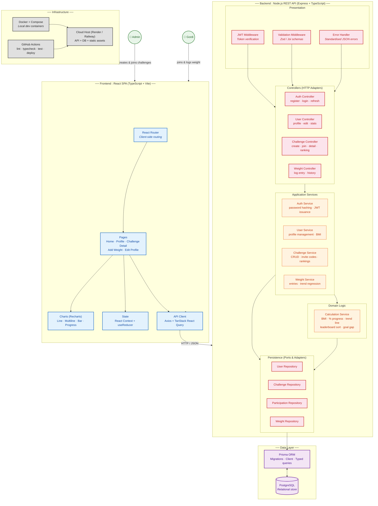

## 1. Diagram Format Justification

**C4 Model** — I combine Context (personas), Container (SPA, API, DB), and Component (controllers, services, repositories) into a single view. This is the right fit because the project is in a pre-code planning stage: one diagram must communicate the system boundary, technology stack, and internal layering to stakeholders and future developers without requiring multiple pages.

---

## 2. Architecture Diagram

The diagram is written to `docs/architecture-diagram.md`. Here it is rendered:

[//]: # "Gordi Challenge — C4-inspired Architecture Diagram"



---

## 3. Pattern Selection

**Chosen pattern: Clean Architecture (Ports & Adapters / Hexagonal-inspired Layered Architecture)**  

This pattern divides the backend into four concentric layers — **Controllers** (HTTP adapters), **Application Services** (orchestration), **Domain** (pure business logic), and **Repositories** (persistence ports) — with all dependencies pointing inward toward the domain. It fits because **Gordi Challenge has non-trivial domain rules** (BMI calculation, linear-regression trend prediction, invite-code generation, leaderboard sort, weekly-entry constraints) that must remain independent of frameworks, the HTTP protocol, and the database. The application is data-centric with clear CRUD surfaces, so a layered structure with a rich domain core prevents business logic from leaking into Express route handlers or Prisma queries. For a solo/small-team academic project, Clean Architecture provides just enough structure without the overhead of CQRS or event-driven patterns, and it maps directly to the project's future testability needs (domain logic can be unit-tested without mocks).

---

## 4. Benefits

- **Domain logic is framework-agnostic** — `CalculationService` computes BMI, trend lines, and rankings using pure functions with no Express or Prisma imports. It can be unit-tested in isolation and reused if a future API version (GraphQL, gRPC) replaces REST.
- **Invite-code and weekly-entry rules are enforced in one place** — The `ChallengeService` owns invite-code uniqueness and the `WeightService` enforces the one-entry-per-Monday constraint, not scattered across controllers or SQL triggers. Changing the invite-code format from 6-character alphanumeric to 8-character hex only touches one file.
- **HTTP layer is thin and swappable** — Controllers do nothing but parse requests, call a service, and format responses. If the project later needs a BFF for a mobile app, the existing services and repositories remain untouched.
- **Repository abstraction enables database-agnostic testing** — Repositories implement interfaces (ports) that can be swapped for in-memory stores during integration tests, avoiding the need for a real PostgreSQL instance in CI for most test runs.
- **Frontend separation of concerns** — TanStack React Query manages server-state caching and background refetching, while React Context handles UI state (active challenge filter, modals). Charts are isolated in a `Charts` module using Recharts, which simplifies replacing the charting library later if the wireframe requirements evolve.
- **TypeScript across the stack** — Shared types for API payloads (generated from Prisma schema) eliminate runtime mismatches between frontend DTO expectations and backend responses.

---

## 5. Trade-offs and Pain Points

- **Repository layer adds indirection for simple CRUD** — For basic "find user by ID" or "insert weight entry", the Repository interface adds a file and a boilerplate method that calls Prisma directly with nearly identical syntax. **Acceptable for MVP** — the indirection cost is low, and it pays off as soon as you add caching, audit logging, or switch databases. Could revisit by using Prisma's generated client directly if the team finds the abstraction burdensome.
- **Domain service separation can feel excessive at small scale** — `CalculationService` could be a static method on the `User` entity, but Clean Architecture pushes for stateless domain services to keep entities anemic (data-only). This is a stylistic trade-off; the current choice prioritises testability over pure DDD purity.
- **No event-driven communication** — Weight entries don't emit events, so updating the leaderboard is a synchronous call inside the controller. If the app grows (e.g., email notifications on new rankings), you would need to introduce an event bus or message queue. **Acceptable for v1** — synchronous updates are simpler and sufficient for the current scale.
- **React Context + useReducer over a state-management library** — This avoids the dependency weight of Redux or Zustand but may become unwieldy if the profile and challenge detail pages share deeply nested state. **Mitigation: keep UI state local to pages; React Query handles all server state.**
- **PostgreSQL + Prisma for a small dataset** — A lighter option (SQLite) would simplify local setup, but the PRD explicitly requires relational integrity (foreign keys, unique codes, GDPR compliance). Prisma's migration tooling and type generation offset the operational overhead.
- **No infrastructure-as-code for deployment** — Docker Compose covers local dev, but production provisioning is manual (Render/Railway dashboard). For a solo academic project this is pragmatic; a team project should adopt Terraform or Pulumi before the first production deployment.

---

## 6. Tech Stack

### Frontend

| Category | Choice | Rationale |
|----------|--------|-----------|
| **Framework** | React 18+ with TypeScript | Mature ecosystem, strong typing, broad hiring pool for a frontender. |
| **Build tool** | Vite | Fast HMR, native TypeScript/JSX, minimal config. |
| **Routing** | React Router v6 | Standard for React SPAs; nested layouts match the screen hierarchy (Home → Challenge Detail). |
| **Server state** | TanStack React Query v5 | Caching, background refetch, optimistic updates for weight entries — eliminates most boilerplate. |
| **UI state** | React Context + `useReducer` | Kept local per page; no global store needed at this scale. |
| **Charts** | Recharts | Composable React charting that covers all needed types (line, multiline, bar, area). Built on D3. |
| **Styling** | TailwindCSS v4 | Utility-first, colocated styles, responsive design without separate CSS files. |
| **Linting & formatting** | **Biomejs** | Replaces ESLint + Prettier in a single tool. Faster, fewer config files, native TypeScript support. |
| **Unit / integration tests** | Vitest + React Testing Library | Compatible with Vite's ecosystem; same runner can be shared with the backend. |
| **E2E tests** | **Playwright** | Reliable cross-browser automation, built-in test runner and assertions, parallel execution. Ideal for E2E coverage of the weigh-in and ranking flows. |

### Backend

| Category | Choice | Rationale |
|----------|--------|-----------|
| **Runtime** | Node.js 22 LTS with TypeScript | Full-stack TypeScript reduces context-switching. LTS ensures stability for production. |
| **HTTP framework** | Express | Minimal, well-understood, huge ecosystem. A frontender can pick it up quickly. (NestJS would add too much ceremony for this scope.) |
| **Validation** | Zod | Schema-based validation that generates TypeScript types automatically — used in controllers and reusable DTOs. |
| **ORM** | Prisma | Declarative schema → auto-generated TypeScript client and migrations. Maps 1:1 to the PRD's four entities. |
| **Auth** | `jsonwebtoken` + `bcrypt` | Stateless JWT tokens; password hashing meets the PRD's security requirement. |
| **Linting & formatting** | **Biomejs** | Same tool as frontend — single `biome.json` at the repo root. |
| **Tests** | Vitest | Same runner as frontend for consistency; Supertest for controller integration tests. |

### Database

| Category | Choice | Rationale |
|----------|--------|-----------|
| **Database** | PostgreSQL 16 | Relational integrity (FKs, unique invite codes), JSONB support if needed later, production-grade. |
| **Hosting** | Managed PostgreSQL (Render / Neon / Supabase) | Reduces operations overhead — automated backups, SSL, point-in-time recovery. |

### API Documentation

| Category | Choice | Rationale |
|----------|--------|-----------|
| **Spec format** | OpenAPI 3.1 (YAML) | Industry standard; describes every endpoint, request body, response schema, and error code. |
| **Doc platform** | **Mintlify** | Consumes OpenAPI specs and renders a searchable, developer-friendly reference. Supports markdown pages for guides (getting started, auth flow, challenge lifecycle). |
| **CI publish** | GitHub Action → Mintlify | Auto-deploys docs on merge to `main` so they're always in sync with the API. |

### Project Management & Methodology

| Category | Choice | Rationale |
|----------|--------|-----------|
| **Issue tracking** | **Linear** | Fast, keyboard-first, integrates with GitHub. Use it to track epics, stories, and bugs mapped to the PRD's screens and flows. |
| **Methodology** | **SDD (Specification-Driven Development)** with **Speckit** | Every feature starts as a structured spec (`.spec.md`) that defines acceptance criteria, scenarios (Given/When/Then), and edge cases. AI LLMs consume these specs to generate initial code and tests, then the developer refines. This fits a small team where a single person writes specs and a frontender implements. |
| **AI assistance** | LLMs (Claude / GPT-4) via Speckit and direct prompting | Specs are the source of truth — AI generates the first pass of implementation and tests, but all changes go through version control and manual review. |

### Infrastructure & DevOps

| Category | Choice | Rationale |
|----------|--------|-----------|
| **Containerisation** | Docker + Docker Compose | Two services: `api` (Node.js) and `db` (PostgreSQL). Eliminates "works on my machine" issues. |
| **CI/CD** | GitHub Actions | Lint (`biome check`), typecheck (`tsc --noEmit`), test (`vitest run`), build, and deploy on every PR and push to `main`. |
| **Production host** | **Render** (recommended) | Unified platform: deploy the Node.js API as a Web Service, PostgreSQL as a managed DB, and serve the Vite build as a Static Site or behind the same service. Free tier for staging, paid for production. Alternative: **Railway** for simpler config; **Fly.io** for global edge regions. |
| **E2E in CI** | Playwright on GitHub Actions | Runs against a preview deployment or a Docker Compose environment. Blocks merge on failure. |
| **Production considerations** | Environment variables via Render dashboard or `.env` (never committed). Secrets managed with GitHub Actions secrets + Render environment. Health check endpoint (`GET /health`). Rate limiting via `express-rate-limit`. CORS configured for the production frontend domain. |

### Recommended Project Structure

```
gordi-challenge/
├── spec/                    # SDD specs (Speckit .spec.md files)
├── docs/                    # Mintlify content + OpenAPI spec
├── frontend/                # React SPA (Vite + TypeScript)
│   ├── src/
│   │   ├── pages/           # One file per screen
│   │   ├── components/      # Shared UI (charts, tables, forms)
│   │   ├── api/             # React Query hooks + Axios client
│   │   ├── context/         # React Context providers
│   │   └── types/           # Shared TypeScript types
│   └── e2e/                 # Playwright tests
├── backend/                 # Express API (TypeScript)
│   ├── src/
│   │   ├── controllers/     # HTTP adapters
│   │   ├── services/        # Application services
│   │   ├── domain/          # Pure business logic
│   │   ├── repositories/    # Prisma-backed data access
│   │   ├── middleware/      # Auth, validation, error handling
│   │   └── routes/          # Route definitions
│   └── prisma/
│       ├── schema.prisma    # Data model
│       └── migrations/      # Auto-generated
├── docker-compose.yml       # api + db for local dev
├── biome.json               # Single lint/format config
├── vitest.workspace.ts      # Shared test config
└── .github/
    └── workflows/
        └── ci.yml           # Lint → typecheck → test → build → deploy
```