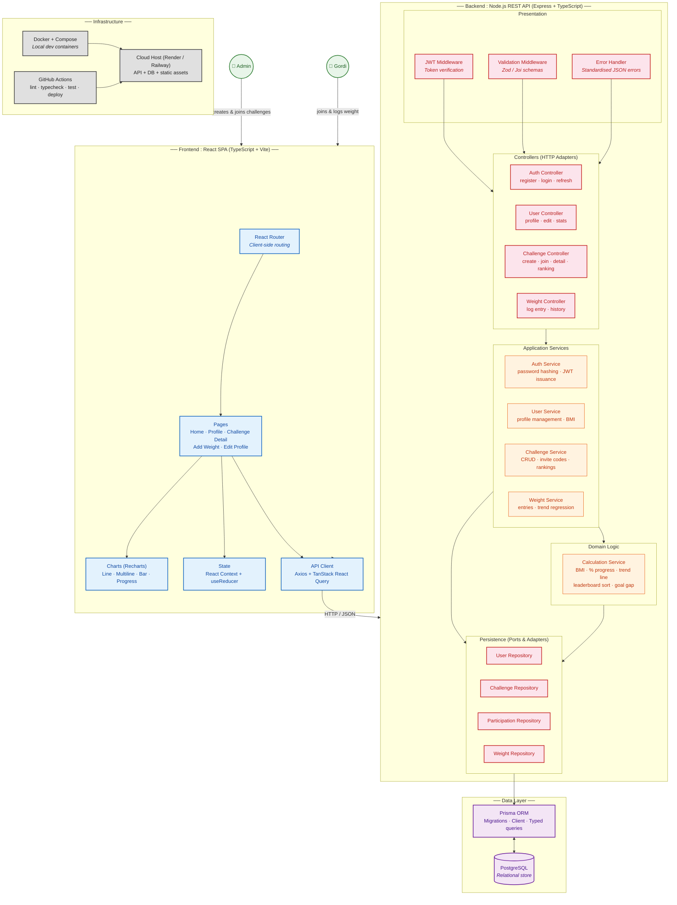

## 1. Diagram Format Justification

**C4 Model** — I combine Context (personas), Container (SPA, API, DB), and Component (controllers, services, repositories) into a single view. This is the right fit because the project is in a pre-code planning stage: one diagram must communicate the system boundary, technology stack, and internal layering to stakeholders and future developers without requiring multiple pages.

---

## 2. Architecture Diagram

The diagram is written to `docs/architecture-diagram.md`. Here it is rendered:

[//]: # "Gordi Challenge — C4-inspired Architecture Diagram"

---

## 3. Pattern Selection

**Chosen pattern: Clean Architecture (Ports & Adapters / Hexagonal-inspired Layered Architecture)**  

This pattern divides the backend into four concentric layers — **Controllers** (HTTP adapters), **Application Services** (orchestration), **Domain** (pure business logic), and **Repositories** (persistence ports) — with all dependencies pointing inward toward the domain. It fits because **Gordi Challenge has non-trivial domain rules** (BMI calculation, linear-regression trend prediction, invite-code generation, leaderboard sort, weekly-entry constraints) that must remain independent of frameworks, the HTTP protocol, and the database. The application is data-centric with clear CRUD surfaces, so a layered structure with a rich domain core prevents business logic from leaking into Express route handlers or Prisma queries. For a solo/small-team academic project, Clean Architecture provides just enough structure without the overhead of CQRS or event-driven patterns, and it maps directly to the project's future testability needs (domain logic can be unit-tested without mocks).

---

## 4. Benefits

- **Domain logic is framework-agnostic** — `CalculationService` computes BMI, trend lines, and rankings using pure functions with no Express or Prisma imports. It can be unit-tested in isolation and reused if a future API version (GraphQL, gRPC) replaces REST.
- **Invite-code and weekly-entry rules are enforced in one place** — The `ChallengeService` owns invite-code uniqueness and the `WeightService` enforces the one-entry-per-Monday constraint, not scattered across controllers or SQL triggers. Changing the invite-code format from 6-character alphanumeric to 8-character hex only touches one file.
- **HTTP layer is thin and swappable** — Controllers do nothing but parse requests, call a service, and format responses. If the project later needs a BFF for a mobile app, the existing services and repositories remain untouched.
- **Repository abstraction enables database-agnostic testing** — Repositories implement interfaces (ports) that can be swapped for in-memory stores during integration tests, avoiding the need for a real PostgreSQL instance in CI for most test runs.
- **Frontend separation of concerns** — TanStack React Query manages server-state caching and background refetching, while React Context handles UI state (active challenge filter, modals). Charts are isolated in a `Charts` module using Recharts, which simplifies replacing the charting library later if the wireframe requirements evolve.
- **TypeScript across the stack** — Shared types for API payloads (generated from Prisma schema) eliminate runtime mismatches between frontend DTO expectations and backend responses.

---

## 5. Trade-offs and Pain Points

- **Repository layer adds indirection for simple CRUD** — For basic "find user by ID" or "insert weight entry", the Repository interface adds a file and a boilerplate method that calls Prisma directly with nearly identical syntax. **Acceptable for MVP** — the indirection cost is low, and it pays off as soon as you add caching, audit logging, or switch databases. Could revisit by using Prisma's generated client directly if the team finds the abstraction burdensome.
- **Domain service separation can feel excessive at small scale** — `CalculationService` could be a static method on the `User` entity, but Clean Architecture pushes for stateless domain services to keep entities anemic (data-only). This is a stylistic trade-off; the current choice prioritises testability over pure DDD purity.
- **No event-driven communication** — Weight entries don't emit events, so updating the leaderboard is a synchronous call inside the controller. If the app grows (e.g., email notifications on new rankings), you would need to introduce an event bus or message queue. **Acceptable for v1** — synchronous updates are simpler and sufficient for the current scale.
- **React Context + useReducer over a state-management library** — This avoids the dependency weight of Redux or Zustand but may become unwieldy if the profile and challenge detail pages share deeply nested state. **Mitigation: keep UI state local to pages; React Query handles all server state.**
- **PostgreSQL + Prisma for a small dataset** — A lighter option (SQLite) would simplify local setup, but the PRD explicitly requires relational integrity (foreign keys, unique codes, GDPR compliance). Prisma's migration tooling and type generation offset the operational overhead.
- **No infrastructure-as-code for deployment** — Docker Compose covers local dev, but production provisioning is manual (Render/Railway dashboard). For a solo academic project this is pragmatic; a team project should adopt Terraform or Pulumi before the first production deployment.