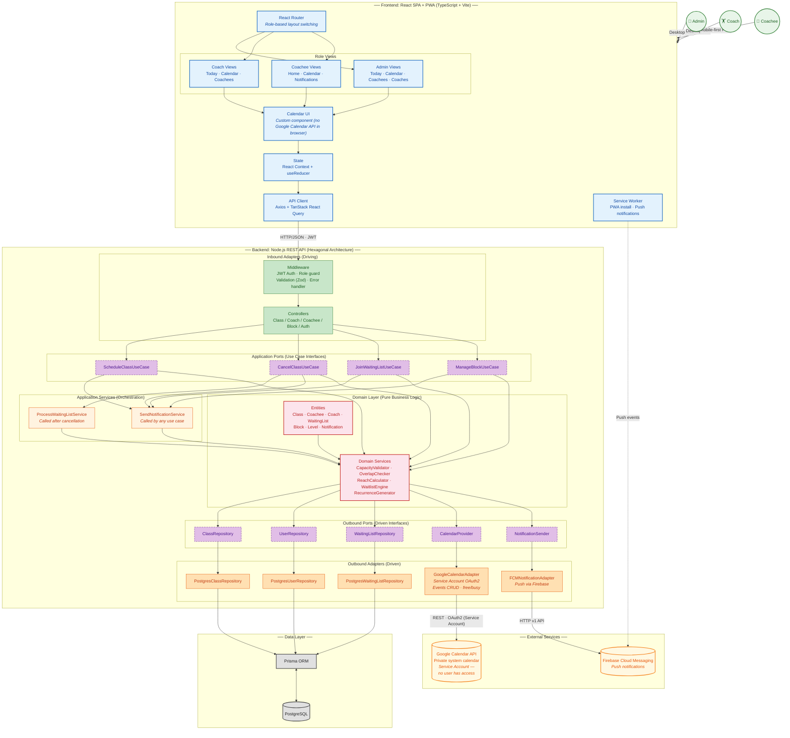
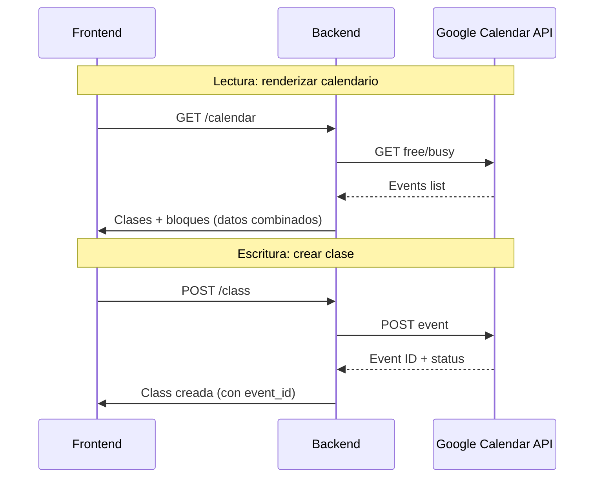

# System Architecture — Personal Training Management Platform

## 1. Recommended Diagram Format

**C4 Model (Context + Container) combinado con un diagrama hexagonal (Ports & Adapters) para el backend.** El C4 muestra el ecosistema completo (personas, frontend, backend, Google Calendar, FCM). El diagrama hexagonal interno del backend revela cómo se cumple el mandato de Clean Architecture del PRD. Se elige C4 porque el proyecto está en etapa pre-code: un solo diagrama debe comunicar el límite del sistema, el stack tecnológico y la estructura interna a stakeholders y futuros desarrolladores sin requerir múltiples páginas.

## 2. Architectural Pattern

**Clean / Hexagonal Architecture (Ports & Adapters)** — mandatado explícitamente por la Sección 8 del PRD. Justificación:

- **Google Calendar como sistema de registro** requiere un adaptador reemplazable. Si mañana migran a Outlook Calendar, solo cambia el adapter, no el dominio. Además, Google Calendar se accede exclusivamente server-side mediante una Service Account con un calendario privado de sistema — ningún usuario humano lo ve ni lo toca, eliminando la necesidad de sincronización bidireccional.
- **Reglas de negocio complejas** (capacidad del gym: 2 individuales + 1 grupal simultáneo, waiting lists con notificación simultánea first-come-first-served, reach de niveles, recurrencia semanal, validación de overlaps) viven en el dominio, testables sin infraestructura.
- **UI condicional por rol** (Admin/Coach/Coachee) en un mismo frontend: un patrón de componentes con layout-switching según rol, con lógica de negocio cero en el cliente.
- **Mobile-first + PWA** para Coachee implica separar concerns de UI (componentes Coachee) del resto.

## 3. Architecture Diagram



### Data Flow — Calendario



## 4. Component & Technology Breakdown

| Component | Role | Tecnología |
|-----------|------|------------|
| **Frontend SPA** | UI con renderizado condicional por rol (Admin/Coach/Coachee); mobile-first para Coachee | React 18+, TypeScript, Vite, TailwindCSS v4, React Router v6, TanStack React Query |
| **Calendar UI** | Componente custom de calendario en el frontend — nunca llama a Google Calendar API directamente | React component, datos vía API del backend |
| **PWA Layer** | Service Worker para instalación "Add to Home Screen" + push notifications | vite-plugin-pwa (Workbox), Web Push API |
| **Backend API** | REST API con arquitectura hexagonal; toda la lógica de negocio | Node.js 22+, TypeScript, Express/Fastify, Zod |
| **Domain Layer** | Entidades puras y servicios de dominio sin dependencias externas | TypeScript (zero framework deps) |
| **Database** | Datos relacionales (usuarios, enrolamientos, waiting lists, notifications, referencias a eventos de Google Calendar) | PostgreSQL 16 + Prisma ORM |
| **Google Calendar Adapter** | Adaptador de salida: Google Calendar es el motor de scheduling interno. Service Account con calendario privado de sistema — ningún usuario humano tiene acceso | Google Calendar API v3 (REST), OAuth2 Service Account (JWT grant) |
| **Notification Adapter** | Push notifications a los 3 roles | Firebase Cloud Messaging (FCM) |
| **Auth** | JWT stateless con RBAC (Admin/Coach/Coachee) | jsonwebtoken + bcrypt |
| **Testing** | Tests unitarios (dominio), integración (adapters), E2E (flujos completos) | Vitest + Supertest + Playwright |

## 5. Benefits

- **Google Calendar es reemplazable**: el `CalendarProvider` port permite intercambiar Google Calendar por Outlook, iCal o un calendario custom sin tocar una línea de dominio.
- **Sin riesgo de desincronización bidireccional**: al usar una Service Account con calendario privado, ningún usuario puede modificar eventos fuera de la plataforma. No hay conflictos de edición externa.
- **Reglas de negocio testables en aislamiento**: `CapacityValidator`, `OverlapChecker`, `ReachCalculator` son funciones puras sin IO. Se testean en milisegundos sin mocks.
- **Waiting list engine aislado**: la lógica de notificación simultánea first-come-first-served con límite de 4 está en el dominio. Se puede unit-testear cada escenario (PRD Sección 7).
- **UI por rol sin duplicación**: un solo frontend con layout-switching basado en rol. Componentes compartidos (Calendar, Notifications bell) reutilizados; vistas específicas por rol en módulos separados.
- **Notificaciones como puerto**: los 12 eventos (PRD Sección 7) se disparan desde el dominio a través del port `NotificationSender`. Se pueden agregar canales (email, SMS) sin cambiar la lógica de negocio.
- **PWA installability limpia**: el Service Worker está desacoplado del resto del frontend, solo maneja cacheo y push events.

## 6. Trade-offs / Pains

- **Google Calendar como motor interno añade latencia**: toda operación de schedule requiere RTT a Google Calendar API. Si la API está caída o rate-limitada, el sistema no puede crear clases ni bloques. Se necesita un cache layer o fallback.
- **Disponibilidad de time slots**: Google Calendar free/busy es costoso de consultar en tiempo real. El modal de "Add Class" necesita surfear slots disponibles sin degradar la experiencia. Posible bottleneck.
- **Service Account management**: requiere gestionar credenciales de Service Account (rotación de keys, permisos, cuotas de API de Google). Es infraestructura adicional que un equipo pequeño debe mantener.
- **Calendario invisible para el usuario**: al no haber un calendario visible fuera de la plataforma, los Coachees no recuerdan sus clases con notificaciones del calendario de Google. Toda la recordación recae en las push notifications de la app.
- **Boilerplate de puertos y adaptadores**: cada caso de uso requiere interface + implementación + inyección de dependencias. Para CRUD simple (ej. listar coachees) es indirección pura.
- **Overhead cognitivo del equipo**: desarrolladores no familiarizados con Hexagonal Architecture pueden sentirse abrumados por las capas. Requiere disciplina mantener el dominio limpio.
- **Testing E2E con dependencia externa**: Google Calendar API y FCM son externos. Los tests E2E necesitan mocks/sandboxes para no depender de servicios reales en CI.

## 7. Google Calendar Integration — Detalle Técnico

### Arquitectura de Conexión

El backend se conecta a Google Calendar API usando una **Service Account** de Google Cloud:

1. Se crea un proyecto en Google Cloud Console.
2. Se habilita Google Calendar API.
3. Se crea una Service Account con un calendario privado (no es un calendario de usuario).
4. El backend usa `google-auth-library` para generar un JWT firmado con la private key de la Service Account y obtener un access token (OAuth2 server-to-server).
5. Todas las llamadas a la API de Google Calendar usan ese token.

### ¿Qué se almacena en Google Calendar vs PostgreSQL?

| Datos | Google Calendar | PostgreSQL |
|-------|----------------|------------|
| Evento de clase (título, hora, duración) | ✅ | ✅ (event_id de referencia) |
| Coachees asignados | ❌ | ✅ |
| Waiting list | ❌ | ✅ |
| Nivel de la clase | ❌ | ✅ |
| Coach asignado | ❌ | ✅ |
| Bloque personal / gym-wide | ✅ | ✅ |
| Notificaciones enviadas | ❌ | ✅ |

Google Calendar es el **system of record para horarios y disponibilidad** (free/busy). PostgreSQL es el system of record para todo lo demás (usuarios, enrolamientos, waiting lists, niveles, notificaciones).

---

## 8. Tech Stack & Development Methodology

### 8.1 Frontend

| Categoría | Elección | Por qué |
|-----------|----------|---------|
| **Framework** | React 18+ con TypeScript | Ecosistema maduro, tipado fuerte, hiring pool amplio para un frontender. |
| **Build tool** | Vite | HMR rápido, TypeScript/JSX nativo, configuración mínima. |
| **Routing** | React Router v6 | Estándar para React SPAs; nested layouts para las vistas por rol. |
| **Server state** | TanStack React Query v5 | Caching, background refetch, optimistic updates — elimina boilerplate de estado del servidor. |
| **UI state** | React Context + `useReducer` | State local por página; ningún store global necesario a esta escala. |
| **Calendar** | Componente custom (React) | Sin dependencia directa de Google Calendar API en el browser. Datos vía backend. |
| **Styling** | TailwindCSS v4 | Utility-first, estilos colocalizados, responsive sin archivos CSS separados. |
| **PWA** | vite-plugin-pwa (Workbox) | Service Worker automático, manifiesto, precaching, manejo de push events. |
| **Linting & formatting** | **Biomejs** | Un solo tool reemplaza ESLint + Prettier. Más rápido, menos archivos de configuración, soporte nativo de TypeScript. |

### 8.2 Backend

| Categoría | Elección | Por qué |
|-----------|----------|---------|
| **Runtime** | Node.js 22 LTS con TypeScript | Full-stack TypeScript reduce context-switching. LTS garantiza estabilidad para producción. |
| **HTTP framework** | Express (vs Fastify) | Express es más conocido, ecosistema enorme, curvas de aprendizaje más suave. Fastify es más rápido pero para esta escala no hay diferencia perceptible. Express gana por adoptabilidad del equipo. |
| **Validation** | Zod | Schemas que generan tipos TypeScript automáticamente — se usa en controllers y DTOs compartidos. |
| **ORM** | Prisma | Schema declarativo → cliente TypeScript autogenerado + migrations. Mapea 1:1 con las entidades del dominio. |
| **Auth** | `jsonwebtoken` + `bcrypt` | JWT stateless (access + refresh tokens); bcrypt para hash de passwords. |
| **Google Calendar** | `google-auth-library` + REST API v3 | Autenticación Service Account (JWT grant), llamado a la API de Calendar para CRUD de eventos y free/busy. |
| **Push notifications** | Firebase Admin SDK (FCM) | Envío de push notifications a dispositivos (web PWA y mobile). |
| **Linting & formatting** | **Biomejs** | Misma tool que el frontend — un solo `biome.json` en la raíz del repo. |
| **Testing unitario/integración** | Vitest + Supertest | Mismo runner que el frontend para consistencia. |

### 8.3 Database

| Categoría | Elección | Por qué |
|-----------|----------|---------|
| **Database** | PostgreSQL 16 | Integridad referencial (FKs, unique constraints para waiting lists), soporte JSONB si se necesita después, production-grade. |
| **Hosting** | Managed PostgreSQL (Neon, Supabase o Render) | Backup automatizado, SSL, point-in-time recovery. Reduce operaciones. |

### 8.4 Testing & Calidad

| Categoría | Elección | Por qué |
|-----------|----------|---------|
| **Unit / integration** | Vitest | Rápido, compatible con Vite, mismo runner frontend y backend. |
| **E2E** | **Playwright** | Confiable, multi-browser, test runner y assertions integrados, ejecución paralela. Mejor opción para flujos críticos: crear clase, waiting list, cancelación, notificaciones. Cypress es alternativa válida pero Playwright es más rápido en CI y tiene mejor soporte de mobile (emulación de dispositivos). |
| **CI/CD** | GitHub Actions | Lint (`biome check`), typecheck (`tsc --noEmit`), test (`vitest run`), build, y deploy en cada PR y push a `main`. |

### 8.5 API Documentation

| Categoría | Elección | Por qué |
|-----------|----------|---------|
| **Spec format** | OpenAPI 3.1 (YAML) | Estándar de la industria; describe cada endpoint, request/response schema y códigos de error. |
| **Doc platform** | **Mintlify** | Consume specs de OpenAPI y renderiza una referencia searchable y developer-friendly. Soporta páginas en Markdown para guías (getting started, auth flow, calendar lifecycle). |
| **CI publish** | GitHub Action → Mintlify | Auto-deploy de la doc en cada merge a `main` para que esté siempre sincronizada con la API. |

### 8.6 Project Management & Methodology

| Categoría | Elección | Por qué |
|-----------|----------|---------|
| **Issue tracking** | **Linear** | Rápido, keyboard-first, se integra con GitHub. Ideal para trackear epics, stories y bugs mapeados a las screens del PRD. |
| **Methodology** | **SDD (Specification-Driven Development)** con **Speckit** | Cada feature arranca con un spec estructurado (`.spec.md`) que define acceptance criteria, escenarios (Given/When/Then) y edge cases. Los specs son el input para AI LLMs (Claude, GPT-4) que generan el primer pase de código y tests. El frontender refina a partir de ahí. Los specs son la source of truth — todo cambio de requisito se refleja primero en el spec. |
| **AI assistance** | LLMs (Claude, GPT-4) via Speckit y prompting directo | Los specs son el contrato. AI genera el primer pase de implementación y tests. Todo cambio pasa por version control y review manual del frontender. |

### 8.7 Infrastructure & DevOps

| Categoría | Elección | Por qué |
|-----------|----------|---------|
| **Containerisation** | Docker + Docker Compose | Tres servicios: `api` (Node.js), `db` (PostgreSQL), y opcionalmente `frontend` (Vite dev server o build estático). Elimina "works on my machine". |
| **Production host** | **Render** (recomendado) | Plataforma unificada: despliega la API de Node.js como Web Service, PostgreSQL como managed DB, y el build de Vite como Static Site o detrás del mismo servicio. Free tier para staging, paid para producción. Alternativas: **Railway** (config más simple), **Fly.io** (edge regions globales). |
| **E2E en CI** | Playwright on GitHub Actions | Corre contra preview deployment o entorno Docker Compose. Bloquea merge si falla. |
| **Consideraciones de prod** | Environment variables via dashboard (nunca commitear `.env`). Secrets gestionados con GitHub Actions secrets + variables de entorno del host. Health check endpoint (`GET /health`). Rate limiting via `express-rate-limit`. CORS configurado para el dominio de producción del frontend. |

### 8.8 Estructura de proyecto recomendada

```
personal-training-platform/
├── spec/                        # SDD specs (.spec.md)
├── docs/                        # Mintlify content + OpenAPI spec
├── frontend/                    # React SPA (Vite + TypeScript)
│   ├── src/
│   │   ├── pages/               # Una carpeta por rol (admin/, coach/, coachee/)
│   │   ├── components/          # UI compartida (calendar, forms, modals)
│   │   ├── api/                 # React Query hooks + Axios client
│   │   ├── context/             # React Context providers
│   │   └── types/               # Tipos TypeScript compartidos
│   ├── e2e/                     # Playwright tests
│   └── public/                  # PWA manifest, service worker, icons
├── backend/
│   ├── src/
│   │   ├── domain/              # Entidades puras + domain services
│   │   ├── application/         # Use cases / application services
│   │   ├── infrastructure/      # Adapters (controllers, repos, calendar, notifications)
│   │   └── config/              # DI container, env config
│   └── prisma/
│       ├── schema.prisma        # Data model
│       └── migrations/          # Auto-generadas
├── docker-compose.yml           # api + db + frontend para dev local
├── biome.json                   # Config única de lint/format
├── vitest.workspace.ts          # Config de tests compartida
└── .github/
    └── workflows/
        └── ci.yml               # Lint → typecheck → test → build → deploy
```
