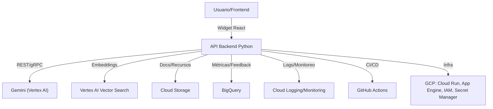
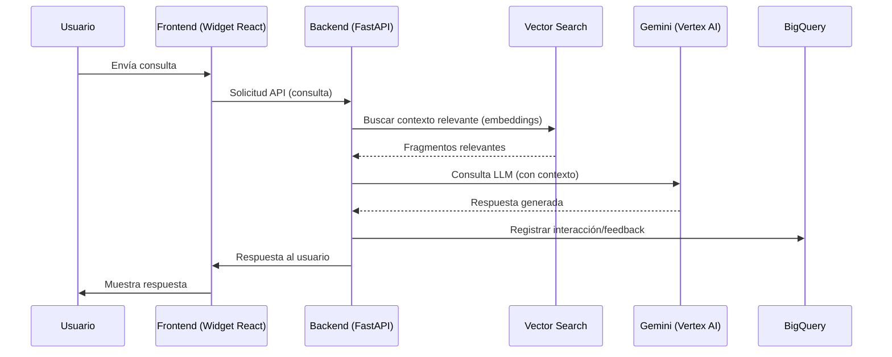
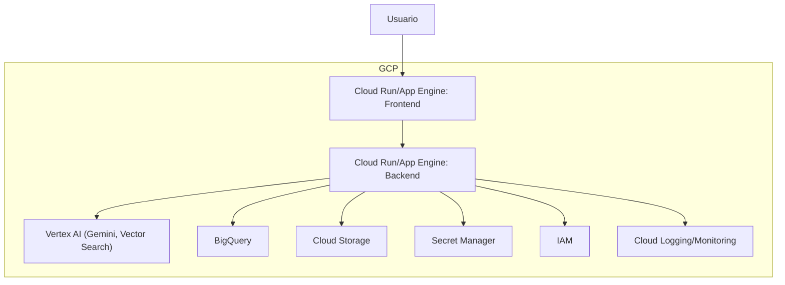
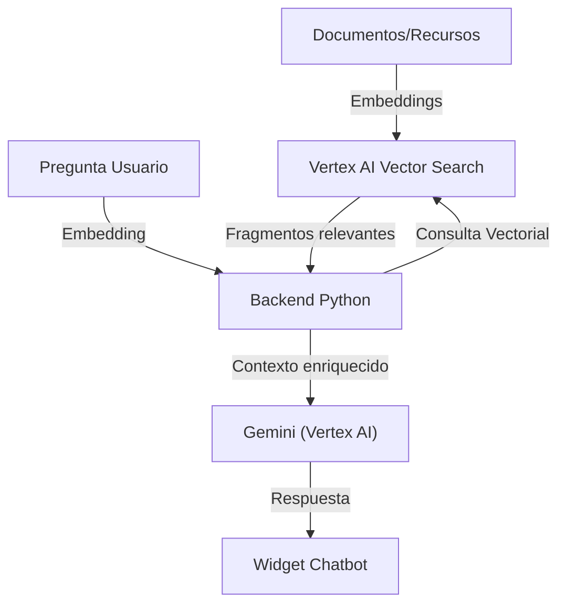
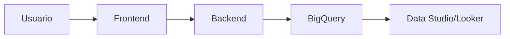
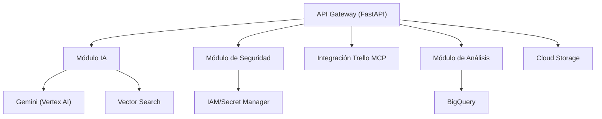
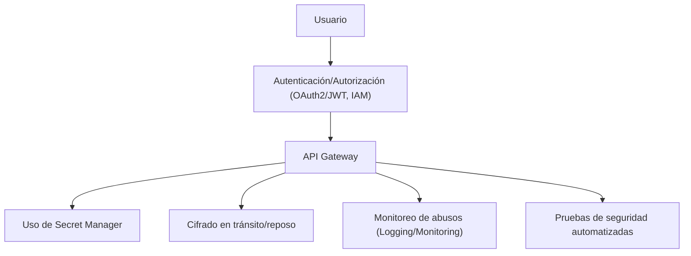
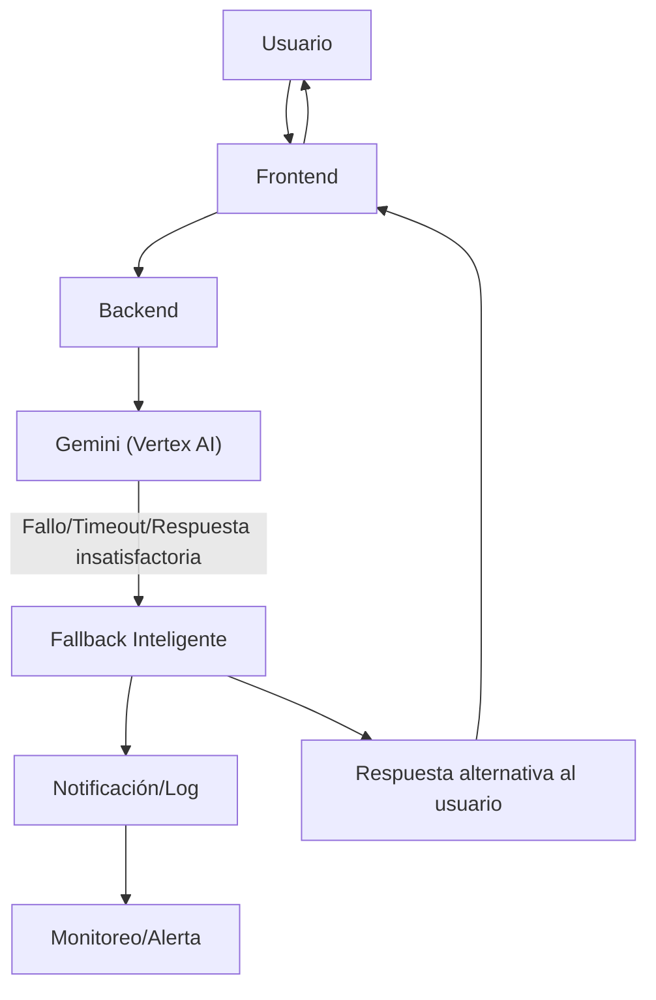
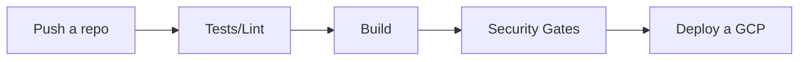

# Propuesta Técnica: AI-Powered Professional Avatar

## 1. Resumen de la Solución

El objetivo es desarrollar un gemelo digital profesional basado en IA, accesible 24/7 desde un portfolio web, que responda en lenguaje natural sobre la experiencia, proyectos y habilidades del usuario. La solución debe ser escalable, segura, multiidioma y con capacidad de análisis y mejora continua.

## 2. Alcance del Proyecto

El desarrollo se realizará sobre el repositorio base [my-resume-react (feature-init-prototype)](https://github.com/aandmaldonado/my-resume-react/tree/feature-init-prototype), que ya cuenta con el frontend del portfolio implementado. El alcance de este proyecto comprende:

- **Frontend:**
  - Integración de un widget de chatbot IA en React dentro del portfolio existente.
  - Adaptación visual y funcional para asegurar coherencia con el diseño actual y experiencia de usuario responsiva.

- **Backend:**
  - Desarrollo completo de la API en Python (FastAPI), encargada de la lógica de negocio, integración con IA (Gemini/Vertex AI), RAG y gestión de datos.
  - Implementación de mecanismos de autenticación, seguridad y registro de métricas.

- **Despliegue e Infraestructura:**
  - Uso de Google Cloud Platform (GCP) para el despliegue de todos los servicios (frontend, backend, almacenamiento, vector search, analítica, etc.).
  - Automatización de CI/CD con GitHub Actions y gestión de infraestructura como código (Terraform opcional).

Este enfoque garantiza una integración fluida del chatbot en el portfolio, manteniendo la escalabilidad, seguridad y facilidad de mantenimiento del sistema.

### 2.1. Descripción de alto nivel del proyecto y estructura de ficheros 🗂️

```
my-resume-react/
├── app/                        # Rutas y páginas Next.js
├── components/
│   └── ui/
│       └── ChatbotWidget.tsx   # Nuevo: Componente principal del chatbot
│       └── ChatbotButton.tsx   # Nuevo: Botón flotante o trigger
│       └── ChatMessage.tsx     # Nuevo: Mensaje individual
│       └── ChatInput.tsx       # Nuevo: Input de usuario
├── hooks/
│   └── useChatbot.ts           # Nuevo: Hook para lógica del chatbot
├── backend/                    # Nuevo: API Python (FastAPI) para IA y RAG
│   ├── main.py                 # Nuevo: Entry point FastAPI
│   ├── rag_pipeline.py         # Nuevo: Lógica de RAG
│   ├── vector_search.py        # Nuevo: Integración Vertex AI Vector Search
│   ├── gemini_client.py        # Nuevo: Cliente Gemini/Vertex AI
│   ├── models/                 # Nuevo: Modelos de datos
│   └── ...
├── lib/
├── public/
│   └── chatbot/                # Nuevo: Assets del chatbot (iconos, sonidos)
├── styles/
│   └── chatbot.css             # Nuevo: Estilos específicos del chatbot
├── .github/
│   └── workflows/              # Workflows de CI/CD
├── infra/                      # Infraestructura como código (Terraform, configs GCP)
├── docs/                       # Documentación, diagramas, prompts, PRD, etc.
├── README.md                   # Descripción general del proyecto
├── package.json
└── ...
```

## 3. Arquitectura de Alto Nivel

### 3.1. Diagrama de arquitectura general 🗺️



### 3.2. Infraestructura y despliegue en GCP ☁️
- **Frontend:** Desplegado en Cloud Run o App Engine.
- **Backend:** Desplegado en Cloud Run o App Engine.
- **Almacenamiento:** Cloud Storage para recursos y documentos.
- **Base de datos:** BigQuery para analítica, Vector Search para embeddings.
- **IA:** Vertex AI (Gemini) para LLM y embeddings.
- **CI/CD:** GitHub Actions con despliegue automático a GCP.
- **Seguridad:** IAM, Secret Manager, cifrado en tránsito y reposo.
- **Monitoreo:** Cloud Logging, Monitoring, alertas.

### 3.3. Diagrama de Secuencia de Interacción Usuario-Chatbot


### 3.4. Diagrama de Despliegue (Deployment)


## 4. Stack Tecnológico Recomendado

- **Frontend:** React, TypeScript, integración con backend vía REST/WebSocket.
- **Backend:** Python 3.11+, FastAPI, integración con Vertex AI (Gemini), Google Cloud Storage, BigQuery, OAuth2/JWT para autenticación.
- **IA:** Gemini (Vertex AI), RAG pipeline, fallback inteligente.
- **Base de datos:** BigQuery (analítica), Firestore o Cloud SQL (opcional para datos transaccionales).
- **Infraestructura:** GCP (Cloud Run/App Engine, Cloud Storage, BigQuery, Vertex AI, Secret Manager, IAM, Logging, Monitoring).
- **Testing:** Pytest, coverage, linters (flake8, black).
- **Control de versiones:** GitHub.
- **CI/CD:** GitHub Actions (deploy a GCP, tests, lint, build).

### 4.1. Almacenamiento y Búsqueda Vectorial para RAG

Para la implementación de RAG (Retrieval Augmented Generation), se utilizará **Vertex AI Vector Search** de Google Cloud Platform como base de datos vectorial. Esta solución permite almacenar, indexar y buscar embeddings de documentos y fragmentos de conocimiento de manera eficiente y escalable.

- **Indexación:** Los documentos relevantes (CV, proyectos, publicaciones, etc.) se procesan y convierten en embeddings usando modelos de Vertex AI o Gemini.
- **Almacenamiento:** Los embeddings se almacenan en Vertex AI Vector Search, permitiendo búsquedas semánticas rápidas y precisas.
- **Consulta:** Ante una pregunta del usuario, el backend genera el embedding de la consulta y recupera los fragmentos más relevantes desde la base vectorial para enriquecer el contexto del LLM (Gemini).
- **Ventajas:**
  - Totalmente gestionado y escalable en GCP.
  - Integración nativa con el resto de servicios de Vertex AI y seguridad de GCP.
  - Permite búsquedas semánticas multiidioma y actualización dinámica del conocimiento.
- **Seguridad:** Los datos y embeddings están protegidos por IAM y cifrado en reposo.

### 4.2. Diagrama de flujo RAG con Vector Search


## 5. Fases y Flujo de Desarrollo

### Fase 1: Fundamentos y Seguridad
- Implementación del widget/chat en React.
- Backend Python (FastAPI) con endpoints básicos y autenticación OAuth2/JWT.
- Configuración de CI/CD con GitHub Actions y despliegue automático a GCP.
- Seguridad guiada por OWASP Top 10 for LLM ([ver referencia](https://owasp.org/www-project-top-10-for-large-language-model-applications/assets/PDF/OWASP-Top-10-for-LLMs-2023-slides-v1_0.pdf)).

### Fase 2: IA y Conectividad
- Integración con Gemini (Vertex AI) y pipeline RAG.
- Conexión a Google Cloud Storage y BigQuery.
- Implementación de lógica de sugerencias y redirección.
- Soporte multiidioma.

### Fase 3: Analítica y Feedback
- Registro de interacciones y preguntas frecuentes en BigQuery.
- Panel de métricas y satisfacción con Google Data Studio/Looker.
- Sistema de feedback y análisis de leads.

### Fase 4: Optimización y Entrega Final
- Mejoras de UX/UI y rendimiento.
- Pruebas de carga y seguridad (OWASP Top 10 for LLM).
- Documentación técnica y de usuario.
- Despliegue final y monitoreo en GCP.

### 5.1. Flujo de Feedback y Analítica


## 6. Descripción de componentes principales 🧩

- **Widget/Chatbot Frontend:** React, integración con backend, despliegue en GCP.
- **API Gateway:** FastAPI en Python, autenticación OAuth2/JWT, logging, integración con Vertex AI y Google Cloud Storage.
- **Módulo IA:** Procesamiento de preguntas, consulta a Gemini (Vertex AI), recuperación de contexto (RAG), fallback inteligente.
- **Integración Trello MCP:** Sincronización de tickets y tareas para gestión ágil (opcional, vía backend Python).
- **Módulo de Análisis:** Registro de métricas y feedback en BigQuery, visualización en Data Studio/Looker.
- **Seguridad:** Autenticación, autorización, protección de datos, logs y cumplimiento OWASP Top 10 for LLM.

### 6.1. Diagrama de Componentes Backend


## 7. Seguridad y cumplimiento OWASP Top 10 for LLM 🛡️

- Autenticación y autorización robusta (OAuth2/JWT, IAM).
- Protección contra inyección de prompts y fuga de datos.
- Cifrado en tránsito y en reposo (TLS, GCP managed keys).
- Uso de Secret Manager para credenciales y claves.
- Monitoreo de abusos y anomalías (Cloud Logging/Monitoring).
- Pruebas de seguridad automatizadas y revisión continua ([OWASP Top 10 for LLM](https://owasp.org/www-project-top-10-for-large-language-model-applications/assets/PDF/OWASP-Top-10-for-LLMs-2023-slides-v1_0.pdf)).

### 7.1. Mapa de Seguridad


### 7.2. Flujo de Recuperación ante Fallos (Fallback)


## 8. Estrategia de testing 🧪

- Cobertura de tests >80% en módulos críticos (Pytest, React Testing Library).
- Tests unitarios, de integración y end-to-end.
- Linting y formateo automático (flake8, black, ESLint, Prettier).
- Pruebas de carga y rendimiento (k6, Locust).
- Pruebas de seguridad siguiendo OWASP Top 10 for LLM.
- CI/CD con ejecución automática de tests en cada push (GitHub Actions).

## 9. Integración y Despliegue

- **CI/CD:** GitHub Actions para tests, build y despliegue automático a GCP.
- **Infraestructura como código:** Terraform (opcional), configuración de recursos en GCP.
- **Monitoreo:** Cloud Logging, Monitoring, alertas y dashboards en GCP.
- **Despliegue del frontend:** Google Cloud Run o App Engine.
- **Despliegue del backend:** Google Cloud Run o App Engine.

### 9.1. Flujo de CI/CD


---