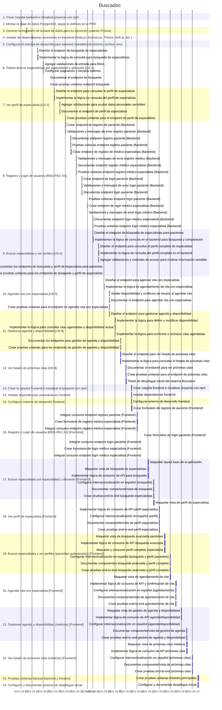

# Avance de trabajo proyecto Buscadoc

```mermaid
gantt
    dateFormat  YYYY-MM-DD
    title       Buscadoc

    section 1. Crear carpeta backend e inicializar proyecto con npm
    ... :done, des1, 2025-08-19, 0.5h

    section 2. Montar la base de datos PostgreSQL según lo definido en el PRD
    ... :done, 2025-08-19, 1h

    section 3. Generar la migración de la base de datos para su ejecución (usando Prisma)
    ... :done, 2025-08-20, 2h

    section 4. Instalar las dependencias necesarias en backend (Node.js, Express.js, Prisma, Auth.js, etc.)
    ... :done, 2025-08-21, 1h

    section 5. Configurar el entorno de desarrollo para backend (variables de entorno, archivo .env)
    ... :done, 2025-08-21, 1h

    section 6. Tickets Buscar especialistas por especialidad y ubicación [US-1]
    Diseñar el endpoint de búsqueda de especialistas :done, des6.1, 2025-08-22, 1h
    Implementar la lógica de consulta para búsqueda de especialistas :done, des6.2, 2025-08-22, 2h
    Agregar validaciones de entrada para filtros :done, des6.3, 2025-08-23, 1h
    Configurar paginación y tiempos óptimos :done, des6.4, 2025-08-23, 1h
    Documentar el endpoint de búsqueda :done, des6.5, 2025-08-24, 1h
    Crear pruebas unitarias endpoint búsqueda :done, des6.6, 2025-08-24, 1h

    section 7. Ver perfil de especialista [US-2]
    Diseñar el endpoint para consultar el perfil de especialista :done, des7.1, 2025-08-25, 1h
    Implementar la lógica de consulta del perfil de especialista :done, des7.2, 2025-08-25, 2h
    Agregar validaciones para ocultar datos personales sensibles :done, des7.3, 2025-08-26, 1h
    Documentar el endpoint de perfil de especialista :done, des7.4, 2025-08-26, 1h
    Crear pruebas unitarias para el endpoint de perfil de especialista :done, des7.5, 2025-08-27, 1h

    section 8. Registro y Login de usuarios [REG-PAC-XX]
    Crear endpoint de registro de paciente (Backend) :done, des8.1, 2025-08-27, 3h
    Validaciones y mensajes de error registro paciente (Backend) :done, des8.2, 2025-08-27, 1h
    Documentar endpoint registro paciente (Backend) :done, des8.3, 2025-08-28, 1h
    Pruebas unitarias endpoint registro paciente (Backend) :done, des8.4, 2025-08-28, 1h
    Crear endpoint de registro de médico especialista (Backend) :done, des8.5, 2025-08-28, 3h
    Validaciones y mensajes de error registro médico (Backend) :done, des8.6, 2025-08-29, 1h
    Documentar endpoint registro médico especialista (Backend) :done, des8.7, 2025-08-29, 1h
    Pruebas unitarias endpoint registro médico especialista (Backend) :done, des8.8, 2025-08-29, 1h
    Crear endpoint de login paciente (Backend) :done, des8.9, 2025-08-30, 2h
    Validaciones y mensajes de error login paciente (Backend) :done, des8.10, 2025-08-30, 1h
    Documentar endpoint login paciente (Backend) :done, des8.11, 2025-08-30, 1h
    Pruebas unitarias endpoint login paciente (Backend) :done, des8.12, 2025-08-31, 1h
    Crear endpoint de login médico especialista (Backend) :done, des8.13, 2025-08-31, 2h
    Validaciones y mensajes de error login médico (Backend) :done, des8.14, 2025-08-31, 1h
    Documentar endpoint login médico especialista (Backend) :done, des8.15, 2025-09-01, 1h
    Pruebas unitarias endpoint login médico especialista (Backend) :done, des8.16, 2025-09-01, 1h

    section 9. Buscar especialistas y ver perfiles [US-4]
    Diseñar el endpoint de búsqueda de especialistas para pacientes :done, des9.1, 2025-09-01, 1h
    Implementar la lógica de consulta en el backend para búsqueda y comparación :done, des9.2, 2025-09-01, 2h
    Diseñar el endpoint para consultar el perfil completo de especialista :done, des9.3, 2025-09-02, 1h
    Implementar la lógica de consulta del perfil completo en el backend :done, des9.4, 2025-09-02, 2h
    Agregar validaciones y controles de acceso para mostrar información sensible :done, des9.5, 2025-09-02, 1h
    Documentar los endpoints de búsqueda y perfil de especialista para pacientes :done, des9.6, 2025-09-03, 1h
    Crear pruebas unitarias para los endpoints de búsqueda y perfil de especialista :done, des9.7, 2025-09-03, 1h

    section 10. Agendar cita con especialista [US-5]
    Diseñar el endpoint para agendar cita con especialista :done, des10.1, 2025-09-03, 1h
    Implementar la lógica de agendamiento de cita con especialista :done, des10.2, 2025-09-03, 2h
    Validar disponibilidad y conflictos de horario al agendar cita :done, des10.3, 2025-09-04, 1h
    Documentar el endpoint para agendar cita con especialista :done, des10.4, 2025-09-04, 1h
    Crear pruebas unitarias para el endpoint de agendar cita con especialista :done, des10.5, 2025-09-04, 1h

    section 11. Gestionar agenda y disponibilidad [US-8]
    Diseñar el endpoint para gestionar agenda y disponibilidad :done, des11.1, 2025-09-04, 1h
    Implementar la lógica para definir y modificar disponibilidad :done,des11.2, 2025-09-05, 2h
    Implementar la lógica para consultar citas agendadas y disponibilidad actual :done,des11.3, 2025-09-05, 2h
    Implementar la lógica para confirmar o rechazar citas agendadas :done, des11.4, 2025-09-05, 1h
    Documentar los endpoints para gestión de agenda y disponibilidad :done, des11.5, 2025-09-06, 1h
    Crear pruebas unitarias para los endpoints de gestión de agenda y disponibilidad :done, des11.6, 2025-09-06, 1h

    section 12. Ver listado de próximas citas [US-9]
    Diseñar el endpoint para ver listado de próximas citas :des12.1, 2025-09-06, 1h
    Implementar la lógica para consultar el listado de próximas citas :des12.2, 2025-09-06, 2h
    Documentar el endpoint para ver próximas citas :des12.3, 2025-09-07, 1h
    Crear pruebas unitarias para el endpoint de próximas citas :des12.4, 2025-09-07, 1h
    Ticket de despliegue inicial del sistema Buscadoc :des12.5, 2025-09-07, 2h

    section 13. Crear la carpeta frontend e inicializar el proyecto con npm
    Crear carpeta frontend e inicializar proyecto con npm :des13.1, 2025-09-08, 0.5h

    section 14. Instalar dependencias necesarias en frontend
    Instalar dependencias frontend :des14.1, 2025-09-08, 1h

    section 15. Configurar entorno de desarrollo frontend
    Configurar entorno de desarrollo frontend :des15.1, 2025-09-08, 1h

    section 16. Registro y Login de usuarios [REG-PAC-XX] [Frontend]
    Crear formulario de registro de paciente (Frontend) :des16.1, 2025-09-08, 2h
    Integrar consumo endpoint registro paciente (Frontend) :des16.2, 2025-09-09, 1h
    Crear formulario de registro médico especialista (Frontend) :des16.3, 2025-09-09, 2h
    Integrar consumo endpoint registro médico especialista (Frontend) :des16.4, 2025-09-09, 1h
    Crear formulario de login paciente (Frontend) :des16.5, 2025-09-10, 1h
    Integrar consumo endpoint login paciente (Frontend) :des16.6, 2025-09-10, 1h
    Crear formulario de login médico especialista (Frontend) :des16.7, 2025-09-10, 1h
    Integrar consumo endpoint login médico especialista (Frontend) :des16.8, 2025-09-10, 1h

    section 17. Buscar especialistas por especialidad y ubicación [Frontend]
    Maquetar layout base de la aplicación :des17.1, 2025-09-11, 2h
    Maquetar vista de búsqueda de especialistas :des17.2, 2025-09-11, 2h
    Implementar lógica de consumo de API para búsqueda :des17.3, 2025-09-11, 2h
    Configurar internacionalización en español (búsqueda) :des17.4, 2025-09-12, 1h
    Documentar componente/vista de búsqueda :des17.5, 2025-09-12, 1h
    Crear pruebas end-to-end búsqueda especialistas :des17.6, 2025-09-12, 1h

    section 18. Ver perfil de especialista [Frontend]
    Maquetar vista de perfil de especialista :des18.1, 2025-09-12, 2h
    Implementar lógica de consumo de API perfil especialista :des18.2, 2025-09-13, 2h
    Configurar internacionalización en español (perfil) :des18.3, 2025-09-13, 1h
    Documentar componente/vista de perfil especialista :des18.4, 2025-09-13, 1h
    Crear pruebas end-to-end perfil especialista :des18.5, 2025-09-13, 1h

    section 19. Buscar especialistas y ver perfiles (pacientes autenticados) [Frontend]
    Maquetar vista de búsqueda avanzada pacientes :des19.1, 2025-09-14, 2h
    Implementar lógica de consumo de API búsqueda avanzada :des19.2, 2025-09-14, 2h
    Maquetar y consumir perfil completo especialista :des19.3, 2025-09-14, 2h
    Configurar internacionalización en español (búsqueda y perfil pacientes) :des19.4, 2025-09-15, 1h
    Documentar componentes búsqueda avanzada y perfil completo :des19.5, 2025-09-15, 1h
    Crear pruebas end-to-end búsqueda avanzada y perfil completo :des19.6, 2025-09-15, 1h

    section 20. Agendar cita con especialista [Frontend]
    Maquetar vista de agendamiento de cita :des20.1, 2025-09-15, 2h
    Implementar lógica de consumo de API y confirmación de cita :des20.2, 2025-09-16, 2h
    Configurar internacionalización en español (agendamiento) :des20.3, 2025-09-16, 1h
    Documentar componente/vista de agendamiento de cita :des20.4, 2025-09-16, 1h
    Crear pruebas end-to-end agendamiento de cita :des20.5, 2025-09-16, 1h

    section 21. Gestionar agenda y disponibilidad (médicos) [Frontend]
    Maquetar vista de gestión de agenda y disponibilidad :des21.1, 2025-09-17, 2h
    Implementar lógica de consumo de API agenda/disponibilidad :des21.2, 2025-09-17, 2h
    Configurar internacionalización en español (agenda/disponibilidad) :des21.3, 2025-09-17, 1h
    Documentar componente/vista de gestión de agenda :des21.4, 2025-09-18, 1h
    Crear pruebas end-to-end gestión de agenda y disponibilidad :des21.5, 2025-09-18, 1h

    section 22. Ver listado de próximas citas (médicos) [Frontend]
    Maquetar vista de próximas citas médicos :des22.1, 2025-09-18, 2h
    Implementar lógica de consumo de API próximas citas :des22.2, 2025-09-18, 2h
    Configurar internacionalización en español (próximas citas) :des22.3, 2025-09-19, 1h
    Documentar componente/vista de próximas citas :des22.4, 2025-09-19, 1h
    Crear pruebas end-to-end próximas citas :des22.5, 2025-09-19, 1h

    section 23. Pruebas unitarias básicas backend y frontend
    Crear pruebas unitarias módulos principales :des23.1, 2025-09-20, 4h

    section 24. Configurar y documentar proceso de despliegue inicial
    Configurar y documentar despliegue inicial :des24.1, 2025-09-20, 3h
```