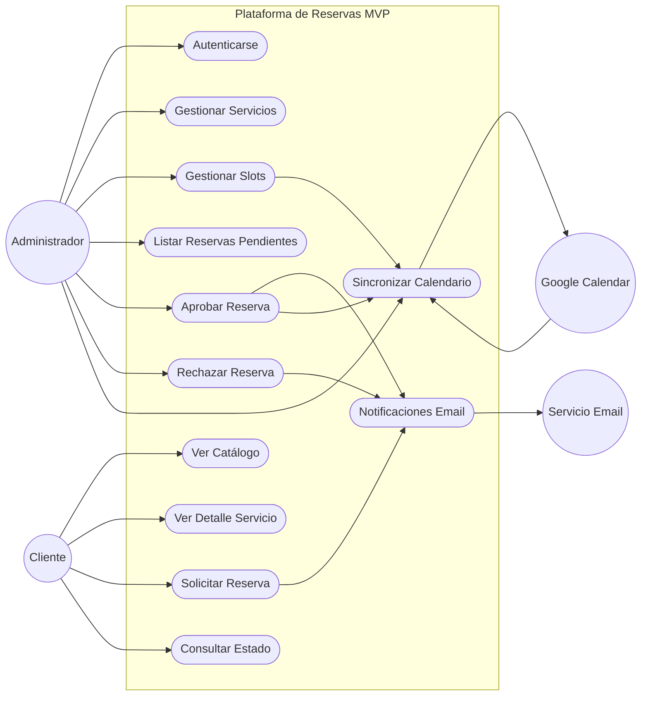
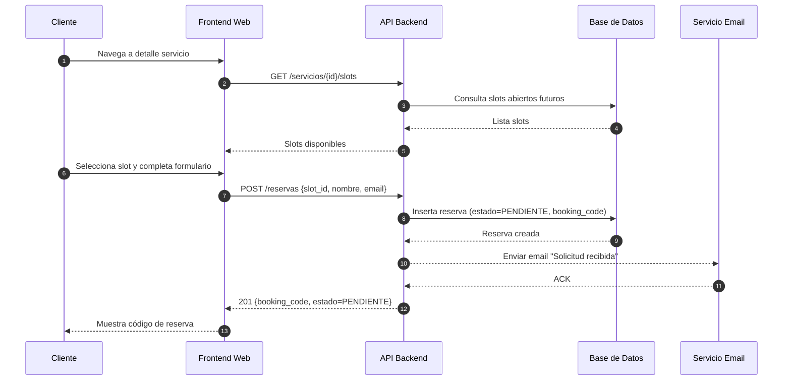
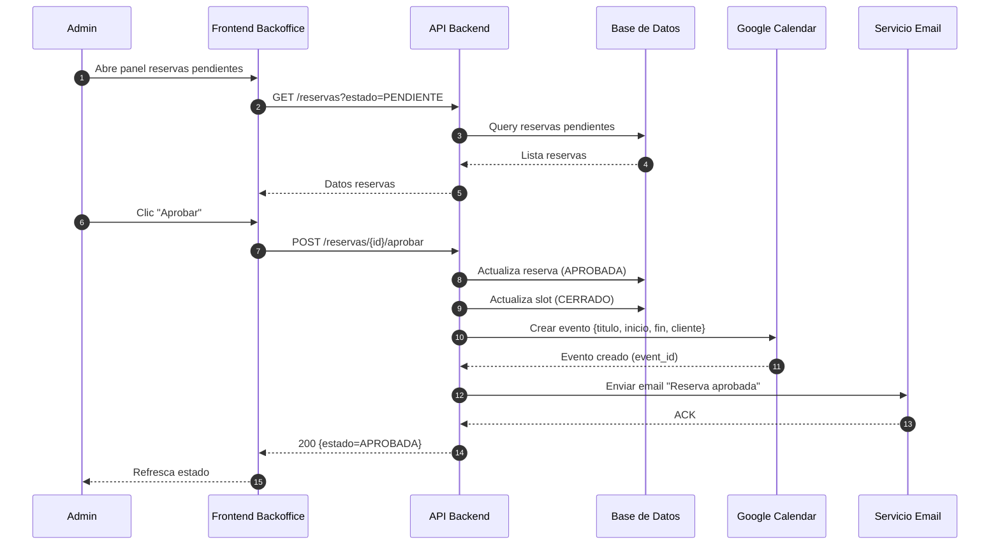

## Diagrama de Casos de Uso y Secuencias - MVP Plataforma de Reservas

## Sección 1: Casos de Uso (Mermaid Flowchart aproximando UML)
 Nota: Mermaid no soporta notación UML de casos de uso nativa; esto es una representación funcional.

---
## Sección 2: Secuencia - Solicitar Reserva

---
## Sección 3: Secuencia - Aprobar Reserva

---
Notas:
-  Los includes de notificaciones se modelan como pasos explícitos a Mail.
- La sincronización inversa (eventos externos) puede implementarse con un job que marque slots como no disponibles (fuera de estas secuencias).
