# RealSaveFooding — User Guide

RealSaveFooding is a mobile-first web application that helps you stop wasting food and money: track what you buy, monitor expiration dates, get AI-assisted expiry estimates, receive alerts before food goes bad, discover recipes that use what you already have, and measure what you save.

This guide covers:

1. [Compilation and local execution](#1-compilation-and-local-execution)
2. [Production deployment (AWS)](#2-production-deployment-aws)
3. [Application functionalities](#3-application-functionalities) — with screenshots of every screen
4. [Running the automated tests](#4-running-the-automated-tests)
5. [Troubleshooting](#5-troubleshooting)

**Tech stack at a glance**

| Layer | Folder | Technology |
|-------|--------|------------|
| Frontend | `front/` | React 19, TanStack Start, Vite, TypeScript |
| Backend | `back/` | NestJS, Prisma ORM, TypeScript |
| Database | Docker / RDS | PostgreSQL 16 |
| Cloud | `infra/` | AWS (EC2, RDS, CloudFront, S3, Textract, SES, SNS), Terraform |

---

## 1. Compilation and local execution

### 1.1 Prerequisites

| Tool | Version |
|------|---------|
| Node.js | ≥ 22 LTS |
| npm | ≥ 10 |
| Docker + Docker Compose | ≥ 25 / ≥ 2.24 |
| Git | ≥ 2.40 |

### 1.2 Clone and install dependencies

```bash
git clone https://github.com/jesramgue/JRG-AI4Devs-finalproject.git
cd JRG-AI4Devs-finalproject

cd back && npm install && cd ..
cd front && npm install && cd ..
```

### 1.3 Configure environment variables

**Backend** — copy the example and adjust:

```bash
cp back/.env.example back/.env
```

The defaults work for local development, **except** the VAPID keys (required at backend startup for Web Push). Generate them once:

```bash
cd back && npx web-push generate-vapid-keys
```

Copy the **public key** into `VAPID_PUBLIC_KEY` (in `back/.env`) and the **private key** into `VAPID_PRIVATE_KEY`. The backend will not start while these are blank.

**Frontend** — create `front/.env`:

```dotenv
VITE_API_BASE_URL=http://localhost:3000/api
VITE_VAPID_PUBLIC_KEY=<same public key as VAPID_PUBLIC_KEY in back/.env>
```

> AWS credentials (`AWS_ACCESS_KEY_ID` / `AWS_SECRET_ACCESS_KEY`) are only needed for receipt OCR (Textract + S3) and email notifications (SES). Everything else works locally without them. See [Local Development Setup](../local-development-setup.md) for the full variable reference.

### 1.4 Start the database and apply migrations

```bash
# Start PostgreSQL 16 in Docker (container: RealSaveFooding-postgres, port 5432)
docker compose -f infra/docker/docker-compose.local.yml up -d

# Create the schema
cd back && npm run prisma:migrate

# Optional: seed a demo user and price catalog
npx prisma db seed
```

### 1.5 Compile and run

**Development mode** (watch + hot reload):

```bash
# Terminal 1 — backend (http://localhost:3000)
cd back && npm run start:dev

# Terminal 2 — frontend (http://localhost:8080)
cd front && npm run dev
```

Or everything at once with the root helper script:

```bash
./dev.sh        # or: make dev
```

Verify the backend is up:

```bash
curl http://localhost:3000/api/health
# {"status":"ok"}
```

Then open **http://localhost:8080** in the browser.

**Production build** (compilation):

```bash
# Backend — compiles TypeScript to back/dist; run with `npm run start`
cd back && npm run build

# Frontend — builds the TanStack Start (Nitro) server bundle to front/.output
cd front && npm run build
```

In production both are packaged as Docker images — see `infra/docker/Dockerfile.back` and `infra/docker/Dockerfile.front`.

---

## 2. Production deployment (AWS)

Production runs on AWS free-tier infrastructure, fully provisioned with Terraform and operated with `prod.sh` / `make`:

```
Browser ──https──▶ CloudFront ──▶ /api/*  → EC2 Docker: realsavefooding-api   (NestJS, :3000)
                              └─▶ default → EC2 Docker: realsavefooding-front (Nitro SSR, :4173)
                                             │
                                             ▼ (security-group-to-security-group)
                                            RDS PostgreSQL (private)
```

**Prerequisites**: AWS CLI v2 (configured), Terraform ≥ 1.6, Docker, `session-manager-plugin` (SSH over SSM).

**One-time configuration**:

```bash
cp infra/terraform/envs/prod/terraform.tfvars.example infra/terraform/envs/prod/terraform.tfvars
# fill in: admin_cidr (your IP /32), ec2_key_name, db_password
```

App secrets (`JWT_SECRET`, VAPID keys, SES sender) live in `infra/docker/prod.secrets.env` — auto-generated on the first `app-deploy` and kept stable across redeploys.

**Deploy commands** (root `Makefile`):

```bash
make deploy       # terraform apply — provisions VPC, EC2, RDS, CloudFront, IAM, alarms
make app-deploy   # builds the two Docker images on the EC2 box, runs migrations, restarts containers
make destroy      # terraform destroy — tears everything down
```

After `app-deploy`, the app is served at the CloudFront domain printed by Terraform (currently https://dtjx9r745cz30.cloudfront.net).

Full step-by-step references:

- [Production (AWS) Deployment Setup](../prod-development-setup.md) — day-to-day operations
- [AWS Free-Tier Deployment Runbook](../deployment/aws-free-tier-runbook.md) — first-time provisioning walkthrough

---

## 3. Application functionalities

All screenshots below were captured from the running application (mobile viewport, the app's primary target). The bottom navigation bar — **Pantry · Recipes · Add · Insights · Settings** — is available on every authenticated screen.

### 3.1 Landing page

The public home page summarizes the value proposition (receipt scanning, expiry reminders, savings tracking) and routes new users to **Get started** (sign-up) or **I already have an account** (sign-in).

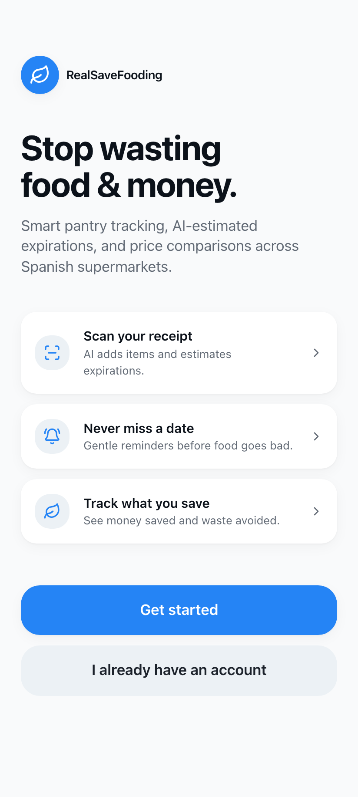

### 3.2 Create an account and sign in

Authentication is email + password (minimum 8 characters). The same screen switches between **Sign in**, **Create account**, and a recovery placeholder. After signing in, a JWT session is stored and you land on the Pantry.

| Sign in | Create account |
|---|---|
| 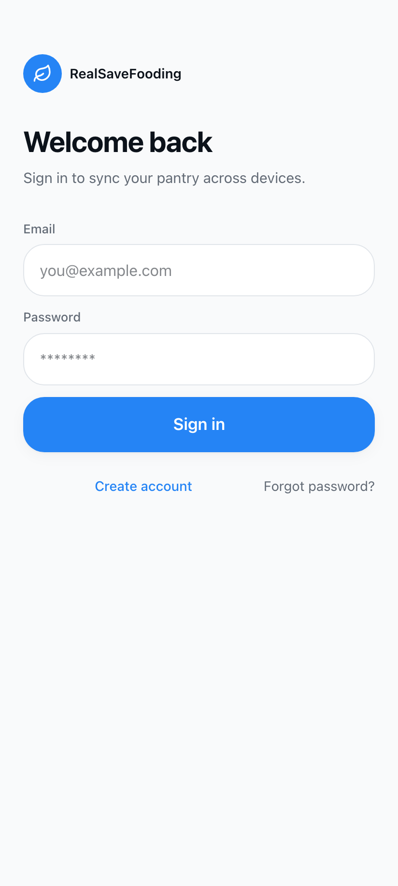 | 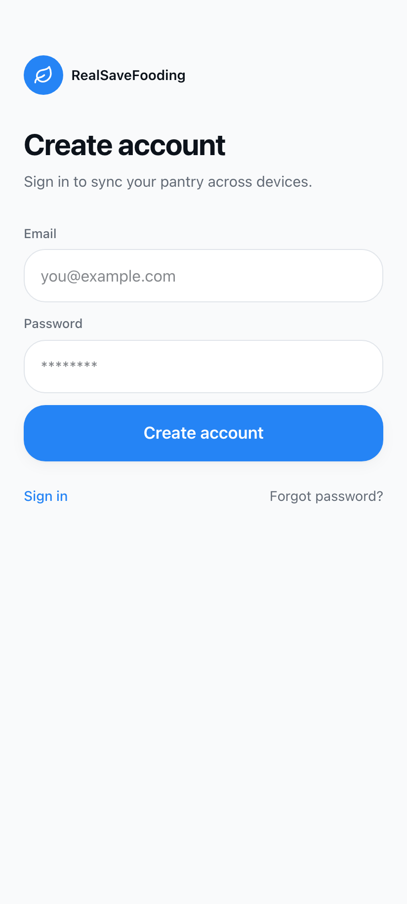 |

### 3.3 Pantry — your inventory

The Pantry is the home screen. It shows:

- An **expiry alert banner** ("3 items expire within 2 days") fed by the dashboard summary.
- **Search** and **filter chips**: All, Expiring, Fridge, Pantry, Freezer.
- One card per item with quantity, unit, storage location, price paid, and a color-coded expiry countdown (red = tomorrow/today, orange = 2–3 days, gray = safe).

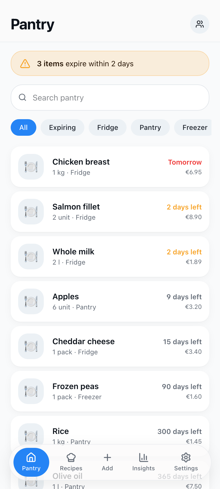

The **Expiring** filter isolates the items that need attention first:

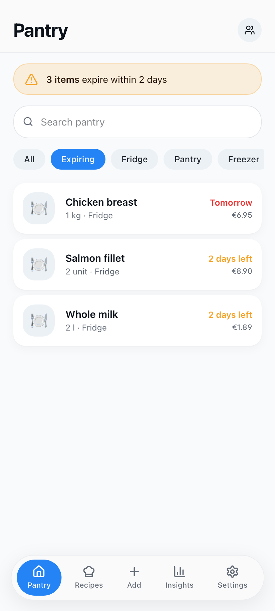

### 3.4 Adding items

The **Add** tab offers four entry methods, plus a "recently added" list:

- **Scan receipt** — upload a supermarket receipt; AWS Textract OCR extracts the items and the AI suggests expiration dates for each line (requires AWS credentials).
- **Photo of product** — identify a single item from a photo.
- **Manual entry** — type it yourself.
- **Voice add** — say what you bought.

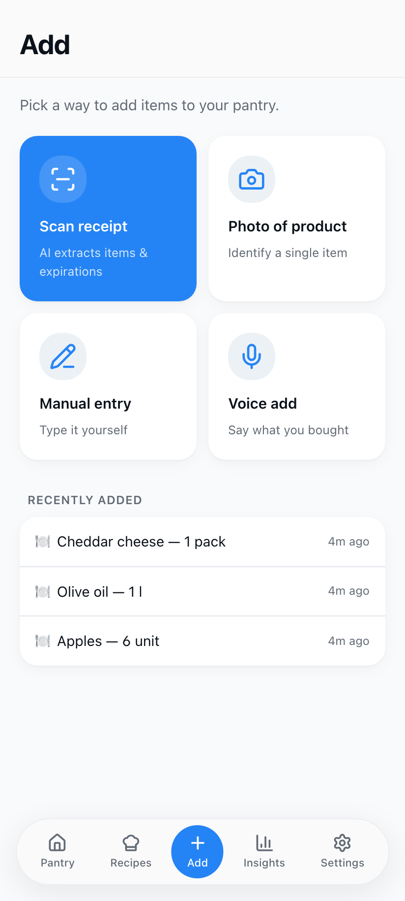

**Manual entry** captures name (with quick-pick food icons), category, quantity, unit, storage location, prices, notes, and the expiration date. If you don't know the date, press **Estimate expiration** — the expiration intelligence service suggests one based on the food category, with a confidence level, and learns from your corrections over time.

| Item + estimate | Full form |
|---|---|
| 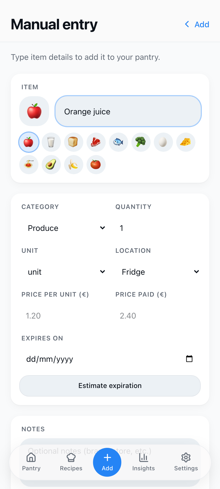 | 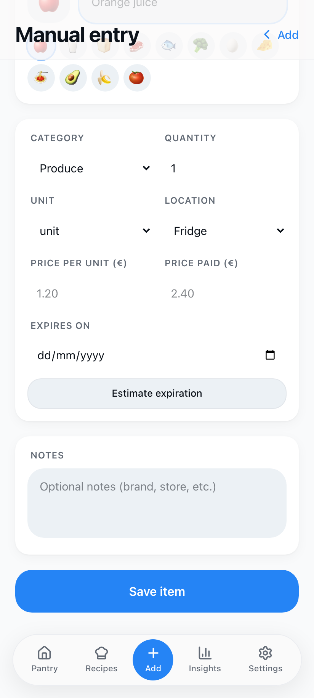 |

### 3.5 Item detail

Tap any pantry card to open the item detail, where you can:

- See at a glance the expiry countdown, price paid, and date added.
- **Edit** name, quantity, unit, storage location, prices, and notes.
- Explore **Alternatives** (plant-based, cheaper, longer shelf life) and change the default product for this food.
- Use **Expiration Intelligence**: re-run the estimate or **override** the date manually — overrides feed the per-category learning that improves future estimates (see Settings § Expiry Learning).
- **Mark as consumed** or **Mark as wasted**, which updates inventory, insights, and gamification points.

| Details | Actions + expiration intelligence |
|---|---|
| 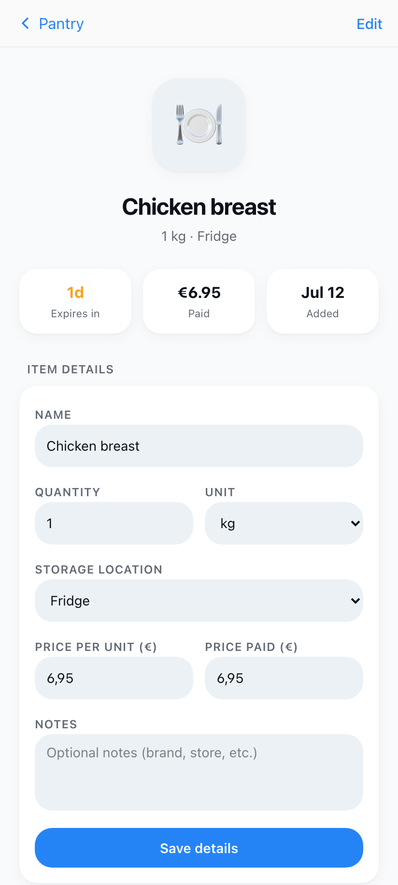 | 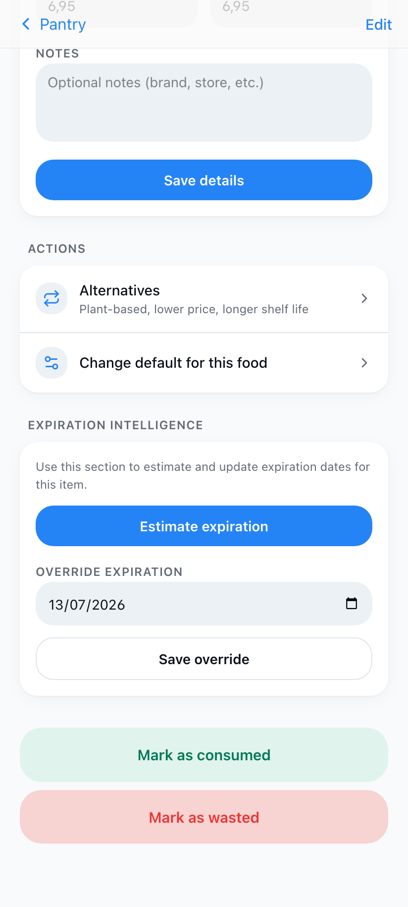 |

### 3.6 Recipes — cook what you have

The Recipes tab suggests meals ranked by how many ingredients you already have in your pantry; matched ingredients are shown as green chips.

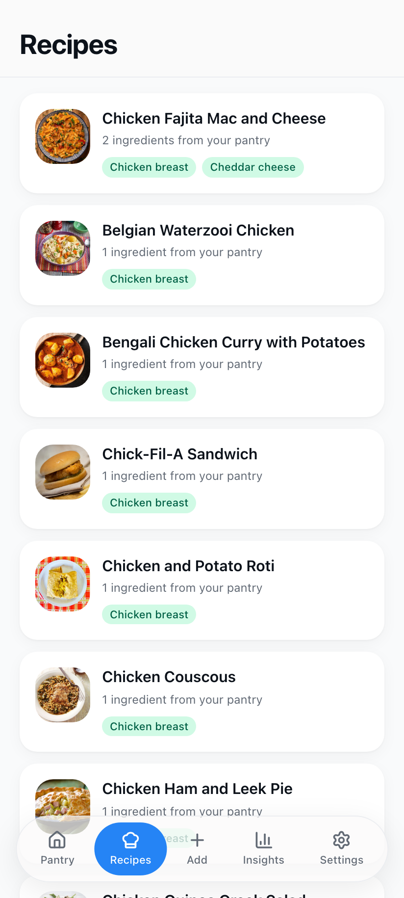

Each recipe detail shows the photo, category, a video link, the ingredient list (pantry-matched ingredients highlighted), and step-by-step instructions. **Mark as cooked** registers consumption of the matched pantry items in one tap.

| Ingredients | Instructions + cook |
|---|---|
| 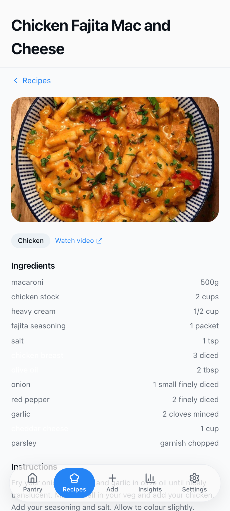 | 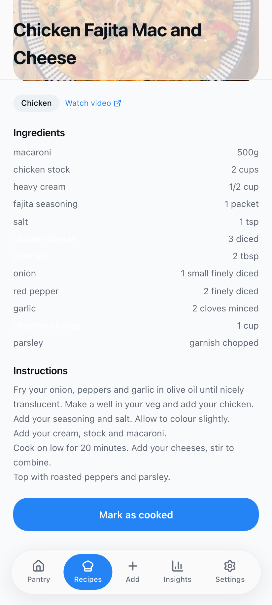 |

### 3.7 Insights — dashboard and use-next

The Insights tab is the analytics dashboard:

- **Active items** and **expiring soon** counters.
- **Achievements summary** (points, streak, latest badge).
- **Waste metrics**: number of waste events, quantity, and money lost.
- **Use next** — a prioritized list of what to eat first, each with a freshness badge (Use today / Use soon / Still fresh) and one-tap **Mark consumed** / **Mark wasted** buttons.

| Dashboard | Use-next list |
|---|---|
| 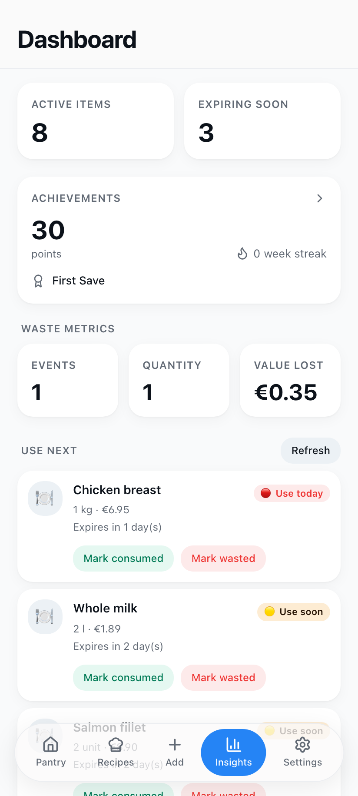 | 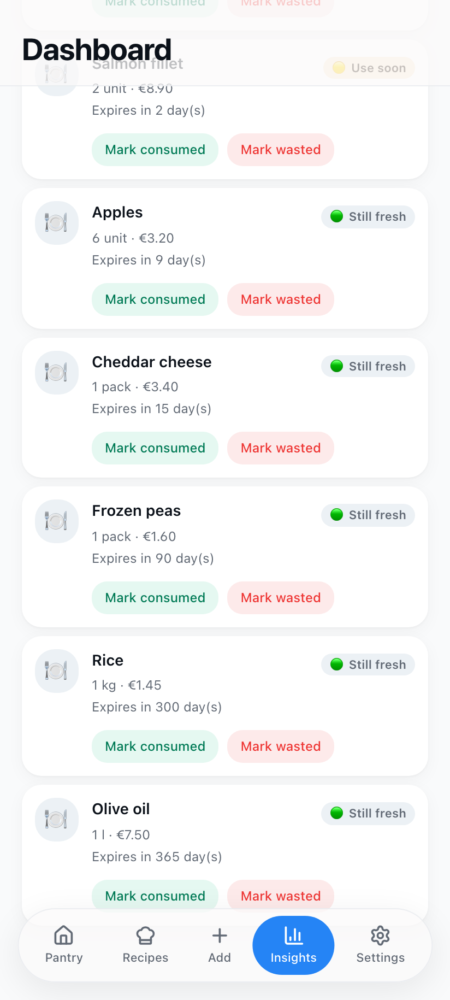 |

### 3.8 Notifications

Reachable from Settings → Notification center. Alerts are delivered through two channels: **email (AWS SES)** and **browser push (Web Push / VAPID)**.

- **Enable push notifications** registers this browser for push messages.
- **Evaluate now** scans the pantry and generates `EXPIRING_SOON` events for items hitting the 3-days-before-expiry threshold (deduplicated per day, respecting your preferences).
- The event feed lists each alert with the item, days remaining, and timestamp.

In production the evaluation also runs automatically on a schedule.

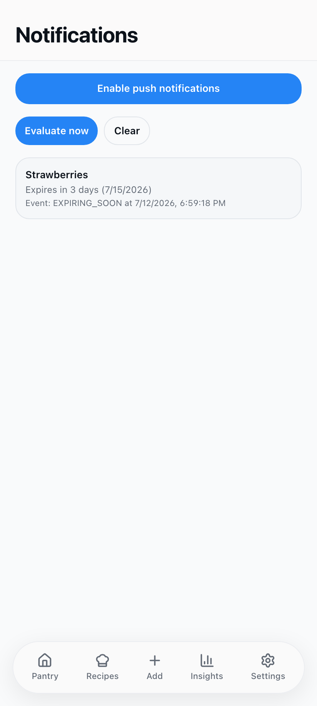

### 3.9 Achievements — gamification

Saving food earns points and badges:

- **Total points** and **value saved** (€) counters.
- **Badges**: First Save, Saver 10/50/100, Money Saver, Zero Waste Week.
- **Points history**: +10 for consuming before expiry, +5 bonus when consumed with 3+ days to spare, −5 for wasted items, and badge events.

| Badges | Points history |
|---|---|
| 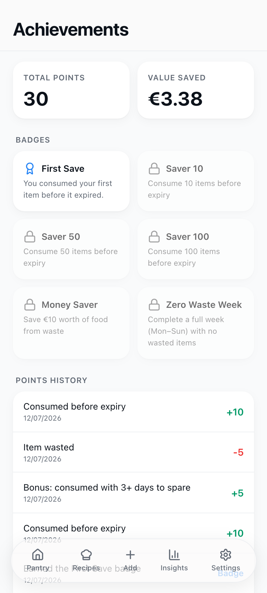 | 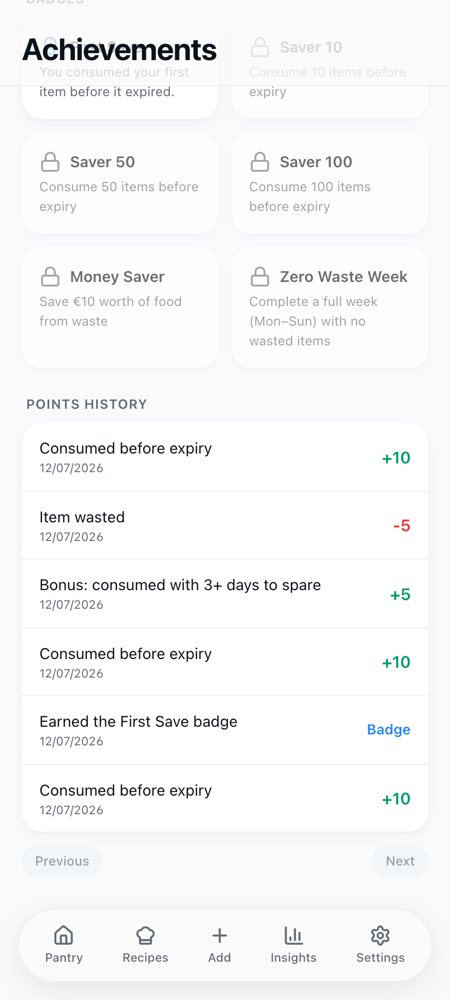 |

### 3.10 Shared pantry — households

Share your pantry with family members or roommates so everyone sees the same inventory. Create a household, then send invitations; invitees accept from their own account. Membership, roles, and pending invites are managed from Settings → Manage sharing.

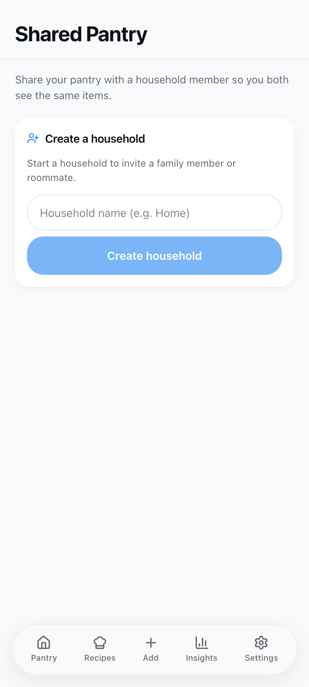

### 3.11 Settings

The Settings tab groups account and behavior configuration:

- **Your profile** — name, family name, age, email, address.
- **Shared pantry** — members and pending invitations.
- **Notifications** — toggle food expiration, price drop, and "consumed by others" alerts; **Auto-expire stale items** automatically marks items as wasted after N days past expiry (configurable threshold).
- **Expiry learning** — shows the per-category expiration preferences the app has learned from your manual overrides, with per-category or full reset.
- **Privacy & security** — change password, delete account (soft delete).
- **App info** and **Sign out**.

| Notifications + learning | Profile + security |
|---|---|
| 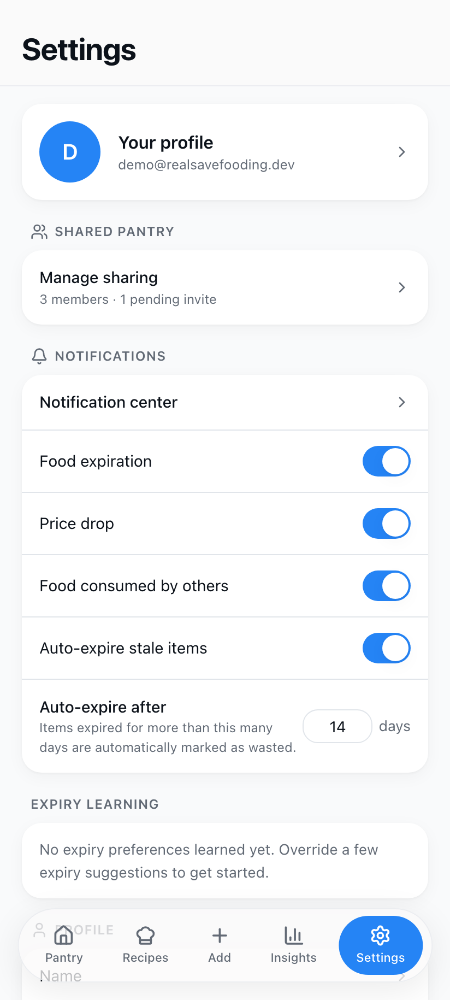 | 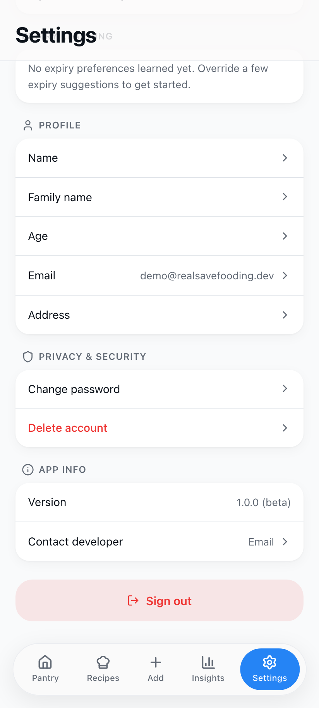 |

---

## 4. Running the automated tests

```bash
# Backend unit tests (Jest)
cd back && npm test

# Backend integration/e2e tests (requires the Docker database)
cd back && npm run test:e2e

# Frontend unit tests (Vitest)
cd front && npm test

# Frontend e2e tests (Playwright — requires backend running)
cd front && npm run playwright:install   # first time only
cd front && npm run test:e2e
```

---

## 5. Troubleshooting

| Symptom | Fix |
|---------|-----|
| Backend exits with `Error: No key set vapidDetails.publicKey` | `VAPID_PUBLIC_KEY`/`VAPID_PRIVATE_KEY` are blank in `back/.env` — generate them (§1.3) |
| Prisma `Can't reach database server` | Check `docker ps --filter name=RealSaveFooding-postgres`; port 5432 may be taken by another container |
| Frontend can't reach the API | Confirm `curl http://localhost:3000/api/health` and `VITE_API_BASE_URL` in `front/.env` |
| Receipt OCR fails | Real AWS credentials with Textract/S3 access are required in `back/.env` |
| Dirty migration state | `cd back && npx prisma migrate reset` (destroys local data) |

For the complete troubleshooting reference see [Local Development Setup §10](../local-development-setup.md#10-troubleshooting).
