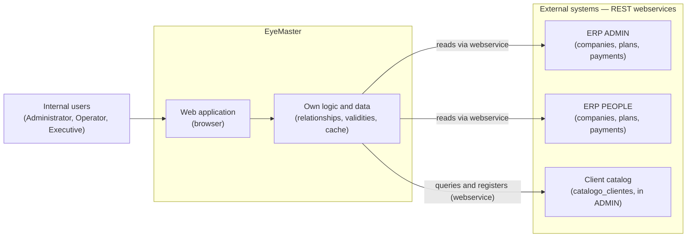
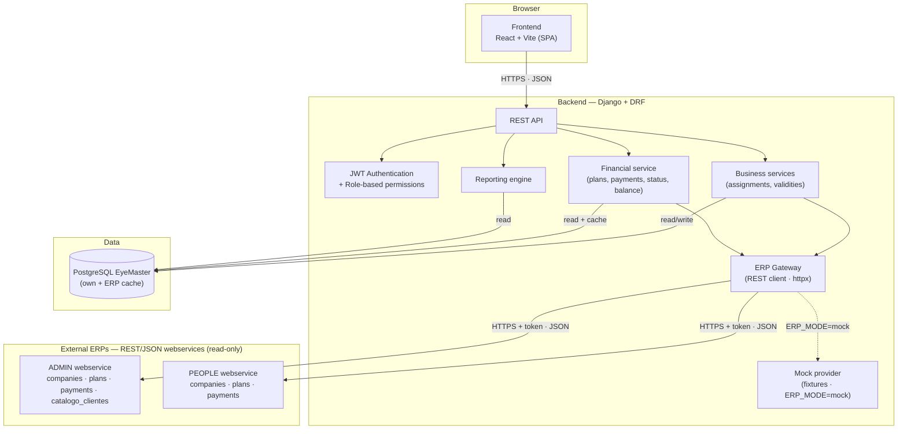
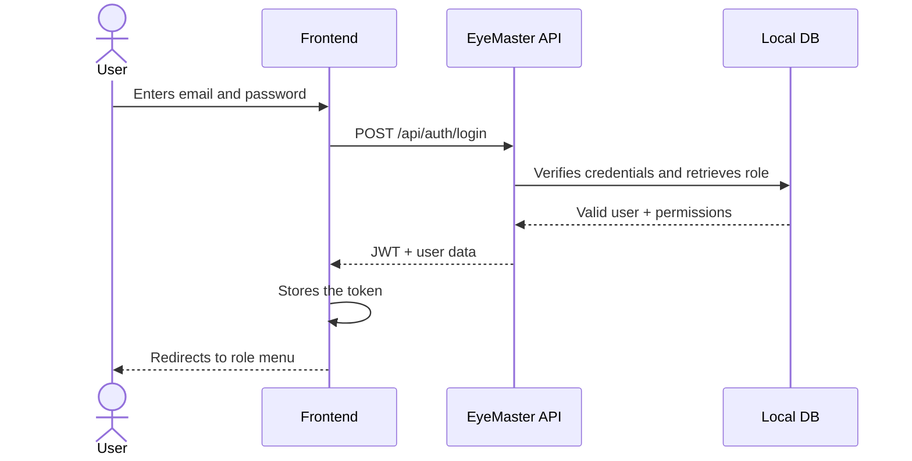
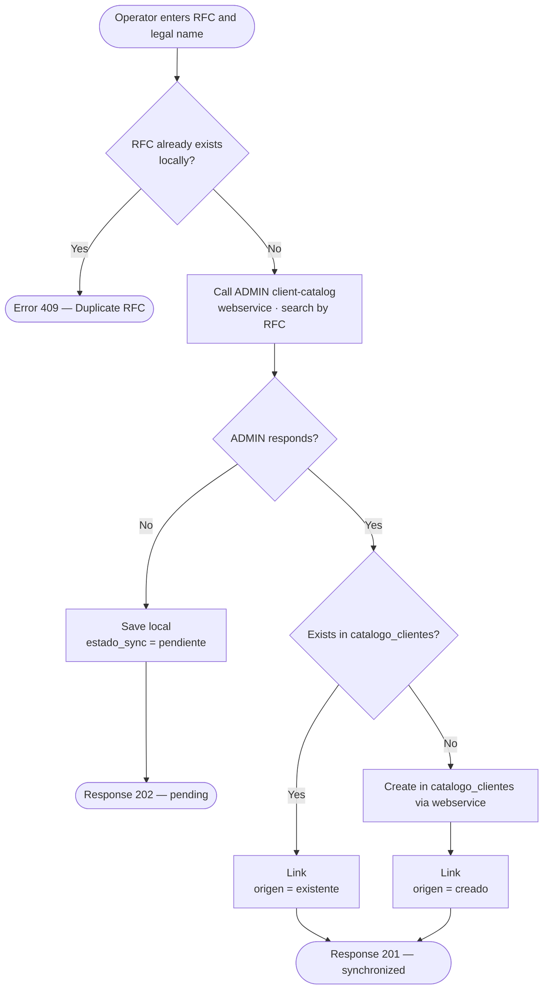
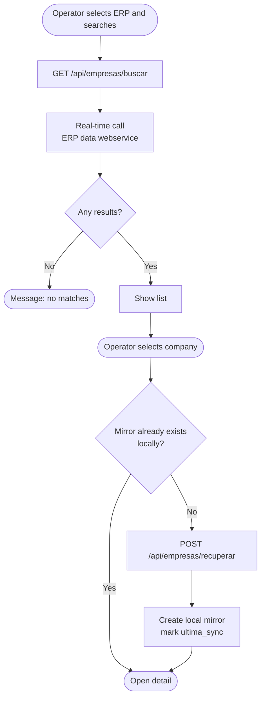
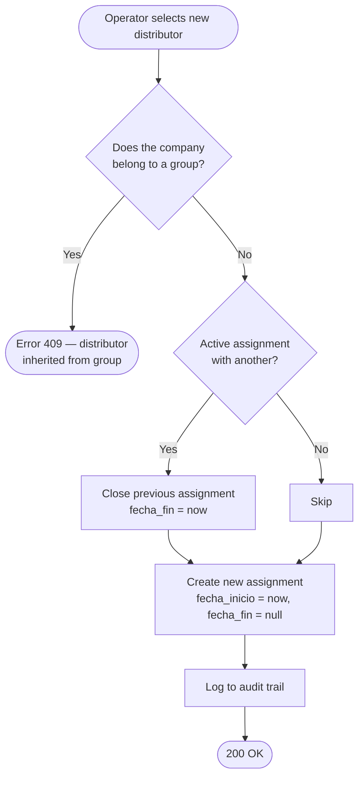
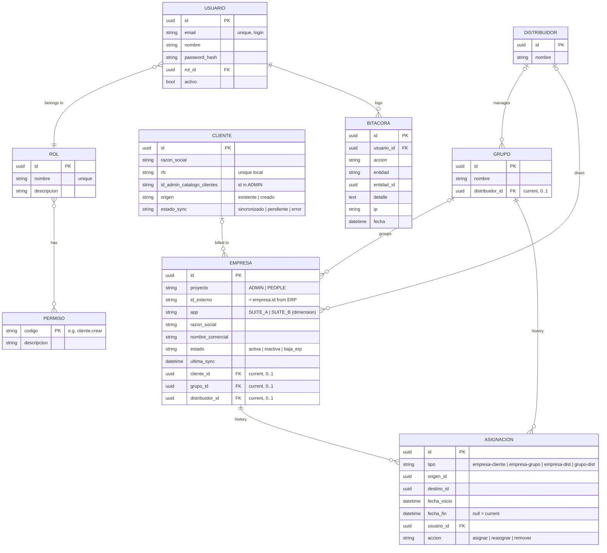
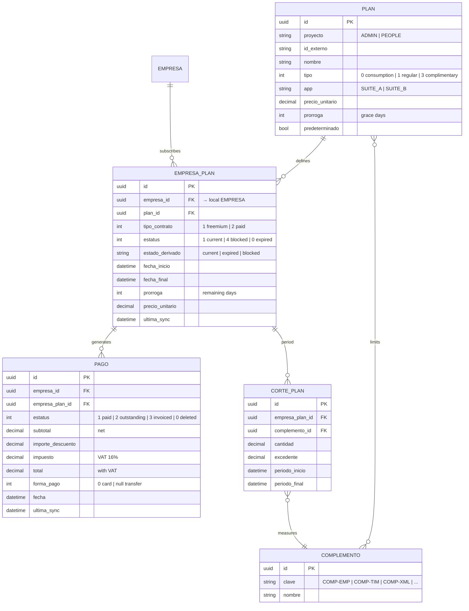

# EyeMaster V2

**Internal commercial and financial administration system for companies registered in external ERPs.**

---

## Table of Contents

1. [Executive summary](#1-executive-summary)
2. [Glossary](#2-glossary)
3. [Project details](#3-project-details)
4. [Product vision](#4-product-vision)
5. [System architecture](#5-system-architecture)
6. [Functional modules](#6-functional-modules)
7. [Data model](#7-data-model)
8. [REST API](#8-rest-api)
9. [User stories](#9-user-stories)
10. [Work plan and tickets](#10-work-plan-and-tickets)
11. [Open items](#11-open-items)
12. [Improvement proposals](#12-improvement-proposals)
13. [Annexes and references](#13-annexes-and-references)

---

## 1. Executive summary

EyeMaster V2 is an **internal application** aimed at commercial, administrative, and executive teams who need to **query, organize, and report** information about companies operating in two of the organization's ERPs: **ADMIN** and **PEOPLE**.

Today, that information is scattered across both systems and there is no single point where common questions can be answered, such as *which companies does this distributor handle?*, *is this client current?*, *how much does group X owe?* or *what are our monthly revenues?*

EyeMaster **does not replace** the ERPs nor modify them. It works as a **consolidation layer** that:

- **Reads in real time** company, plan, and payment information from the ERPs through their **REST webservices** (read-only).
- **Locally manages** commercial relationships: billable client, group, and distributor per company, with history.
- **Calculates** the operational status of each company (current, expired, blocked) and its outstanding balance.
- **Exposes** a **reports** module that combines both sources to answer operational and financial queries.

The result is a single source of truth for commercial operations, with complete historical traceability and reports accessible to any team profile.

---

## 2. Glossary

| Term | Definition |
|---|---|
| **ERP** | External system where companies and their financial operations live. This project has two: ADMIN and PEOPLE. |
| **ADMIN** | One of the two organization ERPs. Exposes REST webservices for its data and for client registration. |
| **PEOPLE** | The other ERP. Same data structure and webservice contract as ADMIN; they were once a single database, now separated. |
| **App** | Suite a company belongs to: `SUITE_A` or `SUITE_B`. It is a reporting dimension. |
| **Company** | Operational entity that lives in an ERP. EyeMaster retrieves it, does not create it. |
| **Client** | Natural or legal person to be invoiced. Validated or registered in ADMIN's `catalogo_clientes` catalog. |
| **Group** | Set of commercially related companies. A company belongs to at most one group. |
| **Distributor** | Commercial account manager. Manages companies directly or through groups. |
| **Assignment** | Time-bounded relationship between two entities (e.g., company↔distributor). Stores *from* and *until*. |
| **Plan** | Service contracted by a company in the ERP (e.g., `Basic Plan`). Includes add-ons and price. |
| **Add-on** | Measurable resource of the plan (employees, stamps, XML, users, products, sales). |
| **empresa_plan** | Active subscription of a company to a plan. Defines validity, price, and operational status. |
| **Payment** | Charge generated in the ERP, always at the **company level**. Has a status (paid, outstanding, invoiced). |
| **Outstanding balance** | Sum of the amount (`total`) of pending payments (status = 2) of a company. Includes VAT. |
| **Billing cycle** | Monthly closure of a `empresa_plan` period. Records consumption and overages. |
| **catalogo_clientes** | Client catalog that lives inside the ADMIN-resolved instance. |
| **Cache** | Local copy in EyeMaster of ERP information, synchronized periodically. |
| **Validity** | Period during which something is active (`fecha_inicio` / `fecha_fin`). Applies to both plans and assignments. |
| **RBAC** | Security model based on roles and permissions (Role-Based Access Control). |
| **SPA** | Single Page Application: web application running in the browser (React + Vite). |
| **JWT** | Signed authentication token, used to identify the user in each request. |
| **ERP webservice** | REST/JSON API exposed by each ERP (ADMIN, PEOPLE) through which EyeMaster reads companies, plans, and payments, and registers clients. Replaces the previous direct database access. |
| **ERP Gateway** | Backend component that centralizes all ERP calls behind a single interface, with two implementations selectable by `ERP_MODE`: **real** (HTTP) and **mock**. |
| **Mock provider** | Implementation of the ERP Gateway that returns local JSON fixtures instead of calling the real webservices, used while these do not yet exist (`ERP_MODE=mock`). |

---

## 3. Project details

| Field | Detail |
|---|---|
| **Product** | EyeMaster V2 |
| **Author** | Jairo Alberto Sánchez Suárez |
| **Program** | AI4Devs Master — Final Project |
| **Current delivery** | Delivery 1 — Technical documentation |
| **Target date** | July 5, 2026 |
| **Application type** | Internal; not offered to the public |
| **Operating currency** | MXN (Mexican peso) |
| **Stack — Backend** | Django + Django REST Framework, PostgreSQL, `httpx` (REST client for the ERP webservices), `djangorestframework-simplejwt` |
| **Stack — Frontend** | React + Vite (decoupled SPA) |
| **External integrations** | ADMIN (REST webservices: data + client catalog), PEOPLE (REST data webservice). Read-only, token-authenticated. **Simulated** by an internal mock provider (`ERP_MODE=mock`) until the real webservices exist. |
| **Deployment** | Backend on Render or Railway (Docker); frontend on Vercel or Netlify |
| **Repository** | *To be defined* |

---

## 4. Product vision

### 4.1 Problem it solves

The current commercial operation has four concrete problems:

1. **Fragmented information.** Companies and their financial information live in two independent ERPs (ADMIN and PEOPLE), with no single query point.
2. **Non-centralized commercial relationships.** There is no canonical place that states which group a company belongs to, who its distributor is, or which client is invoiced.
3. **No historical traceability.** If a company changes distributor, there is no reliable way to know, months later, who it belonged to when a given payment was generated.
4. **Limited reports.** Each ERP only answers for its own information. Questions that cross commercial and financial data (e.g., *total outstanding balance by distributor*) require manual reconciliation.

### 4.2 Product objective

Provide **a single internal system** that allows:

- Retrieving companies from the ERPs without duplicating their capture.
- Managing commercial relationships (client, group, distributor) with history.
- Knowing the financial status of each company (current plan, status, outstanding balance).
- Generating flexible and predefined reports on consolidated data.
- Operating securely by roles, auditing sensitive actions, and temporal traceability.

### 4.3 Scope

#### 4.3.1 What EyeMaster does (Delivery 1)

| Block | Functionality |
|---|---|
| **Access and security** | JWT authentication, configurable roles, own user and permission management. |
| **Clients** | Validated registration against ADMIN (searches or creates by RFC); retry if external service does not respond. |
| **Companies** | Real-time search and retrieval from ADMIN or PEOPLE (read-only). |
| **Commercial structure** | Assignment of client, group, and distributor to each company, with validations and validity. |
| **Plans and subscriptions** | Query of plan catalog and active plan per company, with its status. |
| **Payments and outstanding balance** | Payment query per company and outstanding balance calculation (individual and aggregated by client, group, and distributor). |
| **Reports** | Reporting engine with flexible queries and a catalog of predefined reports. |
| **Audit** | Append-only log of sensitive actions. |

#### 4.3.2 What EyeMaster does NOT do

This delimitation is critical to avoid misunderstandings with any audience:

| Action | Status |
|---|---|
| Create companies in the ERPs | ❌ No. Companies exist previously; EyeMaster retrieves them. |
| Generate charges or invoices | ❌ No. Payments are generated in the ERPs; EyeMaster only queries them. |
| Write to ADMIN or PEOPLE | ❌ No (except client registration via the ADMIN client-catalog webservice to `catalogo_clientes`). |
| Modify plans, add-ons, or consumption | ❌ No. These are source data, read-only. |
| Process online payments | ❌ Out of scope. |
| Replace the ERP in daily operations | ❌ No. It is a consolidation layer, not a replacement. |

#### 4.3.3 Roadmap beyond Delivery 1

Left in backlog, with criteria to be defined:

- **Consolidated payment method configuration.** Allow multiple companies in a group to settle through a paying company. Does not change the billing level (remains per company); this is a configuration so that settlement is attributed correctly. Exact criteria are pending (see §11).
- **Indicators and dashboards.** Visualizations derived from the reporting engine.

### 4.4 Audiences and roles

| Profile | What they need from the system |
|---|---|
| **Client / project sponsor** | Understand what EyeMaster solves and what it does not; functional vision. |
| **Functional analyst** | Business rules, flows, and documented validations. |
| **Developer** | Data model, API, technical decisions, integrations. |
| **QA** | Acceptance criteria, error scenarios, edge cases. |
| **New team member** | Quick onboarding; glossary, scope, and architecture. |
| **Administrative operator** (end user) | How to register clients, retrieve companies, and assign them. |
| **Executive** (end user) | How to query status and reports. |
| **Administrator** (end user) | How to configure roles, users, and permissions. |

The **three functional roles** of the system are:

| Role | Scope |
|---|---|
| **Administrator** | Full access. Manages users, roles, permissions, and catalogs. |
| **Administrative operator** | Daily operations: client registration, company retrieval, assignments, sensitive actions. |
| **Executive** | Read-only: current status queries and reports. |

Permissions associated with each role are **configurable from the system itself** (not hardcoded).

---

## 5. System architecture

### 5.1 Conceptual view (for non-technical audiences)

EyeMaster sits between two existing ERPs and their internal users. It reads the ERPs in real time **through their webservices**, maintains its own database for commercial relationships, and exposes a web application to users.



**What each side manages:**

| What comes from the ERP (read-only) | What EyeMaster manages |
|---|---|
| Companies and their base data | Billable client per company |
| Plans, add-ons, and limits | Group and distributor per company |
| Subscriptions (`empresa_plan`) | Assignment history with validity |
| Consumption, billing cycles, and payments | Users, roles, and permissions |
| Client catalog (`catalogo_clientes`) | Audit log |
| | Consolidated reports |

### 5.2 Technical view



### 5.3 External integrations

| Integration | Type | Direction | Purpose |
|---|---|---|---|
| **ADMIN — data webservice** | REST / JSON | Read (real-time) | Retrieve companies, plans, subscriptions, payments, and billing cycles. |
| **ADMIN — client-catalog webservice** | REST / JSON | Read + limited write | Search client by RFC in `catalogo_clientes` and, if not found, register it. Only point where EyeMaster writes to external systems. |
| **PEOPLE — data webservice** | REST / JSON | Read (real-time) | Same purpose as ADMIN's data webservice. Identical contract. |

**Relevant operational notes:**

- All ERP access goes through a single **ERP Gateway** with two interchangeable implementations, selected by the `ERP_MODE` setting: **real** (`httpx` HTTP client) and **mock** (returns local JSON fixtures). Since the real webservices do not exist yet, the project runs in `ERP_MODE=mock`, which **simulates** both the request and the response.
- ADMIN and PEOPLE expose the **same webservice contract**. They once operated as a single database; at some point they were separated and cleaned up. This history means company identifiers can **overlap** between both ERPs, which requires using `proyecto + id_externo` as the identity in EyeMaster.
- The `empresa.app` field distinguishes two commercial suites: `SUITE_A` and `SUITE_B`. In EyeMaster, `app` is a **reporting dimension**, not part of the identity.
- The ERP webservices are protected by an **access token**. Each request carries it in the `Authorization` header; tokens are kept out of the code (environment variables).
- The webservices resolve internally which instance holds each company; EyeMaster no longer needs `master → instance` resolution logic — it simply calls the webservice.
- Plans, subscriptions, payments, and billing cycles are **cached locally** to speed up queries and enable the reporting engine. The cache carries `ultima_sync`; it is never written back to the ERP.

### 5.4 Architectural decisions

| Decision | Justification |
|---|---|
| **Decoupled frontend from backend** (SPA + REST API) | Deployment independence and ability to evolve separately. |
| **JWT authentication** (`djangorestframework-simplejwt`) | Standard and compatible with stateless SPA without session state in the backend. |
| **RBAC with own views** | Reuses Django's auth engine (models, hashing, verification), but not its admin UI. All user and permission management goes through product endpoints and screens. |
| **ERP access via webservices, not direct DB** | EyeMaster no longer connects to the ERP databases; it consumes their REST webservices. This decouples EyeMaster from the ERPs' internal schema and removes any writable database surface. |
| **Single ERP Gateway (real + mock)** | Centralizing all ERP calls behind one interface allows swapping the real HTTP client for a mock provider (fixtures) via `ERP_MODE`, so the product can be developed and demoed before the real webservices exist. |
| **Read-only webservice integration** | Explicit guarantee that EyeMaster cannot corrupt production data: it consumes only read endpoints (plus the single client-catalog write). It holds no ERP database credentials. |
| **Local financial cache** | The reporting engine needs fast aggregations and historical view that would be costly to resolve by calling the ERP webservice on each request. |
| **Assignments with validity, no physical deletion** | Allows reconstructing system state "as of date" for correct historical reports. |
| **Company identity = `proyecto + id_externo`** | Internal IDs can overlap between ADMIN and PEOPLE. The combination guarantees uniqueness. |
| **`catalogo_clientes` exposed by the ADMIN webservice** | The client catalog is not an independent system; it is served by ADMIN's client-catalog webservice endpoints. |
| **Container deployment** | Environment reproducibility; secrets via environment variables. |

---

## 6. Functional modules

This section describes each module following a consistent template: **objective, problem it solves, how it works, flow, rules, dependencies, external data, own data, errors, and validations**.

### 6.1 Module: Access and security (RBAC)

**Objective.** Ensure that each user accesses exclusively the functionalities their role permits, with secure authentication and configurable permissions.

**Problem it solves.** EyeMaster handles sensitive information (commercial relationships, outstanding balances, client registration in external systems). Without access control, anyone could modify data or see information that is not theirs.

**How it works.**

- Users authenticate with email and password. The system responds with a **JWT token** that the frontend includes in every subsequent request.
- Each user has **one role**. Each role has **a set of permissions**.
- Permissions are identified by code (e.g., `cliente.crear`, `empresa.asignar_grupo`) and are verified at each endpoint.
- User, role, and permission management is done through the system's own screens (Django's admin interface is not used).

**Complete flow (login).**



**Business rules.**

| Rule | Detail |
|---|---|
| R-SEG-01 | Each user belongs to a single role. |
| R-SEG-02 | Permissions per role are **configurable** from the system; they are not hardcoded. |
| R-SEG-03 | Passwords are stored using Django's hashing mechanism (never in plain text). |
| R-SEG-04 | Sensitive actions are recorded in the audit log (see §6.8). |
| R-SEG-05 | An inactive user cannot log in. |

**Dependencies.** None external. It is the base module that enables the rest.

**External data.** Not applicable.

**Own data.** `User`, `Role`, `Permission`, role↔permission associations.

**Error scenarios.**

| Scenario | Expected response |
|---|---|
| Invalid credentials | `401 Unauthorized` with generic message (without specifying whether the issue is user or password). |
| Inactive user | `401` with clear message: "user deactivated". |
| Expired token | `401`. The frontend must renew with `/api/auth/refresh`. |
| Action without permission | `403 Forbidden`. |

**Validations.**

- Email must have a valid format and be unique.
- Passwords follow a minimum security policy (length, characters). *Exact policy pending — see §11.*
- Deleting the last administrator of the system is not allowed.

---

### 6.2 Module: Clients

**Objective.** Maintain a local catalog of billable clients, ensuring each client also exists in ADMIN (`catalogo_clientes`).

**Problem it solves.** In the current operation, clients are duplicated or created inconsistently because each operator searches and captures on their own. EyeMaster centralizes registration and enforces validation against ADMIN first.

**How it works.**

- The operator captures the client's **RFC** and **legal name**.
- EyeMaster invokes ADMIN's **client-catalog webservice** (REST) to search for the client by RFC.
- If found in ADMIN, it is linked locally (`origen = existente`).
- If not found, it is created in ADMIN via the same webservice and then linked locally (`origen = creado`).
- If the webservice **does not respond**, the client is registered locally as `pendiente` and can be retried.

**Complete flow.**



**Business rules.**

| Rule | Detail |
|---|---|
| R-CLI-01 | RFC is **unique** locally in EyeMaster. |
| R-CLI-02 | EyeMaster does not allow creating a client without searching in ADMIN first. |
| R-CLI-03 | If ADMIN does not respond, the client remains in `pendiente` state and must be retried manually. |
| R-CLI-04 | Successful registration in ADMIN is recorded in the audit log (sensitive action). |
| R-CLI-05 | A client can be linked to multiple companies (N-to-1 relationship from company). |

**Dependencies.**

- ADMIN client-catalog webservice (valid access token), via the ERP Gateway.
- Audit log (records the registration).

**External data.** Client data in `catalogo_clientes`, served by ADMIN's client-catalog webservice.

**Own data.** Local `Client` table: `id`, `rfc`, `razon_social`, `id_admin_catalogo_clientes`, `origen`, `estado_sync`.

**Error scenarios.**

| Scenario | Response |
|---|---|
| RFC already registered locally | `409 Conflict`. |
| Client-catalog webservice unavailable or slow | Local client in `pendiente` state; response `202 Accepted`. |
| Webservice responds with ADMIN validation error | `400` with the ERP message. |
| ADMIN token expired | Automatic retry with refreshed token; if it fails, `502 Bad Gateway`. |

**Validations.**

- RFC with valid format (standard length and pattern).
- Legal name not empty.
- Sync status among `sincronizado`, `pendiente`, and `error`.

---

### 6.3 Module: Companies

**Objective.** Allow an operator to find a company registered in ADMIN or PEOPLE and "retrieve" it to manage it in EyeMaster.

**Problem it solves.** Companies already exist in the ERPs. Re-capturing them in EyeMaster would duplicate work, create inconsistencies, and open the door to errors. The solution is to retrieve them as a **mirror**.

**How it works.**

- The operator searches for companies by name or identifier, first selecting the ERP (`ADMIN` or `PEOPLE`).
- EyeMaster queries the corresponding ERP in real time and returns results.
- When selecting a company, EyeMaster creates a local **mirror**: its own row with identity (`proyecto + id_externo`) and relevant base data (`razon_social`, `nombre_comercial`, `app`, etc.), marking the `ultima_sync`.
- From that point on, that company can be assigned to a client, a group, and a distributor from EyeMaster.

**Complete flow.**



**Business rules.**

| Rule | Detail |
|---|---|
| R-EMP-01 | EyeMaster **never creates or modifies companies in the ERP**. It only retrieves them. |
| R-EMP-02 | A company's identity in EyeMaster is `proyecto + id_externo`. |
| R-EMP-03 | Base data (`razon_social`, `nombre_comercial`, `app`) **mirrors the ERP**; in case of discrepancy, the ERP prevails. |
| R-EMP-04 | The `ultima_sync` is updated on each retrieval and shown to the user. |
| R-EMP-05 | If a company was deregistered in the ERP, EyeMaster reflects this with `estado = baja_erp` and blocks new assignments. |

**Dependencies.** ERP data webservices (ADMIN, PEOPLE) consumed through the ERP Gateway; mock provider when `ERP_MODE=mock`.

**External data.** `empresa` and associated fields in each ERP.

**Own data.** Local mirror with identity, base data, `ultima_sync`, and current relationships (client, group, distributor).

**Error scenarios.**

| Scenario | Response |
|---|---|
| ERP unavailable | `503 Service Unavailable` with clear message. |
| Company not found in the ERP | `404`. |
| Company deregistered in the ERP | Mirror updated with `estado = baja_erp`; read allowed, write blocked. |

**Validations.**

- Minimum search parameters (at least 3 characters if searching by name).
- `proyecto` must be `ADMIN` or `PEOPLE`.

---

### 6.4 Module: Commercial structure (client, group, distributor)

**Objective.** Allow defining, with historical traceability, which client is invoiced for a company, which group it belongs to, and which distributor manages it.

**Problem it solves.** Today these relationships are managed informally and are lost when they change. EyeMaster formalizes them with validity and integrity validations.

**How it works.**

Each relationship is modeled as an **assignment**: a row with `fecha_inicio` and `fecha_fin`. If `fecha_fin` is empty, the assignment is **current**. When reassigning, the current one is closed (setting `fecha_fin`) and a new one is opened.

This applies to four relationships:

- company ↔ client
- company ↔ group
- company ↔ distributor
- group ↔ distributor

**Complete flow (changing a company's distributor).**



**Business rules.**

| Rule | Detail |
|---|---|
| R-EST-01 | A company has **at most one current client**. A client can have many companies. |
| R-EST-02 | A company belongs **to at most one current group**. |
| R-EST-03 | A company has **at most one current distributor**. |
| R-EST-04 | If a company belongs to a group, its distributor is **inherited** from the group. It cannot be assigned a direct distributor different from the group's. |
| R-EST-05 | A group has **at most one current distributor**. |
| R-EST-06 | Every reassignment closes the previous validity and opens the new one. **No physical deletion ever.** |
| R-EST-07 | Current assignment uniqueness is guaranteed with a partial unique constraint in DB (`origen_id`, `tipo`) when `fecha_fin IS NULL`. |
| R-EST-08 | All assignments are recorded in the audit log. |

**Dependencies.** Companies, Clients, Groups, Distributors modules. Audit log.

**External data.** None (assignments are EyeMaster's responsibility).

**Own data.** `Asignacion`, `Grupo`, `Distribuidor` tables, and current pointers in `Empresa`.

**Error scenarios.**

| Scenario | Response |
|---|---|
| Assigning to a group when already belonging to another current one | `409 Conflict`. |
| Assigning a direct distributor when the company is in a group | `409`. |
| Assigning to a non-existent group/distributor | `404`. |
| Concurrent change from two sessions | Partial unique constraint prevents double assignment; second client receives `409`. |

**Validations.**

- Referenced entities must exist and be active.
- Dates are coherent (`fecha_fin > fecha_inicio` when closing).
- Distributor inheritance is applied automatically when assigning a group.

---

### 6.5 Module: Plans and subscriptions (ERP cache)

**Objective.** Query which plans exist in each ERP, which plan each company has, its validity, and its operational status (current, expired, blocked).

**Problem it solves.** Knowing whether a company is current requires opening the ERP, navigating to its subscription, and reviewing dates and grace periods. EyeMaster unifies this and exposes it in one place.

**How it works.**

- EyeMaster **caches** relevant ERP tables: `plan`, `complemento`, `empresa_plan`, `corte_plan`.
- The cache is synchronized periodically and when querying company details. Each record carries `ultima_sync`.
- From the cached data, a service (`EstatusPlanService`) derives the **operational status** of each subscription.

**Plan validity.**

Validity is a property of `empresa_plan` (the subscription), **at the company level**. It does not depend on the group or distributor.

**Business rules (verified against ERP code).**

| Rule | Detail |
|---|---|
| R-PLN-01 | The billing level is **always company**, via `empresa_plan`. Group and distributor are reporting dimensions, not billing levels. |
| R-PLN-02 | The `empresa_plan.estatus` used in code is `1 = current`, `4 = blocked`, `0 = expired`. |
| R-PLN-03 | **Current** ⇔ `estatus = 1` **and** `fecha_final + COALESCE(plan.prorroga, 0) + COALESCE(empresa_plan.prorroga, 0) ≥ today`. |
| R-PLN-04 | **Expired** ⇔ `estatus = 0`, or `estatus = 1` with date + grace periods past. |
| R-PLN-05 | **Blocked** ⇔ `estatus = 4`. De facto, a company with two pending payments is considered blocked (rule inherited from the ERP, see §11). |
| R-PLN-06 | The **billing cycle** is exactly monthly: the period ends on the last day at 23:59:59. **No proration**: the period always covers a full month, even if the subscription activates mid-month. |
| R-PLN-07 | **Complimentary and trial plans** (`tipo_empresa = 3`, zero-price payment) **do not count as paid sales**; they are reported separately from `tipo_contrato = 2`. |
| R-PLN-08 | The cache is **read-only**: EyeMaster never writes plans, add-ons, subscriptions, billing cycles, or payments to the ERP. |

> **Note.** The ERP model comment declares values `2 = Contracted` and `3 = Pending payment` for `empresa_plan.estatus`, but the live code only uses `1`, `4`, and `0`. The code behavior is adopted and the caveat is documented (see §11).

**Dependencies.** ERP data webservices (ADMIN, PEOPLE) via the ERP Gateway (mock provider when `ERP_MODE=mock`). Local cache tables.

**External data.** `plan`, `complemento`, `empresa_plan`, `corte_plan`, `consumo_plan`.

**Own data.** Local cache of the above tables, with `ultima_sync` and `estado_derivado`.

**Error scenarios.**

| Scenario | Response |
|---|---|
| ERP unavailable during sync | Last cached version is served with visible `ultima_sync`. |
| Company without active subscription in the ERP | Plan detail responds with `null` and a clear indicator. |

**Validations.**

- `fecha_final` after `fecha_inicio`.
- `prorroga` not negative.
- `precio_unitario` not negative.

---

### 6.6 Module: Payments and outstanding balance (ERP cache)

**Objective.** Query ERP-generated payments at the company level and calculate individual and aggregated outstanding balances (by client, group, and distributor).

**Problem it solves.** Determining how much a client, group, or distributor owes requires consolidating payments from many companies through relationships that now live in EyeMaster.

**How it works.**

- Payments are cached from ADMIN and PEOPLE.
- Each payment carries `estatus`, itemized amounts (`subtotal`, `importe_descuento`, `impuesto`, `total`) and references to `empresa` and `empresa_plan`.
- A company's outstanding balance is calculated as the sum of `total` of payments with `estatus = 2` (pending).
- A group or distributor's outstanding balance is calculated by summing the balance of their current companies.

**Business rules.**

| Rule | Detail |
|---|---|
| R-PAG-01 | Payments are generated **in the ERP**, not in EyeMaster. |
| R-PAG-02 | The billing level is always per company. |
| R-PAG-03 | `pago.estatus`: `1 = paid`, `2 = outstanding (pending)`, `3 = invoiced`, `0 = deleted`. |
| R-PAG-04 | **Company outstanding balance** = `Σ pago.total WHERE estatus = 2 AND empresa_id = X`. This is the **total with VAT**. |
| R-PAG-05 | **VAT** = 16% applied on top of the subtotal: `impuesto = (subtotal − importe_descuento) × 0.16`; `total = subtotal − importe_descuento + impuesto`. All four columns are stored **itemized**. |
| R-PAG-06 | The discount is applied if there is an active discount (`periodos_restantes > 0 AND estatus = 1`). |
| R-PAG-07 | The default **revenue** measure is `pago.total` (with VAT). `subtotal` (net) is also exposed. |
| R-PAG-08 | **Aggregated outstanding balance** by client, group, or distributor is calculated by summing the outstanding balance of their current companies. |

**Dependencies.** Plans module (to associate payments with `empresa_plan`). Commercial structure (to aggregate by client, group, distributor).

**External data.** `pago`, `pago_detalle`.

**Own data.** `pago` cache; aggregation logic.

**Error scenarios.**

| Scenario | Response |
|---|---|
| Inconsistency between `subtotal − discount + tax` and `total` | `total` is shown (it is the ERP's source of truth) and an alert is generated for review. |
| Company with no payments | Outstanding balance = 0. |

**Validations.**

- Amounts not negative.
- `estatus` coherence with permitted values.

---

### 6.7 Module: Reports

**Objective.** Answer any question about the consolidated commercial and financial operation of companies, plans, and payments.

**Problem it solves.** Queries that cross commercial data (from EyeMaster) and financial data (from the ERP) are resolved manually today or not at all. The reporting engine automates them with a flexible engine and a predefined catalog.

**How it works.**

The reporting engine operates on a **star model**:

- **Facts** (tables containing measures): `pago`, `empresa_plan`, `corte_plan`, `consumo_plan`.
- **Dimensions** (attributes to group or filter by): Company, Client, Group, Distributor, Plan, Add-on, Time (month), Project (ADMIN / PEOPLE), App (SUITE_A / SUITE_B), `tipo_contrato`.
- **Measures** (calculated values): `adeudo`, `pagado`, `ingreso_total` (with VAT), `ingreso_neto` (without VAT), `conteo_planes`, `consumo`, `excedente`.

Any report is a combination: **measure × dimensions × filters × as_of_date**.

**Usage modes.**

1. **Flexible engine.** Endpoint `POST /api/reportes/consulta`. The user (via UI) specifies measure, dimensions, filters, and optionally a cut-off date.
2. **Predefined catalog.** Reports "ready in the UI", expressible on the same engine. They serve as shortcuts for the most common cases.

**Predefined catalog.**

| Report | Measure | Dimension / filter |
|---|---|---|
| Client → companies and outstanding balance | Σ adeudo | Client → Company |
| Group → companies and outstanding balance | Σ adeudo | Group → Company |
| Distributor → companies and outstanding balance | Σ adeudo | Distributor → Group / Company |
| Which companies owe me? | Σ adeudo | Company, filter `adeudo > 0` |
| How much does X owe? (client, group, distributor, or company) | Σ adeudo | Dimension = X |
| Companies about to expire | count | Company, filter `fecha_final + grace periods ≤ today + N days` |
| Outstanding balance aging | Σ adeudo | Company × Time |
| Best-selling plan | COUNT empresa_plan | Plan (only `tipo_contrato = 2`) |
| Top companies or clients by revenue | Σ pagado | Company or Client (descending order) |
| Revenue by period | Σ pagado | Time × Project × App |
| Consumption vs. limit by add-on | `consumo` + `excedente` | Company × Add-on |

**Business rules.**

| Rule | Detail |
|---|---|
| R-REP-01 | Aggregates by client, group, and distributor are calculated from companies that are currently assigned to them in EyeMaster. |
| R-REP-02 | "As of date" queries reconstruct the state of assignments at that date (not the current state). |
| R-REP-03 | Complimentary and trial plans (`tipo_empresa = 3`) are reported **separately**. |
| R-REP-04 | The reporting engine does not modify data: read-only. |

**Dependencies.** All previous modules, especially commercial structure and financial cache.

**External data.** Indirect, via cache.

**Own data.** Local fact and dimension tables; query logic.

**Error scenarios.**

| Scenario | Response |
|---|---|
| Invalid measure × dimension combination | `400 Bad Request` with explanation. |
| Filter with malformed value | `400`. |
| No results | `200` with empty list and `total = 0`. |

**Validations.**

- Measure and dimensions declared within the supported catalog.
- `a_fecha`, if provided, must be a valid date.
- Maximum result size (pagination / limit). *Exact policy pending, see §11.*

---

### 6.8 Module: Audit log

**Objective.** Record all sensitive system actions to support traceability, support, and compliance.

**Problem it solves.** When something was assigned incorrectly, duplicated, or deleted, it is necessary to know who, when, and from where. The audit log answers these questions.

**How it works.**

- Each sensitive action (login, client registration, assignment or reassignment, permission changes) inserts a row in the `Bitacora` table.
- The table is **append-only**: never updated or deleted.
- There is a query screen with filters (user, action, date range).

**Business rules.**

| Rule | Detail |
|---|---|
| R-AUD-01 | The audit log is append-only. |
| R-AUD-02 | At minimum these are recorded: login, client registration, assignment and reassignment of relationships, permission changes, role changes. |
| R-AUD-03 | Each record includes user, action, affected entity, details, IP, and date. |
| R-AUD-04 | The audit log is only accessible by Administrators; other roles cannot see it. |

**Dependencies.** Cross-cutting to all modules.

**Own data.** `Bitacora` table.

**Error scenarios.**

- If writing to the audit log fails, the main action **must complete** (not aborted), but an incident alert is generated. *Confirmation pending, see §11.*

**Validations.**

- Required fields: `usuario_id`, `accion`, `entidad`, `fecha`.

---

## 7. Data model

The model is divided into two blocks:

- **Own data:** entities that EyeMaster manages (read and write).
- **ERP cache:** local copy of information that lives in ADMIN or PEOPLE, synchronized periodically. **Read-only** toward the ERP.

### 7.1 Own data — commercial structure



### 7.2 ERP cache — financial model



### 7.3 Integrity rules

**Identity and uniqueness**

| Rule | Detail |
|---|---|
| RI-01 | Company identity: unique per `(proyecto, id_externo)`. |
| RI-02 | Client RFC: unique locally. |
| RI-03 | User email: unique. |
| RI-04 | Current assignment: unique per `(origen_id, tipo)` when `fecha_fin IS NULL`. **Guaranteed by a partial unique constraint in DB**, not just by code. |

**Validities**

| Rule | Detail |
|---|---|
| RI-05 | `fecha_fin IS NULL` ⇔ current assignment. |
| RI-06 | Reassign = close current (`fecha_fin = now`) and create a new one. |
| RI-07 | **Never physical deletion** of assignments. |
| RI-08 | **Plan** validity lives in `empresa_plan` (at company level, does not depend on group or distributor). |

**Inheritance**

| Rule | Detail |
|---|---|
| RI-09 | If a company belongs to a group, its distributor is inherited from the group. |
| RI-10 | A company never simultaneously has a direct distributor and a group with a different distributor. |

**Financial cache**

| Rule | Detail |
|---|---|
| RI-11 | The financial cache is read-only toward the ERP. |
| RI-12 | Each cache record carries `ultima_sync`. |
| RI-13 | The four amount columns in `Pago` (`subtotal`, `importe_descuento`, `impuesto`, `total`) are stored **itemized** and never calculated on the fly. |

---

## 8. REST API

### 8.1 Conventions

| Aspect | Convention |
|---|---|
| **Base URL** | `/api/` |
| **Format** | JSON |
| **Authentication** | Header `Authorization: Bearer <jwt>` |
| **Date encoding** | ISO 8601 (`YYYY-MM-DD` or `YYYY-MM-DDTHH:MM:SSZ`) |
| **Currency** | MXN; decimals with period. |
| **Pagination** | Cursor or `?page=&page_size=` (to be defined, see §11). |

**Expected HTTP codes**

| Code | Meaning |
|---|---|
| `200` | Successful operation with body. |
| `201` | Resource created. |
| `202` | Accepted, synchronization pending. |
| `204` | Successful operation without body. |
| `400` | Invalid data. |
| `401` | Not authenticated or token expired. |
| `403` | Authenticated but without permission. |
| `404` | Resource not found. |
| `409` | Validation conflict (e.g., duplicate assignment). |
| `502` | ADMIN client-catalog webservice failure. |
| `503` | ERP unavailable. |

### 8.2 Endpoints by domain

**Authentication**

| Method | Route | Purpose |
|---|---|---|
| `POST` | `/api/auth/login` | Obtain JWT. |
| `POST` | `/api/auth/refresh` | Renew the token. |
| `GET`  | `/api/auth/me` | Return current user and permissions. |

**Users, roles, and permissions**

| Method | Route | Purpose |
|---|---|---|
| `GET/POST/PUT` | `/api/usuarios` | User CRUD. |
| `GET/POST/PUT` | `/api/roles` | Role CRUD. |
| `GET` | `/api/permisos` | Permission catalog. |
| `PUT` | `/api/roles/{id}/permisos` | Assign permissions to a role. |

**Clients**

| Method | Route | Purpose |
|---|---|---|
| `GET` | `/api/clientes` | List and filter clients. |
| `POST` | `/api/clientes` | Registration (search-or-create in ADMIN). |
| `GET` | `/api/clientes/{id}` | Detail. |
| `POST` | `/api/clientes/{id}/sincronizar` | Retry pending synchronization. |

**Companies**

| Method | Route | Purpose |
|---|---|---|
| `GET` | `/api/empresas/buscar?proyecto=&q=` | Real-time search in the ERP. |
| `POST` | `/api/empresas/recuperar` | Create the local mirror. |
| `GET` | `/api/empresas` | List mirrors with filters (`?proyecto=&grupo=&distribuidor=&cliente=`). |
| `GET` | `/api/empresas/{id}` | Detail with current relationships. |
| `GET` | `/api/empresas/{id}/asignaciones` | Assignment history. |

**Assignments**

| Method | Route | Purpose |
|---|---|---|
| `PUT/DELETE` | `/api/empresas/{id}/cliente` | Assign or remove client. |
| `PUT/DELETE` | `/api/empresas/{id}/grupo` | Assign or remove group. |
| `PUT/DELETE` | `/api/empresas/{id}/distribuidor` | Assign or remove distributor. |

**Catalogs**

| Method | Route | Purpose |
|---|---|---|
| CRUD | `/api/grupos` | Group management. |
| CRUD | `/api/distribuidores` | Distributor management. |
| `PUT` | `/api/grupos/{id}/distribuidor` | Assign distributor to group. |

**Plans, subscriptions, and payments (cache)**

| Method | Route | Purpose |
|---|---|---|
| `GET` | `/api/planes?proyecto=&app=` | Plan catalog. |
| `GET` | `/api/planes/{id}` | Detail with add-ons and limits. |
| `GET` | `/api/empresas/{id}/plan` | Current plan, status, and add-ons vs. limit. |
| `GET` | `/api/empresas/{id}/pagos?estatus=&desde=&hasta=` | Company payments. |
| `GET` | `/api/empresas/{id}/adeudo` | Company total outstanding balance. |

**Aggregated outstanding balance**

| Method | Route | Purpose |
|---|---|---|
| `GET` | `/api/clientes/{id}/adeudo` | Client outstanding balance (sum of its companies). |
| `GET` | `/api/grupos/{id}/adeudo` | Group outstanding balance. |
| `GET` | `/api/distribuidores/{id}/adeudo` | Distributor outstanding balance (direct + inherited). |
| `GET` | `/api/empresas/con-adeudo` | Companies with `adeudo > 0`. |

**Reporting engine**

| Method | Route | Purpose |
|---|---|---|
| `GET` | `/api/reportes` | Predefined report catalog. |
| `POST` | `/api/reportes/consulta` | Flexible query (measure × dimensions × filters × a_fecha). |

**Audit log**

| Method | Route | Purpose |
|---|---|---|
| `GET` | `/api/bitacora?usuario=&accion=&desde=&hasta=` | Audit log query (Administrator only). |

### 8.3 Representative examples

#### 8.3.1 Client registration

**Request**

```http
POST /api/clientes
Authorization: Bearer <jwt>
Content-Type: application/json

{
  "rfc": "XAXX010101000",
  "razon_social": "Comercializadora Demo SA de CV"
}
```

**Possible responses**

| Result | Code | Body |
|---|---|---|
| Found in ADMIN | `201` | `{ "origen": "existente", "estado_sync": "sincronizado", ... }` |
| Created in ADMIN | `201` | `{ "origen": "creado", "estado_sync": "sincronizado", ... }` |
| Webservice not responding | `202` | `{ "estado_sync": "pendiente", ... }` |
| Local duplicate RFC | `409` | `{ "error": "RFC ya registrado en EyeMaster." }` |

#### 8.3.2 Assign group with conflict

**Request**

```http
PUT /api/empresas/{id}/grupo
{ "grupo_id": "..." }
```

**Response**

```http
HTTP/1.1 409 Conflict
{ "error": "La empresa ya pertenece a otro grupo vigente." }
```

#### 8.3.3 Flexible reporting engine query

**Request**

```http
POST /api/reportes/consulta
Authorization: Bearer <jwt>
Content-Type: application/json

{
  "medida": "adeudo",
  "dimensiones": ["distribuidor", "empresa"],
  "filtros": { "proyecto": "ADMIN", "adeudo_min": 0.01 },
  "a_fecha": "2026-06-30"
}
```

**Response**

```http
HTTP/1.1 200 OK
{
  "medida": "adeudo",
  "a_fecha": "2026-06-30",
  "total": 152340.50,
  "filas": [
    { "distribuidor": "Distribuidor Norte", "empresa": "Empresa A", "adeudo": 12500.00 },
    { "distribuidor": "Distribuidor Norte", "empresa": "Empresa B", "adeudo": 8400.50 }
  ]
}
```

| Field | Permitted values |
|---|---|
| `medida` | `adeudo`, `pagado`, `ingreso_total`, `ingreso_neto`, `conteo_planes`, `consumo`, `excedente`. |
| `dimensiones` | `cliente`, `grupo`, `distribuidor`, `empresa`, `plan`, `complemento`, `mes`, `proyecto`, `app`, `tipo_contrato`. |
| `filtros` | Free dictionary with domain keys (`proyecto`, `app`, `tipo_contrato`, `adeudo_min`, etc.). |
| `a_fecha` | ISO `YYYY-MM-DD`. Optional. |

---

## 9. User stories

Stories are grouped by functional block. All belong to **Delivery 1**.

### 9.1 Access and security

**HU-01 — Login with roles and permissions**

> As an internal user, I want to log in with my credentials to access the functions permitted by my role.

**Acceptance criteria**

- Valid credentials → access to the menu corresponding to the role.
- Invalid credentials → clear message without revealing whether the issue is user or password.
- JWT token issued and renewable.
- Permissions per role configurable from the system.

### 9.2 Clients

**HU-02 — Client registration with search or creation in ADMIN**

> As an Administrative operator, I want to register a client by searching first in ADMIN by RFC to avoid duplicates and maintain consistency.

**Acceptance criteria**

- If found in ADMIN, it is linked (`origen = existente`).
- If not found, it is created in ADMIN via its client-catalog webservice and linked (`origen = creado`).
- If the webservice does not respond, it is saved as `pendiente`.
- Two local clients with the same RFC are not allowed (`409`).

**HU-07 — Retry synchronization of pending clients**

> As an Administrative operator, I want to see clients with `pendiente` status and retry their synchronization.

**Acceptance criteria**

- Screen with filterable list of pending clients.
- "Retry" action that invokes the client-catalog webservice and updates the status.
- Result recorded in the audit log.

### 9.3 Companies

**HU-03 — Real-time company retrieval from the ERP**

> As an Administrative operator, I want to search and retrieve a company from ADMIN or PEOPLE in real time to manage it in EyeMaster without re-capturing it.

**Acceptance criteria**

- Search with ERP selector and minimum criteria.
- Results read in real time.
- On selection, local mirror created with `ultima_sync`.
- EyeMaster does not modify the ERP.

### 9.4 Commercial structure

**HU-04 — Client assignment to company**

> As an Administrative operator, I want to assign a client to a company to define who is invoiced.

**Acceptance criteria**

- Company: maximum one current client.
- Changes close the previous validity and open the new one.
- Never physically deleted.

**HU-05 — Assignment to group and/or distributor with validations**

> As an Administrative operator, I want to assign a company to a group and/or distributor with validations to maintain a coherent structure.

**Acceptance criteria**

- One company: at most one group and one distributor at a time.
- If it belongs to a group, it inherits the group's distributor.
- Conflicts → `409` with clear message.

**HU-06 — Current status query**

> As an Executive, I want to filter companies by project, group, distributor, or client and see the current status.

**Acceptance criteria**

- Combinable filters.
- Read-only.
- Results with current client, group, distributor, and plan.

### 9.5 Plans, payments, and status

**HU-08 — Plan catalog**

> As an Executive, I want to see the plans available in ADMIN and PEOPLE to know the offering.

**Acceptance criteria**

- List with `tipo`, `app`, price, and add-ons.
- Source: ERP cache, read-only.

**HU-09 — Current plan and status per company**

> As an Executive, I want to see a company's current plan and its status to know if it is current, expired, or blocked.

**Acceptance criteria**

- Shows plan, add-ons vs. limit, `fecha_final`, and grace periods.
- Classifies current / expired / blocked according to R-PLN-03..05.
- Indicates `tipo_contrato` (freemium or paid).

**HU-10 — Payments made and outstanding balance per company**

> As an Executive, I want to see a company's payments and outstanding balance to know its financial situation.

**Acceptance criteria**

- Payment list with status and breakdown (`subtotal`, `descuento`, `impuesto`, `total`).
- Outstanding balance = `Σ total WHERE estatus = 2`.
- Gross view (with VAT) or net.

### 9.6 Reports

**HU-11 — Reporting engine (flexible queries and catalog)**

> As an Executive, I want to generate flexible and predefined reports to answer any question about companies, plans, payments, and outstanding balances.

**Acceptance criteria**

- Flexible query: measure × dimensions × filters × `a_fecha`.
- Predefined catalog accessible from the UI.
- Aggregations by client, group, and distributor calculated via model relationships.
- Exportable results.

### 9.7 Story traceability

| Story | Block | Main role | Module |
|---|---|---|---|
| HU-01 | Access | All | 6.1 |
| HU-02 | Clients | Operator | 6.2 |
| HU-03 | Companies | Operator | 6.3 |
| HU-04 | Structure | Operator | 6.4 |
| HU-05 | Structure | Operator | 6.4 |
| HU-06 | Structure | Executive | 6.4 |
| HU-07 | Clients | Operator | 6.2 |
| HU-08 | Plans | Executive | 6.5 |
| HU-09 | Plans | Executive | 6.5 |
| HU-10 | Payments | Executive | 6.6 |
| HU-11 | Reports | Executive | 6.7 |

---

## 10. Work plan and tickets

**Mixed** structure: one epic per story (or related set) with technical tickets inside. Estimation in **story points**:

| Points | Meaning |
|---|---|
| 1 | Trivial |
| 2 | Simple |
| 3 | Moderate |
| 5 | Complex |
| 8 | Very complex |

**Layers:** `BE` = backend; `FE` = frontend; `INT` = integration.

### 10.1 Epics

**Epic 01 — Access, users, roles, and permissions** *(HU-01)*

| Ticket | Task | Layer | Pts |
|---|---|---|---|
| TK-01-01 | Custom user model (email login). | BE | 2 |
| TK-01-02 | `Role` and `Permission` models with base role seed. | BE | 3 |
| TK-01-03 | JWT authentication endpoints (login, refresh, me). | BE | 3 |
| TK-01-04 | DRF `PermissionClass` for code-based verification. | BE | 2 |
| TK-01-05 | User CRUD (endpoints + screen). | BE+FE | 5 |
| TK-01-06 | Role CRUD and permission assignment. | BE+FE | 5 |
| TK-01-07 | Login screen and route guard. | FE | 3 |

**Epic 02 — Client registration** *(HU-02, HU-07)*

| Ticket | Task | Layer | Pts |
|---|---|---|---|
| TK-02-01 | `Client` model (unique RFC, `estado_sync`). | BE | 2 |
| TK-02-02 | Client-catalog client in the ERP Gateway (`httpx`, configurable token) + mock. | INT | 5 |
| TK-02-03 | `POST /api/clientes` with search-or-create logic. | BE | 5 |
| TK-02-04 | Client listing and detail. | BE | 2 |
| TK-02-05 | Synchronization retry. | BE | 2 |
| TK-02-06 | Registration screen with status badge. | FE | 3 |

**Epic 03 — Retrieve company** *(HU-03)*

| Ticket | Task | Layer | Pts |
|---|---|---|---|
| TK-03-01 | `ERPGateway` interface + mock provider (JSON fixtures), selectable by `ERP_MODE`. | BE | 3 |
| TK-03-02 | Real `ERPGateway` REST client (`httpx`) for ADMIN/PEOPLE data webservices + response mapping to cache models. | BE | 5 |
| TK-03-03 | `Company` model and endpoints (search, retrieve, detail). | BE | 5 |
| TK-03-04 | Search and retrieval screen. | FE | 3 |

**Epic 04 — Assign client** *(HU-04)*

| Ticket | Task | Layer | Pts |
|---|---|---|---|
| TK-04-01 | `Assignment` model with validities and partial uniqueness in DB. | BE | 5 |
| TK-04-02 | `PUT /api/empresas/{id}/cliente` with validity close and open. | BE | 3 |
| TK-04-03 | Client assignment UI in company detail. | FE | 3 |

**Epic 05 — Assign group and distributor** *(HU-05, HU-06)*

| Ticket | Task | Layer | Pts |
|---|---|---|---|
| TK-05-01 | `Group` and `Distributor` models + CRUD. | BE | 3 |
| TK-05-02 | `AsignacionService` with exclusivity and inheritance rules. | BE | 5 |
| TK-05-03 | `PUT/DELETE` endpoints for group and distributor per company. | BE | 3 |
| TK-05-04 | UI with selectors, visible inheritance, and conflicts. | FE | 5 |

**Epic 06 — Audit log** *(cross-cutting)*

| Ticket | Task | Layer | Pts |
|---|---|---|---|
| TK-06-01 | `Bitacora` model (append-only). | BE | 2 |
| TK-06-02 | `AuditService` invoked from key points. | BE | 3 |
| TK-06-03 | Audit log query endpoint and screen. | BE+FE | 3 |

**Epic 07 — Financial cache** *(HU-08, HU-09, HU-10)*

| Ticket | Task | Layer | Pts |
|---|---|---|---|
| TK-07-01 | Cache models `Plan` and `Complemento`. | BE | 3 |
| TK-07-02 | Models `EmpresaPlan`, `Pago`, `CortePlan`. | BE | 5 |
| TK-07-03 | `ERPFinanceService`: reading plans/payments/cycles from ADMIN and PEOPLE. | INT | 8 |
| TK-07-04 | Endpoints: plan catalog, current plan, payments per company. | BE | 5 |
| TK-07-05 | Screen: company financial profile. | FE | 5 |

**Epic 08 — Status and outstanding balance** *(HU-09, HU-10)*

| Ticket | Task | Layer | Pts |
|---|---|---|---|
| TK-08-01 | `EstatusPlanService` (current / expired / blocked). | BE | 5 |
| TK-08-02 | `AdeudoService`: per company + client/group/distributor aggregations. | BE | 5 |
| TK-08-03 | Status and outstanding balance endpoints + `empresas/con-adeudo`. | BE | 3 |
| TK-08-04 | UI: status badges and outstanding balance traffic light. | FE | 3 |

**Epic 09 — Reporting engine** *(HU-11)*

| Ticket | Task | Layer | Pts |
|---|---|---|---|
| TK-09-01 | "As of date" query layer. | BE | 5 |
| TK-09-02 | Flexible engine `POST /api/reportes/consulta`. | BE | 8 |
| TK-09-03 | Predefined report catalog. | BE | 5 |
| TK-09-04 | Reporting engine UI (selector, tables, export). | FE | 8 |

### 10.2 Summary

| Epic | Tickets | Points |
|---|---|---|
| 01 — Access, users, roles, permissions | 7 | 23 |
| 02 — Client registration | 6 | 19 |
| 03 — Retrieve company | 4 | 16 |
| 04 — Assign client | 3 | 11 |
| 05 — Assign group and distributor | 4 | 16 |
| 06 — Audit log | 3 | 8 |
| 07 — Financial cache | 5 | 26 |
| 08 — Status and outstanding balance | 4 | 16 |
| 09 — Reporting engine | 4 | 26 |
| **Total** | **40** | **161** |

> The extended detail of each ticket (description, acceptance criteria, dependencies, and technical notes) lives in `docs/tickets.md`.

---

## 11. Open items

This section **does not infer or invent**. It lists topics that must be resolved before (or during) development. Grouped by origin.

### 11.1 Business rules — inherited from the ERP

Detected during analysis of the master code (see `reglas_cobranza.md`). Require confirmation with whoever operates the ERP in production:

| ID | Topic | Open question |
|---|---|---|
| PD-01 | `empresa_plan` status | The model comment declares `2 = Contracted` and `3 = Pending payment`, but the live code only uses `1`, `4`, and `0`. Which is considered current in production? |
| PD-02 | Definition of "blocked" | The behavior "blocked with 2 pending payments" comes from a docstring, not an explicit statement. When is `estatus = 4` effectively assigned? |
| PD-03 | Threshold `total > 10` | The code assumes payments with `total ≤ 10` are automatically marked paid. Is this a business rule or an artifact? |
| PD-04 | Production cron | Two nearly identical scripts exist (`cron_plan.py` and `pagos_pendientes.py`); the latter has hardcoded dates from 2021. Which one runs in production? |
| PD-05 | Reactivation after non-payment | What exactly happens to `empresa_plan.estatus` when a pending payment is settled? The detected reactivation flow may not be the only one. |
| PD-06 | Use of `complemento_escala` | The volume pricing scale appears in the model but is not used in charge calculation. Is it pending functionality, deprecated, or applied another way? |
| PD-07 | Billing cycle timezone | The cycle uses `current_date` / `now()` without explicit TZ. What is the TZ of PostgreSQL and the process? Affects the exact cycle boundary (23:59:59 of which timezone). |

### 11.2 Business rules — EyeMaster's own

| ID | Topic | Pending decision |
|---|---|---|
| PD-08 | Password policy | Minimum length, complexity, expiration, failed attempts. |
| PD-09 | Audit log failure handling | If audit log insertion fails, is the action aborted or completed with an alert? |
| PD-10 | Synchronization frequency | Periodicity of financial cache synchronization (hourly, daily, on-demand). |
| PD-11 | API pagination policy | Maximum page size and mechanism (offset, cursor). |
| PD-12 | Report export policy | Supported formats (CSV, XLSX, PDF) and row limit. |
| PD-13 | Logical deletion vs. deactivation | For entities like groups and distributors: deactivated or deleted? |
| PD-14 | Bulk reassignment | Is moving many companies to a group at once allowed? With what validations? |
| PD-15 | API versioning | Will a `v1` prefix be included from the start? |

### 11.3 Backlog — consolidated payment (Payment method configuration)

Functionality outside Delivery 1, mentioned in §4.3.3. Still to be defined:

- Which company acts as "payer" and under what criteria it is selected.
- How consolidated payment is attributed to individual companies (proportional, manual, other).
- How this is reflected in reports (outstanding balance per company or per payer?).
- Whether it requires coordination with changes in the ERPs or is resolved entirely in EyeMaster.

### 11.4 Operational

| ID | Topic | Pending |
|---|---|---|
| PD-16 | Git repository | URL to be defined. |
| PD-17 | Environment variables | Complete list of secrets and configuration. |
| PD-18 | Deployment plan | Render vs. Railway: final decision. |
| PD-19 | Backup plan | Local PostgreSQL backup policy. |
| PD-20 | Monitoring and alerts | Tools and metrics to observe (ERP webservice uptime, request latency, sync errors). |

---

## 12. Improvement proposals

Improvements detected during analysis. Each includes its justification.

### 12.1 Architecture

| Proposal | Justification |
|---|---|
| **Define a `SyncService` with schedule and observability** | Financial cache synchronization is critical. Centralizing it with metrics (`ultima_sync_ok`, errors, latency) facilitates diagnosis and support. |
| **"As of date" view layer as a reusable module** | The reporting engine needs to reconstruct state at a date. If that logic lives in a dedicated module, it can also be used in historical detail screens. |
| **Circuit breaker for the ERP webservices** | If an ERP webservice responds slowly or intermittently, cutting requests and degrading gracefully (`pendiente` state / cached data) is better than blocking the operator. |

### 12.2 Data model

| Proposal | Justification |
|---|---|
| **Rename `Empresa.proyecto` to `Empresa.erp_origen`** | "Proyecto" is used in many ambiguous senses (master's project, project management); `erp_origen` is unambiguous. |
| **`EmpresaSnapshot` table for base data history** | Today only the last ERP mirror version is saved. A monthly or event-based snapshot would allow evolution reports (legal name changes, etc.). |
| **Explicitly mark cache tables** | Prefix (`cache_plan`, `cache_pago`) or separate schema. Reduces the risk of someone accidentally writing to a cache. |

### 12.3 APIs

| Proposal | Justification |
|---|---|
| **Version prefix from the start (`/api/v1/...`)** | Allows evolving without breaking future consumers. |
| **Standardized error format** | A consistent envelope `{ "error": { "code": "...", "message": "...", "detail": ... } }` facilitates handling in the frontend. |
| **HEAD/OPTIONS on catalog endpoints** | Useful for frontend introspection (discovering valid reporting engine filters). |

### 12.4 User stories

| Proposal | Justification |
|---|---|
| **Add HU for bulk reassignment** | Real cases: "move this entire group to another distributor". Suggested to document (even to formally discard it). |
| **Add HU for report export** | Today it is mentioned as an acceptance criterion of HU-11. A standalone story with formats and limits would be better. |
| **Add HU for impersonation / view as** | For support: an Administrator needs to see what a specific Executive sees. Optional. |

### 12.5 Business rules

| Proposal | Justification |
|---|---|
| **Document historical payment attribution** | Today it is implicitly understood. It would be good to write, with an example, how a payment is attributed to the distributor/group that owned the company when it was generated. |
| **Explicit "what is current" policy** | Clarify whether "current" considers only `fecha_fin IS NULL` or also includes grace periods (relevant for the plan, not for assignments). |

### 12.6 Nomenclature

| Proposal | Justification |
|---|---|
| **Use the same term throughout the document** | For example, "mirror" and "cache" are used in nearby contexts. Suggestion: "mirror" only for `Empresa` (1-to-1 relationship with ERP) and "cache" for catalog and aggregated tables. |
| **`empresa_plan.estado_derivado` with lowercase enumerated values** | `vigente` / `vencido` / `bloqueado` (without accents to avoid comparison issues). |

### 12.7 Document structure

| Proposal | Justification |
|---|---|
| **Separate tickets into `docs/tickets.md`** | Already planned; keep the README focused on functional vision and architecture. |
| **Deployment diagram** | Does not exist yet. Useful for QA and operations. |
| **Data flow diagram** | A view showing where sensitive data travels. |

---

## 13. Annexes and references

### 13.1 Related documents

- `reglas_cobranza.md` — financial rules verified against the ERP code, with file and line citations.
- `planes_pagos_diseno.md` — walkthrough of the ERP's original billing model.
- `docs/tickets.md` *(to be elaborated)* — extended detail of each ticket.

### 13.2 Document conventions

- **Business rules** are identified with prefixes (`R-SEG-`, `R-CLI-`, `R-EMP-`, `R-EST-`, `R-PLN-`, `R-PAG-`, `R-REP-`, `R-AUD-`).
- **Data model integrity rules** carry prefix `RI-`.
- **Open items** carry prefix `PD-`.

### 13.3 Changes from the previous README version

- Complete reorganization by functional modules with consistent template.
- Section 6 (modules) rewritten with functional focus, not just technical.
- Glossary added to make the document readable by non-technical audiences.
- Section 11 (open items) explicit and separated from decisions made.
- Section 12 (improvements) with justified proposals that were not there before.
- Unambiguous clarification of what EyeMaster **does not do** (§4.3.2).
- Clarification that the relevant "validity" of the status is the plan's (`empresa_plan`), not the distributor's.
