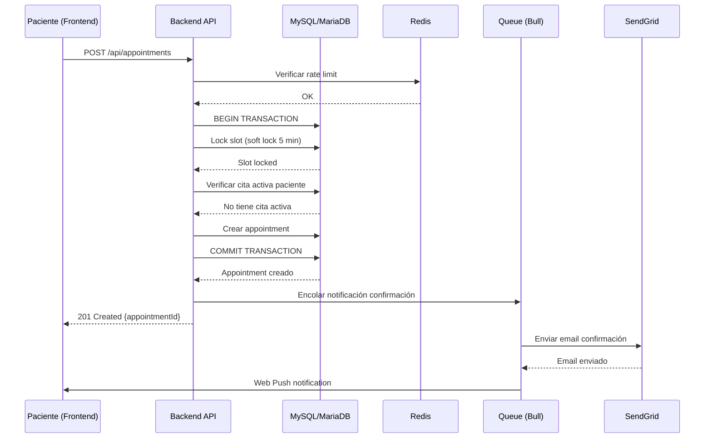
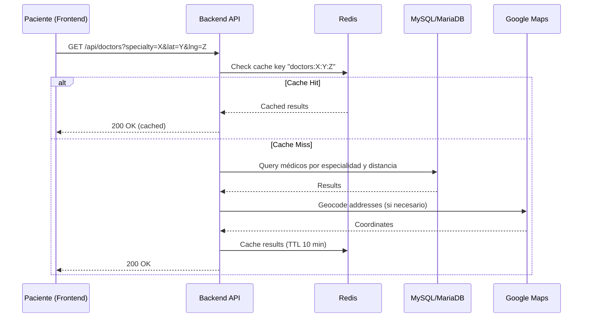

# Arquitectura MVP - CitaYa
## Documento Técnico Detallado

---

## 📊 SLA y Objetivos de Performance

### **SLA Propuesto para MVP**

Basado en el volumen esperado (1 consulta/minuto inicial, crecimiento a 10 pacientes/mes y 4 médicos/mes), se propone el siguiente SLA:

| Métrica | Objetivo | Justificación |
|---------|----------|---------------|
| **Disponibilidad** | 99.5% uptime (≈3.6h downtime/mes) | Suficiente para MVP, permite mantenimiento programado |
| **Latencia P95 (Lecturas)** | < 500ms | Búsquedas, consultas de disponibilidad, perfiles |
| **Latencia P95 (Escrituras)** | < 1s | Creación de citas, actualizaciones de perfil |
| **Latencia P99** | < 2s | Casos edge, consultas complejas |
| **Throughput** | 60 req/min (1 req/seg) | Escalable a 10x con misma infraestructura |
| **Tiempo de Recuperación (RTO)** | < 15 minutos | Failover automático a réplicas |
| **Punto de Recuperación (RPO)** | < 5 minutos | Backups incrementales cada 5 min |

### **Métricas de Monitoreo Clave (KPIs)**

- **Request Rate**: Requests por segundo por endpoint
- **Error Rate**: % de requests con status 5xx (objetivo < 0.1%)
- **Response Time**: P50, P95, P99 por endpoint
- **Database Connections**: Pool de conexiones activas
- **Cache Hit Rate**: % de hits en Redis (objetivo > 80%)
- **Queue Depth**: Tamaño de colas de trabajos (objetivo < 100)

---

## 🛠 Stack Tecnológico Detallado

### **Frontend**

| Tecnología | Versión | Uso |
|------------|---------|-----|
| **Next.js** | 14.2+ | Framework React con SSR/SSG |
| **React** | 18.3+ | Librería UI |
| **TypeScript** | 5.3+ | Type safety |
| **Tailwind CSS** | 3.4+ | Estilos utility-first |
| **next-intl** | 3.0+ | Internacionalización (ES/EN) |
| **Zustand** | 4.5+ | Estado global ligero |
| **React Query (TanStack Query)** | 5.0+ | Gestión de estado servidor (cache, refetch) |
| **Zod** | 3.22+ | Validación de esquemas (frontend y backend) |
| **Google Maps JavaScript API** | Latest | Mapas y geolocalización |
| **Workbox** | 7.0+ | Service Workers para Web Push |

### **Backend**

| Tecnología | Versión | Uso |
|------------|---------|-----|
| **Node.js** | 20 LTS | Runtime JavaScript |
| **Express.js** | 4.18+ | Framework web |
| **TypeScript** | 5.3+ | Type safety |
| **TypeORM** | 0.3+ | ORM para MySQL/MariaDB (elegido sobre Prisma) |
| **MySQL** | 8.0+ | Base de datos relacional (alternativa: MariaDB 10.11+) |
| **Redis** | 7.2+ | Cache y sesiones |
| **Bull** | 4.11+ | Colas de trabajos (Redis-based) |
| **JWT** | jsonwebtoken 9.0+ | Autenticación |
| **Bcrypt** | 5.1+ | Hashing de contraseñas |
| **SendGrid SDK** | @sendgrid/mail 7.7+ | Emails transaccionales |
| **Axios** | 1.6+ | Cliente HTTP para APIs externas |

### **DevOps e Infraestructura**

| Tecnología | Versión | Uso |
|------------|---------|-----|
| **Docker** | 24+ | Containerización |
| **Docker Compose** | 2.24+ | Orquestación local |
| **Kubernetes** | 1.28+ | Orquestación producción (opcional) |
| **GitHub Actions** | Latest | CI/CD |
| **Ansible** | 2.15+ | Provisioning VPS (opcional) |
| **Nginx** | 1.25+ | Reverse proxy / Load balancer |
| **Prometheus** | 2.48+ | Métricas |
| **Grafana** | 10.2+ | Dashboards |
| **Loki** | 2.9+ | Agregación de logs |

### **Servicios Externos**

| Servicio | Uso | Costo Estimado MVP |
|----------|-----|-------------------|
| **Google Maps API** | Geolocalización, mapas | ~$50/mes (200k requests) |
| **SendGrid** | Emails transaccionales | Free tier (100 emails/día) |
| **reCAPTCHA v3** | Protección anti-bot | Gratis |
| **VPS Hostgator** | Servidor completo (4 vCPU, 8GB RAM, 160GB SSD) | ~$40-60/mes (plan Business) |
| **Dominio** | Nombre de dominio .com | ~$15/año (~$1.25/mes) |
| **CloudFlare CDN** | CDN + DDoS Protection | Opcional (gratis o ~$20/mes Pro) |
| **GitHub Container Registry** | Docker Registry | Gratis para público, ~$5/mes privado |

**Total Estimado**: ~$50-65/mes (sin incluir CDN premium, etc.)

---

## 🏗 Decisiones de Diseño Clave

### **1. Bloqueo de Slots (Soft Lock con Expiración)**

**Problema**: Evitar doble booking cuando dos pacientes intentan reservar el mismo slot simultáneamente.

**Solución**: Soft lock con expiración de 5 minutos.

```typescript
// Pseudocódigo del flujo (MySQL/MariaDB)
async function reserveSlot(slotId: string, patientId: string) {
  return await db.transaction(async (tx) => {
    // 1. Intentar adquirir lock (sintaxis MySQL)
    const [lockResult] = await tx.execute(`
      UPDATE slots 
      SET 
        locked_by = ?,
        locked_until = DATE_ADD(NOW(), INTERVAL 5 MINUTE),
        is_available = false
      WHERE 
        id = ? 
        AND is_available = true
        AND (locked_until IS NULL OR locked_until < NOW())
    `, [patientId, slotId]);
    
    if (lockResult.affectedRows === 0) {
      throw new Error('Slot no disponible');
    }
    
    // Obtener datos del slot bloqueado
    const [slotRows] = await tx.execute(
      'SELECT doctor_id FROM slots WHERE id = ?',
      [slotId]
    );
    
    // 2. Verificar que paciente no tenga cita activa
    const [activeAppointments] = await tx.execute(`
      SELECT id FROM appointments 
      WHERE patient_id = ? 
        AND status IN ('confirmed', 'pending')
        AND appointment_date > NOW()
    `, [patientId]);
    
    if (activeAppointments.length > 0) {
      throw new Error('Paciente ya tiene una cita activa');
    }
    
    // 3. Crear cita
    const [appointmentResult] = await tx.execute(`
      INSERT INTO appointments (patient_id, doctor_id, slot_id, status)
      VALUES (?, ?, ?, 'confirmed')
    `, [patientId, slotRows[0].doctor_id, slotId]);
    
    // Obtener la cita creada
    const [appointment] = await tx.execute(
      'SELECT * FROM appointments WHERE id = ?',
      [appointmentResult.insertId]
    );
    
    return appointment[0];
  });
}
```

**Ventajas**:
- ✅ Previene doble booking con transacciones ACID
- ✅ Expiración automática si usuario abandona el proceso
- ✅ No requiere sistema de colas complejo

**Trade-offs**:
- ⚠️ Ventana de 5 minutos donde slot aparece "ocupado" pero no confirmado
- ⚠️ Requiere cleanup job para liberar locks expirados

### **2. Búsqueda por Proximidad (Fallback a Código Postal)**

**Problema**: Búsqueda eficiente de médicos por proximidad (5 km) con fallback si no hay geolocalización.

**Solución**: 
1. Si hay geolocalización: calcular distancia usando fórmula Haversine en MySQL/MariaDB
2. Si no hay geolocalización: búsqueda por código postal usando Google Maps Geocoding API

```sql
-- Índice para búsquedas geográficas (MySQL Spatial Index)
ALTER TABLE doctors ADD SPATIAL INDEX idx_location (POINT(latitude, longitude));

-- Query de búsqueda con distancia (fórmula Haversine)
SELECT 
  d.*,
  (
    6371 * acos(
      cos(radians(?)) * cos(radians(d.latitude)) *
      cos(radians(d.longitude) - radians(?)) +
      sin(radians(?)) * sin(radians(d.latitude))
    )
  ) AS distance_km
FROM doctors d
WHERE 
  d.specialty = ?
  AND d.verification_status = 'approved'
  AND (
    6371 * acos(
      cos(radians(?)) * cos(radians(d.latitude)) *
      cos(radians(d.longitude) - radians(?)) +
      sin(radians(?)) * sin(radians(d.latitude))
    )
  ) < 5  -- 5 km
ORDER BY distance_km
LIMIT 20;
```

**Nota**: Para mejor performance, se puede usar un bounding box antes de calcular Haversine:
```sql
-- Primero filtrar con bounding box (más rápido)
WHERE 
  d.latitude BETWEEN ? - 0.045 AND ? + 0.045  -- ~5km en grados
  AND d.longitude BETWEEN ? - 0.045 AND ? + 0.045
  AND d.specialty = ?
  AND d.verification_status = 'approved'
-- Luego calcular distancia exacta y ordenar
```

**Ventajas**:
- ✅ Búsqueda eficiente con índices espaciales básicos de MySQL (SPATIAL INDEX)
- ✅ Fallback robusto para usuarios sin geolocalización
- ✅ Cacheable en Redis (médicos por código postal)
- ⚠️ Haversine es más costoso que PostGIS, pero aceptable para MVP con índices adecuados

### **3. Notificaciones Asíncronas**

**Problema**: Envío de emails y push notifications sin bloquear la respuesta del API.

**Solución**: Cola de trabajos con Bull (Redis-based).

```typescript
// Definición de cola
import Queue from 'bull';

const notificationQueue = new Queue('notifications', {
  redis: { host: process.env.REDIS_HOST },
});

// Encolar trabajo
await notificationQueue.add('send-appointment-confirmation', {
  appointmentId: appointment.id,
  patientEmail: patient.email,
  appointmentDate: appointment.date,
});

// Procesador de trabajos
notificationQueue.process('send-appointment-confirmation', async (job) => {
  const { appointmentId, patientEmail, appointmentDate } = job.data;
  
  await sendGrid.send({
    to: patientEmail,
    templateId: 'appointment-confirmation',
    dynamicTemplateData: {
      appointmentDate,
      // ...
    },
  });
  
  // Enviar Web Push
  await pushNotificationService.send({
    userId: patient.id,
    title: 'Cita confirmada',
    body: `Tu cita es el ${appointmentDate}`,
  });
});
```

**Ventajas**:
- ✅ No bloquea requests del API
- ✅ Reintentos automáticos en caso de fallo
- ✅ Escalable con múltiples workers
- ✅ Monitoreo de colas en Grafana

### **4. Recordatorios 30 Minutos Antes**

**Problema**: Enviar recordatorios exactamente 30 minutos antes de cada cita.

**Solución**: Cron job que consulta citas próximas y programa trabajos con delay.

```typescript
import cron from 'node-cron';

// Ejecutar cada minuto
cron.schedule('* * * * *', async () => {
  // Buscar citas que empiezan en 30 minutos (sintaxis MySQL)
  const [appointments] = await db.execute(`
    SELECT id, patient_id, doctor_id, appointment_date
    FROM appointments
    WHERE 
      status = 'confirmed'
      AND appointment_date BETWEEN 
        DATE_ADD(NOW(), INTERVAL 29 MINUTE) AND 
        DATE_ADD(NOW(), INTERVAL 31 MINUTE)
      AND reminder_sent = false
  `);
  
  for (const appointment of appointments) {
    // Encolar recordatorio
    await notificationQueue.add(
      'send-appointment-reminder',
      { appointmentId: appointment.id },
      { delay: new Date(appointment.appointment_date).getTime() - Date.now() - 30 * 60 * 1000 }
    );
    
    // Marcar como recordatorio enviado
    await db.execute(`
      UPDATE appointments 
      SET reminder_sent = true 
      WHERE id = ?
    `, [appointment.id]);
  }
});
```

**Ventajas**:
- ✅ Precisión de 1 minuto (suficiente para MVP)
- ✅ Evita duplicados con flag `reminder_sent`
- ✅ Escalable: puede ejecutarse en múltiples workers sin conflictos

---

## 🔄 Flujos de Datos Principales

### **Flujo 1: Reserva de Cita**



### **Flujo 2: Búsqueda de Médicos**



---

## 🔧 Consideraciones Específicas MySQL/MariaDB

### **Diferencias Clave vs PostgreSQL**

1. **Búsquedas Geográficas**:
   - MySQL no tiene PostGIS, pero tiene soporte básico para índices espaciales
   - Usar fórmula Haversine pura (más costosa computacionalmente)
   - Optimización: usar bounding box antes de calcular distancia exacta
   - Alternativa: almacenar coordenadas geohash para búsquedas más rápidas

2. **Transacciones y Locks**:
   - MySQL InnoDB soporta transacciones ACID completas (igual que PostgreSQL)
   - Sintaxis de locks: `SELECT ... FOR UPDATE` funciona igual
   - Nivel de aislamiento por defecto: REPEATABLE READ (ajustar a READ COMMITTED si necesario)

3. **Índices**:
   - MySQL soporta índices B-tree, Hash, Full-text y Spatial
   - Para búsquedas por especialidad: índice compuesto `(specialty, verification_status)`
   - Para geolocalización: SPATIAL INDEX en columna POINT o calcular distancia con índices en lat/lng

4. **Replicación**:
   - Master-Slave replication nativa (binlog)
   - Configuración más simple que PostgreSQL streaming replication
   - Read replica para distribuir carga de lectura

5. **Backups**:
   - `mysqldump` para backups lógicos (más común)
   - `mariabackup` o `xtrabackup` para backups físicos (más rápido, menos downtime)
   - Scripts de backup automático con cron
   - Retención de 30 días

6. **Migraciones con Rollback**:
   - TypeORM migrations ejecutadas automáticamente en CI/CD
   - Cada migración debe tener su script de rollback correspondiente
   - Proceso: Backup antes de migración → Ejecutar migración → Verificar → Rollback si falla
   - Scripts de rollback almacenados en `/backend/migrations/rollback/`

### **Configuración Recomendada MySQL/MariaDB**

```ini
# my.cnf optimizaciones para MVP
[mysqld]
# Motor de almacenamiento
default-storage-engine=InnoDB

# Pool de conexiones
max_connections=200
thread_cache_size=50

# Buffer pool (ajustar según RAM disponible, ~70% de RAM dedicada)
innodb_buffer_pool_size=2G
innodb_buffer_pool_instances=2

# Logs binarios para replicación
log-bin=mysql-bin
binlog_format=ROW
server-id=1

# Performance
innodb_flush_log_at_trx_commit=2  # Balance entre performance y durabilidad
innodb_log_file_size=256M
innodb_flush_method=O_DIRECT

# Query cache (deshabilitado en MySQL 8.0+, usar Redis en su lugar)
# query_cache_type=0
```

### **Estructura de Directorios en VPS**

**Nota**: Esta es la estructura en el servidor VPS. La estructura del repositorio Git está documentada en la sección 2.3 del README.

```
/var/www/citaya/              # Directorio principal de la aplicación
├── frontend/                 # Build de Next.js (desplegado desde Docker)
├── backend/                  # Código fuente backend (opcional, para debugging)
├── workers/                  # Código fuente workers (opcional, para debugging)
├── storage/                  # Archivos subidos (volumen Docker)
│   ├── uploads/              # Cédulas profesionales (LUKS encriptado, permisos 700)
│   │                         # Montado desde /dev/mapper/citaya-uploads
│   ├── .luks-container       # Contenedor LUKS (archivo encriptado)
│   └── avatares/             # Imágenes de perfil (permisos 700)
├── logs/                     # Logs de aplicación (volumen Docker, rotación automática)
│   ├── api-prod.log
│   ├── api-staging.log
│   ├── worker-prod.log
│   ├── frontend-prod.log
│   └── security.log          # Logs de seguridad (retención 1 semana)
├── scripts/                  # Scripts copiados desde repositorio
│   ├── monitoring/           # Scripts de monitoreo (ejecutados por cron cada 5 min)
│   │   ├── health-check.sh
│   │   ├── check-disk.sh
│   │   ├── check-db.sh
│   │   └── alert-discord.sh
│   ├── deployment/           # Scripts de despliegue
│   │   ├── deploy.sh
│   │   ├── rollback.sh
│   │   └── migrate.sh
│   └── backup/               # Scripts de backup
│       └── mysql-backup.sh   # Backup diario (cron a las 2 AM)
├── docker-compose.prod.yml   # Docker Compose único para prod y staging
├── .env.prod                 # Variables de entorno producción (encriptado, permisos 600)
└── .env.staging              # Variables de entorno staging (encriptado, permisos 600)

/var/lib/docker/volumes/       # Volúmenes Docker persistentes
├── citaya_mysql_data/        # Datos MySQL
├── citaya_redis_data/        # Datos Redis
└── citaya_storage/           # Archivos estáticos (bind mount a /var/www/citaya/storage)

/var/backups/
└── mysql/
    ├── daily/                # Backups diarios (mysqldump + GPG)
    │   ├── backup_YYYYMMDD.sql
    │   └── backup_YYYYMMDD.sql.gpg  # Versión encriptada para envío externo
    └── weekly/               # Backups semanales
        └── backup_week_XX.sql.gpg

# Almacenamiento Externo (S3, GCS, etc.)
# Backups encriptados enviados automáticamente después de creación local

/etc/nginx/
└── sites-available/
    └── citaya.conf           # Configuración Nginx + SSL (Let's Encrypt)
                                # Reverse proxy a contenedores Docker

/etc/letsencrypt/              # Certificados SSL (Certbot)
└── live/
    └── citaya.com/
        ├── cert.pem
        ├── privkey.pem
        └── fullchain.pem

/etc/mysql/
└── my.cnf                     # Configuración MySQL (si no usa Docker)

/etc/ssh/
└── sshd_config                # Configuración SSH segura (puerto personalizado)

/etc/fail2ban/
└── jail.local                 # Configuración Fail2ban para SSH

/etc/fstab                      # Configuración montaje automático LUKS

/home/citaya/.ssh/             # Claves SSH para despliegue CI/CD
├── authorized_keys            # Clave pública para GitHub Actions
└── github_actions             # Clave privada para GitHub Actions (permisos 600)

/opt/monitoring/              # Monitoreo básico (opcional, si no usa Docker)
└── prometheus/               # Prometheus básico (fase posterior)

/etc/cron.d/                  # Cron jobs configurados
├── citaya-health-check       # Health check cada 5 minutos
├── citaya-check-disk         # Verificación disco cada 5 minutos
├── citaya-check-db           # Verificación DB cada 5 minutos
└── citaya-backup-mysql       # Backup MySQL diario
```

**Configuración de Cron Jobs**:

```bash
# /etc/cron.d/citaya-health-check
*/5 * * * * citaya /var/www/citaya/scripts/monitoring/health-check.sh

# /etc/cron.d/citaya-check-disk
*/5 * * * * citaya /var/www/citaya/scripts/monitoring/check-disk.sh

# /etc/cron.d/citaya-check-db
*/5 * * * * citaya /var/www/citaya/scripts/monitoring/check-db.sh

# /etc/cron.d/citaya-backup-mysql
0 2 * * * citaya /var/www/citaya/scripts/backup/mysql-backup.sh
```

**Variables de Entorno**:
- `.env.prod`: Variables de producción (encriptado, permisos 600)
- `.env.staging`: Variables de staging (encriptado, permisos 600)
- Secrets incluyen: DB credentials, Redis, SendGrid API key, Google Maps API key, VAPID keys, Discord webhook URL

**Flujo de Despliegue Detallado**:

1. **Build y Push**:
   - GitHub Actions build imágenes Docker (frontend, backend, workers)
   - Push a GitHub Container Registry (ghcr.io) con tag semántico (v1.0.X)
   - Retención de últimas 5 versiones para rollback

2. **Deploy Staging (Automático)**:
   - SSH al VPS usando secrets de GitHub
   - Pull imágenes desde ghcr.io con tag específico
   - Ejecutar migraciones TypeORM automáticamente (con rollback si fallan)
   - `docker-compose -f docker-compose.prod.yml --env-file .env.staging up -d`
   - Health check `/health` (solo alerta, no bloquea)

3. **Deploy Production (Requiere Aprobación)**:
   - Aprobación manual en GitHub Environments
   - SSH al VPS usando `scripts/deployment/deploy.sh`
   - Pull imágenes desde ghcr.io con tag específico
   - Ejecutar migraciones TypeORM automáticamente (con rollback si fallan)
   - Rolling restart: `docker-compose -f docker-compose.prod.yml --env-file .env.prod up -d`
   - Health check `/health` cada 5 minutos
   - Rollback automático si health check falla (reconstruir desde tag anterior)

4. **Monitoreo Continuo**:
   - Scripts ejecutados por cron cada 5 minutos:
     - `scripts/monitoring/health-check.sh` → Verifica `/health` endpoint
     - `scripts/monitoring/check-disk.sh` → Verifica espacio disco
     - `scripts/monitoring/check-db.sh` → Verifica conexión MySQL
   - Alertas a Discord si detectan problemas

5. **Backups Automáticos**:
   - Cron job diario: `mysqldump` → `/var/backups/mysql/daily/`
   - Retención 30 días con rotación automática
   - Comprimir backups antiguos para ahorrar espacio

6. **Logs**:
   - Logs de Docker en `/var/www/citaya/logs/`
   - Rotación automática configurada
   - Retención local según espacio disponible

**Rollback de Deploy**:
- Si health check falla después de 5 minutos:
  1. Identificar tag de versión anterior (de las 5 disponibles)
  2. Reconstruir contenedores desde tag anterior
  3. Ejecutar rollback de migraciones si es necesario
  4. Verificar health check
  5. Notificar resultado a Discord

**Escalado Horizontal**:
- Cuando se añadan más instancias de frontend/API:
  - Configuración manual de Nginx para balanceo de carga
  - Documentado en `docs/deployment/nginx-scaling.md`
  - Actualizar `docker-compose.prod.yml` con nuevas instancias

### **Endpoint de Health Check**

**Ruta**: `GET /health`

**Respuesta**:
```json
{
  "status": "healthy",
  "timestamp": "2026-01-20T10:00:00Z",
  "checks": {
    "database": "connected",
    "redis": "connected",
    "disk": {
      "usage": 45.2,
      "status": "ok"
    }
  },
  "version": "1.0.0"
}
```

**Implementación**:
- Verifica conexión a MySQL
- Verifica conexión a Redis
- Verifica uso de disco (<90% = ok)
- Usado por scripts de monitoreo y CI/CD para health checks post-deploy

### **Plan de Rollback para Migraciones**

**Proceso Automatizado**:

1. **Pre-migración**:
   ```bash
   # Backup automático antes de migración
   mysqldump -u user -p database > backup_pre_migration_$(date +%Y%m%d_%H%M%S).sql
   ```

2. **Ejecución de Migración**:
   ```bash
   # TypeORM ejecuta migración
   npm run migration:run
   ```

3. **Verificación Post-migración**:
   - Health check endpoint debe responder correctamente
   - Verificar integridad de datos críticos
   - Tests de smoke post-migración

4. **Rollback Automático** (si falla):
   ```bash
   # Ejecutar script de rollback específico
   npm run migration:revert
   # O restaurar backup si es necesario
   mysql -u user -p database < backup_pre_migration_*.sql
   ```

**Estructura de Migraciones**:
```
backend/
├── migrations/
│   ├── 1234567890-CreateUsersTable.ts
│   ├── 1234567891-CreateDoctorsTable.ts
│   └── rollback/
│       ├── 1234567890-CreateUsersTable.rollback.sql
│       └── 1234567891-CreateDoctorsTable.rollback.sql
```

---

## 🚀 Proceso de Setup Inicial del VPS

**Documentación Completa**: `docs/deployment/vps-setup.md`

### **Pasos de Configuración Inicial**

1. **Preparación del VPS**:
   - Acceso SSH al servidor
   - Actualizar sistema: `apt update && apt upgrade -y`
   - Crear usuario `citaya` con permisos sudo

2. **Instalación de Docker**:
   ```bash
   # Instalar Docker Engine
   curl -fsSL https://get.docker.com -o get-docker.sh
   sh get-docker.sh
   
   # Instalar Docker Compose
   apt install docker-compose-plugin
   
   # Agregar usuario citaya al grupo docker
   usermod -aG docker citaya
   ```

3. **Instalación y Configuración de Nginx**:
   ```bash
   # Instalar Nginx
   apt install nginx
   
   # Configurar reverse proxy para producción y staging
   # Archivo: /etc/nginx/sites-available/citaya.conf
   # Documentado en docs/deployment/nginx-config.md
   ```

4. **Configuración SSL con Certbot**:
   ```bash
   # Instalar Certbot
   apt install certbot python3-certbot-nginx
   
   # Obtener certificados para dominio principal y staging
   certbot --nginx -d citaya.com -d www.citaya.com
   certbot --nginx -d staging.citaya.com
   
   # Verificar renovación automática (garantizada por proveedor)
   certbot renew --dry-run
   ```

5. **Configuración de Firewall y SSH**:
   ```bash
   # Configurar UFW (solo puertos necesarios)
   ufw default deny incoming
   ufw default allow outgoing
   ufw allow 80/tcp    # HTTP
   ufw allow 443/tcp   # HTTPS
   ufw allow <SSH_PORT>/tcp  # SSH en puerto personalizado (NO 22)
   ufw enable
   
   # Configurar SSH seguro
   # Editar /etc/ssh/sshd_config
   Port <SSH_PORT>                    # Cambiar puerto por defecto
   PermitRootLogin no                 # Deshabilitar login root
   PasswordAuthentication no          # Solo claves SSH
   PubkeyAuthentication yes
   PermitEmptyPasswords no
   
   # Reiniciar SSH
   systemctl restart sshd
   
   # Instalar y configurar Fail2ban
   apt install fail2ban
   
   # Configurar Fail2ban para SSH
   # Archivo: /etc/fail2ban/jail.local
   [sshd]
   enabled = true
   port = <SSH_PORT>
   maxretry = 3
   bantime = 3600
   findtime = 600
   
   systemctl enable fail2ban
   systemctl start fail2ban
   ```

6. **Setup de Directorios y Permisos**:
   ```bash
   # Crear estructura de directorios
   mkdir -p /var/www/citaya/{storage/{uploads,avatares},logs,scripts}
   mkdir -p /var/backups/mysql/{daily,weekly}
   
   # Configurar permisos
   chown -R citaya:citaya /var/www/citaya
   chmod 700 /var/www/citaya/storage/uploads  # LUKS después
   chmod 600 /var/www/citaya/.env.prod
   chmod 600 /var/www/citaya/.env.staging
   ```

7. **Configuración de Cron Jobs**:
   ```bash
   # Copiar scripts de monitoreo desde repositorio
   cp scripts/monitoring/* /var/www/citaya/scripts/monitoring/
   cp scripts/backup/* /var/www/citaya/scripts/backup/
   
   # Configurar cron jobs
   cp infrastructure/cron/* /etc/cron.d/
   chmod 644 /etc/cron.d/citaya-*
   ```

8. **Configuración de SSH para CI/CD**:
   ```bash
   # Generar clave SSH para GitHub Actions
   ssh-keygen -t ed25519 -C "github-actions" -f /home/citaya/.ssh/github_actions
   
   # Añadir clave pública a authorized_keys
   cat /home/citaya/.ssh/github_actions.pub >> /home/citaya/.ssh/authorized_keys
   
   # Configurar GitHub Secrets con clave privada
   ```

9. **Despliegue Inicial**:
   ```bash
   # Clonar repositorio (o copiar archivos)
   cd /var/www/citaya
   git clone <repo-url> .
   
   # Configurar variables de entorno
   cp .env.example .env.prod
   cp .env.example .env.staging
   # Editar y encriptar archivos .env
   
   # Primer despliegue
   docker-compose -f docker-compose.prod.yml --env-file .env.prod up -d
   ```

10. **Configuración LUKS para Directorio Sensible** (Después del setup inicial):
    ```bash
    # Crear dispositivo loopback para directorio de uploads
    dd if=/dev/zero of=/var/www/citaya/storage/.luks-container bs=1M count=1024
    
    # Crear volumen LUKS
    cryptsetup luksFormat /var/www/citaya/storage/.luks-container
    
    # Abrir volumen LUKS
    cryptsetup luksOpen /var/www/citaya/storage/.luks-container citaya-uploads
    
    # Formatear con ext4
    mkfs.ext4 /dev/mapper/citaya-uploads
    
    # Montar volumen
    mkdir -p /var/www/citaya/storage/uploads-encrypted
    mount /dev/mapper/citaya-uploads /var/www/citaya/storage/uploads-encrypted
    
    # Configurar montaje automático en /etc/fstab
    # (requiere clave almacenada de forma segura)
    
    # Mover archivos existentes al volumen encriptado
    mv /var/www/citaya/storage/uploads/* /var/www/citaya/storage/uploads-encrypted/
    rmdir /var/www/citaya/storage/uploads
    ln -s /var/www/citaya/storage/uploads-encrypted /var/www/citaya/storage/uploads
    ```

11. **Verificación Post-Setup**:
    ```bash
    # Verificar contenedores
    docker ps
    
    # Verificar health check
    curl https://citaya.com/health
    
    # Verificar logs
    docker-compose logs -f
    
    # Verificar cron jobs
    systemctl status cron
    
    # Verificar Fail2ban
    fail2ban-client status sshd
    
    # Verificar firewall
    ufw status verbose
    ```

**Notas Importantes**:
- Todos los pasos deben documentarse en `docs/deployment/vps-setup.md`
- Proceso debe ser reproducible y automatizable
- Considerar usar Ansible para automatización completa (opcional)

### **Configuración Docker Compose para Producción y Staging**

**Un Solo Archivo**: `docker-compose.prod.yml`

El mismo archivo Docker Compose se usa para ambos entornos, diferenciados por variables de entorno:

```yaml
# docker-compose.prod.yml
version: '3.8'

services:
  frontend:
    image: ghcr.io/usuario/citaya-frontend:${VERSION:-latest}
    ports:
      - "${FRONTEND_PORT:-3000}:3000"
    environment:
      - NODE_ENV=${NODE_ENV}
      - NEXT_PUBLIC_API_URL=${API_URL}
    volumes:
      - ./storage:/app/storage
    depends_on:
      - api

  api:
    image: ghcr.io/usuario/citaya-api:${VERSION:-latest}
    ports:
      - "${API_PORT:-4000}:4000"
    environment:
      - NODE_ENV=${NODE_ENV}
      - DB_HOST=${DB_HOST}
      - DB_NAME=${DB_NAME}
      - REDIS_HOST=${REDIS_HOST}
    volumes:
      - ./storage:/app/storage
      - ./logs:/app/logs
    depends_on:
      - mysql
      - redis

  worker:
    image: ghcr.io/usuario/citaya-worker:${VERSION:-latest}
    environment:
      - NODE_ENV=${NODE_ENV}
      - DB_HOST=${DB_HOST}
      - REDIS_HOST=${REDIS_HOST}
    volumes:
      - ./logs:/app/logs
    depends_on:
      - mysql
      - redis

  mysql:
    image: mysql:8.0
    environment:
      - MYSQL_ROOT_PASSWORD=${MYSQL_ROOT_PASSWORD}
      - MYSQL_DATABASE=${MYSQL_DATABASE}
    volumes:
      - mysql_data:/var/lib/mysql
      - ./backups:/backups

  redis:
    image: redis:7-alpine
    volumes:
      - redis_data:/data

volumes:
  mysql_data:
  redis_data:
```

**Uso por Entorno**:

```bash
# Producción
docker-compose -f docker-compose.prod.yml --env-file .env.prod up -d

# Staging
docker-compose -f docker-compose.prod.yml --env-file .env.staging up -d
```

**Variables de Entorno Clave**:
- `FRONTEND_PORT`: 3000 (prod), 3001 (staging)
- `API_PORT`: 4000 (prod), 4001 (staging)
- `DB_NAME`: `citaya_prod` o `citaya_staging` (o usar prefijos de tabla)
- `NODE_ENV`: `production` o `staging`
- `VERSION`: Tag de la imagen Docker (ej: `v1.0.0`)

---

## 🔒 Seguridad Detallada

### **Encriptación de Datos**

#### **1. Encriptación de Archivos .env**
- **Método**: AES-256
- **Ubicación**: `/var/www/citaya/.env.prod` y `.env.staging`
- **Acceso**: Solo administrador del VPS tiene acceso a las claves de desencriptación
- **Permisos**: 600 (solo propietario puede leer/escribir)
- **Proceso de desencriptación**: Manual por administrador cuando se necesite modificar

#### **2. Encriptación LUKS para Cédulas**
- **Directorio**: `/var/www/citaya/storage/uploads/` únicamente
- **Configuración**: Después del setup inicial del VPS
- **Método**: LUKS (Linux Unified Key Setup) con ext4
- **Clave**: Almacenada de forma segura, acceso solo para administrador del VPS
- **Montaje**: Automático en boot (configurado en `/etc/fstab`)

#### **3. Encriptación de Cédulas en Base de Datos**
- **Método**: Encriptación a nivel de aplicación (AES-256-CBC)
- **Alcance**: Solo cédulas profesionales (no otros datos)
- **Proceso**:
  - Encriptación antes de almacenar en MySQL
  - Desencriptación al recuperar (solo para usuarios autorizados)
  - Clave de encriptación en `.env` encriptado
- **Implementación**: Ver ejemplo en código de la sección 2.5 del README

### **Protección de Archivos Subidos**

- **Validación de Tipos MIME**: Verificación del tipo real del archivo (no solo extensión)
- **Validación de Extensiones**: Solo extensiones permitidas (.pdf, .jpg, .png, .jpeg)
- **Límite de Tamaño**: Configurado en backend (ej: 10MB máximo para cédulas)
- **Escaneo de Malware**: Escaneo antes de almacenar (usando ClamAV o servicio externo)
- **Almacenamiento**: Directorio con permisos 700, acceso solo mediante URLs firmadas temporales

### **Rate Limiting**

- **Configuración**: Por endpoint (diferentes límites según criticidad)
- **Almacenamiento**: Contadores en memoria de la aplicación (no distribuido)
- **Limitación**: 
  - Login: 5 intentos por IP cada 15 minutos
  - Registro: 3 intentos por IP cada hora
  - API general: 100 requests por IP cada minuto
- **Nota**: Al reiniciar instancia, contadores se resetean (aceptable para MVP)

### **CORS y CSRF**

- **CORS**: 
  - Dominios permitidos: `citaya.com`, `www.citaya.com`, `staging.citaya.com`
  - No wildcard, configuración específica por entorno
- **CSRF Tokens**:
  - Almacenados en Redis por sesión
  - Generación: Un token por sesión (no por request)
  - Validación en formularios críticos (crear cita, modificar perfil, etc.)

### **Auditoría y Logging de Seguridad**

- **Logs de Seguridad**:
  - Archivo: `/var/www/citaya/logs/security.log`
  - Eventos: Intentos de login fallidos, cambios de permisos, accesos a datos sensibles
  - Retención: 1 semana, luego rotación automática
- **Auditoría Completa**:
  - Base de datos: Tabla `audit_logs`
  - Información registrada: quién (user_id), qué (acción), cuándo (timestamp), IP (dirección IP)
  - Todas las acciones auditadas (no solo administrativas):
    - Login/logout
    - Creación/modificación de citas
    - Acceso a datos sensibles (cédulas)
    - Acciones administrativas (moderación, aprobación de médicos)
  - Retención: Configurable (recomendado: 1 año)

### **Backups Encriptados**

- **Método**: `mysqldump` + encriptación GPG
- **Frecuencia**: Diario a las 2:00 AM (cron job)
- **Proceso**:
  1. Crear dump de MySQL: `mysqldump > backup_YYYYMMDD.sql`
  2. Encriptar con GPG: `gpg --encrypt --recipient <GPG_KEY_ID> backup_YYYYMMDD.sql`
  3. Comprimir: `gzip backup_YYYYMMDD.sql.gpg`
  4. Enviar a almacenamiento externo (S3, GCS, etc.)
  5. Eliminar archivo local después de envío exitoso
- **Retención Local**: 30 días en `/var/backups/mysql/daily/`
- **Almacenamiento Externo**: 
  - Envío automático después de encriptación
  - Servicios soportados: AWS S3, Google Cloud Storage, Azure Blob Storage
  - Configuración en `.env`: Credenciales de almacenamiento externo
  - Clave GPG almacenada de forma segura, acceso solo para administrador
- **Rotación**: Automática, compresión de backups antiguos antes de eliminar
- **Script**: `scripts/backup/mysql-backup.sh` ejecutado por cron

### **Derecho al Olvido (GDPR)**

- **Proceso**: Soft delete de datos personales
- **Retención**: 1 año después del soft delete
- **Eliminación Permanente**: 
  - Después de 1 año: eliminación completa de base de datos
  - Eliminación de backups externos que contengan datos del usuario
  - Proceso automatizado con job batch mensual
- **Datos Eliminados**: 
  - Información personal del usuario
  - Cédulas profesionales (si aplica)
  - Historial de citas (anonimizado si necesario para estadísticas)

### **Configuración SSH Segura**

- **Puerto**: Cambiado del puerto por defecto (22) a puerto personalizado
- **Autenticación**: Solo claves SSH (deshabilitado login por contraseña)
- **Fail2ban**: 
  - Configurado para proteger SSH
  - Máximo 3 intentos fallidos antes de bloqueo
  - Tiempo de bloqueo: 1 hora
  - Ventana de tiempo: 10 minutos
- **Configuración SSH**:
  ```bash
  # /etc/ssh/sshd_config
  Port <SSH_PORT>
  PermitRootLogin no
  PasswordAuthentication no
  PubkeyAuthentication yes
  MaxAuthTries 3
  ```

### **Secrets Management**

- **VPS**: Archivos `.env` encriptados con AES, acceso solo para administrador
- **CI/CD**: Todos los secrets en GitHub Secrets (GitHub Actions)
- **Rotación**: 
  - Claves SSH: Cada 6 meses (recomendado)
  - API Keys: Según política del proveedor
  - Claves de encriptación: Solo cuando sea necesario (proceso manual)

### **Seguridad Docker**

- **Escaneo de Imágenes**: Trivy en CI/CD antes del despliegue
- **Usuarios no-root**: Contenedores ejecutados con usuarios no-root cuando sea posible
- **Límites de Recursos**: 
  - CPU: Límites por contenedor
  - Memoria: Límites por contenedor
  - Configurado en `docker-compose.prod.yml`
- **Network**: Redes Docker aisladas, solo comunicación necesaria

---

## 🧪 Estrategia de Testing Detallada

### **Stack de Testing**

| Tipo | Herramienta | Uso |
|------|-------------|-----|
| **Unit Tests** | Jest | Lógica de negocio, servicios, utilidades |
| **Integration Tests** | Jest + Supertest | Endpoints API, integración con BD |
| **E2E Tests** | Cypress | Flujos críticos de usuario |
| **Cobertura** | Istanbul/nyc | Medición de cobertura de código |
| **Base de Datos Tests** | MySQL Docker | Contenedor separado para tests |

### **Configuración de Entorno de Testing**

**Docker Compose para Tests** (`docker-compose.test.yml`):
```yaml
version: '3.8'
services:
  mysql-test:
    image: mysql:8.0
    environment:
      MYSQL_ROOT_PASSWORD: test_password
      MYSQL_DATABASE: citaya_test
    ports:
      - "3307:3306"
    tmpfs:
      - /var/lib/mysql  # Mejor performance, datos no persisten
    command: --default-authentication-plugin=mysql_native_password
```

**Setup de Tests**:
- Base de datos MySQL separada (`citaya_test`) en contenedor Docker
- Migraciones ejecutadas antes de cada suite de tests
- Datos generados dinámicamente usando factories
- Limpieza de datos después de cada test (transacciones que se revierten)
- Contenedor Docker iniciado automáticamente antes de ejecutar tests

### **Tipos de Tests Implementados**

#### **1. Unit Tests (70%)**
- **Cobertura**: Servicios, repositorios, utilidades, helpers
- **Ejemplos**: 
  - Lógica de bloqueo de slots
  - Validación de reglas de negocio
  - Cálculo de distancias geográficas
  - Encriptación/desencriptación (si se implementa en el futuro)

#### **2. Integration Tests (20%)**
- **Cobertura**: Endpoints API, integración con MySQL, Redis
- **Ejemplos**:
  - Creación de citas (endpoint completo)
  - Búsqueda de médicos con geolocalización
  - Autenticación y autorización
  - Validación de archivos subidos

#### **3. E2E Tests (10%)**
- **Cobertura**: Flujos críticos de usuario
- **Ejemplos**:
  - Login → Búsqueda → Reserva de cita
  - Registro de médico → Carga de cédula → Aprobación admin
  - Reprogramación de cita

#### **4. Tests de Seguridad**
- **Cobertura**: Vulnerabilidades OWASP comunes
- **Tests incluidos**:
  - Prevención de inyección SQL
  - Prevención de XSS
  - Rate limiting por endpoint
  - Validación de CSRF tokens
  - Autenticación y autorización

#### **5. Tests de Migraciones**
- **Cobertura**: Migraciones TypeORM y scripts de rollback
- **Tests incluidos**:
  - Ejecución correcta de migraciones
  - Rollback de migraciones
  - Ejecución de scripts de rollback SQL
  - Integridad de datos después de migración/rollback

#### **6. Tests de Workers/Cron Jobs**
- **Cobertura**: Background jobs y schedulers
- **Tests incluidos**:
  - Envío de recordatorios de citas (30 min antes)
  - Procesamiento de colas Bull
  - Envío de emails transaccionales
  - Procesamiento batch de dashboards admin

#### **7. Tests de Validación de Archivos**
- **Cobertura**: Validaciones de archivos subidos
- **Tests incluidos**:
  - Validación de tipos MIME
  - Validación de extensiones de archivo
  - Validación de tamaño máximo
  - Rechazo de archivos inválidos

### **Mocks y Servicios Externos**

**Servicios Mockeados Completamente**:
- **SendGrid**: Mock de `@sendgrid/mail` para tests de notificaciones
- **Google Maps**: Mock de geocoding y mapas para tests de búsqueda
- **reCAPTCHA**: Mock de verificación para tests de autenticación

**Ejemplo de Mock**:
```typescript
// tests/helpers/mocks.ts
jest.mock('@sendgrid/mail', () => ({
  setApiKey: jest.fn(),
  send: jest.fn().mockResolvedValue([{ statusCode: 202 }]),
}));

jest.mock('googlemaps', () => ({
  geocode: jest.fn().mockResolvedValue({
    results: [{ geometry: { location: { lat: 19.4326, lng: -99.1332 } } }]
  }),
}));
```

### **Generación Dinámica de Datos**

**Factories para Datos de Prueba**:
```typescript
// tests/helpers/factories.ts
export async function createTestPatient(overrides = {}) {
  return await patientRepository.create({
    email: `patient-${Date.now()}@test.com`,
    password: await bcrypt.hash('password123', 12),
    role: 'patient',
    ...overrides,
  });
}

export async function createTestDoctor(overrides = {}) {
  return await doctorRepository.create({
    email: `doctor-${Date.now()}@test.com`,
    password: await bcrypt.hash('password123', 12),
    role: 'doctor',
    specialty: 'Cardiología',
    verificationStatus: 'approved',
    latitude: 19.4326,
    longitude: -99.1332,
    ...overrides,
  });
}
```

### **CI/CD Integration**

**Pipeline de Tests en GitHub Actions**:
```yaml
# .github/workflows/tests.yml
name: Tests

on:
  pull_request:
    branches: [main, develop]

jobs:
  test:
    runs-on: ubuntu-latest
    services:
      mysql:
        image: mysql:8.0
        env:
          MYSQL_ROOT_PASSWORD: test_password
          MYSQL_DATABASE: citaya_test
        ports:
          - 3306:3306
    
    steps:
      - uses: actions/checkout@v3
      - uses: actions/setup-node@v3
      
      - name: Install dependencies
        run: npm ci
      
      - name: Run unit tests
        run: npm run test:unit
      
      - name: Run integration tests
        run: npm run test:integration
        env:
          DB_HOST: localhost
          DB_NAME: citaya_test
      
      - name: Run E2E tests
        run: npm run test:e2e
      
      - name: Generate coverage report
        run: npm run test:coverage
      
      - name: Upload coverage
        uses: codecov/codecov-action@v3
```

**Cobertura Objetivo**:
- **General**: Mínimo 70% de cobertura de código
- **Lógica Crítica**: 90% de cobertura en:
  - Servicios de reservas
  - Autenticación y autorización
  - Bloqueo de slots (prevención de doble booking)
  - Validación de archivos

**Ejecución**:
- Todos los tests se ejecutan en cada Pull Request
- Tests E2E también se ejecutan en cada PR (no solo en staging/producción)
- Los tests deben pasar para que el PR pueda ser mergeado
- Reportes de cobertura generados y mostrados en PR

### **Estructura de Tests**

```
backend/
└── tests/
    ├── unit/                  # Tests unitarios (70%)
    │   ├── services/
    │   │   ├── appointment.service.test.ts
    │   │   └── doctor.service.test.ts
    │   ├── repositories/
    │   └── utils/
    ├── integration/           # Tests de integración (20%)
    │   ├── api/
    │   │   ├── appointments.test.ts
    │   │   ├── doctors.test.ts
    │   │   └── auth.test.ts
    │   └── database/
    ├── security/              # Tests de seguridad
    │   ├── sql-injection.test.ts
    │   ├── xss.test.ts
    │   └── rate-limiting.test.ts
    ├── migrations/            # Tests de migraciones
    │   └── migration.test.ts
    ├── workers/              # Tests de cron jobs
    │   └── schedulers.test.ts
    ├── files/                # Tests de validación de archivos
    │   └── validation.test.ts
    └── helpers/              # Helpers y utilidades
        ├── test-db.ts        # Setup de base de datos
        ├── factories.ts      # Factories para datos dinámicos
        └── mocks.ts          # Mocks de servicios externos

frontend/
└── tests/
    ├── unit/                 # Tests unitarios de componentes
    ├── integration/          # Tests de integración
    └── e2e/                  # Tests E2E con Cypress
        ├── auth.spec.ts
        ├── appointments.spec.ts
        └── search.spec.ts
```

---

## 📈 Plan de Escalabilidad

### **Fase 1: MVP (Mes 1-3)**
- 1 consulta/minuto
- Infraestructura inicial: 1x Frontend, 1x API, 1+ Workers, 1x MySQL (sin réplicas)
- Entornos: Producción y Staging en mismo VPS (puertos diferentes)
- Monitoreo básico: Scripts de health check cada 5 minutos, alertas Discord, Prometheus básico
- Backups automáticos: Cron diario, retención 30 días, rotación automática
- Logs: Rotación automática local
- Sin Grafana/Loki inicialmente (implementación posterior)
- Service Workers y Web Push en fase posterior
- SSL: Renovación automática garantizada por proveedor

### **Fase 2: Crecimiento Inicial (Mes 4-6)**
- 10 consultas/minuto
- Escalar Frontend y API a múltiples instancias (2-3 cada una)
- Añadir más workers (2-3)
- Añadir primera Read Replica de MySQL
- Implementar Grafana para dashboards visuales
- Implementar Service Workers y Web Push Notifications

### **Fase 3: Escala Media (Mes 7-12)**
- 100+ consultas/minuto
- Considerar migración a microservicios:
  - Servicio de Autenticación
  - Servicio de Citas
  - Servicio de Búsqueda
  - Servicio de Notificaciones
- Message queue (RabbitMQ o Redis Pub/Sub avanzado) para desacoplamiento
- CDN para assets estáticos (CloudFront)

### **Fase 4: Escala Alta (Año 2+)**
- 1000+ consultas/minuto
- Arquitectura de microservicios completa
- Event-driven architecture (Event Sourcing, CQRS)
- Database sharding por región
- Cache distribuido (Redis Cluster)

---

## 🚨 Consideraciones y Limitaciones del MVP

### **Limitaciones Conocidas**

1. **Single Database**: Toda la lógica en una BD MySQL/MariaDB (sin réplicas inicialmente). Escalado vertical limitado.
2. **Single Instance**: Una sola instancia de Frontend y API inicialmente (escalable después).
3. **Sesiones en Redis**: Si Redis cae, usuarios pierden sesión (mitigado con failover).
4. **Workers Single Point**: Un solo worker puede ser cuello de botella (mitigado con múltiples workers).
5. **Geolocalización**: Dependencia de Google Maps API (costos crecientes con escala).
6. **Moderación Manual**: Proceso 100% manual puede ser lento con muchos médicos.
7. **Monitoreo Básico**: Sin Grafana/Loki inicialmente, solo scripts básicos y Prometheus.
8. **Sin Web Push**: Service Workers y Web Push Notifications en fase posterior.
9. **Despliegue Simple**: No blue-green deployment, solo rolling restart con downtime mínimo.

### **Riesgos y Mitigaciones**

| Riesgo | Probabilidad | Impacto | Mitigación |
|--------|--------------|---------|------------|
| **Doble booking por race condition** | Media | Alto | Transacciones ACID + soft locks |
| **Redis downtime** | Baja | Medio | Failover automático + sesiones en BD como fallback |
| **Google Maps API quota exceeded** | Baja | Medio | Cache agresivo + fallback a búsqueda por código postal |
| **SendGrid rate limit** | Baja | Bajo | Cola de trabajos con retry exponencial |
| **MySQL primary failure** | Baja | Alto | Backups diarios + script de failover manual (sin réplicas inicialmente) |
| **Frontend/API single point** | Media | Medio | Escalado horizontal cuando crezca tráfico |
| **Monitoreo limitado** | Baja | Bajo | Scripts básicos + alertas Discord, Grafana después |
| **Sin Web Push** | Baja | Bajo | Emails funcionan, Web Push en fase posterior |

---

## 📊 Dashboards Admin (Batch Diario)

### **Procesamiento Batch**

- **Frecuencia**: Una vez al día (ejecutado a las 2:00 AM hora CDMX)
- **Worker**: Proceso batch que consulta MySQL y genera reportes
- **Almacenamiento**: Resultados cacheados en Redis por 24 horas

### **Visualizaciones Prioritarias**

1. **Gráficos**:
   - Reservas por día/semana (línea de tiempo)
   - Cancelaciones por día (barras)
   - Calificaciones promedio por especialidad (torta)
   - Tendencias de demanda (línea de tiempo)

2. **Tablas**:
   - Top 10 médicos por número de citas
   - Médicos por calificación promedio
   - Cancelaciones por motivo
   - Especialidades más demandadas

3. **Métricas Clave**:
   - Total de reservas del día/semana
   - Tasa de cancelación (%)
   - Calificación promedio general
   - Médicos activos

**Nota**: Mapa de demanda geográfica en fase posterior (requiere integración con Google Maps más avanzada)

---

## 📝 Próximos Pasos

1. **Setup de Repositorio**: Estructura de carpetas según arquitectura propuesta
2. **Configuración de Entorno**: Variables de entorno en `.env` encriptado, secrets management
3. **Setup Inicial VPS**: Documentar proceso paso a paso en `docs/deployment/vps-setup.md`:
   - Instalación Docker y Docker Compose
   - Configuración Nginx como reverse proxy
   - Configuración SSL con Certbot/Let's Encrypt
   - Setup usuarios y permisos
   - Configuración firewall
   - Instalación scripts de monitoreo y cron jobs
4. **Setup de Base de Datos**: Migraciones iniciales con TypeORM para MySQL, seeds de datos de prueba, configuración de replicación Master-Slave (para fase posterior)
5. **Generación VAPID Keys**: Preparar generación de keys para Web Push (implementación posterior), almacenar en `.env`
6. **Configuración SSL**: Let's Encrypt con Certbot, renovación automática garantizada por proveedor
7. **Setup Monitoreo Básico**: Scripts de health check (cron cada 5 min), alertas Discord, Prometheus básico
8. **Configuración CI/CD**: GitHub Actions workflows con GitHub Container Registry, SSH deploy, migraciones automáticas
9. **Setup Backups**: 
   - Cron jobs para backups MySQL diarios
   - Encriptación GPG de backups
   - Envío automático a almacenamiento externo
   - Rotación automática, retención 30 días local
10. **Configuración Logs**: Rotación automática de logs Docker, retención local, logs de seguridad separados
11. **Configuración Seguridad**:
    - Encriptación AES de archivos `.env`
    - Configuración LUKS para directorio de uploads (después del setup inicial)
    - Implementación de encriptación de cédulas a nivel de aplicación
    - Configuración Fail2ban para SSH
    - Setup de auditoría completa (tabla `audit_logs`)
    - Configuración de validación y escaneo de archivos subidos
11. **Implementación de Autenticación**: JWT, middleware, endpoints de login/registro
12. **Implementación de Búsqueda**: Endpoints de búsqueda con geolocalización
13. **Implementación de Reservas**: Lógica de bloqueo de slots, creación de citas
14. **Implementación Health Check**: Endpoint `/health` para monitoreo (verificado cada 5 min)
15. **Setup de CI/CD**: GitHub Actions workflows con:
    - GitHub Container Registry (ghcr.io)
    - Despliegue por SSH
    - Migraciones automáticas con rollback
    - Retención de 5 versiones para rollback
    - Health checks post-deploy
16. **Setup de Observabilidad**: Prometheus básico, scripts de monitoreo (cron cada 5 min), alertas Discord (Grafana/Loki después)
17. **Migraciones con Rollback**: Plan de rollback para cada migración TypeORM, ejecución automática en deploy
18. **Dashboards Admin**: Procesamiento batch diario, visualizaciones en gráficos y tablas
19. **Configuración Entornos**: Setup de producción y staging en mismo VPS con `docker-compose.prod.yml`
20. **Implementación Seguridad**:
    - Encriptación de cédulas en base de datos (AES-256-CBC)
    - Validación y escaneo de archivos subidos
    - Rate limiting por endpoint
    - CSRF tokens en Redis
    - Logging de seguridad y auditoría completa
    - Endpoint de derecho al olvido (soft delete con retención 1 año)
21. **Documentación Despliegue**: Guías para escalado manual de Nginx, rollback, troubleshooting
22. **Documentación Seguridad**: Guías de configuración LUKS, encriptación, Fail2ban
23. **Tests**: 
    - Unit tests con Jest (70% del total)
    - Integration tests con Jest + Supertest (20% del total)
    - E2E tests con Cypress (10% del total)
    - Tests de seguridad (OWASP, SQL injection, XSS, rate limiting)
    - Tests de migraciones y scripts de rollback
    - Tests de cron jobs (workers)
    - Tests de validación de archivos (MIME, extensiones, tamaño)
    - Base de datos MySQL separada en contenedor Docker para tests
    - Datos generados dinámicamente (no fixtures)
    - Mocks completos de servicios externos (SendGrid, Google Maps, reCAPTCHA)
    - Cobertura objetivo: 70% general, 90% en lógica crítica
    - Ejecución en cada PR (incluyendo E2E)
24. **Documentación API**: OpenAPI/Swagger specification

---

**Documento creado**: 2026-01-20  
**Versión**: 1.0 MVP  
**Autor**: Arquitectura propuesta para CitaYa MVP
