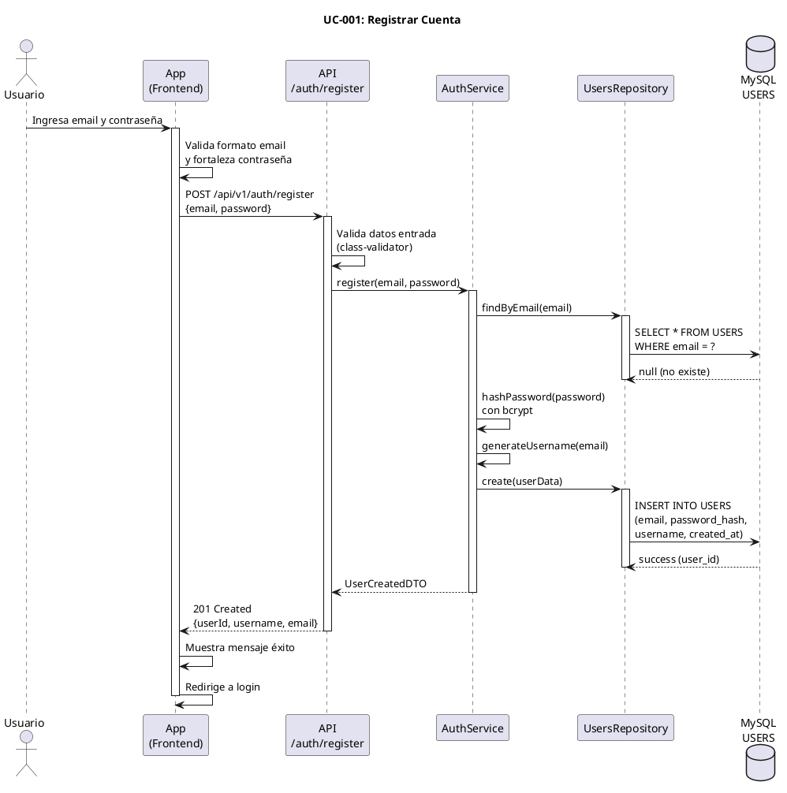

# UC-001: Registrar Cuenta

## Identificador
UC-001

## Descripción
Este caso de uso permite a un usuario nuevo crear una cuenta en UNLOKD proporcionando su email y contraseña. El sistema valida que el email no esté previamente registrado, almacena la contraseña de forma segura (hash) y crea el perfil básico del usuario.

El registro es el punto de entrada a la aplicación y establece la identidad del usuario para todas las interacciones posteriores. Una vez completado el registro, el usuario puede iniciar sesión y acceder a todas las funcionalidades de mensajería condicionada.

## Actores
- **Actor principal**: Usuario nuevo (no autenticado)
- **Actores secundarios**: Sistema de autenticación, Base de datos MySQL

## Precondiciones
- El usuario no tiene una cuenta existente con ese email
- El usuario tiene acceso a la aplicación (web o móvil)
- El sistema de base de datos está disponible

## Flujo Principal
1. El usuario accede a la pantalla de registro
2. El usuario ingresa su email
3. El usuario ingresa su contraseña (mínimo 8 caracteres)
4. El usuario confirma su contraseña
5. El usuario acepta los términos y condiciones
6. El sistema valida que el email tiene formato correcto
7. El sistema verifica que el email no existe en la base de datos
8. El sistema genera un hash seguro de la contraseña (bcrypt/argon2)
9. El sistema crea el registro en la tabla USERS con estado activo
10. El sistema genera un username único basado en el email
11. El sistema envía email de bienvenida (opcional)
12. El sistema muestra mensaje de éxito
13. El sistema redirige al usuario a la pantalla de login

## Flujos Alternativos

### FA-1: Email ya registrado
- **Paso 7**: Si el email ya existe en la base de datos
  - El sistema muestra mensaje: "Este email ya está registrado"
  - El sistema ofrece opción de "¿Olvidaste tu contraseña?"
  - El flujo termina sin crear la cuenta

### FA-2: Formato de email inválido
- **Paso 6**: Si el email no tiene formato válido
  - El sistema muestra mensaje: "Ingresa un email válido"
  - El usuario debe corregir el email
  - El flujo vuelve al paso 2

### FA-3: Contraseña débil
- **Paso 3**: Si la contraseña no cumple requisitos mínimos
  - El sistema muestra mensaje: "La contraseña debe tener al menos 8 caracteres"
  - El usuario debe ingresar una contraseña más fuerte
  - El flujo vuelve al paso 3

### FA-4: Contraseñas no coinciden
- **Paso 4**: Si la confirmación no coincide con la contraseña
  - El sistema muestra mensaje: "Las contraseñas no coinciden"
  - El usuario debe reingresar la confirmación
  - El flujo vuelve al paso 4

### FA-5: Error de conexión a base de datos
- **Paso 9**: Si hay error al crear el registro
  - El sistema muestra mensaje: "Error al crear la cuenta. Intenta nuevamente"
  - El sistema registra el error en logs
  - El flujo termina sin crear la cuenta

## Postcondiciones
- Se crea un nuevo registro en la tabla USERS con:
  - email único
  - password_hash seguro
  - username único generado
  - is_active = 1
  - created_at con timestamp actual
- El usuario puede iniciar sesión con las credenciales creadas
- El usuario aparece como usuario válido en el sistema

## Reglas de Negocio
- **RN-1**: El email debe ser único en todo el sistema
- **RN-2**: La contraseña debe tener mínimo 8 caracteres
- **RN-3**: La contraseña debe almacenarse únicamente como hash (bcrypt con factor 10+)
- **RN-4**: El username se genera automáticamente a partir del email (parte antes de @)
- **RN-5**: Si el username ya existe, se agrega sufijo numérico secuencial
- **RN-6**: El usuario se crea en estado activo (is_active = 1) por defecto
- **RN-7**: No se requiere verificación de email para el MVP

## Requisitos No Funcionales
### Seguridad
- Las contraseñas deben hashearse con bcrypt o argon2 (nunca almacenar en texto plano)
- El endpoint debe tener rate limiting (máximo 5 intentos por IP por minuto)
- Validación de entrada para prevenir SQL injection y XSS
- El sistema no debe revelar si un email existe o no (seguridad por obscuridad)

### Performance
- El registro debe completarse en menos de 2 segundos
- El hash de contraseña debe ejecutarse de forma no bloqueante

### Usabilidad
- Mensajes de error claros y específicos
- Indicador visual de fortaleza de contraseña en tiempo real
- Opción de mostrar/ocultar contraseña durante ingreso

## Diagrama PlantUML

## Trazabilidad
- **Historia de Usuario**: HU-001 - Registro de usuario con email y contraseña
- **Ticket de Trabajo**: UNLOKD-002 - Implementar módulo de autenticación
- **Épica**: EPIC-1 - Fundación - Autenticación y Usuarios
- **Sprint**: Sprint 1
- **Módulo NestJS**: `src/modules/auth/`
- **Tabla de BD**: `USERS`

