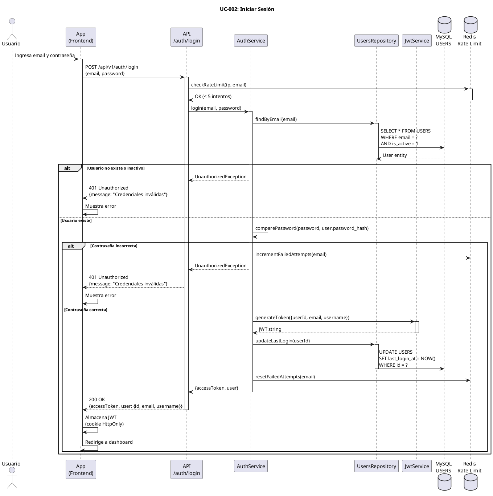

# UC-002: Iniciar Sesión

## Identificador
UC-002

## Descripción
Este caso de uso permite a un usuario registrado autenticarse en UNLOKD mediante su email y contraseña. El sistema valida las credenciales, genera un token JWT de acceso y establece la sesión del usuario.

La sesión autenticada permite al usuario acceder a todas las funcionalidades protegidas de la aplicación: crear chats, enviar mensajes condicionados, gestionar su perfil y visualizar contenido bloqueado.

## Actores
- **Actor principal**: Usuario registrado
- **Actores secundarios**: Sistema de autenticación, Base de datos MySQL

## Precondiciones
- El usuario tiene una cuenta creada en el sistema
- La cuenta del usuario está activa (is_active = 1)
- El usuario no está actualmente autenticado
- El sistema está disponible

## Flujo Principal
1. El usuario accede a la pantalla de login
2. El usuario ingresa su email
3. El usuario ingresa su contraseña
4. El usuario presiona el botón "Iniciar sesión"
5. El sistema valida el formato del email
6. El sistema busca el usuario por email en la base de datos
7. El sistema verifica que el usuario existe y está activo
8. El sistema compara la contraseña ingresada con el hash almacenado
9. El sistema valida que la contraseña es correcta
10. El sistema genera un JWT con payload (userId, email, username)
11. El sistema actualiza el campo last_login_at en USERS
12. El sistema retorna el JWT al cliente
13. El cliente almacena el JWT (cookie HttpOnly o local storage)
14. El sistema redirige al usuario al dashboard principal

## Flujos Alternativos

### FA-1: Email no registrado
- **Paso 7**: Si el usuario no existe en la base de datos
  - El sistema muestra mensaje genérico: "Credenciales inválidas"
  - El sistema registra intento fallido en logs
  - El flujo termina sin autenticar

### FA-2: Contraseña incorrecta
- **Paso 9**: Si la contraseña no coincide con el hash
  - El sistema muestra mensaje genérico: "Credenciales inválidas"
  - El sistema incrementa contador de intentos fallidos (Redis)
  - El sistema registra intento fallido en logs
  - El flujo termina sin autenticar

### FA-3: Cuenta desactivada
- **Paso 7**: Si is_active = 0
  - El sistema muestra mensaje: "Tu cuenta ha sido desactivada"
  - El sistema sugiere contactar soporte
  - El flujo termina sin autenticar

### FA-4: Demasiados intentos fallidos
- **Paso 5**: Si el usuario ha superado el límite de intentos (5 en 15 minutos)
  - El sistema muestra mensaje: "Demasiados intentos. Intenta en 15 minutos"
  - El sistema bloquea temporalmente el IP/email
  - El flujo termina sin autenticar

### FA-5: Error al generar JWT
- **Paso 10**: Si hay error en la generación del token
  - El sistema muestra mensaje: "Error de autenticación. Intenta nuevamente"
  - El sistema registra el error en logs
  - El flujo termina sin autenticar

## Postcondiciones
- El usuario queda autenticado en el sistema
- Se genera un JWT válido con expiración de 24 horas
- Se actualiza last_login_at en la tabla USERS
- El cliente puede realizar peticiones autenticadas con el JWT
- El usuario puede acceder a todas las funcionalidades protegidas

## Reglas de Negocio
- **RN-1**: El JWT debe expirar en 24 horas para web y 30 días para móvil
- **RN-2**: El JWT debe firmarse con algoritmo HS256 o RS256
- **RN-3**: La clave secreta del JWT debe estar en variables de entorno
- **RN-4**: El sistema debe usar mensajes genéricos de error para no revelar qué credencial es incorrecta
- **RN-5**: Máximo 5 intentos fallidos por IP/email en ventana de 15 minutos
- **RN-6**: El contador de intentos fallidos se resetea tras login exitoso
- **RN-7**: El payload del JWT debe incluir: userId, email, username (no incluir password_hash)

## Requisitos No Funcionales
### Seguridad
- Rate limiting: máximo 5 intentos por IP por 15 minutos
- Usar bcrypt.compare() para verificar contraseña (timing-attack resistant)
- JWT debe almacenarse en cookie HttpOnly + Secure en web
- Validar JWT en cada petición protegida
- Registrar todos los intentos de login (exitosos y fallidos) para auditoría

### Performance
- El login debe completarse en menos de 1 segundo
- La comparación de hash debe ser no bloqueante
- El sistema debe soportar 100 logins concurrentes

### Usabilidad
- Opción "Recordarme" para extender expiración del JWT
- Enlace "¿Olvidaste tu contraseña?" visible
- Mensaje de error claro pero genérico (seguridad)
- Indicador de carga durante autenticación

## Diagrama PlantUML

## Trazabilidad
- **Historia de Usuario**: HU-002 - Login de usuario y obtención de JWT
- **Ticket de Trabajo**: UNLOKD-002 - Implementar módulo de autenticación
- **Épica**: EPIC-1 - Fundación - Autenticación y Usuarios
- **Sprint**: Sprint 1
- **Módulo NestJS**: `src/modules/auth/`
- **Tabla de BD**: `USERS`
- **Cache**: Redis para rate limiting y contador de intentos

