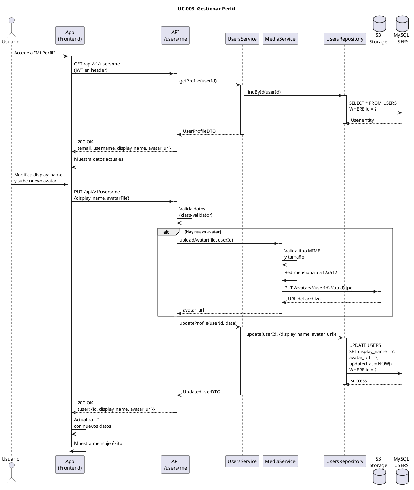

# UC-003: Gestionar Perfil

## Identificador
UC-003

## Descripción
Este caso de uso permite a un usuario autenticado visualizar y actualizar su información de perfil personal en UNLOKD. El usuario puede modificar su nombre para mostrar (display_name), subir o cambiar su foto de avatar, y gestionar su estado de presencia (online/offline).

La gestión del perfil es fundamental para la identidad del usuario en la aplicación, ya que estos datos se muestran en todos los chats y mensajes que envía.

## Actores
- **Actor principal**: Usuario autenticado
- **Actores secundarios**: Sistema de usuarios, Servicio de almacenamiento de archivos (S3), Base de datos

## Precondiciones
- El usuario está autenticado (tiene JWT válido)
- La cuenta del usuario está activa
- El sistema está disponible

## Flujo Principal
1. El usuario accede a la sección "Mi Perfil"
2. El sistema carga y muestra los datos actuales del perfil:
   - Email (no editable)
   - Username (no editable)
   - Display name
   - Avatar actual
   - Estado de presencia
3. El usuario modifica el display_name
4. El usuario sube una nueva imagen de avatar (opcional)
5. El usuario selecciona su estado de presencia (online/offline)
6. El usuario presiona "Guardar cambios"
7. El sistema valida los datos ingresados
8. Si hay nueva imagen, el sistema la sube a S3 y obtiene la URL
9. El sistema actualiza el registro en la tabla USERS
10. El sistema retorna los datos actualizados
11. El sistema muestra mensaje de éxito
12. El sistema actualiza la interfaz con los nuevos datos

## Flujos Alternativos

### FA-1: Display name vacío
- **Paso 7**: Si el display_name está vacío
  - El sistema muestra mensaje: "El nombre para mostrar es requerido"
  - El usuario debe ingresar un nombre válido
  - El flujo vuelve al paso 3

### FA-2: Display name demasiado largo
- **Paso 7**: Si el display_name supera 255 caracteres
  - El sistema muestra mensaje: "El nombre debe tener máximo 255 caracteres"
  - El usuario debe acortar el nombre
  - El flujo vuelve al paso 3

### FA-3: Imagen de avatar inválida
- **Paso 4**: Si el archivo no es una imagen válida
  - El sistema muestra mensaje: "Solo se permiten imágenes JPG, PNG o WebP"
  - El usuario debe seleccionar un archivo válido
  - El flujo vuelve al paso 4

### FA-4: Imagen muy grande
- **Paso 4**: Si la imagen supera 5MB
  - El sistema muestra mensaje: "La imagen debe pesar menos de 5MB"
  - El usuario debe seleccionar una imagen más pequeña
  - El flujo vuelve al paso 4

### FA-5: Error al subir imagen a S3
- **Paso 8**: Si falla la carga a S3
  - El sistema muestra mensaje: "Error al subir la imagen. Intenta nuevamente"
  - El sistema registra el error en logs
  - El sistema continúa sin actualizar el avatar
  - El flujo continúa al paso 9 con los demás cambios

### FA-6: Usuario no autenticado
- **Paso 1**: Si el JWT es inválido o expiró
  - El sistema redirige al login
  - El flujo termina

## Postcondiciones
- El registro del usuario en USERS se actualiza con los nuevos datos
- Si se subió nuevo avatar, la imagen anterior se elimina de S3 (opcional)
- Los cambios son visibles inmediatamente en la UI
- Los chats donde participa el usuario muestran los datos actualizados
- El estado de presencia se propaga vía WebSocket a contactos

## Reglas de Negocio
- **RN-1**: El email no puede modificarse (identidad única)
- **RN-2**: El username no puede modificarse (identificador público)
- **RN-3**: El display_name es obligatorio (mínimo 1 carácter, máximo 255)
- **RN-4**: El avatar debe ser JPG, PNG o WebP con máximo 5MB
- **RN-5**: El avatar se redimensiona automáticamente a 512x512px
- **RN-6**: El estado de presencia se actualiza automáticamente al hacer login/logout
- **RN-7**: El avatar anterior debe eliminarse de S3 al subir uno nuevo (limpieza)
- **RN-8**: Si no se proporciona avatar, se usa un avatar por defecto generado con iniciales

## Requisitos No Funcionales
### Seguridad
- Validar que el usuario solo puede editar su propio perfil
- Sanitizar el display_name para prevenir XSS
- Las URLs de S3 deben ser firmadas y con expiración
- Validar tipo MIME real del archivo (no solo extensión)

### Performance
- La actualización del perfil debe completarse en menos de 2 segundos
- La carga de la imagen debe ser asíncrona (no bloquear UI)
- Comprimir y optimizar imagen antes de subir a S3
- Usar CDN para servir avatares (baja latencia)

### Usabilidad
- Vista previa del avatar antes de guardar
- Crop/recorte de imagen integrado
- Indicador de progreso durante carga de imagen
- Confirmación visual de cambios guardados
- Opción de eliminar avatar y volver al por defecto

## Diagrama PlantUML

## Trazabilidad
- **Historia de Usuario**: HU-003 - Actualizar perfil de usuario (nombre, avatar)
- **Ticket de Trabajo**: UNLOKD-003 - Implementar módulo de usuarios y perfiles
- **Épica**: EPIC-1 - Fundación - Autenticación y Usuarios
- **Sprint**: Sprint 1
- **Módulo NestJS**: `src/modules/users/`, `src/modules/media/`
- **Tabla de BD**: `USERS`
- **Storage**: S3-compatible para avatares

