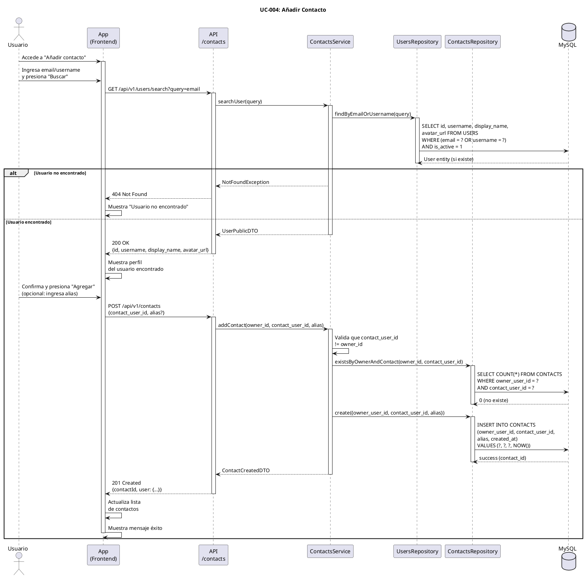

# UC-004: Añadir Contacto

## Identificador
UC-004

## Descripción
Este caso de uso permite a un usuario autenticado agregar otros usuarios de UNLOKD a su lista de contactos. El usuario puede buscar contactos por email o username, y opcionalmente asignarles un alias personalizado.

Los contactos agregados aparecen en la lista de contactos del usuario y facilitan la creación de chats 1-a-1. Esta funcionalidad es fundamental para construir la red social del usuario dentro de UNLOKD.

## Actores
- **Actor principal**: Usuario autenticado
- **Actores secundarios**: Sistema de usuarios, Base de datos

## Precondiciones
- El usuario está autenticado
- El contacto a agregar existe en el sistema
- El contacto a agregar no está ya en la lista del usuario
- El contacto no ha bloqueado al usuario

## Flujo Principal
1. El usuario accede a la sección "Contactos"
2. El usuario presiona "Añadir contacto"
3. El sistema muestra el formulario de búsqueda
4. El usuario ingresa el email o username del contacto
5. El usuario presiona "Buscar"
6. El sistema busca el usuario en la base de datos
7. El sistema verifica que el usuario existe
8. El sistema verifica que no es el mismo usuario
9. El sistema verifica que no está ya agregado como contacto
10. El sistema muestra el perfil del usuario encontrado (avatar, display_name)
11. El usuario confirma que es el contacto correcto
12. El usuario (opcionalmente) ingresa un alias personalizado
13. El usuario presiona "Agregar"
14. El sistema crea el registro en la tabla CONTACTS
15. El sistema muestra mensaje de éxito
16. El sistema actualiza la lista de contactos
17. El nuevo contacto aparece disponible para crear chats

## Flujos Alternativos

### FA-1: Usuario no encontrado
- **Paso 7**: Si no existe usuario con ese email/username
  - El sistema muestra mensaje: "Usuario no encontrado"
  - El usuario puede intentar con otro email/username
  - El flujo vuelve al paso 4

### FA-2: Intentando agregarse a sí mismo
- **Paso 8**: Si el email/username corresponde al usuario actual
  - El sistema muestra mensaje: "No puedes agregarte a ti mismo"
  - El flujo vuelve al paso 4

### FA-3: Contacto ya agregado
- **Paso 9**: Si el usuario ya está en la lista de contactos
  - El sistema muestra mensaje: "Este usuario ya está en tus contactos"
  - El sistema ofrece opción de "Ver contacto"
  - El flujo termina

### FA-4: Usuario bloqueado
- **Paso 7**: Si el usuario buscado ha bloqueado al usuario actual
  - El sistema muestra mensaje: "Usuario no encontrado" (no revelar bloqueo)
  - El flujo termina

### FA-5: Alias demasiado largo
- **Paso 12**: Si el alias supera 50 caracteres
  - El sistema muestra mensaje: "El alias debe tener máximo 50 caracteres"
  - El usuario debe acortar el alias
  - El flujo vuelve al paso 12

### FA-6: Error de base de datos
- **Paso 14**: Si falla la inserción en CONTACTS
  - El sistema muestra mensaje: "Error al agregar contacto. Intenta nuevamente"
  - El sistema registra el error en logs
  - El flujo termina sin crear el contacto

## Postcondiciones
- Se crea un registro en la tabla CONTACTS vinculando al usuario con el contacto
- El contacto aparece en la lista de contactos del usuario
- El usuario puede crear un chat 1-a-1 con ese contacto
- Si se proporcionó alias, se almacena en el registro
- La relación de contactos es unidireccional (no automáticamente recíproca)

## Reglas de Negocio
- **RN-1**: Un usuario no puede agregarse a sí mismo como contacto
- **RN-2**: No pueden existir contactos duplicados (constraint UNIQUE en owner_user_id + contact_user_id)
- **RN-3**: El alias es opcional y personal (solo lo ve el owner del contacto)
- **RN-4**: La relación de contacto es unidireccional (A puede agregar a B sin que B agregue a A)
- **RN-5**: Si un usuario está bloqueado, aparece como "no encontrado" (privacidad)
- **RN-6**: El alias puede modificarse posteriormente desde los detalles del contacto
- **RN-7**: Para el MVP, no se envía notificación al contacto cuando es agregado
- **RN-8**: El límite de contactos por usuario es 500 (para prevenir abuso)

## Requisitos No Funcionales
### Seguridad
- Validar que el usuario autenticado solo puede agregar contactos a su propia lista
- No revelar información de usuarios bloqueados
- Rate limiting en búsqueda de contactos (10 búsquedas por minuto)
- Sanitizar el alias para prevenir XSS

### Performance
- La búsqueda debe completarse en menos de 500ms
- Usar índice en USERS(email) y USERS(username) para búsquedas rápidas
- La adición del contacto debe ser instantánea (< 200ms)

### Usabilidad
- Autocompletado en el campo de búsqueda
- Vista previa del perfil antes de agregar
- Indicador visual cuando el contacto ya existe
- Sugerencias de contactos basadas en agenda del teléfono (futuro)

## Diagrama PlantUML

## Trazabilidad
- **Historia de Usuario**: HU-004 - Crear chat 1-a-1 con un contacto (depende de tener contactos)
- **Ticket de Trabajo**: UNLOKD-003 - Implementar módulo de usuarios y perfiles
- **Épica**: EPIC-1 - Fundación - Autenticación y Usuarios
- **Sprint**: Sprint 1
- **Módulo NestJS**: `src/modules/users/`, `src/modules/contacts/`
- **Tablas de BD**: `USERS`, `CONTACTS`

