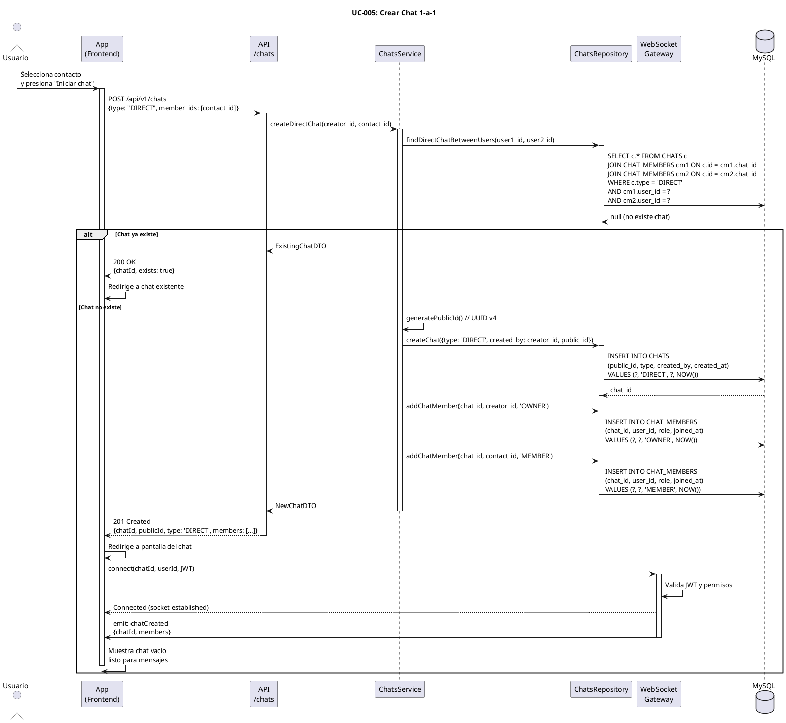

# UC-005: Crear Chat 1-a-1

## Identificador
UC-005

## Descripción
Este caso de uso permite a un usuario autenticado iniciar una conversación privada (chat 1-a-1) con uno de sus contactos. El sistema crea el chat si no existe previamente, o redirige al chat existente si ya hay uno entre ambos usuarios.

Los chats 1-a-1 son la base de la mensajería en UNLOKD y permiten el envío de mensajes condicionados entre dos personas.

## Actores
- **Actor principal**: Usuario autenticado
- **Actores secundarios**: Sistema de chats, Base de datos, WebSocket gateway

## Precondiciones
- El usuario está autenticado
- El contacto con quien se desea chatear existe y está activo
- El contacto no ha bloqueado al usuario
- El sistema está disponible

## Flujo Principal
1. El usuario accede a su lista de contactos
2. El usuario selecciona un contacto
3. El usuario presiona "Iniciar chat" o "Enviar mensaje"
4. El sistema verifica si ya existe un chat 1-a-1 entre ambos usuarios
5. Si no existe, el sistema crea un nuevo chat tipo DIRECT
6. El sistema agrega ambos usuarios como miembros del chat (CHAT_MEMBERS)
7. El sistema asigna rol OWNER al creador y MEMBER al contacto
8. El sistema genera un public_id (UUID) para el chat
9. El sistema redirige al usuario a la pantalla del chat
10. El sistema carga el historial de mensajes (vacío para chat nuevo)
11. El sistema establece conexión WebSocket para mensajería en tiempo real
12. El usuario puede comenzar a enviar mensajes

## Flujos Alternativos

### FA-1: Chat ya existe
- **Paso 4**: Si ya existe un chat DIRECT entre ambos usuarios
  - El sistema obtiene el chat existente
  - El sistema redirige directamente al chat
  - El sistema carga el historial de mensajes existente
  - El flujo continúa al paso 11

### FA-2: Contacto no existe
- **Paso 4**: Si el contact_user_id no corresponde a un usuario activo
  - El sistema muestra mensaje: "Usuario no disponible"
  - El flujo termina sin crear el chat

### FA-3: Usuario bloqueado
- **Paso 4**: Si el contacto ha bloqueado al usuario
  - El sistema muestra mensaje: "No puedes iniciar un chat con este usuario"
  - El flujo termina sin crear el chat

### FA-4: Error al crear chat
- **Paso 5**: Si falla la creación del chat en la base de datos
  - El sistema muestra mensaje: "Error al crear el chat. Intenta nuevamente"
  - El sistema registra el error en logs
  - El flujo termina sin crear el chat

### FA-5: Error de conexión WebSocket
- **Paso 11**: Si falla la conexión WebSocket
  - El sistema muestra mensaje: "Modo sin conexión. Reintentando..."
  - El sistema reintenta la conexión automáticamente
  - El usuario puede seguir viendo mensajes pero no enviar en tiempo real

## Postcondiciones
- Se crea un registro en la tabla CHATS con tipo DIRECT
- Se crean 2 registros en CHAT_MEMBERS (uno por cada usuario)
- El chat queda disponible para ambos usuarios en su lista de chats
- Se establece conexión WebSocket para ambos usuarios (si están online)
- Los mensajes enviados en el chat son visibles para ambos participantes
- El chat aparece en la lista de "Chats recientes"

## Reglas de Negocio
- **RN-1**: Solo puede existir un chat DIRECT entre dos usuarios específicos
- **RN-2**: Un chat DIRECT siempre tiene exactamente 2 miembros
- **RN-3**: El campo title de un chat DIRECT es NULL (se deriva del nombre del contacto)
- **RN-4**: El creador del chat recibe rol OWNER, el otro usuario rol MEMBER
- **RN-5**: Ambos usuarios tienen permisos completos en un chat 1-a-1 (enviar, leer, salir)
- **RN-6**: Si un usuario "sale" del chat, el chat no se elimina pero deja de aparecer en su lista
- **RN-7**: El public_id del chat se usa para todas las referencias en la API (no el id interno)
- **RN-8**: Para verificar existencia, se busca por ambos user_ids en cualquier orden

## Requisitos No Funcionales
### Seguridad
- Validar que el usuario autenticado puede crear chats con contactos válidos
- No permitir crear chats con usuarios bloqueados
- El public_id debe ser un UUID v4 aleatorio
- Validar permisos antes de mostrar el chat

### Performance
- La creación del chat debe completarse en menos de 500ms
- La verificación de existencia debe usar índice compuesto en CHAT_MEMBERS
- La carga inicial del historial vacío debe ser instantánea
- La conexión WebSocket debe establecerse en menos de 1 segundo

### Usabilidad
- Si el chat ya existe, la transición debe ser transparente
- Indicador visual de estado de conexión (online/offline)
- Precarga de avatar y nombre del contacto
- Skeleton loader mientras carga el chat

## Diagrama PlantUML

## Trazabilidad
- **Historia de Usuario**: HU-004 - Crear chat 1-a-1 con un contacto
- **Ticket de Trabajo**: UNLOKD-006 - Implementar módulo de chats
- **Épica**: EPIC-2 - Mensajería Básica
- **Sprint**: Sprint 2
- **Módulo NestJS**: `src/modules/chats/`, `src/modules/realtime/`
- **Tablas de BD**: `CHATS`, `CHAT_MEMBERS`

