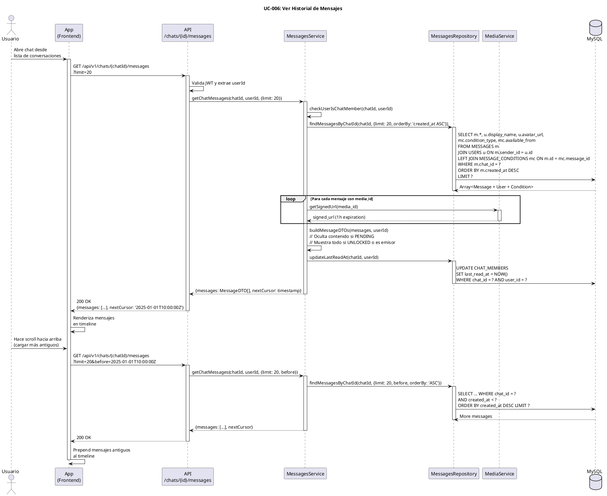

# UC-006: Ver Historial de Mensajes

## Identificador
UC-006

## Descripción
Este caso de uso permite a un usuario autenticado visualizar el historial completo de mensajes de un chat en orden cronológico. El sistema carga los mensajes de forma paginada, mostrando el estado de cada mensaje (bloqueado, desbloqueado, expirado) y permitiendo scroll infinito para cargar mensajes anteriores.

El historial de mensajes es fundamental para dar contexto a la conversación y permite al usuario identificar qué mensajes puede desbloquear y cuáles ya ha visualizado.

## Actores
- **Actor principal**: Usuario autenticado y miembro del chat
- **Actores secundarios**: Sistema de mensajería, Base de datos

## Precondiciones
- El usuario está autenticado
- El usuario es miembro del chat solicitado
- El chat existe y está activo
- El sistema está disponible

## Flujo Principal
1. El usuario accede a un chat desde su lista de conversaciones
2. El sistema verifica que el usuario es miembro del chat
3. El sistema carga los 20 mensajes más recientes
4. Para cada mensaje, el sistema obtiene:
   - Emisor (avatar, nombre)
   - Tipo de contenido (texto, imagen, audio, video)
   - Tipo de visibilidad (PLAIN o CONDITIONAL)
   - Estado (PENDING, UNLOCKED, EXPIRED, FAILED)
   - Timestamp de creación
5. Para mensajes CONDITIONAL PENDING, el sistema muestra indicador de candado
6. Para mensajes UNLOCKED, el sistema muestra el contenido completo
7. El sistema renderiza los mensajes en orden cronológico
8. El usuario puede hacer scroll hacia arriba para cargar mensajes anteriores
9. El sistema carga 20 mensajes adicionales en cada scroll
10. El usuario puede hacer tap/click en mensaje bloqueado para intentar desbloquearlo
11. El sistema actualiza last_read_at del usuario en CHAT_MEMBERS

## Flujos Alternativos

### FA-1: Usuario no es miembro del chat
- **Paso 2**: Si el usuario no pertenece al chat
  - El sistema retorna error 403 Forbidden
  - El sistema muestra mensaje: "No tienes acceso a este chat"
  - El flujo termina

### FA-2: Chat vacío (sin mensajes)
- **Paso 3**: Si el chat no tiene mensajes
  - El sistema muestra pantalla vacía con mensaje motivacional
  - El sistema muestra "Envía tu primer mensaje" o similar
  - El usuario puede comenzar a escribir

### FA-3: Fin del historial
- **Paso 9**: Si no hay más mensajes para cargar
  - El sistema muestra indicador "Inicio de la conversación"
  - El scroll hacia arriba se detiene
  - No se hacen más peticiones de paginación

### FA-4: Error al cargar mensajes
- **Paso 3**: Si falla la consulta a base de datos
  - El sistema muestra mensaje: "Error al cargar mensajes. Intenta nuevamente"
  - El sistema ofrece botón "Reintentar"
  - El sistema registra el error en logs

### FA-5: Mensaje multimedia con URL expirada
- **Paso 6**: Si la URL firmada de S3 expiró
  - El sistema solicita nueva URL firmada
  - El sistema actualiza el mensaje con la nueva URL
  - El contenido se muestra correctamente

### FA-6: Nuevo mensaje mientras se visualiza
- **Paso 7**: Si llega un nuevo mensaje vía WebSocket
  - El sistema agrega el mensaje al final del timeline
  - El sistema hace scroll automático si el usuario está en el fondo
  - El sistema incrementa contador de mensajes nuevos si está arriba

## Postcondiciones
- El usuario visualiza el historial de mensajes del chat
- Se actualiza last_read_at en CHAT_MEMBERS con el timestamp actual
- Los mensajes se marcan como "entregados" para el usuario
- El contador de mensajes no leídos se resetea
- El estado de lectura se propaga vía WebSocket al emisor

## Reglas de Negocio
- **RN-1**: Los mensajes se ordenan por created_at ASC (más antiguos primero)
- **RN-2**: La paginación usa cursor-based con parámetro `before` (timestamp)
- **RN-3**: El tamaño de página por defecto es 20 mensajes
- **RN-4**: El límite máximo de mensajes por petición es 100
- **RN-5**: Los mensajes CONDITIONAL PENDING solo muestran preview/indicador, no contenido
- **RN-6**: Los mensajes con visibility_type PLAIN se muestran siempre completos
- **RN-7**: Las URLs de multimedia se generan firmadas con expiración de 1 hora
- **RN-8**: El sistema no carga automáticamente imágenes/videos pesados (lazy loading)
- **RN-9**: Al cargar el historial, se actualiza last_read_at automáticamente
- **RN-10**: Los mensajes propios siempre se muestran completos (incluso si son condicionados)

## Requisitos No Funcionales
### Seguridad
- Validar que el usuario está autenticado y es miembro del chat
- No exponer contenido de mensajes bloqueados en la respuesta JSON
- Usar URLs firmadas con expiración para contenido multimedia
- Sanitizar contenido de texto para prevenir XSS

### Performance
- La carga inicial de 20 mensajes debe completarse en menos de 500ms
- Usar índice compuesto (chat_id, created_at) en MESSAGES
- Implementar lazy loading de imágenes (solo cargar las visibles)
- Cachear avatares de usuarios en el cliente
- Virtualización del scroll para chats con miles de mensajes

### Usabilidad
- Scroll automático al último mensaje al abrir chat
- Indicador visual de "cargando más mensajes"
- Separadores de fecha entre mensajes de días diferentes
- Agrupación de mensajes consecutivos del mismo emisor
- Botón flotante "Ir al último mensaje" si el usuario hace scroll arriba
- Skeleton loaders mientras carga

## Diagrama PlantUML

## Trazabilidad
- **Historia de Usuario**: HU-006 - Ver timeline de mensajes de un chat (paginado)
- **Ticket de Trabajo**: UNLOKD-007 - Implementar módulo de mensajes
- **Épica**: EPIC-2 - Mensajería Básica
- **Sprint**: Sprint 2
- **Módulo NestJS**: `src/modules/messages/`, `src/modules/media/`
- **Tablas de BD**: `MESSAGES`, `CHAT_MEMBERS`, `MESSAGE_CONDITIONS`, `USERS`

