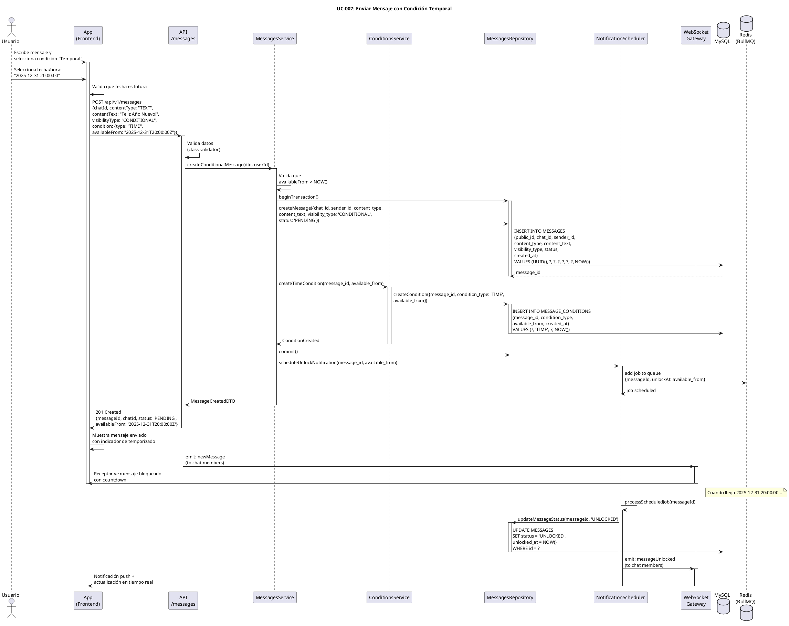

# UC-007: Enviar Mensaje con Condición Temporal

## Identificador
UC-007

## Descripción
Este caso de uso permite a un usuario enviar un mensaje que solo podrá ser visualizado por el receptor en una fecha y hora específica. Esta es una de las funcionalidades diferenciadoras core de UNLOKD, permitiendo crear sorpresas, invitaciones reveladoras o cápsulas del tiempo.

El mensaje permanece en estado PENDING hasta que llega el momento programado, momento en el cual el sistema notifica al receptor que el mensaje está disponible para desbloqueo.

## Actores
- **Actor principal**: Usuario autenticado (emisor)
- **Actores secundarios**: Sistema de mensajería, Motor de condiciones, Base de datos, Scheduler de notificaciones

## Precondiciones
- El usuario está autenticado
- El usuario es miembro del chat
- El chat existe y está activo
- El usuario tiene permisos para enviar mensajes en el chat
- La fecha/hora programada es futura (mayor a NOW())

## Flujo Principal
1. El usuario abre un chat
2. El usuario escribe el mensaje de texto o selecciona multimedia
3. El usuario presiona el botón de "condiciones" (ícono de candado)
4. El sistema muestra el menú de tipos de condiciones
5. El usuario selecciona "Programar para fecha/hora"
6. El sistema muestra un selector de fecha y hora
7. El usuario selecciona la fecha y hora futura deseada
8. El usuario confirma la condición
9. El usuario presiona "Enviar"
10. El sistema valida que la fecha es futura
11. El sistema crea el mensaje en estado PENDING
12. El sistema crea el registro de condición tipo TIME en MESSAGE_CONDITIONS
13. El sistema almacena available_from con la fecha/hora seleccionada
14. El sistema programa un job en Redis para notificar cuando llegue el momento
15. El sistema envía el mensaje vía WebSocket al receptor
16. El receptor ve el mensaje bloqueado con contador regresivo
17. El sistema muestra confirmación de envío al emisor

## Flujos Alternativos

### FA-1: Fecha en el pasado
- **Paso 10**: Si available_from <= NOW()
  - El sistema muestra mensaje: "La fecha debe ser futura"
  - El usuario debe seleccionar una fecha/hora posterior
  - El flujo vuelve al paso 6

### FA-2: Fecha muy lejana (más de 1 año)
- **Paso 10**: Si available_from > NOW() + 1 año
  - El sistema muestra advertencia: "La fecha es muy lejana (máximo 1 año)"
  - El usuario puede confirmar o cambiar la fecha
  - Si confirma, el flujo continúa

### FA-3: Usuario no miembro del chat
- **Paso 11**: Si el usuario no es miembro del chat
  - El sistema retorna error 403 Forbidden
  - El sistema muestra mensaje: "No puedes enviar mensajes en este chat"
  - El flujo termina sin crear el mensaje

### FA-4: Error al crear mensaje
- **Paso 11**: Si falla la creación en la base de datos
  - El sistema muestra mensaje: "Error al enviar mensaje. Intenta nuevamente"
  - El sistema registra el error en logs
  - El flujo termina sin crear el mensaje

### FA-5: Error al programar job
- **Paso 14**: Si falla la programación del job en Redis
  - El sistema registra el error en logs
  - El mensaje se crea igual (el scheduler verificará periódicamente)
  - El flujo continúa normalmente

### FA-6: Receptor offline
- **Paso 15**: Si el receptor no está conectado vía WebSocket
  - El sistema almacena el evento para entrega posterior
  - El sistema envía notificación push al receptor
  - El flujo continúa normalmente

## Postcondiciones
- Se crea un registro en MESSAGES con:
  - visibility_type = 'CONDITIONAL'
  - status = 'PENDING'
  - content_type según el tipo de contenido
  - content_text o media_id según corresponda
- Se crea un registro en MESSAGE_CONDITIONS con:
  - condition_type = 'TIME'
  - available_from = fecha/hora programada
- Se programa un job en Redis para notificar cuando llegue el momento
- El mensaje aparece en el timeline del chat para ambos usuarios
- El emisor ve el mensaje completo
- El receptor ve el mensaje bloqueado con contador regresivo
- Cuando llega available_from, el receptor recibe notificación de desbloqueo

## Reglas de Negocio
- **RN-1**: available_from debe ser > NOW() al momento de creación
- **RN-2**: El límite máximo de programación es 1 año en el futuro
- **RN-3**: El mensaje permanece PENDING hasta que available_from se alcanza
- **RN-4**: El emisor siempre puede ver su propio mensaje completo
- **RN-5**: El receptor ve indicador de "🔒 Bloqueado hasta DD/MM/YYYY HH:MM"
- **RN-6**: No se requiere acción del receptor, el mensaje se desbloquea automáticamente
- **RN-7**: Cuando available_from llega, status cambia a UNLOCKED automáticamente
- **RN-8**: Se envía notificación push al receptor cuando el mensaje se desbloquea
- **RN-9**: El sistema usa un scheduler (BullMQ) para verificar mensajes desbloqueables cada minuto
- **RN-10**: La zona horaria se maneja en UTC, la UI convierte a zona local del usuario

## Requisitos No Funcionales
### Seguridad
- Validar que el usuario es miembro del chat
- Validar que available_from es una fecha válida y futura
- Sanitizar el contenido del mensaje para prevenir XSS
- No exponer el contenido del mensaje en la API si está PENDING (solo para emisor)

### Performance
- El envío del mensaje debe completarse en menos de 1 segundo
- El scheduler debe procesar 1000+ mensajes por minuto
- Usar índice en MESSAGE_CONDITIONS(available_from, status) para búsquedas eficientes
- El job de notificación debe ejecutarse con latencia < 5 segundos del momento programado

### Usabilidad
- Selector de fecha/hora intuitivo con calendario visual
- Atajos rápidos: "En 1 hora", "Mañana", "En 1 semana"
- Vista previa de cuándo se desbloqueará ("En 2 días, 3 horas")
- Contador regresivo visual para el receptor
- Opción de cancelar/editar antes de enviar

## Diagrama PlantUML

## Trazabilidad
- **Historia de Usuario**: HU-007 - Enviar mensaje con condición temporal
- **Ticket de Trabajo**: UNLOKD-012 - Implementar condición TIME (temporal)
- **Épica**: EPIC-3 - Motor de Condiciones
- **Sprint**: Sprint 3
- **Módulo NestJS**: `src/modules/messages/`, `src/modules/conditions/`, `src/modules/notifications/`
- **Tablas de BD**: `MESSAGES`, `MESSAGE_CONDITIONS`
- **Jobs**: BullMQ queue para scheduled unlocks

