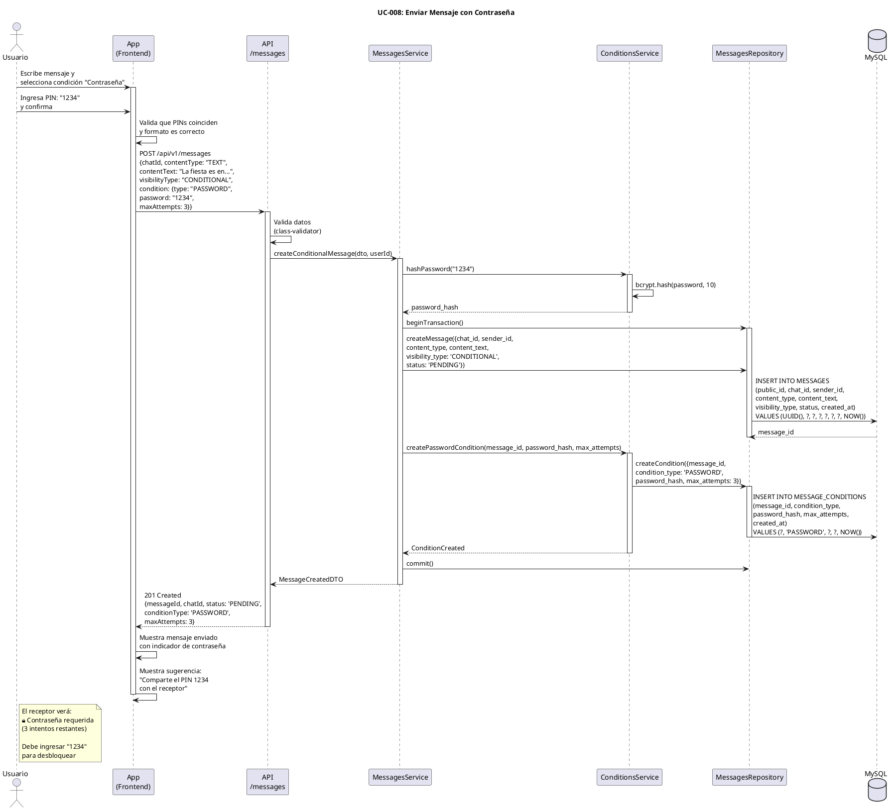

# UC-008: Enviar Mensaje con Contraseña

## Identificador
UC-008

## Descripción
Este caso de uso permite a un usuario enviar un mensaje protegido con una contraseña numérica de 4 dígitos (PIN). El receptor debe ingresar el PIN correcto para desbloquear y visualizar el contenido. El sistema limita los intentos fallidos a 3 para prevenir fuerza bruta.

Esta funcionalidad es ideal para regalos con ubicación secreta, invitaciones privadas o confesiones románticas que requieren una "clave" compartida previamente.

## Actores
- **Actor principal**: Usuario autenticado (emisor)
- **Actores secundarios**: Sistema de mensajería, Motor de condiciones, Base de datos

## Precondiciones
- El usuario está autenticado
- El usuario es miembro del chat
- El chat existe y está activo
- El usuario tiene permisos para enviar mensajes

## Flujo Principal
1. El usuario abre un chat
2. El usuario escribe el mensaje de texto o selecciona multimedia
3. El usuario presiona el botón de "condiciones" (ícono de candado)
4. El sistema muestra el menú de tipos de condiciones
5. El usuario selecciona "Proteger con contraseña"
6. El sistema muestra un campo para ingresar PIN de 4 dígitos
7. El usuario ingresa el PIN (ej: 1234)
8. El sistema solicita confirmar el PIN
9. El usuario reingresa el PIN
10. El sistema valida que ambos PINs coinciden
11. El usuario (opcional) configura el número máximo de intentos (default: 3)
12. El usuario presiona "Enviar"
13. El sistema valida que el PIN tiene 4 dígitos numéricos
14. El sistema genera un hash seguro del PIN (bcrypt)
15. El sistema crea el mensaje en estado PENDING
16. El sistema crea el registro de condición tipo PASSWORD
17. El sistema almacena password_hash y max_attempts
18. El sistema envía el mensaje vía WebSocket al receptor
19. El receptor ve el mensaje bloqueado con indicador de "🔒 Contraseña requerida"
20. El sistema muestra confirmación de envío al emisor

## Flujos Alternativos

### FA-1: PIN no numérico
- **Paso 13**: Si el PIN contiene caracteres no numéricos
  - El sistema muestra mensaje: "El PIN debe contener solo números"
  - El usuario debe reingresar el PIN
  - El flujo vuelve al paso 6

### FA-2: PIN con longitud incorrecta
- **Paso 13**: Si el PIN no tiene exactamente 4 dígitos
  - El sistema muestra mensaje: "El PIN debe tener 4 dígitos"
  - El usuario debe reingresar el PIN
  - El flujo vuelve al paso 6

### FA-3: PINs no coinciden
- **Paso 10**: Si la confirmación no coincide con el PIN original
  - El sistema muestra mensaje: "Los PINs no coinciden"
  - El usuario debe reingresar ambos PINs
  - El flujo vuelve al paso 6

### FA-4: Max attempts inválido
- **Paso 11**: Si max_attempts < 1 o > 10
  - El sistema muestra mensaje: "Los intentos deben estar entre 1 y 10"
  - El sistema sugiere el valor por defecto (3)
  - El usuario debe ajustar el valor

### FA-5: Error al crear mensaje
- **Paso 15**: Si falla la creación en la base de datos
  - El sistema muestra mensaje: "Error al enviar mensaje. Intenta nuevamente"
  - El sistema registra el error en logs
  - El flujo termina sin crear el mensaje

### FA-6: Usuario no miembro del chat
- **Paso 15**: Si el usuario no es miembro del chat
  - El sistema retorna error 403 Forbidden
  - El sistema muestra mensaje: "No puedes enviar mensajes en este chat"
  - El flujo termina sin crear el mensaje

## Postcondiciones
- Se crea un registro en MESSAGES con:
  - visibility_type = 'CONDITIONAL'
  - status = 'PENDING'
  - content_type según el tipo de contenido
  - content_text o media_id según corresponda
- Se crea un registro en MESSAGE_CONDITIONS con:
  - condition_type = 'PASSWORD'
  - password_hash = hash bcrypt del PIN
  - max_attempts = número de intentos permitidos (default: 3)
- El mensaje aparece en el timeline del chat
- El emisor ve el mensaje completo
- El receptor ve el mensaje bloqueado con indicador de contraseña
- El receptor puede intentar desbloquearlo hasta max_attempts veces

## Reglas de Negocio
- **RN-1**: El PIN debe ser exactamente 4 dígitos numéricos (0-9)
- **RN-2**: El PIN debe hashearse con bcrypt (factor 10) antes de almacenar
- **RN-3**: Nunca se almacena el PIN en texto plano
- **RN-4**: max_attempts por defecto es 3
- **RN-5**: max_attempts mínimo es 1, máximo es 10
- **RN-6**: El emisor siempre puede ver su propio mensaje completo
- **RN-7**: El receptor ve "🔒 Contraseña requerida (X intentos restantes)"
- **RN-8**: Cada intento fallido se registra en MESSAGE_UNLOCK_ATTEMPTS
- **RN-9**: Al alcanzar max_attempts, el mensaje pasa a status FAILED
- **RN-10**: Un mensaje en estado FAILED no puede desbloquearse nunca
- **RN-11**: El emisor puede ver cuántos intentos ha hecho el receptor (futuro)
- **RN-12**: El sistema NO envía el PIN al receptor (debe comunicarse por otro medio)

## Requisitos No Funcionales
### Seguridad
- Usar bcrypt con factor 10+ para hashear el PIN
- Validar que el usuario es miembro del chat
- Rate limiting en intentos de desbloqueo (3 intentos cada 5 minutos por mensaje/usuario)
- Sanitizar el contenido del mensaje para prevenir XSS
- No exponer password_hash en ninguna respuesta de API
- Registrar todos los intentos de desbloqueo para auditoría

### Performance
- El envío del mensaje debe completarse en menos de 1 segundo
- El hash del PIN debe ejecutarse de forma asíncrona (no bloquear)
- La validación del PIN debe usar bcrypt.compare() (timing-attack resistant)

### Usabilidad
- Teclado numérico para ingresar PIN
- Indicador visual de longitud del PIN (4 círculos)
- Sugerencia de "Comparte este PIN con el receptor por otro medio"
- Opción de copiar PIN al portapapeles antes de enviar
- Vista previa de cómo verá el receptor el mensaje bloqueado
- Selector visual para max_attempts (1-10)

## Diagrama PlantUML

## Trazabilidad
- **Historia de Usuario**: HU-008 - Enviar mensaje con contraseña de 4 dígitos
- **Ticket de Trabajo**: UNLOKD-013 - Implementar condición PASSWORD (con hash + intentos)
- **Épica**: EPIC-3 - Motor de Condiciones
- **Sprint**: Sprint 3
- **Módulo NestJS**: `src/modules/messages/`, `src/modules/conditions/`
- **Tablas de BD**: `MESSAGES`, `MESSAGE_CONDITIONS`, `MESSAGE_UNLOCK_ATTEMPTS`

