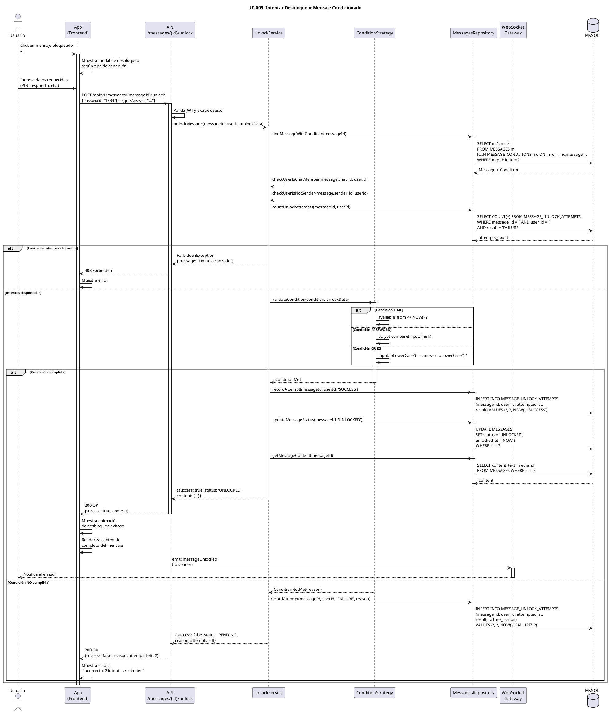

# UC-009: Intentar Desbloquear Mensaje Condicionado

## Identificador
UC-009

## Descripción
Este caso de uso permite a un usuario receptor intentar desbloquear un mensaje que tiene condiciones de visualización (TIME, PASSWORD, QUIZ, etc.). El sistema valida si se cumplen las condiciones requeridas y, en caso afirmativo, cambia el estado del mensaje a UNLOCKED y revela el contenido completo.

Este es el caso de uso central del diferenciador de UNLOKD, donde el usuario interactúa activamente con el sistema de condiciones para acceder al contenido bloqueado.

## Actores
- **Actor principal**: Usuario autenticado (receptor)
- **Actores secundarios**: Motor de condiciones, Sistema de mensajería, Base de datos, WebSocket gateway

## Precondiciones
- El usuario está autenticado
- El usuario es miembro del chat que contiene el mensaje
- El mensaje existe y tiene visibility_type = 'CONDITIONAL'
- El mensaje está en estado PENDING o no ha sido desbloqueado por este usuario
- El usuario no es el emisor del mensaje (emisor siempre ve todo)
- El sistema está disponible

## Flujo Principal
1. El usuario ve un mensaje bloqueado en el timeline del chat
2. El usuario hace tap/click en el mensaje bloqueado
3. El sistema muestra el modal de desbloqueo según el tipo de condición:
   - TIME: muestra contador regresivo y botón "Desbloquear" si ya pasó la hora
   - PASSWORD: muestra campo para ingresar PIN
   - QUIZ: muestra la pregunta y opciones
4. El usuario proporciona los datos requeridos (contraseña, respuesta, etc.)
5. El usuario presiona "Desbloquear"
6. El sistema valida los datos ingresados
7. El sistema obtiene la condición asociada al mensaje
8. El sistema verifica el tipo de condición
9. El sistema valida que la condición se cumple:
   - TIME: available_from <= NOW()
   - PASSWORD: bcrypt.compare(inputPassword, password_hash)
   - QUIZ: inputAnswer == quiz_correct_answer
10. El sistema registra el intento en MESSAGE_UNLOCK_ATTEMPTS con resultado SUCCESS
11. El sistema actualiza el mensaje a status = 'UNLOCKED'
12. El sistema actualiza unlocked_at con el timestamp actual
13. El sistema retorna el contenido completo del mensaje
14. El sistema envía evento WebSocket al emisor (notificación de desbloqueo)
15. El sistema muestra el contenido desbloqueado al usuario
16. El sistema reproduce animación de "desbloqueo exitoso"

## Flujos Alternativos

### FA-1: Condición TIME no cumplida (muy temprano)
- **Paso 9**: Si available_from > NOW()
  - El sistema registra intento con resultado FAILURE y razón "TOO_EARLY"
  - El sistema muestra mensaje: "Este mensaje se desbloqueará el DD/MM/YYYY a las HH:MM"
  - El sistema muestra contador regresivo
  - El flujo termina sin desbloquear

### FA-2: Contraseña incorrecta (PASSWORD)
- **Paso 9**: Si bcrypt.compare() retorna false
  - El sistema registra intento con resultado FAILURE y razón "INVALID_PASSWORD"
  - El sistema decrementa intentos restantes
  - El sistema muestra mensaje: "PIN incorrecto. Te quedan X intentos"
  - Si intentos restantes > 0: el flujo vuelve al paso 4
  - Si intentos restantes == 0: el flujo va a FA-3

### FA-3: Límite de intentos alcanzado
- **Paso 9**: Si el usuario ya hizo max_attempts intentos fallidos
  - El sistema actualiza mensaje a status = 'FAILED'
  - El sistema muestra mensaje: "Límite de intentos alcanzado. No puedes desbloquear este mensaje"
  - El sistema envía notificación al emisor
  - El flujo termina sin desbloquear

### FA-4: Respuesta incorrecta (QUIZ)
- **Paso 9**: Si inputAnswer != quiz_correct_answer
  - El sistema registra intento con resultado FAILURE y razón "INCORRECT_ANSWER"
  - El sistema muestra mensaje: "Respuesta incorrecta. Intenta nuevamente"
  - Si hay max_attempts configurado, decrementa contador
  - El flujo vuelve al paso 4

### FA-5: Usuario no es miembro del chat
- **Paso 6**: Si el usuario no es miembro del chat
  - El sistema retorna error 403 Forbidden
  - El sistema muestra mensaje: "No tienes acceso a este mensaje"
  - El flujo termina sin desbloquear

### FA-6: Mensaje ya desbloqueado
- **Paso 7**: Si el mensaje ya está en estado UNLOCKED
  - El sistema simplemente muestra el contenido
  - No se registra nuevo intento
  - El flujo salta al paso 15

### FA-7: Mensaje expirado
- **Paso 7**: Si el mensaje tiene expires_at y expires_at < NOW()
  - El sistema actualiza mensaje a status = 'EXPIRED'
  - El sistema muestra mensaje: "Este mensaje ha expirado"
  - El flujo termina sin desbloquear

### FA-8: Error de base de datos
- **Paso 11**: Si falla la actualización del mensaje
  - El sistema muestra mensaje: "Error al desbloquear. Intenta nuevamente"
  - El sistema registra el error en logs
  - El flujo termina sin desbloquear

## Postcondiciones
- Se crea un registro en MESSAGE_UNLOCK_ATTEMPTS con:
  - message_id, user_id, attempted_at, result (SUCCESS/FAILURE), failure_reason
- Si el desbloqueo fue exitoso:
  - El mensaje cambia a status = 'UNLOCKED'
  - Se actualiza unlocked_at con timestamp actual
  - El contenido completo del mensaje se hace visible para el usuario
  - El emisor recibe notificación de que su mensaje fue desbloqueado
  - El mensaje aparece normal (sin candado) en el timeline
- Si el desbloqueo falló:
  - El mensaje permanece en estado PENDING
  - Se decrementa el contador de intentos restantes (si aplica)
  - Si se alcanzó max_attempts, el mensaje cambia a FAILED
  - El usuario puede ver cuántos intentos le quedan

## Reglas de Negocio
- **RN-1**: Un usuario solo puede desbloquear mensajes donde NO es el emisor
- **RN-2**: El emisor siempre ve el contenido completo sin necesidad de desbloqueo
- **RN-3**: Cada intento (exitoso o fallido) se registra en MESSAGE_UNLOCK_ATTEMPTS
- **RN-4**: Para condición TIME, el usuario solo necesita que available_from <= NOW()
- **RN-5**: Para condición PASSWORD, se usa bcrypt.compare() (timing-attack resistant)
- **RN-6**: Para condición QUIZ, la comparación es case-insensitive y trim
- **RN-7**: El límite de intentos solo aplica a PASSWORD y QUIZ, no a TIME
- **RN-8**: Un mensaje en estado FAILED no puede desbloquearse nunca
- **RN-9**: Un mensaje desbloqueado (UNLOCKED) permanece así (no se puede "re-bloquear")
- **RN-10**: Para mensajes con visualización única, tras desbloqueo se elimina automáticamente
- **RN-11**: El sistema debe validar condiciones en el backend (no confiar en el cliente)
- **RN-12**: Rate limiting: máximo 10 intentos por minuto por usuario

## Requisitos No Funcionales
### Seguridad
- NUNCA enviar password_hash ni quiz_correct_answer al cliente
- Validar TODAS las condiciones en el backend
- Usar bcrypt.compare() para validar contraseñas (no comparación directa)
- Rate limiting: máximo 10 intentos por minuto por usuario
- Registrar todos los intentos para auditoría
- Validar que el usuario es miembro del chat

### Performance
- La validación debe completarse en menos de 500ms
- bcrypt.compare() debe ejecutarse de forma asíncrona
- Usar índice en MESSAGE_UNLOCK_ATTEMPTS(message_id, user_id) para consultas rápidas
- Cachear condiciones de mensajes frecuentemente consultados

### Usabilidad
- Feedback inmediato al intentar desbloquear
- Animación celebratoria al desbloqueo exitoso
- Mensaje de error claro al fallar
- Indicador de intentos restantes visible
- Sugerencia de "Pídele al emisor una pista" si falla múltiples veces
- Opción de "Notificarme cuando sea el momento" para TIME

## Diagrama PlantUML

## Trazabilidad
- **Historia de Usuario**: HU-009 - Intentar desbloquear mensaje condicionado
- **Ticket de Trabajo**: UNLOKD-014 - Implementar servicio de desbloqueo con validaciones
- **Épica**: EPIC-3 - Motor de Condiciones
- **Sprint**: Sprint 3
- **Módulo NestJS**: `src/modules/messages/`, `src/modules/conditions/`
- **Tablas de BD**: `MESSAGES`, `MESSAGE_CONDITIONS`, `MESSAGE_UNLOCK_ATTEMPTS`
- **Patrón de Diseño**: Strategy Pattern para validación de condiciones

