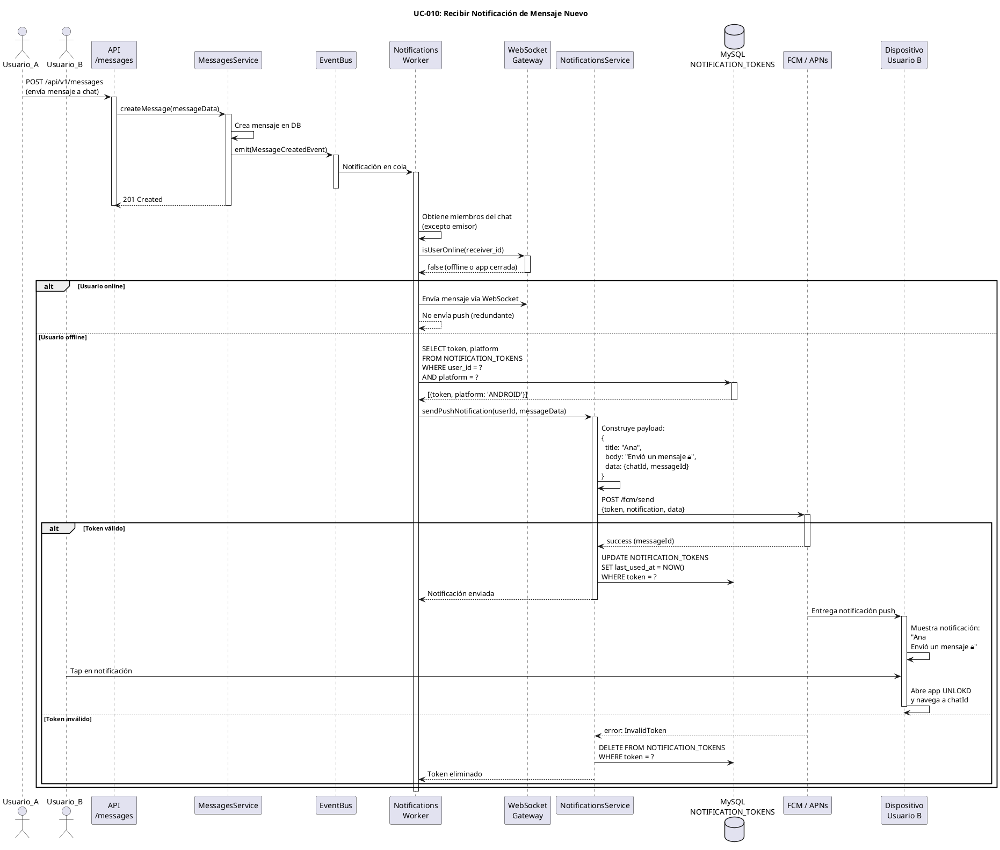

# UC-010: Recibir Notificación de Mensaje Nuevo

## Identificador
UC-010

## Descripción
Este caso de uso permite a un usuario recibir notificaciones push en su dispositivo cuando alguien le envía un mensaje nuevo, cuando un mensaje temporizado se desbloquea, o cuando ocurren eventos relevantes en sus chats. Las notificaciones funcionan incluso cuando la app está cerrada o en segundo plano.

Las notificaciones son fundamentales para mantener al usuario informado y promover el engagement con la aplicación.

## Actores
- **Actor principal**: Usuario receptor (puede estar online u offline)
- **Actores secundarios**: Worker de notificaciones, Firebase Cloud Messaging (FCM) / Apple Push Notification Service (APNs), Base de datos

## Precondiciones
- El usuario tiene una cuenta activa
- El usuario ha concedido permisos de notificaciones en su dispositivo
- El dispositivo del usuario tiene un token FCM/APNs válido registrado
- El sistema de notificaciones está operativo

## Flujo Principal
1. Ocurre un evento relevante (nuevo mensaje, mensaje desbloqueado, etc.)
2. El backend emite un evento de dominio (ej: MessageCreatedEvent)
3. El worker de notificaciones escucha el evento desde la cola Redis/BullMQ
4. El worker obtiene los destinatarios del evento (miembros del chat excepto emisor)
5. Para cada destinatario, el worker verifica si está online vía WebSocket
6. Si el usuario está offline o la app en segundo plano:
7. El worker consulta los tokens de notificación del usuario en NOTIFICATION_TOKENS
8. El worker construye el payload de notificación según el tipo de evento:
   - Nuevo mensaje: "Nombre envió un mensaje" (sin revelar contenido bloqueado)
   - Mensaje desbloqueado: "Un mensaje se desbloqueó en Chat X"
   - Mención: "@Tu apareciste en Chat X"
9. El worker envía la notificación a FCM/APNs según la plataforma del token
10. FCM/APNs entregan la notificación al dispositivo del usuario
11. El dispositivo muestra la notificación en la bandeja de notificaciones
12. El usuario ve la notificación
13. El usuario hace tap en la notificación
14. La app se abre y navega directamente al chat correspondiente
15. El worker actualiza last_used_at en NOTIFICATION_TOKENS

## Flujos Alternativos

### FA-1: Usuario está online (WebSocket conectado)
- **Paso 6**: Si el usuario está conectado vía WebSocket
  - El sistema entrega el mensaje en tiempo real vía WebSocket
  - No se envía notificación push (redundante)
  - El flujo termina

### FA-2: Usuario no tiene tokens registrados
- **Paso 7**: Si el usuario no tiene tokens válidos
  - El worker registra en logs que no se pudo notificar
  - El flujo termina sin enviar notificación
  - El mensaje queda disponible para cuando el usuario abra la app

### FA-3: Token inválido o expirado
- **Paso 10**: Si FCM/APNs retorna error de token inválido
  - El worker marca el token como inválido
  - El worker elimina el token de NOTIFICATION_TOKENS
  - El worker intenta con el siguiente token del usuario (si existe)
  - Si no hay más tokens, el flujo termina sin notificar

### FA-4: Error de FCM/APNs (servicio caído)
- **Paso 10**: Si FCM/APNs retorna error de servicio
  - El worker reintenta el envío con backoff exponencial (3 intentos)
  - Si sigue fallando, el worker registra el error
  - El job se reintenta después de 5 minutos
  - El flujo termina temporalmente

### FA-5: Usuario tiene notificaciones desactivadas
- **Paso 7**: Si el usuario desactivó notificaciones en la configuración de la app
  - El worker verifica la preferencia del usuario
  - El worker no envía notificación
  - El flujo termina

### FA-6: Mensaje bloqueado (condicionado)
- **Paso 8**: Si el mensaje es CONDITIONAL
  - El worker NO incluye el contenido en la notificación
  - El worker muestra: "Nombre envió un mensaje bloqueado 🔒"
  - El payload solo incluye chatId e indicador de bloqueado
  - El flujo continúa normalmente

### FA-7: Notificación silenciada (DND / horario nocturno)
- **Paso 8**: Si el usuario tiene modo "No molestar" activo
  - El worker verifica horarios de silencio configurados
  - El worker envía notificación silenciosa (sin sonido/vibración)
  - O el worker pospone notificación para después del horario DND
  - El flujo continúa con notificación silenciosa

## Postcondiciones
- El usuario recibe la notificación push en su dispositivo
- La notificación aparece en la bandeja de notificaciones
- El usuario puede hacer tap para abrir la app en el chat correcto
- Se actualiza last_used_at en NOTIFICATION_TOKENS
- Si el token es inválido, se elimina de la base de datos
- El evento de notificación se registra para analytics (opcional)

## Reglas de Negocio
- **RN-1**: No se envían notificaciones si el usuario está online vía WebSocket
- **RN-2**: No se envían notificaciones de mensajes propios
- **RN-3**: Para mensajes CONDITIONAL, no se revela el contenido en la notificación
- **RN-4**: Se respetan las preferencias de notificación del usuario
- **RN-5**: Un usuario puede tener múltiples tokens (múltiples dispositivos)
- **RN-6**: Tokens inválidos se eliminan automáticamente de la base de datos
- **RN-7**: Las notificaciones se agrupan por chat (no spam individual)
- **RN-8**: El payload incluye deep link para abrir el chat correcto
- **RN-9**: Los tokens expiran después de 60 días sin uso
- **RN-10**: Rate limiting: máximo 100 notificaciones por hora por usuario
- **RN-11**: Prioridad de notificaciones: menciones > mensajes directos > grupos
- **RN-12**: Notificaciones de mensajes desbloqueados tienen prioridad alta

## Requisitos No Funcionales
### Seguridad
- Los tokens FCM/APNs deben almacenarse de forma segura
- El payload de notificación NO debe incluir contenido sensible
- Para mensajes bloqueados, solo enviar indicador sin contenido
- Validar que el usuario es miembro del chat antes de notificar
- Los deep links deben incluir validación de autenticación

### Performance
- El worker debe procesar 1000+ notificaciones por segundo
- La latencia entre evento y notificación debe ser < 5 segundos
- Usar cola Redis/BullMQ para desacoplar procesamiento
- Batch de notificaciones cuando sea posible (múltiples dispositivos)
- Timeout de 10 segundos en llamadas a FCM/APNs

### Confiabilidad
- Reintentos automáticos con backoff exponencial
- Dead letter queue para notificaciones que fallan persistentemente
- Logging detallado de todos los intentos de notificación
- Monitoreo de tasas de entrega de FCM/APNs
- Alertas si tasa de error > 5%

### Usabilidad
- Notificaciones claras y concisas (máximo 100 caracteres)
- Incluir avatar del emisor en la notificación (rich notifications)
- Agrupación inteligente de notificaciones del mismo chat
- Acciones rápidas: "Responder", "Marcar como leído"
- Deep linking preciso al chat/mensaje correcto

## Diagrama PlantUML

## Trazabilidad
- **Historia de Usuario**: HU-010 - Recibir notificación push de mensaje nuevo
- **Ticket de Trabajo**: UNLOKD-018 - Implementar worker de notificaciones push (FCM/APNs)
- **Épica**: EPIC-4 - Multimedia, Notificaciones y UX
- **Sprint**: Sprint 4
- **Módulo NestJS**: `src/modules/notifications/`
- **Tabla de BD**: `NOTIFICATION_TOKENS`
- **Servicios externos**: Firebase Cloud Messaging (Android/Web), Apple Push Notification Service (iOS)
- **Cola**: BullMQ para procesamiento asíncrono

