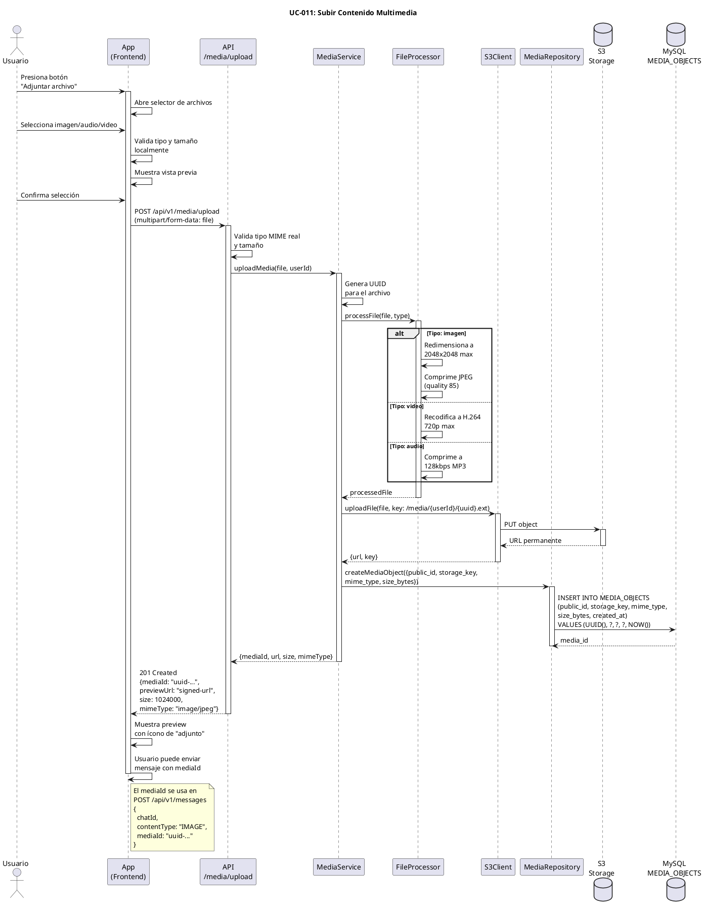

# UC-011: Subir Contenido Multimedia

## Identificador
UC-011

## Descripción
Este caso de uso permite a un usuario subir archivos multimedia (imágenes, audios, videos) al sistema para incluirlos en mensajes. El sistema valida, procesa, optimiza y almacena el archivo en S3, generando una URL segura que luego se asocia al mensaje.

El soporte multimedia es fundamental para crear mensajes condicionados ricos que incluyan fotos, notas de voz o videos como contenido bloqueado.

## Actores
- **Actor principal**: Usuario autenticado
- **Actores secundarios**: Servicio de multimedia, Almacenamiento S3, Base de datos

## Precondiciones
- El usuario está autenticado
- El usuario tiene permisos para subir archivos
- El archivo cumple con los límites de tamaño y tipo
- El sistema de almacenamiento S3 está disponible
- El sistema está operativo

## Flujo Principal
1. El usuario abre un chat y presiona el botón de adjuntar archivo
2. El sistema abre el selector de archivos del dispositivo
3. El usuario selecciona un archivo (imagen, audio o video)
4. El sistema valida el tipo de archivo
5. El sistema valida el tamaño del archivo
6. El sistema muestra vista previa del archivo seleccionado
7. El usuario confirma la selección
8. El sistema genera un identificador único para el archivo (UUID)
9. El sistema comprime/optimiza el archivo según el tipo:
   - Imágenes: redimensiona y comprime JPEG/PNG
   - Videos: recodifica a formato optimizado (H.264)
   - Audios: normaliza volumen y comprime a MP3/AAC
10. El sistema sube el archivo procesado a S3 en la ruta `/media/{userId}/{uuid}.ext`
11. S3 retorna la URL permanente del archivo
12. El sistema crea un registro en MEDIA_OBJECTS con los metadatos
13. El sistema retorna el media_id al cliente
14. El usuario puede enviar mensaje incluyendo el media_id
15. El sistema muestra indicador de "subida completada"

## Flujos Alternativos

### FA-1: Tipo de archivo no soportado
- **Paso 4**: Si el archivo no es imagen/audio/video
  - El sistema muestra mensaje: "Tipo de archivo no soportado. Solo imágenes, audios y videos"
  - El sistema muestra lista de formatos aceptados
  - El usuario debe seleccionar otro archivo
  - El flujo vuelve al paso 2

### FA-2: Archivo demasiado grande
- **Paso 5**: Si el archivo supera los límites:
  - Imagen > 10MB
  - Audio > 25MB
  - Video > 100MB
  - El sistema muestra mensaje: "El archivo es muy grande (máx: XXmb)"
  - El sistema sugiere comprimir el archivo
  - El usuario debe seleccionar un archivo más pequeño
  - El flujo vuelve al paso 2

### FA-3: Error al procesar archivo
- **Paso 9**: Si falla la compresión/optimización
  - El sistema muestra mensaje: "Error al procesar el archivo. Intenta con otro"
  - El sistema registra el error en logs
  - El flujo vuelve al paso 2

### FA-4: Error al subir a S3
- **Paso 10**: Si falla la subida a S3
  - El sistema reintenta la subida (3 intentos con backoff)
  - Si sigue fallando:
    - El sistema muestra mensaje: "Error al subir archivo. Verifica tu conexión"
    - El usuario puede reintentar
    - El flujo puede volver al paso 9

### FA-5: Espacio insuficiente en S3
- **Paso 10**: Si la cuenta de S3 alcanzó su cuota
  - El sistema registra alerta crítica
  - El sistema muestra mensaje: "Servicio temporalmente no disponible"
  - El administrador recibe alerta
  - El flujo termina sin subir

### FA-6: Usuario cancela durante subida
- **Paso 10**: Si el usuario cancela mientras sube
  - El sistema aborta la subida a S3
  - El sistema limpia archivos temporales
  - El sistema retorna al chat sin archivo adjunto
  - El flujo termina

### FA-7: Archivo corrupto
- **Paso 9**: Si el archivo no puede leerse o está corrupto
  - El sistema muestra mensaje: "El archivo está corrupto o dañado"
  - El usuario debe seleccionar otro archivo
  - El flujo vuelve al paso 2

## Postcondiciones
- El archivo multimedia se almacena en S3 en formato optimizado
- Se crea un registro en MEDIA_OBJECTS con:
  - public_id (UUID)
  - storage_key (ruta en S3)
  - mime_type (tipo MIME del archivo)
  - size_bytes (tamaño del archivo procesado)
  - encryption_type (si aplica)
  - created_at (timestamp)
- El sistema retorna media_id al cliente
- El usuario puede enviar mensaje con ese media_id
- El archivo queda disponible para descarga vía URL firmada
- Si el mensaje no se envía en 24 horas, el archivo se marca para eliminación

## Reglas de Negocio
- **RN-1**: Tipos de archivo soportados:
  - Imágenes: JPG, JPEG, PNG, GIF, WebP
  - Audios: MP3, M4A, AAC, OGG, WAV
  - Videos: MP4, MOV, AVI, WebM
- **RN-2**: Límites de tamaño:
  - Imágenes: máximo 10MB
  - Audios: máximo 25MB
  - Videos: máximo 100MB
- **RN-3**: Las imágenes se redimensionan a máximo 2048x2048px preservando aspect ratio
- **RN-4**: Los videos se recodifican a H.264 con máximo 720p
- **RN-5**: Los audios se comprimen a 128kbps MP3/AAC
- **RN-6**: El nombre del archivo en S3 debe ser UUID para evitar colisiones
- **RN-7**: Los archivos se organizan por userId: `/media/{userId}/{uuid}.ext`
- **RN-8**: Los archivos no asociados a mensaje se eliminan después de 24 horas
- **RN-9**: El sistema valida el tipo MIME real (no solo la extensión)
- **RN-10**: Para el MVP, no se aplica cifrado a los archivos (futuro)
- **RN-11**: URLs de acceso son firmadas con expiración de 1 hora
- **RN-12**: Un media_id solo puede usarse una vez (asociado a un mensaje)

## Requisitos No Funcionales
### Seguridad
- Validar tipo MIME real del archivo (no confiar en extensión)
- Escanear archivos en busca de malware (integración con antivirus, futuro)
- Generar URLs firmadas con expiración para acceso
- Sanitizar metadatos del archivo (EXIF, etc.)
- Rate limiting: máximo 10 archivos por minuto por usuario
- Validar que el usuario está autenticado

### Performance
- Subida en chunks para archivos > 5MB
- Procesamiento asíncrono de compresión/optimización
- Paralelizar subida a S3 con compresión
- Mostrar barra de progreso en tiempo real
- Timeouts configurables por tipo de archivo
- Usar workers separados para procesamiento pesado

### Confiabilidad
- Reintentos automáticos en fallos de red
- Limpieza de archivos temporales tras error
- Rollback de MEDIA_OBJECTS si falla asociación con mensaje
- Monitoreo de cuota de S3
- Alertas si tasa de error > 5%

### Usabilidad
- Vista previa del archivo antes de confirmar
- Barra de progreso durante subida
- Indicador de velocidad de subida
- Opción de cancelar durante subida
- Compresión automática sugerida para archivos grandes
- Crop/edición básica de imágenes antes de subir

## Diagrama PlantUML

## Trazabilidad
- **Historia de Usuario**: HU-011 - Subir imagen/video para enviar en mensaje
- **Ticket de Trabajo**: UNLOKD-017 - Implementar módulo de multimedia (upload + S3)
- **Épica**: EPIC-4 - Multimedia, Notificaciones y UX
- **Sprint**: Sprint 4
- **Módulo NestJS**: `src/modules/media/`
- **Tabla de BD**: `MEDIA_OBJECTS`
- **Storage**: S3-compatible (Backblaze/Wasabi/MinIO)
- **Procesamiento**: Sharp (imágenes), FFmpeg (video/audio)

