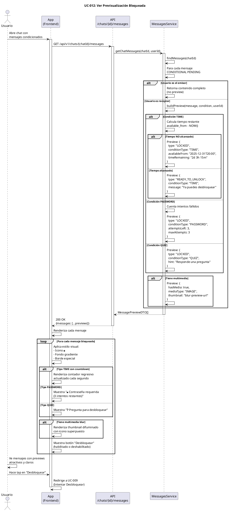

# UC-012: Ver Previsualización Bloqueada

## Identificador
UC-012

## Descripción
Este caso de uso permite a un usuario receptor visualizar una representación parcial o indicativa de un mensaje condicionado bloqueado, sin revelar su contenido completo. El sistema muestra un estado visual diferenciado que genera curiosidad y anticipación.

La previsualización bloqueada es un elemento clave de la experiencia de usuario de UNLOKD, creando expectativa y motivando al usuario a cumplir las condiciones de desbloqueo.

## Actores
- **Actor principal**: Usuario autenticado (receptor)
- **Actores secundarios**: Sistema de mensajería, Motor de condiciones

## Precondiciones
- El usuario está autenticado
- El usuario es miembro del chat
- Existe un mensaje con visibility_type = 'CONDITIONAL'
- El mensaje está en estado PENDING (no desbloqueado aún)
- El usuario no es el emisor del mensaje
- El sistema está operativo

## Flujo Principal
1. El usuario abre un chat que contiene mensajes condicionados
2. El sistema obtiene los mensajes del chat con sus condiciones
3. Para cada mensaje CONDITIONAL PENDING, el sistema:
4. Verifica el tipo de condición (TIME, PASSWORD, QUIZ, etc.)
5. Determina qué información revelar sin comprometer el contenido
6. Construye el preview según el tipo de condición:
   - TIME: muestra contador regresivo y fecha de desbloqueo
   - PASSWORD: muestra "🔒 Protegido con contraseña (X intentos)"
   - QUIZ: muestra "❓ Responde la pregunta para desbloquear"
7. Si es contenido multimedia, aplica efecto de difuminado (blur)
8. Si es texto, muestra placeholder genérico o primera palabra difuminada
9. El sistema renderiza el mensaje con estilo visual distintivo:
   - Icono de candado prominente
   - Fondo con gradiente suave
   - Borde diferenciado
   - Animación sutil de "bloqueado"
10. El usuario ve el preview sin poder leer el contenido completo
11. El sistema muestra botón "Desbloquear" o "Ver detalles"
12. El usuario puede hacer tap para intentar desbloquear
13. Si hace tap, el sistema redirige a UC-009 (Intentar Desbloquear)

## Flujos Alternativos

### FA-1: Mensaje con condición TIME no alcanzada
- **Paso 6**: Si available_from > NOW()
  - El sistema calcula tiempo restante
  - Muestra contador regresivo: "Se desbloqueará en 2 días, 3 horas"
  - Muestra fecha exacta: "Disponible el 31/12/2025 a las 20:00"
  - Icono de reloj animado
  - Botón deshabilitado con tooltip: "Espera hasta la fecha programada"

### FA-2: Mensaje con condición TIME alcanzada
- **Paso 6**: Si available_from <= NOW() pero aún no desbloqueado
  - Muestra "🔓 ¡Ya puedes desbloquear este mensaje!"
  - Botón "Desbloquear ahora" habilitado y destacado
  - Animación llamativa para llamar la atención
  - Badge de "Nuevo" si se desbloqueó recientemente

### FA-3: Mensaje con múltiples intentos fallidos
- **Paso 6**: Si el usuario ya intentó desbloquear sin éxito
  - Muestra intentos restantes: "🔒 2 intentos restantes"
  - Si queda 1 intento: mensaje de advertencia destacado
  - Si llegó al límite: "❌ Límite alcanzado. No puedes desbloquear"
  - Botón deshabilitado si llegó al límite

### FA-4: Contenido multimedia bloqueado
- **Paso 8**: Si el mensaje tiene media_id
  - El sistema obtiene thumbnail/preview del archivo
  - Aplica blur pesado (radius 20px)
  - Muestra icono de tipo de medio (imagen/video/audio) superpuesto
  - Muestra tamaño del archivo: "Imagen • 2.3 MB"
  - No carga el archivo completo (ahorra bandwidth)

### FA-5: Usuario es el emisor
- **Paso 3**: Si el usuario es quien envió el mensaje
  - No aplica previsualización bloqueada
  - Muestra el contenido completo
  - Badge de "Enviado" con información de estado
  - Indicador de quién intentó desbloquear (si aplica)
  - El flujo termina mostrando mensaje normal

### FA-6: Mensaje expirado
- **Paso 3**: Si el mensaje tiene expires_at < NOW()
  - Muestra "⏱️ Este mensaje ha expirado"
  - Preview completamente oscurecido
  - Botón deshabilitado
  - Mensaje de "Ya no está disponible"

## Postcondiciones
- El usuario ve el mensaje en el timeline con indicadores visuales de bloqueo
- El usuario comprende qué tipo de condición protege el mensaje
- El usuario sabe qué debe hacer para desbloquearlo
- El usuario puede decidir si intentar desbloquear ahora o más tarde
- La curiosidad del usuario se activa sin frustración
- El contenido real permanece protegido y no se expone

## Reglas de Negocio
- **RN-1**: Nunca exponer el contenido real en el preview
- **RN-2**: Para texto, máximo mostrar tipo de contenido, no palabras reales
- **RN-3**: Para multimedia, aplicar blur y no cargar archivo completo
- **RN-4**: El emisor siempre ve el contenido completo (sin preview)
- **RN-5**: Mostrar tipo de condición sin revelar la respuesta/contraseña
- **RN-6**: Para TIME, mostrar contador regresivo actualizado en tiempo real
- **RN-7**: Indicar intentos restantes para condiciones con límite
- **RN-8**: Diferenciar visualmente entre "aún bloqueado" y "ya disponible"
- **RN-9**: El preview debe ser atractivo, no frustrante
- **RN-10**: Usar iconografía consistente:
  - 🔒 = Bloqueado
  - 🔓 = Ya disponible para desbloquear
  - ⏱️ = Temporizado
  - 🔑 = Contraseña
  - ❓ = Quiz
  - ❌ = Expirado/fallido
- **RN-11**: El preview no debe consumir recursos innecesarios (lazy loading)

## Requisitos No Funcionales
### Seguridad
- NUNCA incluir el contenido real en la respuesta JSON
- NUNCA revelar contraseñas, respuestas o pistas en el preview
- No exponer metadatos sensibles del archivo multimedia
- Validar que el usuario es miembro del chat
- Las URLs de preview deben ser firmadas y con expiración

### Performance
- El preview debe renderizarse inmediatamente (< 100ms)
- No cargar archivos multimedia completos (solo thumbnails)
- Aplicar blur en el cliente (no procesar imagen en backend)
- Lazy loading de previews fuera de viewport
- Actualizar contador regresivo localmente (no hacer peticiones)

### Usabilidad
- **Visual claro y atractivo** que genere curiosidad
- Iconografía intuitiva que comunique el tipo de condición
- Contador regresivo animado y actualizado en tiempo real
- Transiciones suaves entre estados (bloqueado → disponible)
- Feedback visual al hacer tap (ripple effect)
- Accesibilidad: lectores de pantalla deben describir el estado
- Dark mode: previews deben verse bien en ambos temas
- Animaciones sutiles que llamen la atención sin molestar

### UX Emocional
- **Anticipación** (no frustración): el preview debe motivar, no molestar
- **Claridad**: el usuario debe entender qué hacer sin confusión
- **Recompensa**: al desbloquear, animación celebratoria
- **Curiosidad controlada**: suficiente información para intrigar, no revelar

## Diagrama PlantUML

## Trazabilidad
- **Historia de Usuario**: HU-012 - Ver previsualización difuminada de mensaje bloqueado
- **Ticket de Trabajo**: UNLOKD-019 - Implementar previsualización difuminada en frontend
- **Épica**: EPIC-4 - Multimedia, Notificaciones y UX
- **Sprint**: Sprint 4
- **Módulo NestJS**: `src/modules/messages/` (backend), componentes React (frontend)
- **Relacionado con**: UC-009 (Desbloquear mensaje)

