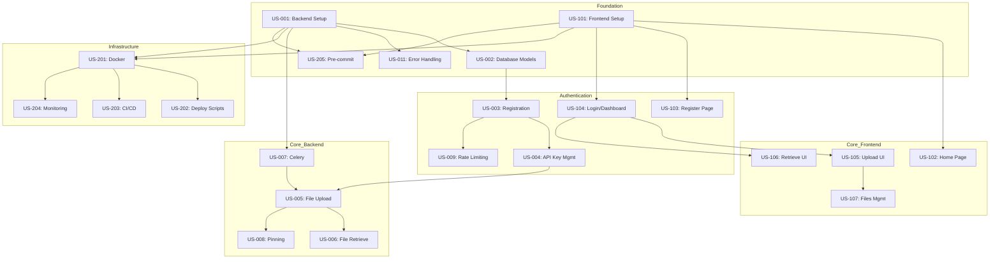

# IPFS Gateway Project - User Stories Summary

## Overview

This document provides a comprehensive summary of all user stories for the IPFS Gateway SaaS project. The user stories are organized by domain (Backend, Frontend, Infrastructure) and prioritized for efficient development planning.

---

## Summary Statistics

| Category | Total Stories | Critical | High | Medium |
|----------|---------------|----------|------|--------|
| Backend | 13 | 5 | 5 | 3 |
| Frontend | 10 | 4 | 4 | 2 |
| Infrastructure | 5 | 0 | 4 | 1 |
| **Total** | **28** | **9** | **13** | **6** |

### Estimated Total Effort
- **Backend**: ~84 hours
- **Frontend**: ~70 hours
- **Infrastructure**: ~42 hours
- **Total**: ~196 hours (~5 weeks with 1 developer)

---

## Priority Legend

| Symbol | Priority | Description |
|--------|----------|-------------|
| 🔴 | Critical | Must be completed first, blocks other work |
| 🟠 | High | Essential for MVP, should be done early |
| 🟡 | Medium | Important but can be deferred |

## Difficulty Legend

| Stars | Level | Description |
|-------|-------|-------------|
| ⭐ | Easy | Straightforward implementation |
| ⭐⭐ | Medium | Some complexity, standard patterns |
| ⭐⭐⭐ | Medium-High | Multiple components, integrations |
| ⭐⭐⭐⭐ | High | Complex logic, external services |

---

## Backend User Stories

### Phase 1: Foundation (Sprint 1-2)

| ID | Title | Priority | Difficulty | Effort | Dependencies |
|----|-------|----------|------------|--------|--------------|
| US-001 | Project Setup and Configuration | 🔴 Critical | ⭐⭐ | 8h | None |
| US-002 | Database Models and Migrations | 🔴 Critical | ⭐⭐ | 6h | US-001 |
| US-011 | Error Handling and Responses | 🟡 Medium | ⭐⭐ | 4h | US-001 |

**Goal**: Establish the foundational project structure, database models, and error handling patterns.

### Phase 2: Authentication (Sprint 2-3)

| ID | Title | Priority | Difficulty | Effort | Dependencies |
|----|-------|----------|------------|--------|--------------|
| US-003 | User Registration and Authentication | 🔴 Critical | ⭐⭐⭐ | 6h | US-001, US-002 |
| US-004 | API Key Management | 🟠 High | ⭐⭐⭐ | 8h | US-003 |
| US-009 | Rate Limiting and Security | 🟠 High | ⭐⭐⭐ | 6h | US-003 |

**Goal**: Implement complete user authentication, API key lifecycle, and security measures.

### Phase 3: Core Functionality (Sprint 3-4)

| ID | Title | Priority | Difficulty | Effort | Dependencies |
|----|-------|----------|------------|--------|--------------|
| US-007 | Celery Task Queue Setup | 🟠 High | ⭐⭐⭐ | 6h | US-001 |
| US-005 | File Upload to IPFS | 🔴 Critical | ⭐⭐⭐⭐ | 12h | US-004, US-007 |
| US-006 | File Retrieval from IPFS | 🔴 Critical | ⭐⭐⭐ | 8h | US-004, US-005 |
| US-008 | Content Pinning Management | 🟠 High | ⭐⭐⭐ | 6h | US-005, US-007 |

**Goal**: Implement all core IPFS operations with async processing and resilience patterns.

### Phase 4: Polish & Testing (Sprint 5)

| ID | Title | Priority | Difficulty | Effort | Dependencies |
|----|-------|----------|------------|--------|--------------|
| US-010 | Audit Logging System | 🟡 Medium | ⭐⭐ | 4h | US-002 |
| US-012 | API Documentation (Swagger) | 🟡 Medium | ⭐⭐ | 4h | All endpoints |
| US-013 | Backend Testing Suite | 🟠 High | ⭐⭐⭐ | 12h | All stories |

**Goal**: Complete audit trail, documentation, and comprehensive testing.

---

## Frontend User Stories

### Phase 1: Foundation (Sprint 1-2)

| ID | Title | Priority | Difficulty | Effort | Dependencies |
|----|-------|----------|------------|--------|--------------|
| US-101 | Frontend Project Setup | 🔴 Critical | ⭐⭐ | 6h | None |
| US-102 | Home Page and Navigation | 🟠 High | ⭐⭐ | 6h | US-101 |
| US-109 | Error Handling and Feedback UI | 🟡 Medium | ⭐⭐ | 5h | US-101 |

**Goal**: Set up Next.js project with core layout and error handling.

### Phase 2: Authentication UI (Sprint 2-3)

| ID | Title | Priority | Difficulty | Effort | Dependencies |
|----|-------|----------|------------|--------|--------------|
| US-103 | User Registration Page | 🔴 Critical | ⭐⭐ | 5h | US-101, US-003 |
| US-104 | User Login and Dashboard | 🔴 Critical | ⭐⭐⭐ | 8h | US-101, US-004 |

**Goal**: Complete authentication flow and user dashboard.

### Phase 3: Core Features (Sprint 3-4)

| ID | Title | Priority | Difficulty | Effort | Dependencies |
|----|-------|----------|------------|--------|--------------|
| US-105 | File Upload Interface | 🔴 Critical | ⭐⭐⭐ | 8h | US-104, US-005 |
| US-106 | File Retrieval Interface | 🟠 High | ⭐⭐ | 6h | US-104, US-006 |
| US-107 | Files Management Page | 🟠 High | ⭐⭐⭐ | 8h | US-105, US-008 |

**Goal**: Implement all file operation interfaces.

### Phase 4: Documentation & Testing (Sprint 5)

| ID | Title | Priority | Difficulty | Effort | Dependencies |
|----|-------|----------|------------|--------|--------------|
| US-108 | Documentation Pages | 🟡 Medium | ⭐⭐ | 8h | US-101 |
| US-110 | Frontend Testing Suite | 🟠 High | ⭐⭐⭐ | 10h | All stories |

**Goal**: Complete documentation and testing coverage.

---

## Infrastructure User Stories

### Phase 1: Development Environment (Sprint 1)

| ID | Title | Priority | Difficulty | Effort | Dependencies |
|----|-------|----------|------------|--------|--------------|
| US-205 | Pre-commit Hooks Configuration | 🟠 High | ⭐⭐ | 4h | US-001, US-101 |

**Goal**: Establish code quality enforcement from day one.

### Phase 2: Containerization (Sprint 4)

| ID | Title | Priority | Difficulty | Effort | Dependencies |
|----|-------|----------|------------|--------|--------------|
| US-201 | Docker Configuration | 🟠 High | ⭐⭐⭐ | 10h | US-001, US-101 |
| US-202 | Deployment Scripts | 🟡 Medium | ⭐⭐⭐ | 8h | US-201 |

**Goal**: Complete containerization and deployment automation.

### Phase 3: CI/CD & Monitoring (Sprint 5)

| ID | Title | Priority | Difficulty | Effort | Dependencies |
|----|-------|----------|------------|--------|--------------|
| US-203 | CI/CD Pipeline | 🟠 High | ⭐⭐⭐ | 8h | US-201 |
| US-204 | Monitoring and Logging | 🟠 High | ⭐⭐⭐⭐ | 12h | US-201 |

**Goal**: Establish automated deployment and observability.

---

## Recommended Sprint Plan

### Sprint 1 (Week 1-2): Foundation
- ✅ US-001: Backend Project Setup
- ✅ US-002: Database Models
- ✅ US-011: Error Handling
- ✅ US-101: Frontend Project Setup
- ✅ US-205: Pre-commit Hooks

### Sprint 2 (Week 3-4): Authentication
- ✅ US-003: User Registration
- ✅ US-004: API Key Management
- ✅ US-009: Rate Limiting
- ✅ US-102: Home Page
- ✅ US-103: Registration Page
- ✅ US-104: Login & Dashboard

### Sprint 3 (Week 5-6): Core Features Part 1
- ✅ US-007: Celery Setup
- ✅ US-005: File Upload Backend
- ✅ US-105: File Upload Frontend
- ✅ US-109: Error Handling UI

### Sprint 4 (Week 7-8): Core Features Part 2
- ✅ US-006: File Retrieval Backend
- ✅ US-008: Content Pinning
- ✅ US-106: File Retrieval Frontend
- ✅ US-107: Files Management
- ✅ US-201: Docker Configuration

### Sprint 5 (Week 9-10): Polish & Deployment
- ✅ US-010: Audit Logging
- ✅ US-012: API Documentation
- ✅ US-013: Backend Testing
- ✅ US-108: Documentation Pages
- ✅ US-110: Frontend Testing
- ✅ US-202: Deployment Scripts
- ✅ US-203: CI/CD Pipeline
- ✅ US-204: Monitoring

---

## Dependency Graph

---

## Risk Assessment

### High Risk Items
1. **US-005 (File Upload)**: Complex integration with Filebase API, async processing
2. **US-204 (Monitoring)**: Multiple tools to configure (Prometheus, Grafana, ELK)
3. **US-007 (Celery)**: Message broker configuration, worker management

### Mitigation Strategies
- Start Filebase integration early with simple tests
- Use Docker Compose for local monitoring stack testing
- Test Celery with simple tasks before complex workflows

---

## Files Location

- **User Stories**: `user-stories/<domain>/US-XXX-*.md`
- **Tasks**: `tasks/<domain>/TASK-US-XXX-XX-*.md`
- **Documentation**: `documentation/`

---

## Changelog

| Date | Version | Changes |
|------|---------|---------|
| 2026-01-29 | 1.0.0 | Initial user stories creation |

---

*This document is auto-generated and should be updated as the project progresses.*
