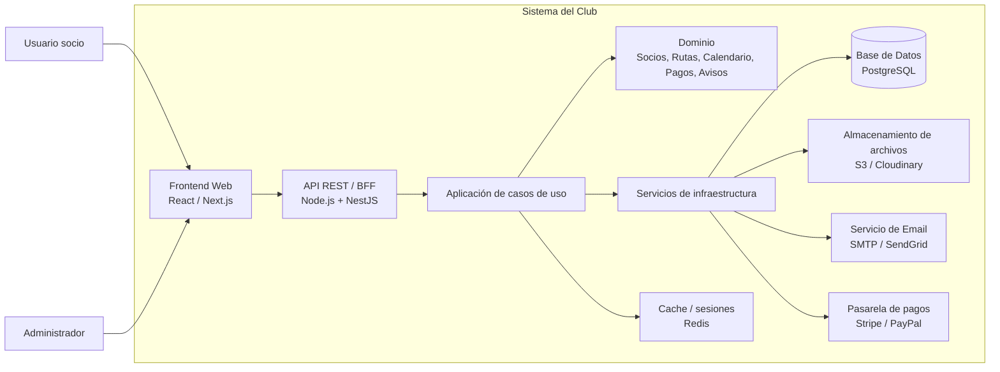
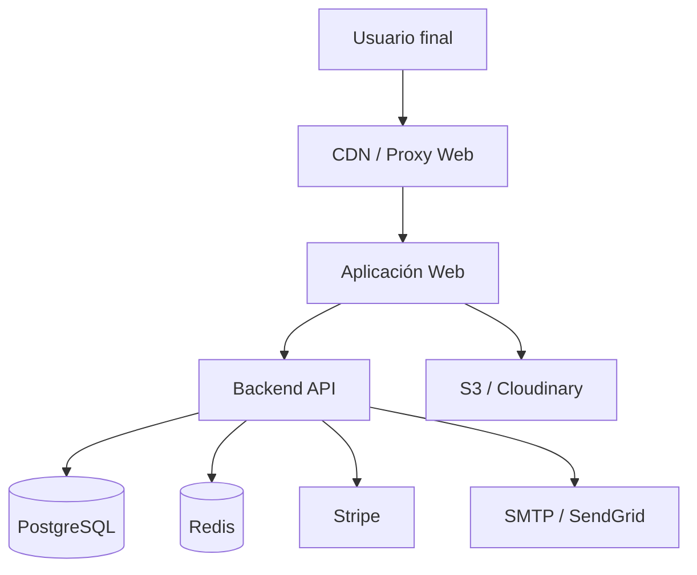

# Arquitectura del sistema — Frapen Angels

## 1. Alcance y contexto del sistema

A partir de la funcionalidad descrita en el punto 1.2 del README, el sistema debe soportar:

- inscripción y gestión de perfiles de socios;
- consulta del calendario de actividades;
- visualización de la galería de rutas;
- publicación, consulta y seguimiento de rutas realizadas;
- pasarela de pago asociada a rutas con alojamiento o restaurante;
- panel administrativo para gestionar rutas, avisos y envío de correos.

Este conjunto de funciones presenta un dominio claramente cohesivo: el club, sus socios y sus actividades. Por ello, la arquitectura propuesta se centra en una solución con un único motor de ejecución, modular y organizada por capas funcionales, en lugar de distribuir la lógica en microservicios independientes.

---

## 2. Patrón arquitectónico propuesto

### 2.1. Elección: monolito modular con capas y puertos/adaptadores

Se propone una arquitectura de tipo monolito modular, organizada en capas:

- capa de presentación (frontend);
- capa de aplicación o casos de uso;
- capa de dominio;
- capa de infraestructura y acceso a datos;
- servicios externos (pagos, correo, almacenamiento de media).

Además, se adoptan principios de puertos y adaptadores para desacoplar la lógica de negocio de la tecnología concreta de persistencia, notificaciones y pagos.

### 2.2. Justificación

La razón principal es que el proyecto combina varias funcionalidades relacionadas entre sí, pero no requiere todavía un crecimiento tan alto ni un aislamiento tan fuerte entre dominios como para justificar varios servicios desplegados por separado.

En un proyecto de este tipo, una arquitectura de monolito modular aporta:

- una base de desarrollo más ágil;
- un despliegue único y más sencillo;
- una trazabilidad del dato más clara entre UI, dominio y persistencia;
- una ejecución transaccional más natural para operaciones como la inscripción, el cobro y la creación de rutas.

---

## 3. Diagrama de arquitectura



### 3.1. Interpretación del diagrama

- El frontend se encarga de la experiencia de navegación del socio y del administrador.
- La API o BFF centraliza las peticiones del cliente y orquesta la lógica de negocio.
- El dominio concentra las reglas propias del negocio: inscripción, rutas, calendario, pagos y avisos.
- La infraestructura abstrae la interacción con almacenamiento persistente, correo, pagos y carga de medios.

---

## 4. Descripción de componentes principales

### 4.1. Frontend

Tecnología sugerida:

- React o Next.js

Responsabilidad:

- ofrecer la experiencia web para socios;
- renderizar calendario, galería, perfil, rutas y panel administrativo;
- integrar flujos de autenticación y pagos con la API.

### 4.2. API / Backend

Tecnología sugerida:

- Node.js con NestJS o Express

Responsabilidad:

- exponer endpoints REST para socios, rutas, calendario, administración y pagos;
- validar permisos según rol;
- coordinar casos de uso y orquestar integraciones externas.

### 4.3. Capa de dominio

Responsabilidad:

- representar las reglas del negocio: inscripción, acceso a rutas, validación del perfil, gestión de pagos, envío de avisos.
- mantener las entidades y los servicios centralizados.

### 4.4. Persistencia

Tecnología sugerida:

- PostgreSQL

Responsabilidad:

- almacenar socios, rutas, calendario, pagos, incidencias, correos y estados de administración.
- soportar transacciones necesarias para procesos de alta y pago.

### 4.5. Almacenamiento de media

Tecnología sugerida:

- S3-compatible storage o Cloudinary

Responsabilidad:

- guardar imágenes de rutas y galerías;
- servir contenido optimizado y reducir carga en el backend.

### 4.6. Notificaciones y correo

Tecnología sugerida:

- SMTP o SendGrid

Responsabilidad:

- enviar avisos sobre próximas rutas, recordatorios y comunicaciones administrativas.

### 4.7. Pasarela de pagos

Tecnología sugerida:

- Stripe

Responsabilidad:

- gestionar cobros asociados a rutas con hotel o restaurante;
- devolver estados de pago para confirmar disponibilidad y reserva.

### 4.8. Capa de caché y sesiones

Tecnología sugerida:

- Redis

Responsabilidad:

- agilizar autenticación y sesiones;
- cachear datos frecuentes como calendario, rutas destacadas o contenido público.

---

## 5. Beneficios principales del patrón elegido

La arquitectura de monolito modular aporta ventajas muy claras para este proyecto:

1. Menor complejidad operativa
   - un único despliegue;
   - una sola base de datos principal;
   - menos puntos de fallo y menos coordinación entre equipos.

2. Desarrollo más rápido
   - el dominio es integrado y no necesita interfaz entre múltiples servicios;
   - las funcionalidades están muy relacionadas entre sí.

3. Mejor trazabilidad transaccional
   - una operación como "inscribir socio + pagar + crear avisos" puede gestionarse con una sola transacción o con un flujo gobernado por el backend.

4. Facilidad de evolución
   - si más adelante el proyecto crece, se pueden extraer módulos o servicios específicos sin romper completamente el sistema.

5. Mantener una sola lógica de seguridad y permisos
   - simplifica el control de accesos y la auditoría.

---

## 6. Déficits o sacrificios de esta decisión

Aunque la solución es adecuada para el alcance inicial, presenta algunos límites:

1. Escala vertical más que horizontal
   - cuando el número de socios o las peticiones crezca mucho, el monolito puede convertirse en un cuello de botella.

2. Acoplamiento funcional si no se modulariza bien
   - si el desarrollo no separa claramente dominios, el backend puede volverse difícil de mantener.

3. Menor aislamiento de fallos
   - un problema en un módulo puede afectar al conjunto, aunque el patrón modular ayuda a reducirlo.

4. Evolución más lenta hacia microservicios
   - la separación posterior a servicios requiere reestructuración y cambios en despliegue y observabilidad.

---

## 7. Arquitectura de despliegue propuesta



### 7.1. Despliegue recomendado

- frontend y backend desplegados en una plataforma PaaS o contenedores;
- base de datos gestionada en PostgreSQL;
- almacenamiento de imágenes en S3-compatible o Cloudinary;
- integración de pagos y correo a través de servicios externos;
- configuración de entornos separados: desarrollo, pruebas y producción.

### 7.2. Proceso de despliegue

1. commit y validación en CI;
2. ejecución de tests automatizados;
3. build de frontend y backend;
4. migraciones de base de datos;
5. despliegue a entorno de pruebas;
6. validación funcional;
7. despliegue a producción con política de release controlada.

---

## 8. Estructura de alto nivel del proyecto

Una estructura recomendada para este sistema, siguiendo un monolito modular, sería la siguiente:

```text
src/
  app/
    admin/
    auth/
    calendar/
    gallery/
    routes/
    payments/
    notifications/
  domain/
    members/
    routes/
    activities/
    payments/
    notifications/
  infrastructure/
    persistence/
    storage/
    mail/
    payments/
  shared/
    config/
    utils/
    security/
public/
  assets/
  media/
config/
  env/
  deployment/
  ci/
```

### 8.1. Propósito de las carpetas principales

- `src/app`: contiene el nivel de presentación y la coordinación de las rutas e interfaces de usuario.
- `src/domain`: encapsula las entidades, reglas y casos de negocio del club.
- `src/infrastructure`: organiza adaptadores para base de datos, correo, medios y pagos.
- `src/shared`: reutiliza utilidades, políticas de seguridad y configuración centralizada.
- `public/`: recursos públicos, assets y media estáticos.
- `config/`: entorno, CI/CD y parámetros de despliegue.

Este patrón responde bien a una arquitectura modular monolítica, donde cada dominio funcional se puede agrupar sin forzar la distribución por servicios.

---

## 9. Seguridad

La seguridad debe tratarse como un eje transversal en la solución. Las buenas prácticas recomendadas son:

1. Autenticación y autorización por roles
   - socios y administradores con permisos diferenciados;
   - control de acceso a rutas administrativas y a operaciones de pago.

2. Protecciones en la API
   - validación de entrada;
   - prevención de inyección SQL y XSS;
   - uso de tokens firmados o sesiones seguras.

3. Almacenamiento seguro de credenciales
   - variables de entorno para secretos;
   - no persistir claves ni tokens en repositorio.

4. Protección de pagos
   - no manejar datos financieros directamente en el frontend;
   - comunicar la pasarela de pago mediante flujo seguro y confirmación de estado en backend.

5. Observabilidad y trazabilidad
   - registro de accesos, errores y cambios relevantes;
   - auditoría para operaciones administrativas.

---

## 10. Tests

La validación del sistema debe contemplar varios niveles:

1. Tests unitarios
   - validan reglas de negocio en el dominio: precios, restricciones de inscripción, fechas, permisos.

2. Tests de integración
   - comprueban la comunicación entre backend, base de datos y servicios externos simulados o controlados.

3. Tests de API
   - verifican endpoints principales como login, creación de rutas, consulta de calendario y cobro.

4. Tests e2e
   - validan flujos completos del usuario: registro, navegación, pago y gestión administrativa.

Se recomienda automatizar estos tests en la pipeline de CI para asegurar que cada cambio no rompa el comportamiento esencial del sistema.

---

## 11. Conclusión

La arquitectura propuesta para Frapen Angels responde de forma pragmática al alcance funcional definido en el README. Un monolito modular con capas bien definidas permite construir el producto con rapidez, mantener la coherencia del dominio y reducir la complejidad operativa inicial.

El principal beneficio es la capacidad de ofrecer una solución completa, real y mantenible con una base tecnológica sólida, y el principal sacrificio es que, en el futuro, si la carga crece o se multiplica la complejidad del negocio, será necesario refactorizar hacia una arquitectura distribuida.
