# Modelo de datos de Frapen Angels

Este documento describe el modelo de persistencia propuesto para la aplicación del club Frapen Angels, alineado con la arquitectura definida en [documentos/arquitectura.md](arquitectura.md) y con los requisitos de negocio recogidos en [readme.md](../readme.md).

El dominio funcional identificado es el siguiente:

- Gestión de perfiles y autenticación de socios.
- Consulta y publicación de rutas realizadas o programadas.
- Visualización del calendario de actividades.
- Galería asociada a rutas y contenido visual.
- Cobro y trazabilidad de pagos en rutas con alojamiento o restaurante.
- Administración de rutas, avisos y envío de comunicaciones.

La base de datos se modelo como un único esquema relacional PostgreSQL, siguiendo el monolito modular propuesto por la arquitectura.

---

## 1. Diagrama Mermaid del modelo de datos

```mermaid
erDiagram
    ROLES ||--o{ MEMBERS : "role_id"
    MEMBERS ||--o{ ROUTE_REGISTRATIONS : "member_id"
    ROUTES ||--o{ ROUTE_REGISTRATIONS : "route_id"
    MEMBERS ||--o{ PAYMENTS : "member_id"
    ROUTES ||--o{ PAYMENTS : "route_id"
    MEMBERS ||--o{ NOTIFICATIONS : "member_id"
    ADMIN_USERS ||--o{ NOTIFICATIONS : "created_by"
    ROUTES ||--o{ NOTIFICATIONS : "route_id"
    ROUTES ||--o{ ROUTE_MEDIA : "route_id"
    ROUTES ||--o{ CALENDAR_EVENTS : "route_id"
    ADMIN_USERS ||--o{ ROUTES : "created_by"
    ADMIN_USERS ||--o{ CALENDAR_EVENTS : "created_by"

    ROLES {
        UUID role_id PK
        VARCHAR role_name UK "SOCIO, ADMIN, etc."
        JSONB permissions
        TIMESTAMP created_at
        TIMESTAMP updated_at
    }

    MEMBERS {
        UUID member_id PK
        UUID role_id FK "FK -> roles.role_id"
        VARCHAR email UK "not null"
        VARCHAR password_hash "not null"
        VARCHAR first_name "not null"
        VARCHAR last_name "not null"
        VARCHAR dni UK
        DATE birth_date
        VARCHAR phone
        VARCHAR address
        VARCHAR city
        VARCHAR postal_code
        VARCHAR membership_number UK
        VARCHAR status "ACTIVE, INACTIVE, BLOCKED"
        TIMESTAMP created_at
        TIMESTAMP updated_at
        TIMESTAMP last_login_at
    }

    ADMIN_USERS {
        UUID admin_id PK
        UUID member_id FK "FK -> members.member_id, opcional"
        VARCHAR username UK "not null"
        VARCHAR email UK "not null"
        VARCHAR password_hash "not null"
        VARCHAR status "ACTIVE, INACTIVE"
        TIMESTAMP created_at
        TIMESTAMP updated_at
    }

    ROUTES {
        UUID route_id PK
        UUID created_by FK "FK -> admin_users.admin_id"
        VARCHAR title "not null"
        TEXT description
        VARCHAR difficulty "EASY, MEDIUM, HARD"
        DECIMAL distance_km
        VARCHAR meeting_point
        VARCHAR status "DRAFT, PUBLISHED, COMPLETED, CANCELLED"
        DATE departure_date
        TIME departure_time
        DATE return_date
        BOOLEAN has_lodging
        BOOLEAN has_restaurant
        DECIMAL base_price
        DECIMAL lodging_price
        DECIMAL restaurant_price
        DECIMAL total_price
        JSONB route_data "info extra"
        TIMESTAMP created_at
        TIMESTAMP updated_at
    }

    ROUTE_MEDIA {
        UUID media_id PK
        UUID route_id FK "FK -> routes.route_id"
        VARCHAR media_type "IMAGE, VIDEO"
        VARCHAR file_url "not null"
        VARCHAR cloud_key
        VARCHAR caption
        BOOLEAN is_cover
        UUID uploaded_by FK "FK -> admin_users.admin_id"
        TIMESTAMP created_at
    }

    CALENDAR_EVENTS {
        UUID event_id PK
        UUID route_id FK "FK -> routes.route_id, nullable"
        UUID created_by FK "FK -> admin_users.admin_id"
        VARCHAR title "not null"
        TEXT description
        TIMESTAMP start_at "not null"
        TIMESTAMP end_at
        VARCHAR location
        VARCHAR status "SCHEDULED, DONE, CANCELLED"
        INTEGER capacity
        TIMESTAMP created_at
        TIMESTAMP updated_at
    }

    ROUTE_REGISTRATIONS {
        UUID registration_id PK
        UUID route_id FK "FK -> routes.route_id"
        UUID member_id FK "FK -> members.member_id"
        VARCHAR registration_status "PENDING, CONFIRMED, CANCELLED, COMPLETED"
        INTEGER companions
        DECIMAL amount_due
        DECIMAL amount_paid
        TIMESTAMP created_at
        TIMESTAMP updated_at
    }

    PAYMENTS {
        UUID payment_id PK
        UUID member_id FK "FK -> members.member_id"
        UUID route_id FK "FK -> routes.route_id"
        UUID registration_id FK "FK -> route_registrations.registration_id, nullable"
        VARCHAR provider "STRIPE, PAYPAL, MANUAL"
        VARCHAR provider_payment_id UK
        VARCHAR status "PENDING, PAID, FAILED, REFUNDED"
        DECIMAL amount "not null"
        VARCHAR currency "EUR"
        TIMESTAMP created_at
        TIMESTAMP paid_at
        JSONB provider_payload
    }

    NOTIFICATIONS {
        UUID notification_id PK
        UUID route_id FK "FK -> routes.route_id, nullable"
        UUID created_by FK "FK -> admin_users.admin_id"
        VARCHAR title "not null"
        TEXT body "not null"
        VARCHAR type "ROUTE, GENERAL, REMINDER"
        VARCHAR status "DRAFT, SENT, FAILED"
        TIMESTAMP scheduled_at
        TIMESTAMP sent_at
        TIMESTAMP created_at
    }

    NOTIFICATION_RECIPIENTS {
        UUID notification_recipient_id PK
        UUID notification_id FK "FK -> notifications.notification_id"
        UUID member_id FK "FK -> members.member_id"
        VARCHAR delivery_status "PENDING, SENT, OPENED, FAILED"
        TIMESTAMP delivered_at
        TIMESTAMP read_at
    }

    AUDIT_LOGS {
        UUID audit_id PK
        UUID actor_member_id FK "FK -> members.member_id, nullable"
        UUID actor_admin_id FK "FK -> admin_users.admin_id, nullable"
        VARCHAR entity_type
        UUID entity_id
        VARCHAR action "CREATE, UPDATE, DELETE, PAYMENT, SEND_EMAIL"
        JSONB payload
        TIMESTAMP created_at
    }
```

### Notas de diseño

- La entidad `members` representa el perfil principal de los socios. También puede ser reutilizada para autenticación, control de acceso y trazabilidad de actividades.
- La entidad `admin_users` permite separar el acceso administrativo del perfil principal del socio. En una implementación real puede ser un perfil bajo la misma tabla de usuario, pero el diseño lo expresa de forma explícita para mantener el control de permisos.
- Las rutas están relacionadas con una política de publicación y con precio y disponibilidad.
- `route_registrations` es la tabla de inscripción de socio a ruta.
- `payments` se asocia al socio, a la ruta y a la inscripción como una operación de cobro transaccional.
- `notifications` y `notification_recipients` permiten la administración de comunicaciones y el envío de avisos a socios.
- `audit_logs` recoge operaciones relevantes y ayuda a la seguridad y a la observabilidad.

---

## 2. Descripción de las entidades principales

### 2.1. `roles`

Tabla de referencia para perfiles y permisos dentro del sistema.

Atributos:

- `role_id`: UUID, identificador primario. Identifica un rol de acceso del usuario.
- `role_name`: texto no nulo, nombre del rol. Valores esperados: `SOCIO`, `ADMIN`, `SUPERADMIN`, etc.
- `permissions`: JSONB con los permisos aplicables al rol.
- `created_at`: marca de tiempo de creación.
- `updated_at`: marca de tiempo de última modificación.

Relaciones:

- Un `role` puede estar asociado a varios `members` (`roles` 1:N `members`).

Restricciones:

- `role_name` debe ser único.

---

### 2.2. `members`

Entidad principal del dominio del socio.

Atributos:

- `member_id`: UUID, clave primaria.
- `role_id`: UUID, clave foránea a `roles.role_id`.
- `email`: correo electrónico único para autenticación y contacto.
- `password_hash`: hash de contraseña almacenado con política segura.
- `first_name`: nombre del socio.
- `last_name`: apellidos.
- `dni`: documento de identidad, índice único si se desea una relación fuerte con identidad.
- `birth_date`: fecha de nacimiento.
- `phone`: teléfono de contacto.
- `address`: dirección postal.
- `city`: ciudad postal.
- `postal_code`: código postal.
- `membership_number`: número interno de socio, único.
- `status`: estado del perfil, con valores `ACTIVE`, `INACTIVE`, `BLOCKED`.
- `created_at`, `updated_at`, `last_login_at`: trazabilidad y seguridad.

Relaciones:

- Un socio pertenece a un rol.
- Un socio puede registrarse en varias rutas.
- Un socio puede generar varios pagos y recibir varios avisos.

Restricciones:

- Email único.
- Dni único si aplica en el negocio.
- Membership number único.
- Email y `password_hash` no nulos.
- Se recomienda `status` con control de dominio y `CHECK` para limitar valores válidos.

---

### 2.3. `admin_users`

Representa los perfiles habilitados para administrar la plataforma.

Atributos:

- `admin_id`: UUID, clave primaria.
- `member_id`: UUID, clave foránea a `members.member_id` (opcional pero útil para vincular una cuenta administrativa con un perfil socio existente).
- `username`: nombre de acceso del administrador, único.
- `email`: correo de administración, único.
- `password_hash`: hash de credencial.
- `status`: estado de habilitación.
- `created_at`, `updated_at`: trazabilidad.

Relaciones:

- Un `admin_user` puede crear rutas, eventos del calendario y avisos.
- Un `admin_user` puede ser auditor de cambios o responsable de operaciones del panel administrativo.

Restricciones:

- `username` y `email` únicos.
- `password_hash` no nulo.

---

### 2.4. `routes`

Entidad central del negocio de rutas y actividades del club.

Atributos:

- `route_id`: UUID, clave primaria.
- `created_by`: UUID, clave foránea a `admin_users.admin_id`.
- `title`: título de la ruta.
- `description`: texto descriptivo.
- `difficulty`: nivel de dificultad, con opciones como `EASY`, `MEDIUM`, `HARD`.
- `distance_km`: distancia de la ruta.
- `meeting_point`: punto de encuentro.
- `status`: `DRAFT`, `PUBLISHED`, `COMPLETED`, `CANCELLED`.
- `departure_date`, `departure_time`: fecha y hora de salida.
- `return_date`: fecha estimada de regreso.
- `has_lodging`, `has_restaurant`: banderas de servicios complementarios.
- `base_price`: precio base de la ruta.
- `lodging_price`: coste de alojamiento asociado.
- `restaurant_price`: coste del restaurante asociado.
- `total_price`: precio total calculado.
- `route_data`: JSONB para criterios de cálculo o información adicional.
- `created_at`, `updated_at`: trazabilidad.

Relaciones:

- La ruta es creada por un administrador.
- La ruta puede tener varias imágenes y varios eventos de calendario.
- La ruta puede generar varias inscripciones y pagos.
- La ruta puede asociar avisos y comunicaciones.

Restricciones:

- `title` no nulo.
- `status` restringido por `CHECK`.
- `total_price` permitir validación consistente con los precios parciales.

---

### 2.5. `route_media`

Colección de imágenes o vídeos asociados a una ruta para su galería.

Atributos:

- `media_id`: UUID, clave primaria.
- `route_id`: UUID, clave foránea a `routes.route_id`.
- `media_type`: tipo de archivo (`IMAGE`, `VIDEO`).
- `file_url`: URL pública o privada donde se sirve el contenido.
- `cloud_key`: clave identificativa del recurso en un proveedor externo.
- `caption`: leyenda visual.
- `is_cover`: bandera para foto principal de la ruta.
- `uploaded_by`: UUID con clave foránea a `admin_users.admin_id`.
- `created_at`: fecha de carga.

Relaciones:

- Una ruta puede tener muchas imágenes/videos.
- Una media es subida por un administrador.

Restricciones:

- `file_url` no nulo.
- `route_id` no nulo.

---

### 2.6. `calendar_events`

Representa una entrada en el calendario de actividades del club.

Atributos:

- `event_id`: UUID, clave primaria.
- `route_id`: UUID, clave foránea a `routes.route_id`, puede ser nulo si el evento no corresponde exactamente con una ruta.
- `created_by`: UUID, clave foránea a `admin_users.admin_id`.
- `title`: nombre del evento.
- `description`: texto descriptivo.
- `start_at`, `end_at`: fecha y hora de inicio y fin.
- `location`: lugar del evento.
- `status`: `SCHEDULED`, `DONE`, `CANCELLED`.
- `capacity`: número de plazas disponibles para la actividad.
- `created_at`, `updated_at`: trazabilidad.

Relaciones:

- Un evento puede estar asociado a una ruta o ser independiente.
- Se crea desde administración.

Restricciones:

- `start_at` no nulo.
- El `status` puede controlarse mediante `CHECK`.

---

### 2.7. `route_registrations`

Entidad de inscripción o participación del socio en la ruta.

Atributos:

- `registration_id`: UUID, clave primaria.
- `route_id`: UUID, clave foránea a `routes.route_id`.
- `member_id`: UUID, clave foránea a `members.member_id`.
- `registration_status`: estado de la inscripción. Valores: `PENDING`, `CONFIRMED`, `CANCELLED`, `COMPLETED`.
- `companions`: número de acompañantes que reserva/consulta el socio.
- `amount_due`: importe pendiente.
- `amount_paid`: importe ya abonado.
- `created_at`, `updated_at`: trazabilidad.

Relaciones:

- Cada inscripción asocia un socio con una ruta.
- Una inscripción puede tener asociados varios pagos.

Restricciones:

- La combinación `route_id + member_id` puede tener una restricción de unicidad para evitar duplicados.
- `amount_due` y `amount_paid` en validación monetaria.

---

### 2.8. `payments`

Entidad de control del proceso de cobro asociado a una ruta o actividad.

Atributos:

- `payment_id`: UUID, clave primaria.
- `member_id`: UUID, clave foránea a `members.member_id`.
- `route_id`: UUID, clave foránea a `routes.route_id`.
- `registration_id`: UUID, clave foránea a `route_registrations.registration_id`, si el pago se ha asociado a una inscripción.
- `provider`: proveedor externo de pago (`STRIPE`, `PAYPAL`, `MANUAL`).
- `provider_payment_id`: identificador externo del intento/cobro.
- `status`: `PENDING`, `PAID`, `FAILED`, `REFUNDED`.
- `amount`: importe del pago.
- `currency`: moneda usada en el cobro.
- `created_at`: fecha de creación del pago.
- `paid_at`: fecha de confirmación del cobro.
- `provider_payload`: JSONB con el payload de la pasarela.

Relaciones:

- Un pago está vinculado a un socio.
- Un pago puede estar asociado a una ruta concreta.
- Un pago puede vincularse a una inscripción.

Restricciones:

- `provider_payment_id` debe ser único si se utiliza como identificador externo.
- `amount` no puede ser negativo.
- `currency` con `CHECK` si se desea limitar a códigos ISO.

---

### 2.9. `notifications`

Entidad de avisos enviados o programados para socios.

Atributos:

- `notification_id`: UUID, clave primaria.
- `route_id`: UUID, clave foránea a `routes.route_id`, opcional.
- `created_by`: UUID, clave foránea a `admin_users.admin_id`.
- `title`: título del aviso.
- `body`: contenido del mensaje.
- `type`: tipo de comunicación (`ROUTE`, `GENERAL`, `REMINDER`).
- `status`: estado de publicación o envío (`DRAFT`, `SENT`, `FAILED`).
- `scheduled_at`: fecha de programación del envío.
- `sent_at`: fecha de entrega efectiva.
- `created_at`: fecha de creación del aviso.

Relaciones:

- Un aviso puede estar asociado a una ruta concreta.
- Un aviso puede ser creado por un administrador.
- Un aviso puede ser entregado a varios socios.

Restricciones:

- `title`, `body` y `created_by` no nulos.

---

### 2.10. `notification_recipients`

Entidad de reparto de mensajes a cada socio.

Atributos:

- `notification_recipient_id`: UUID, clave primaria.
- `notification_id`: UUID, clave foránea a `notifications.notification_id`.
- `member_id`: UUID, clave foránea a `members.member_id`.
- `delivery_status`: estado de entrega (`PENDING`, `SENT`, `OPENED`, `FAILED`).
- `delivered_at`: fecha de envío al socio.
- `read_at`: fecha de lectura o consumo del mensaje.

Relaciones:

- Un aviso está asociado a múltiples destinatarios.
- Cada socio puede recibir varios avisos.

Restricciones:

- La combinación `notification_id + member_id` puede ser única.

---

### 2.11. `audit_logs`

Registro de acciones de negocio y de seguridad.

Atributos:

- `audit_id`: UUID, clave primaria.
- `actor_member_id`: UUID, clave foránea a `members.member_id` cuando el actor es un socio.
- `actor_admin_id`: UUID, clave foránea a `admin_users.admin_id` cuando el actor es administrador.
- `entity_type`: entidad sobre la que se actúa.
- `entity_id`: identificador de la entidad afectada.
- `action`: operación de la auditoría.
- `payload`: JSONB con el detalle del cambio.
- `created_at`: marca temporal.

Relaciones:

- Registra acciones del socio o la administración.

Restricciones:

- Debe existir al menos un actor en el registro.
- `entity_type` y `action` pueden limitarse a un conjunto de valores controlado.

---

## 3. Consideraciones para implementación

El modelo anterior permite cubrir el flujo de negocio principal:

1. El socio se registra y se crea su perfil en `members`.
2. El administrador gestiona rutas en `routes` y media asociada en `route_media`.
3. El calendario se refleja en `calendar_events`.
4. El socio realiza una inscripción en `route_registrations`.
5. El cobro se materializa en `payments` junto con el flujo de pasarela.
6. Los avisos se preparan en `notifications` y se distribuyen en `notification_recipients`.
7. Las operaciones de administración se trazan con `audit_logs`.

Este diseño es coherente con la arquitectura monolítica modular propuesta y puede ser implementado sobre PostgreSQL, usando migraciones y soporte de transacciones para los servicios de pago y correo.
