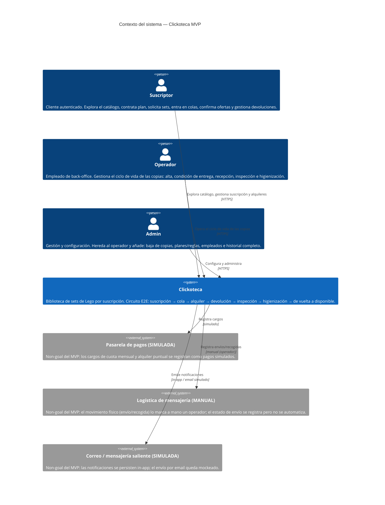
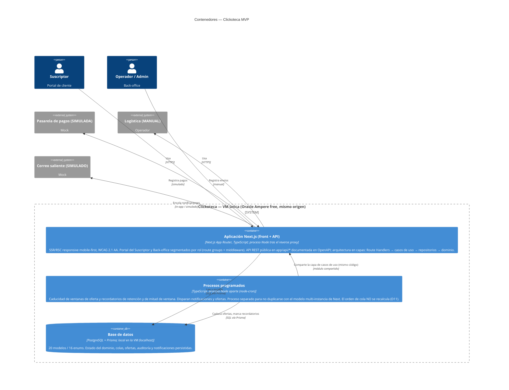
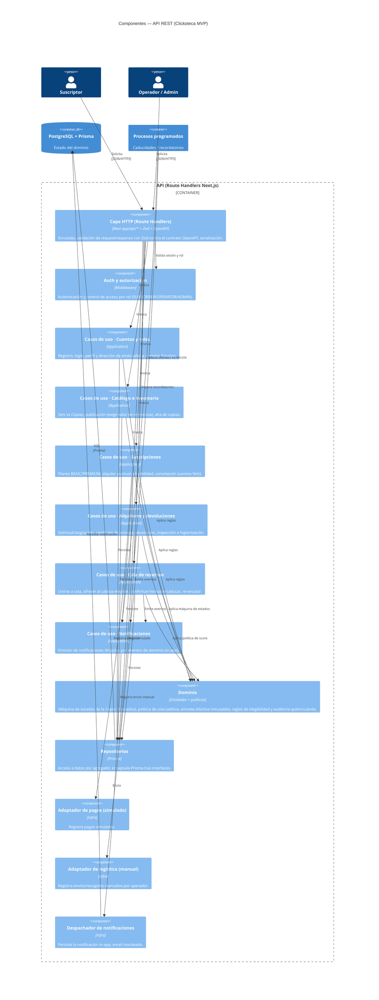

# Arquitectura C4 — Clickoteca MVP

> **Estado:** borrador para revisión. Derivado de los specs de
> `openspec/changes/clickoteca-mvp/` (`proposal.md`, `design.md`, `specs/*`),
> del modelo de datos de `documents/PRD.md` §15 y de las decisiones de stack
> registradas en `AGENTS.md`.
>
> Los diagramas siguen el [modelo C4](https://c4model.com/) (Contexto →
> Contenedores → Componentes) en notación Mermaid. Se documentan los niveles 1
> a 3; el nivel 4 (código) se omite por convención C4 (lo cubre el propio código
> y `prisma/schema.prisma`).
>
> **Stack confirmado:** **Next.js full-stack** (App Router, TypeScript) para
> front + API REST (Route Handlers en `app/api/*`, OpenAPI), **PostgreSQL +
> Prisma**, scheduler en proceso aparte. **Hosting** en VM única Oracle Ampere
> free, mismo origen (`ADR-0001` §2 y §5). No quedan *Open questions* de
> arquitectura.
>
> Última actualización: 2026-07-05.

---

## 1. Nivel 1 — Diagrama de contexto del sistema

Enmarca **quién** usa Clickoteca y con **qué sistemas externos** interactúa. En
el MVP los tres sistemas externos están **simulados** (pagos, logística y
correo son *non-goals*, ver `proposal.md`): se dibujan para fijar la frontera
real del producto, pero su implementación es un mock o una acción manual del
operador.

**Notas de contexto**

- Cada cuenta tiene **exactamente un rol** (`SUBSCRIBER | OPERATOR | ADMIN`);
  `Admin` hereda las capacidades de `Operador` (ver PRD §14.2 y `design.md` D6).
- La frontera de los tres sistemas externos es real de cara a una futura
  producción, pero en el MVP su implementación es simulada/manual: por eso el
  valor de referencia del Set y el registro de condición de entrega se guardan
  ya (base documental de una reclamación futura), aunque no se cobren
  penalizaciones (`design.md` D8, D9).

---

## 2. Nivel 2 — Diagrama de contenedores

Descompone Clickoteca en unidades lógicas. El stack está confirmado: **Next.js
full-stack** (App Router) sirve front + API REST (OpenAPI) sobre **PostgreSQL +
Prisma**, con un **scheduler** en proceso aparte. Los procesos **conviven en una
única VM** (Oracle Ampere free, mismo origen — ver `ADR-0001` §5): la app Next y
el scheduler son dos procesos Node; Postgres corre local.

**Notas de contenedores**

- **App Next.js única con dos superficies.** El PRD modela dos caras (Portal del
  Suscriptor y Back-office, §14.1/§14.2); se implementan en **un solo proyecto
  Next** (App Router) con **route groups + middleware** por rol. El
  *code-splitting* por ruta lo da Next de serie: el código de back-office no viaja
  al navegador del suscriptor sin autorización. La API pública vive en el mismo
  proyecto (`app/api/*`, Route Handlers REST + OpenAPI). La capa compartida
  (tipos, dominio, cliente OpenAPI) se factoriza para dejar barata una futura
  extracción de la API. Ver `ADR-0001` §2–§3.
- **Scheduler.** Solo cubre eventos **genuinamente temporales**: la gestión de la
  ventana de confirmación (D5, UC-P16/17) y los recordatorios (D7). El **orden de
  cola ya no se recalcula** — se deriva de forma *lazy* sobre `entrada_efectiva`
  inmutable (`design.md` D11 revisado), así que el antiguo "recálculo de score"
  desaparece del scheduler. Corre como **proceso Node aparte** (`node-cron`) en la
  misma VM —**no** in-process en Next: su modelo multi-instancia duplicaría el
  cron—; reutiliza la misma capa de casos de uso importándola como módulo.
- **Hosting (decidido):** **VM única** con IP pública en **Oracle Cloud Free Tier**
  (Ampere A1 / ARM64, 2 OCPU · 12 GB · 50 GB). Un reverse proxy (Caddy) termina TLS
  y enruta al servidor Next (front + `/api`); Postgres corre en `localhost`; las
  imágenes viven en el filesystem. **Mismo origen** → sin CORS y cookie de sesión
  *first-party* (`ADR-0002`). Alternativas descartadas y trade-offs (ops propio,
  punto único de fallo, plan B Hetzner) en `ADR-0001` §5.

---

## 3. Nivel 3 — Diagrama de componentes de la API (Route Handlers de Next.js)

Detalle interno de la **capa API** de la app Next (Route Handlers en `app/api/*`),
siguiendo la arquitectura en capas declarada (Route Handlers → casos de uso →
repositorios → dominio) y organizado por las seis *capabilities* de los specs. Se
aplican SOLID/CUPID/DRY sin DI pesado. El dominio y los casos de uso son módulos
TS agnósticos de Next (los reutilizan tanto los Route Handlers como el scheduler).

**Notas de componentes**

- **Corte por capability + capas.** Cada slice de `specs/*` tiene su grupo de
  casos de uso; todos comparten el **dominio** (máquina de estados de la copia y
  política de score) y los **repositorios** Prisma. Es la traducción directa de
  "rutas → casos de uso → repositorios → dominio" de `AGENTS.md`.
- **El dominio concentra las invariantes.** La transición de estados de la
  `Copy` (guardada por *compare-and-swap*, `design.md` D12) y la política de cola
  (`score = días_esperando + bono_plan`, congelada en `entrada_efectiva` al
  encolar, D11) viven en el dominio, no en los controllers ni en SQL, para que
  sean testables de forma aislada (criterio de tests de caminos de error, PRD §10).
- **El scheduler reutiliza casos de uso.** No duplica lógica: importa los mismos
  casos de uso de cola/notificaciones que la API, coherente con que corra como
  proceso Node aparte que comparte esa capa (nivel 2).
- **Adaptadores de infraestructura** aíslan lo simulado (pagos, logística,
  email): sustituirlos por integraciones reales en el futuro no toca el dominio.

---

## 4. Trazabilidad specs ↔ componentes

| Capability (`specs/*`)   | Casos de uso PRD          | Componente API (nivel 3)                  |
|--------------------------|---------------------------|-------------------------------------------|
| `accounts-roles`         | UC-P03/P04/P11, UC-B08/B13/B14 | Casos de uso · Cuentas y roles       |
| `catalog-inventory`      | UC-P01/P02, UC-B02        | Casos de uso · Catálogo e inventario      |
| `subscriptions`          | UC-P05/P14, UC-B10/B11    | Casos de uso · Suscripciones              |
| `rentals-returns`        | UC-P06/P12/P13, UC-B03–B07/B09 | Casos de uso · Alquileres y devoluciones |
| `reservation-queue`      | UC-P07/P08/P09/P15/P16/P17 | Casos de uso · Cola de reservas + scheduler |
| `notifications`          | UC-P18, UC-B12            | Casos de uso · Notificaciones + despachador |

---

## 5. Decisiones de arquitectura relacionadas

- Decisiones **de dominio** (D1–D13, incl. concurrencia por CAS, orden de cola
  inmutable y visitante no autenticado): `openspec/changes/clickoteca-mvp/design.md`.
- Decisiones **de arquitectura de la aplicación** (stack, capas, hosting,
  scheduler): `documents/ADR-0001-arquitectura-mvp.md`.
- Decisiones **de la API** (auth por cookie de sesión, contrato de errores RFC
  9457): `documents/ADR-0002-api-auth-errores.md`.
