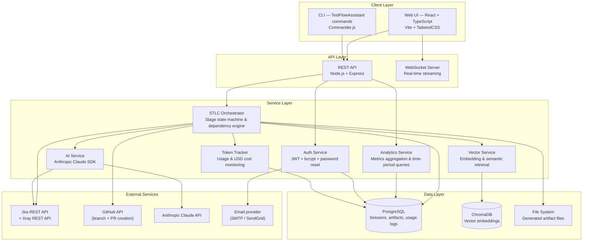
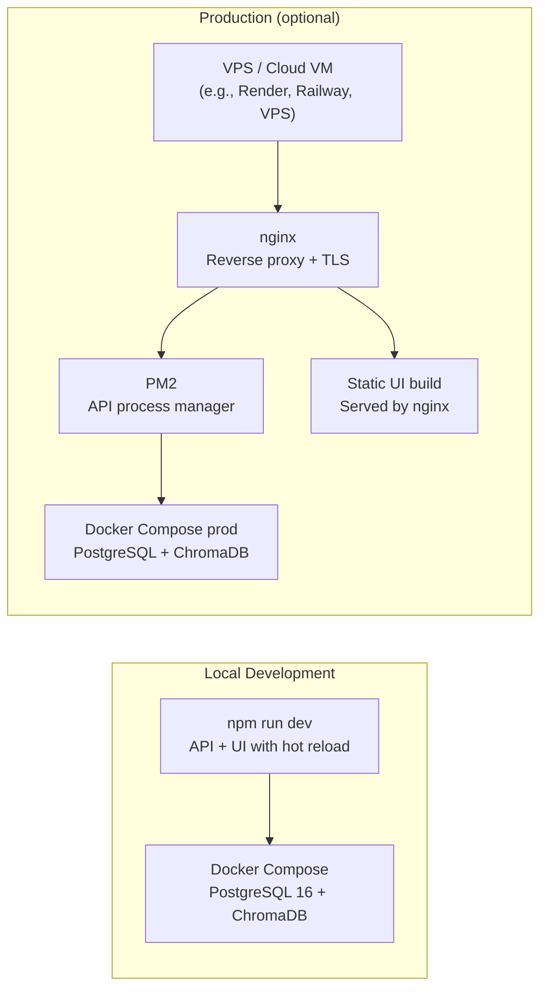
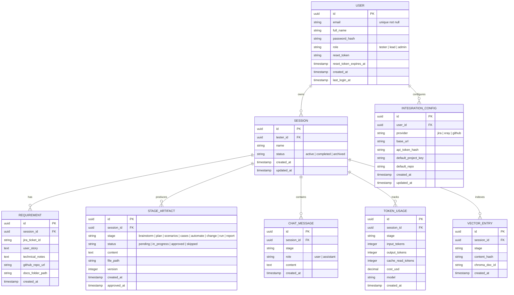

## Índice

0. [Ficha del proyecto](#0-ficha-del-proyecto)
1. [Descripción general del producto](#1-descripción-general-del-producto)
2. [Arquitectura del sistema](#2-arquitectura-del-sistema)
3. [Modelo de datos](#3-modelo-de-datos)
4. [Especificación de la API](#4-especificación-de-la-api)
5. [Historias de usuario](#5-historias-de-usuario)
6. [Tickets de trabajo](#6-tickets-de-trabajo)
7. [Pull requests](#7-pull-requests)

---

## 0. Ficha del proyecto

### **0.1. Tu nombre completo:**

Roselyn Piñango

### **0.2. Nombre del proyecto:**

**TestFlowAssistant** — AI-Powered STLC Workflow Orchestrator

### **0.3. Descripción breve del proyecto:**

TestFlowAssistant is an AI-assisted Software Testing Lifecycle (STLC) workflow orchestrator that guides testers through every stage of quality assurance — from brainstorming test strategies against Jira tickets and user stories, to generating Gherkin scenarios, automated Playwright tests, and comprehensive test reports. Available both as a CLI tool and a web-based UI, TestFlowAssistant keeps the tester in the loop through intelligent conversational interactions, a vector database for continuous learning, and built-in token usage observability on every page.

### **0.4. URL del proyecto:**

> [TestFlowAssistant](https://github.com/roselynpinango/AI4Devs-finalproject-RP)


### 0.5. URL o archivo comprimido del repositorio

> [TestFlowAssistant Repository](https://github.com/roselynpinango/AI4Devs-finalproject-RP)

> Puedes tenerlo alojado en público o en privado, en cuyo caso deberás compartir los accesos de manera segura. Puedes enviarlos a [alvaro@lidr.co](mailto:alvaro@lidr.co) usando algún servicio como [onetimesecret](https://onetimesecret.com/). También puedes compartir por correo un archivo zip con el contenido

---

## 1. Descripción general del producto

### **1.1. Objetivo:**

**TestFlowAssistant** addresses a critical gap in modern QA teams: the absence of a structured, AI-augmented toolchain that covers the _entire_ Software Testing Lifecycle while keeping the tester as the decision-maker at every step. Inspired by command-based tools like spec-kit, TestFlowAssistant extends the concept into a full STLC orchestration platform — from initial requirement analysis all the way to final test reporting.

**For whom:** QA engineers, SDETs, and test leads who want to accelerate their testing workflows without sacrificing judgment, traceability, or coverage quality.

**Value delivered:**
- Eliminates repetitive, manual STLC documentation work through AI generation
- Ensures consistency across test plans, scenarios, test cases, and automation scripts
- Prevents mechanical testing by enforcing tester interaction at each stage gate
- Provides full audit trail and observability of AI usage (tokens + USD cost per session)
- Learns continuously from past sessions via vector embeddings to improve future recommendations
- Enables team-level accountability through per-tester session ownership and audit history
- Surfaces actionable quality metrics (pass rates, defect density, false positive rates) across configurable time periods

### **1.2. Características y funcionalidades principales:**

| Stage | CLI Command | Description |
|-------|-------------|-------------|
| Brainstorm | `TestFlowAssistant test-brainstorm` | Analyzes Jira tickets, user stories, GitHub repos, and documentation folders to evaluate functional and technical impact. Opens an interactive chat for scope clarification before proceeding. |
| Test Plan | `TestFlowAssistant test-plan` | Defines testing strategy, approach, types, prerequisites, limitations, resources, and data requirements. Tester validates and approves. |
| Test Scenarios | `TestFlowAssistant test-scenarios` | Generates Gherkin `.feature` files from the approved plan using BDD best practices. |
| Test Cases | `TestFlowAssistant test-cases` | Produces structured test cases with ID, Title, Preconditions, Postconditions, Steps to Reproduce, Expected Results, Test Data, and Priority. Optional stage. |
| Test Automate | `TestFlowAssistant test-automate` | Generates Playwright automated test scripts from approved scenarios and cases. |
| Scope Change | `TestFlowAssistant test-change` | Accepts new scope inputs (functional or technical) and propagates updates across all existing STLC artifacts. Interactive clarification when needed. |
| Test Run | `TestFlowAssistant test-run` | Executes manual or automated tests (Playwright). Provides a quick results summary. |
| Test Report | `TestFlowAssistant test-report` | Generates a comprehensive Markdown report with functional, security, performance, and UX findings. Downloadable from the UI. |
| **User Management** | _(Web UI only)_ | Sign up, login, and password recovery for testers. Every session is owned by an authenticated user for full audit traceability. |
| **Session Analytics** | _(Web UI only)_ | Dashboard with testing metrics aggregated over configurable periods (week, month, quarter): % tests passed, slowest tests, most-failing scenarios, defect density, and % false positives from tester feedback. |
| **Jira/Xray Integration** | `--push-xray` flag | After `test-scenarios` or `test-cases`, presents the tester with a confirmation step showing exactly what will be pushed. Only on explicit approval does the integration push artifacts to Xray and link results back to the Jira ticket. |
| **GitHub Integration** | `--push-branch` flag | After `test-automate`, shows the tester a preview of the branch name, target repo, and files to be committed. Only on explicit approval does the integration create the branch and open the Pull Request. |

**Cross-cutting features:**
- **Tester-in-the-loop**: Every stage includes a conversational confirmation step; the pipeline cannot advance without tester approval.
- **Stage ordering enforcement**: The UI pipeline view prevents skipping stages and shows dependency status clearly.
- **Vector DB memory**: ChromaDB stores STLC configurations and learns from usage patterns to improve prompt quality over time.
- **Observability panel**: Every UI page shows real-time token usage (input/output tokens + USD cost) for the current stage and session total.
- **Dual interface**: Full CLI support alongside the React web UI — all operations are available from the terminal for CI/CD integration.
- **TDD-first codebase**: Unit, integration, and E2E tests using Jest and Playwright from day one.
- **Authentication & audit**: JWT-based auth with role support (`tester`, `lead`, `admin`); all sessions are tied to a verified user for traceability.
- **Analytics dashboard**: Aggregated metrics across sessions with time-period filters — covering test outcomes, defect density, and AI false-positive rates.
- **Jira/Xray sync (approval-gated)**: Before any push to Xray, the tester reviews a confirmation dialog showing the artifacts and target project. No data leaves the tool without explicit approval.
- **GitHub auto-PR (approval-gated)**: After `test-automate`, the tester confirms the branch name, target repository, and file list before the branch and PR are created. Rejected or cancelled — nothing is pushed.

### **1.3. Diseño y experiencia de usuario:**

> _Screenshots and demo video will be added upon initial deployment. Below is the planned UX flow:_

**Dashboard — Entry point:**
The main screen shows active STLC sessions, visual stage pipeline with current progress, and the observability panel with cumulative token usage for each session.

**Stage view — Conversational UX:**
Each stage opens a split-panel layout: the left side displays the AI-generated artifact (plan, Gherkin scenarios, Playwright scripts, etc.) with diff highlighting for revisions; the right side hosts a chat interface for the tester to refine, request changes, or approve the output before the stage is finalized.

**Downloadable artifacts:**
Every generated deliverable — `.feature` files, test cases CSV/Markdown, Playwright scripts, and the final Markdown report — is available for one-click download from its stage view.

**Integration approval flow:**
When a stage completes and an external push is available (Xray, GitHub), the chat panel shows a structured confirmation card: target system, artifact list, and destination details. The tester must click **Approve & Push** (or type `yes` in CLI) to proceed. Dismissing or ignoring the card leaves the artifacts local with no side effects.

**CLI parity:**
All features available in the UI are also accessible via the `TestFlowAssistant` CLI, enabling integration with CI pipelines and terminal-first workflows. Token usage is printed at the end of each CLI command.

### **1.4. Instrucciones de instalación:**

**Prerequisites:**

> [!NOTE]
> Docker is required to run PostgreSQL and ChromaDB locally. If you prefer a managed DB, you can point `DATABASE_URL` to any PostgreSQL 16+ instance and skip `docker compose up`.

- Node.js >= 20.x
- npm >= 10.x
- Docker & Docker Compose (for local PostgreSQL and ChromaDB)
- Anthropic API key (Claude)

**1. Clone the repository:**
```bash
git clone <repo-url>
cd TestFlowAssistant
```

**2. Install all workspace dependencies:**
```bash
npm install
```

**3. Configure environment variables:**

> [!IMPORTANT]
> Never commit your `.env` file. The `ANTHROPIC_API_KEY` grants billable API access. Rotate it immediately if accidentally exposed.

```bash
cp .env.example .env
# Edit .env: set ANTHROPIC_API_KEY, DATABASE_URL, CHROMADB_URL
```

**4. Start infrastructure (PostgreSQL + ChromaDB):**
```bash
docker compose up -d
```

**5. Run database migrations and seed:**
```bash
npm run db:migrate
npm run db:seed
```

**6. Start the application:**
```bash
# Web UI + API server (hot reload in development)
npm run dev

# CLI only
npm run cli -- test-brainstorm --ticket PROJ-123
```

**7. Run the test suite:**
```bash
npm test              # Unit + integration (Jest)
npm run test:e2e      # E2E (Playwright)
npm run test:coverage # Coverage report
```

---

## 2. Arquitectura del Sistema

### **2.1. Diagrama de arquitectura:**



**Architectural pattern:** Layered + Hexagonal (Ports & Adapters) with KISS as the guiding principle.

**Why this architecture:**
- **Layered separation** keeps CLI and UI as thin clients over the same API, eliminating logic duplication.
- **Hexagonal ports** isolate the AI service behind an interface, enabling mock substitution in tests without touching orchestration logic.
- **Vector DB sidecar** enables semantic retrieval of past STLC configurations without polluting the relational schema.
- **Trade-off:** ChromaDB adds operational complexity (requires Docker). Accepted because vector search for STLC knowledge retrieval is a first-class requirement for the learning feedback loop.

> [!NOTE]
> The CLI and Web UI share the same API — there is no logic duplication between interfaces. All orchestration decisions live exclusively in the `STLCOrchestrator` service.

### **2.2. Descripción de componentes principales:**

| Component | Technology | Responsibility |
|-----------|-----------|----------------|
| **CLI** | Commander.js (Node.js) | Terminal interface; parses `TestFlowAssistant` commands, proxies requests to the API, prints results and token usage |
| **Web UI** | React 18, TypeScript, Vite, TailwindCSS | Browser-based UX: stage pipeline view, conversational chat panel, artifact viewer, token observability panel |
| **REST API** | Express.js, Zod validation | HTTP endpoints for all STLC operations; session and stage lifecycle management |
| **WebSocket Server** | `ws` (Node.js) | Streams AI responses to the chat UI in real time; pushes token usage updates |
| **STLC Orchestrator** | Domain service (Node.js) | Enforces stage ordering and dependency rules; manages the session state machine; coordinates AI, Vector, and Token services |
| **AI Service** | Anthropic Claude SDK | Calls Claude with stage-specific system prompts; handles streaming and prompt caching |
| **Vector Service** | ChromaDB client + embedding model | Stores and retrieves STLC knowledge embeddings; surfaces relevant past configurations at session start |
| **Token Tracker** | Express middleware + DB writer | Intercepts every AI call; records input/output tokens, cache hits, and USD cost per stage in PostgreSQL |
| **Auth Service** | bcrypt, jsonwebtoken, nodemailer | User registration, login, JWT issuance, and password reset via email token |
| **Analytics Service** | Domain service (Node.js) | Aggregates session data into quality metrics; supports week/month/quarter time filters |
| **Jira/Xray Integration** | Jira REST API + Xray REST API | Pushes Gherkin scenarios and test cases to Xray; pulls execution status back on `test-run`. The Orchestrator holds an `AWAITING_INTEGRATION_APPROVAL` state — the service is only invoked after the tester confirms. |
| **GitHub Integration** | Octokit (GitHub REST SDK) | Creates a branch and opens a PR with Playwright test files. Gated by the same `AWAITING_INTEGRATION_APPROVAL` state; no API call is made until the tester explicitly approves the push. |
| **PostgreSQL** | pg driver + Drizzle ORM | Persistent store for users, sessions, stage artifacts, chat history, and token usage records |
| **ChromaDB** | ChromaDB v0.5+ | Persistent vector store for the STLC knowledge base and usage feedback loop |

### **2.3. Descripción de alto nivel del proyecto y estructura de ficheros**

```
TestFlowAssistant/
├── packages/
│   ├── cli/                        # Commander.js CLI entry point
│   │   ├── src/
│   │   │   ├── commands/           # One file per STLC stage command
│   │   │   │   ├── brainstorm.ts
│   │   │   │   ├── plan.ts
│   │   │   │   ├── scenarios.ts
│   │   │   │   ├── cases.ts
│   │   │   │   ├── automate.ts
│   │   │   │   ├── change.ts
│   │   │   │   ├── run.ts
│   │   │   │   └── report.ts
│   │   │   └── index.ts            # CLI root with Commander setup
│   │   └── package.json
│   │
│   ├── api/                        # Express REST API + WebSocket server
│   │   ├── src/
│   │   │   ├── routes/             # Route handlers grouped by STLC stage
│   │   │   │   ├── auth.ts         # POST /auth/signup, /auth/login, /auth/reset-password
│   │   │   │   └── analytics.ts    # GET /analytics/metrics with time-period filters
│   │   │   ├── services/
│   │   │   │   ├── orchestrator.ts # Stage state machine (core domain)
│   │   │   │   ├── ai.service.ts   # Anthropic Claude integration
│   │   │   │   ├── vector.service.ts # ChromaDB embedding + retrieval
│   │   │   │   ├── token.tracker.ts  # Token usage recording
│   │   │   │   ├── auth.service.ts        # JWT issuance, bcrypt, password reset
│   │   │   │   ├── analytics.service.ts   # Metrics aggregation queries
│   │   │   │   ├── jira-xray.service.ts   # Push to Xray, pull execution results
│   │   │   │   └── github.service.ts      # Branch creation + PR via Octokit
│   │   │   ├── domain/
│   │   │   │   ├── stage.constants.ts # Stage order and dependencies
│   │   │   │   └── stage.types.ts
│   │   │   ├── db/
│   │   │   │   ├── schema.ts       # Drizzle ORM table definitions
│   │   │   │   ├── migrations/     # Auto-generated Drizzle migrations
│   │   │   │   └── seed.ts         # Development seed data
│   │   │   └── index.ts            # Server entry point
│   │   └── package.json
│   │
│   └── ui/                         # React + Vite frontend
│       ├── src/
│       │   ├── components/
│       │   │   ├── TokenObservabilityPanel.tsx
│       │   │   ├── StagePipeline.tsx
│       │   │   ├── ChatPanel.tsx
│       │   │   └── ArtifactViewer.tsx
│       │   ├── pages/
│       │   │   ├── Login.tsx           # Sign in form
│       │   │   ├── Signup.tsx          # Registration form
│       │   │   ├── ForgotPassword.tsx  # Password recovery request
│       │   │   ├── ResetPassword.tsx   # Token-based password reset
│       │   │   ├── Dashboard.tsx       # Active sessions + quick metrics
│       │   │   ├── Analytics.tsx       # Session analytics with time-period filters
│       │   │   ├── Brainstorm.tsx
│       │   │   ├── Plan.tsx
│       │   │   ├── Scenarios.tsx
│       │   │   ├── Cases.tsx
│       │   │   ├── Automate.tsx
│       │   │   ├── Run.tsx
│       │   │   └── Report.tsx
│       │   ├── hooks/
│       │   │   ├── useSession.ts
│       │   │   ├── useChat.ts
│       │   │   ├── useTokenUsage.ts
│       │   │   └── useAnalytics.ts     # Analytics data fetching with period filter
│       │   └── index.tsx
│       └── package.json
│
├── shared/                         # Shared TypeScript types and constants
│   ├── types.ts
│   └── constants.ts
│
├── tests/
│   ├── unit/                       # Jest unit tests (mirror src structure)
│   ├── integration/                # Jest integration tests (API + DB)
│   └── e2e/                        # Playwright E2E tests
│
├── artifacts/                      # Generated STLC files per session (gitignored)
├── docker-compose.yml              # PostgreSQL + ChromaDB for local dev
├── .env.example
├── jest.config.ts
├── playwright.config.ts
└── package.json                    # npm workspaces root
```

**Pattern:** npm Workspaces monorepo. Each package (`cli`, `api`, `ui`) is independently buildable and deployable. Shared types in `/shared` prevent interface drift between packages.

### **2.4. Infraestructura y despliegue**



**Deployment process:**
1. `npm run build` — compiles all packages
2. `docker compose -f docker-compose.prod.yml up -d` — starts production DB containers
3. `npm run db:migrate` — applies pending migrations
4. `pm2 start packages/api/dist/index.js --name TestFlowAssistant-api` — starts API server
5. nginx serves the static build from `packages/ui/dist/` with proxy rules for `/api` and `/ws`

### **2.5. Seguridad**

| Practice | Implementation |
|----------|---------------|
| API key management | Anthropic API key stored in `.env`, never committed; validated at startup with fail-fast |
| Input validation | All API request bodies validated with Zod schemas before any processing |
| Prompt injection prevention | User inputs are sanitized and enclosed in delimited prompt templates; raw input never concatenated into prompts |
| Rate limiting | `express-rate-limit` on AI endpoints to prevent abuse and control costs |
| CORS | Strict CORS policy configured — only trusted origins accepted |
| Dependency scanning | `npm audit` runs in the CI pipeline; high-severity findings block merges |
| Secret scanning | `.gitignore` covers `.env`; pre-commit hook blocks credential-like patterns |
| Integration token encryption | Jira/Xray and GitHub API tokens stored AES-256 encrypted in `INTEGRATION_CONFIG`; decrypted only at service call time using a server-side key from `.env` |

### **2.6. Tests**

> [!TIP]
> Run `npm run test:coverage` to verify the 80% coverage gate before opening a PR. The CI pipeline enforces this threshold automatically.

**Test strategy (TDD — Red-Green-Refactor from day one):**

**Unit tests (Jest):** Each service is tested in isolation with mocked dependencies. Coverage target: 80%+.
- `orchestrator.test.ts` — verifies stage dependency enforcement, state transitions, and approval flow
- `ai.service.test.ts` — verifies prompt construction per stage and response parsing
- `token-tracker.test.ts` — verifies token counting and USD cost calculation accuracy

**Integration tests (Jest + Testcontainers):** API routes tested against real PostgreSQL and ChromaDB containers spun up per test suite.
- `POST /api/sessions` creates a session and persists it correctly
- `POST /api/sessions/:id/stages/plan` returns 409 when `brainstorm` is not yet approved
- `GET /api/sessions/:id/report` returns full report with token usage summary

**E2E tests (Playwright):**
- Full happy path: create session → brainstorm → plan → scenarios → report download
- Stage ordering enforcement: attempting to skip a stage shows the correct blocking UI message
- Token observability panel updates in real time after each AI response
- Chat interaction: tester sends message → AI responds → artifact updates → tester approves

---

## 3. Modelo de Datos

### **3.1. Diagrama del modelo de datos:**



### **3.2. Descripción de entidades principales:**

**USER**
- Represents an authenticated tester or QA lead registered in the platform.
- `role` controls access: `tester` owns sessions; `lead` can view all team sessions; `admin` manages users.
- `password_hash` stores the bcrypt-hashed credential — the plain password is never persisted.
- `reset_token` + `reset_token_expires_at` support time-limited password recovery flows; both are nulled out after use.
- `last_login_at` feeds the Analytics service for user activity reporting.

**SESSION**
- Central entity representing one STLC engagement for a given feature or sprint scope.
- `tester_id` (FK → USER) links the session to its owner, enabling per-tester audit trails and analytics filtering.
- `status` drives the stage pipeline state machine (`active` → `completed` → `archived`).
- All other entities are children of a session; deleting a session cascades to all related records.

**REQUIREMENT**
- Stores all input sources provided by the tester at session start: Jira ticket reference, user story text, GitHub repo URL, and local documentation folder path.
- Nullable fields allow partial input — a session can begin with just a user story and enrich the requirement later via `test-change`.

**STAGE_ARTIFACT**
- Stores the generated output for each STLC stage: plain text for plans, Gherkin syntax for scenarios, TypeScript for Playwright scripts, Markdown for reports.
- `version` supports iterative refinement — each tester-approved update increments the version, preserving history.
- `file_path` points to the persisted artifact file on disk (e.g., `./artifacts/{session-id}/scenarios.feature`).
- `approved_at` is set when the tester explicitly approves the stage output; this is the gate for the next stage to begin.

**CHAT_MESSAGE**
- Full conversation history per session per stage.
- Used to restore conversational context when the tester returns to a stage after a break.
- `role` follows the OpenAI/Anthropic message convention (`user` | `assistant`).

**TOKEN_USAGE**
- Granular record of every AI call: tokens in/out, prompt cache reads, and computed USD cost.
- Powers the real-time observability panel on every UI page.
- `cache_read_tokens` tracks Anthropic prompt cache hits for cost optimization visibility.

**VECTOR_ENTRY**
- Maps between the relational session data and ChromaDB document IDs.
- `content_hash` enables deduplication — the same artifact content is not re-embedded.
- Enables semantic retrieval of similar past STLC configurations when starting a new session.

**INTEGRATION_CONFIG**
- Stores per-user credentials and defaults for external tool integrations (Jira/Xray, GitHub).
- `api_token_hash` — the token is stored encrypted (AES-256), never in plain text.
- `provider` discriminates between Jira+Xray (same base URL, separate API) and GitHub.
- One user can configure multiple providers independently; each session picks up the config at execution time.

> [!NOTE]
> **Analytics** metrics (% tests passed, defect density, false positive rate, slowest/most-failing scenarios) are computed at query time by the Analytics Service aggregating over `STAGE_ARTIFACT`, `TOKEN_USAGE`, and `SESSION` — no separate analytics table is needed, keeping the schema KISS-compliant.

---

## 4. Especificación de la API

> Backend communicates through REST API. Below are the 3 principal endpoints.

### `POST /api/sessions`

Creates a new STLC session.

```yaml
summary: Create a new STLC session
requestBody:
  required: true
  content:
    application/json:
      schema:
        type: object
        required: [name]
        properties:
          name:
            type: string
            example: "Sprint 42 — User Login Feature"
          jira_ticket_id:
            type: string
            example: "PROJ-123"
          user_story:
            type: string
            example: "As a registered user, I want to log in with my email and password..."
responses:
  '201':
    description: Session created successfully
    content:
      application/json:
        example:
          id: "a3f1c2d4-..."
          name: "Sprint 42 — User Login Feature"
          status: "active"
          created_at: "2026-05-24T10:00:00Z"
  '400':
    description: Validation error — name is required
```

---

### `POST /api/sessions/{sessionId}/stages/{stage}`

Triggers an STLC stage execution or submits a tester message for the current stage.

```yaml
summary: Execute or interact with an STLC stage
parameters:
  - name: sessionId
    in: path
    required: true
    schema:
      type: string
      format: uuid
  - name: stage
    in: path
    required: true
    schema:
      type: string
      enum: [brainstorm, plan, scenarios, cases, automate, change, run, report]
requestBody:
  required: true
  content:
    application/json:
      schema:
        type: object
        properties:
          message:
            type: string
            description: Tester message or refinement request
          approve:
            type: boolean
            description: Set to true to approve the current artifact and advance the pipeline
responses:
  '200':
    description: Stage artifact generated or updated
    content:
      application/json:
        example:
          id: "b4g2d3e5-..."
          stage: "plan"
          status: "in_progress"
          content: "## Test Plan\n### Strategy: Risk-based..."
          version: 2
  '409':
    description: Prerequisite stage not yet approved
    content:
      application/json:
        example:
          error: "Stage 'plan' requires 'brainstorm' to be approved first."
          prerequisite: "brainstorm"
  '404':
    description: Session not found
```

---

### `GET /api/sessions/{sessionId}/report`

Returns the final test report for a session in JSON or Markdown format.

```yaml
summary: Retrieve the final STLC test report for a session
parameters:
  - name: sessionId
    in: path
    required: true
    schema:
      type: string
      format: uuid
  - name: format
    in: query
    schema:
      type: string
      enum: [json, markdown]
      default: json
responses:
  '200':
    description: Full test report
    content:
      application/json:
        example:
          session_id: "a3f1c2d4-..."
          generated_at: "2026-05-24T18:30:00Z"
          summary: "18 scenarios executed. 16 passed, 2 failed."
          token_usage:
            total_input: 45200
            total_output: 12800
            total_cost_usd: 0.087320
          findings:
            functional: ["Login fails when email contains uppercase letters"]
            security: ["Session token not invalidated on logout"]
            performance: []
            ux: ["Error messages lack actionable guidance"]
      text/markdown:
        schema:
          type: string
          description: Full report as downloadable Markdown file
  '404':
    description: Session not found
  '409':
    description: Report stage not yet completed
```

---

## 5. Historias de Usuario

> Documenta 3 de las historias de usuario principales utilizadas durante el desarrollo, teniendo en cuenta las buenas prácticas de producto al respecto.

**Historia de Usuario 1 — Brainstorm desde un ticket de Jira**

```
Como QA engineer,
quiero proporcionar un ticket de Jira y recibir un análisis de impacto funcional y técnico,
para poder definir el alcance correcto de las pruebas antes de iniciar la planificación.

Criterios de aceptación:
  DADO QUE proporciono un ID de ticket de Jira válido
  CUANDO ejecuto `TestFlowAssistant test-brainstorm --ticket PROJ-123`
  ENTONCES el sistema recupera los detalles del ticket y genera un análisis de impacto
  Y el sistema me hace preguntas de clarificación sobre el alcance si detecta ambigüedad
  Y el análisis se guarda como artefacto del stage "brainstorm" en estado in_progress

  DADO QUE el análisis ha sido generado y he respondido las preguntas del chat
  CUANDO apruebo el análisis explícitamente
  ENTONCES el stage "brainstorm" cambia a estado "approved"
  Y el stage "plan" queda habilitado para su ejecución

  DADO QUE intento ejecutar test-plan sin haber aprobado el brainstorm
  ENTONCES el sistema retorna un error 409 con mensaje descriptivo del prerequisito faltante

Prioridad: Alta
Story Points: 5
```

---

**Historia de Usuario 2 — Generación de escenarios Gherkin**

```
Como QA engineer,
quiero generar automáticamente escenarios Gherkin en archivos .feature
a partir del plan de pruebas aprobado,
para acelerar la creación de documentación BDD y mantener consistencia en el proyecto.

Criterios de aceptación:
  DADO QUE el stage "test-plan" ha sido aprobado en la sesión actual
  CUANDO ejecuto `TestFlowAssistant test-scenarios`
  ENTONCES el sistema genera un archivo .feature con escenarios en formato Gherkin válido
  Y el archivo se guarda en el directorio de artefactos de la sesión como scenarios.feature

  DADO QUE los escenarios han sido generados
  CUANDO solicito ajustes en el chat (ej. "añade un escenario de login con cuenta bloqueada")
  ENTONCES el sistema actualiza los escenarios según mi instrucción
  Y la versión del artefacto se incrementa
  Y el archivo en disco se sobreescribe con la versión actualizada

  DADO QUE los escenarios satisfacen mis requerimientos
  CUANDO los apruebo explícitamente
  ENTONCES el stage "scenarios" avanza a "approved" y se habilita el stage "test-cases" y "test-automate"

Prioridad: Alta
Story Points: 8
```

---

**Historia de Usuario 3 — Registro, login y recuperación de contraseña**

```
Como tester,
quiero poder registrarme, iniciar sesión y recuperar mi contraseña,
para que mis sesiones de pruebas queden asociadas a mi identidad y sean auditables por mi equipo.

Criterios de aceptación:
  DADO QUE soy un nuevo usuario de TestFlowAssistant
  CUANDO completo el formulario de registro con email, nombre y contraseña
  ENTONCES se crea mi cuenta y recibo un JWT de acceso
  Y puedo comenzar a crear sesiones STLC inmediatamente

  DADO QUE soy un usuario registrado
  CUANDO inicio sesión con mis credenciales correctas
  ENTONCES recibo un JWT válido y accedo al Dashboard con mis sesiones activas

  DADO QUE olvidé mi contraseña
  CUANDO solicito recuperación con mi email
  ENTONCES recibo un correo con un enlace de reset válido por 1 hora
  Y al usar el enlace puedo establecer una nueva contraseña
  Y el enlace queda invalidado tras su primer uso

  DADO QUE intento acceder a una sesión de otro tester sin ser lead o admin
  ENTONCES el sistema retorna un error 403 con mensaje de acceso denegado

Prioridad: Alta
Story Points: 5
```

---

**Historia de Usuario 4 — Dashboard de métricas de sesiones**

```
Como QA lead,
quiero consultar métricas agregadas de todas las sesiones de prueba de mi equipo
para un período configurable (semana, mes, trimestre),
para poder identificar tendencias, sesiones problemáticas y mejorar el proceso de testing.

Criterios de aceptación:
  DADO QUE accedo a la sección Analytics de TestFlowAssistant
  CUANDO selecciono un período de tiempo (week / month / quarter)
  ENTONCES veo las siguientes métricas calculadas para ese período:
  - % de tests pasados sobre el total de tests ejecutados
  - Escenarios que más tiempo tomaron en ejecutarse
  - Escenarios con mayor tasa de fallo histórica
  - % de defectos/findings por sesión ejecutada
  - % de falsos positivos identificados por feedback del tester

  DADO QUE hago clic en una métrica específica
  ENTONCES veo el detalle de las sesiones que contribuyen a esa métrica
  Y puedo navegar a la sesión individual para revisar el test report completo

  DADO QUE soy un tester (no lead ni admin)
  ENTONCES la vista Analytics muestra únicamente mis propias sesiones

Prioridad: Media
Story Points: 8
```

---

## 6. Tickets de Trabajo

> Documenta 3 de los tickets de trabajo principales del desarrollo, uno de backend, uno de frontend, y uno de bases de datos.

**Ticket 1 — Backend: Implementar STLC Orchestrator con máquina de estados**

```
ID: TFA-001
Tipo: Feature — Backend
Título: Implementar STLCOrchestrator con estado de sesión y validación de dependencias entre stages

Descripción:
Crear el servicio central STLCOrchestrator que gestiona el ciclo de vida de los stages
en una sesión. Debe impedir la ejecución de un stage si sus prerequisitos no han sido
aprobados, y persistir el estado en PostgreSQL a través de Drizzle ORM.

Criterios de aceptación:
  [ ] El orchestrator define el orden canónico:
      brainstorm → plan → scenarios → cases (opt) → automate → run → report
  [ ] test-change puede ejecutarse en cualquier momento post-brainstorm aprobado
  [ ] Intentar un stage sin prerequisito aprobado lanza StageBlockedError (HTTP 409)
  [ ] El estado del stage se persiste en STAGE_ARTIFACT.status
  [ ] Aprobar un stage registra STAGE_ARTIFACT.approved_at con timestamp UTC

Tareas técnicas:
  1. Definir StageOrder y StageDependencies en shared/constants.ts (TDD: escribe tests primero)
  2. Implementar STLCOrchestrator en packages/api/src/services/orchestrator.ts
  3. Unit tests (antes de implementar):
     - should block plan execution if brainstorm not approved
     - should allow test-change after brainstorm regardless of other stages
     - should persist approved_at when approveStage() is called
     - should increment artifact version on each update
  4. Integration test: POST /stages/plan returns 409 when brainstorm not approved

Estimación: 5 story points
Dependencias: TFA-003 (DB schema)
Asignado a: Backend
```

---

**Ticket 2 — Frontend: Flujo completo de User Management (Sign up, Login, Password Recovery)**

```
ID: TFA-002
Tipo: Feature — Frontend
Título: Implementar flujo de autenticación con Sign up, Login y recuperación de contraseña

Descripción:
Crear las páginas y hooks necesarios para el flujo completo de autenticación de TestFlowAssistant:
registro de nuevos testers, inicio de sesión con JWT, y recuperación de contraseña por email.
El JWT recibido al autenticarse debe persistirse en memoria y adjuntarse a todas las requests API.

Criterios de aceptación:
  [ ] Página Login: formulario email + contraseña, validación client-side con Zod, muestra errores de la API
  [ ] Página Signup: formulario nombre + email + contraseña + confirmación, validación client-side
  [ ] Página ForgotPassword: formulario email, muestra confirmación al enviar
  [ ] Página ResetPassword: formulario nueva contraseña + confirmación, lee el token desde la URL
  [ ] El JWT se almacena en memory (no localStorage) y se refresca con cada request exitosa
  [ ] Rutas protegidas redirigen a /login si no hay JWT válido
  [ ] Tests con React Testing Library (TDD):
      - renders login form and shows error on invalid credentials
      - stores JWT and redirects to dashboard on successful login
      - shows password reset confirmation email message
      - protected route redirects to /login when unauthenticated

Tareas técnicas:
  1. Crear páginas en packages/ui/src/pages/: Login.tsx, Signup.tsx, ForgotPassword.tsx, ResetPassword.tsx
  2. Crear hook useAuth() con estado { user, token, login(), logout(), signup() }
  3. Crear ProtectedRoute component que verifica token antes de renderizar la ruta
  4. Añadir interceptor Axios/fetch para adjuntar Authorization: Bearer <token>
  5. Escribir tests antes de implementar (TDD)

Estimación: 5 story points
Dependencias: TFA-003 (tabla USER en base de datos)
Asignado a: Frontend
```

---

**Ticket 3 — Base de datos: Esquema completo con USER y migración inicial con Drizzle ORM**

```
ID: TFA-003
Tipo: Feature — Base de datos
Título: Diseñar e implementar esquema de base de datos completo (incl. USER) y primera migración

Descripción:
Crear el esquema completo de base de datos para TestFlowAssistant usando Drizzle ORM con PostgreSQL 16.
Incluir todas las tablas del modelo de datos (USER, SESSION, REQUIREMENT, STAGE_ARTIFACT,
CHAT_MESSAGE, TOKEN_USAGE, VECTOR_ENTRY) con relaciones, índices y constraints correctos.
La tabla USER es fundacional: SESSION.tester_id referencia USER.id.

Criterios de aceptación:
  [ ] Tabla USER: id, email (unique), full_name, password_hash, role, reset_token,
      reset_token_expires_at, created_at, last_login_at
  [ ] Tabla SESSION: incluye tester_id FK → USER.id con ON DELETE RESTRICT
  [ ] Todas las demás tablas del modelo están definidas en packages/api/src/db/schema.ts
  [ ] La migración se ejecuta sin errores contra PostgreSQL 16 (local y Testcontainers)
  [ ] Seed script crea un usuario de ejemplo + sesiones asociadas por stage
  [ ] Índices: USER.email, SESSION(tester_id, status), STAGE_ARTIFACT(session_id, stage),
      TOKEN_USAGE(session_id), USER.reset_token
  [ ] Foreign keys con ON DELETE CASCADE en artifacts, messages, token_usage
  [ ] drizzle-kit generate produce migraciones deterministas sin cambios espurios

Tareas técnicas:
  1. Instalar y configurar drizzle-orm + drizzle-kit + pg driver
  2. Definir schema completo en packages/api/src/db/schema.ts (USER primero, luego SESSION)
  3. Generar migración inicial: npx drizzle-kit generate
  4. Crear packages/api/src/db/seed.ts con usuario de prueba y sesiones de ejemplo
  5. Integration tests con Testcontainers (escribir primero):
     - migration runs cleanly on fresh PostgreSQL 16 container
     - seed creates expected user, sessions, and stage artifacts
     - USER.email unique constraint is enforced
     - SESSION cannot be deleted while USER exists (ON DELETE RESTRICT)
     - foreign key cascades work for artifacts and messages
  6. Documentar únicamente constraints no obvios con comentarios de una línea

Estimación: 5 story points
Dependencias: ninguna (es la base del proyecto)
Asignado a: Backend / Base de datos
```

---

## 7. Pull Requests

> Documenta 3 de las Pull Requests realizadas durante la ejecución del proyecto

**Pull Request 1**

> _To be completed and documented during development sprint 1_

**Pull Request 2**

> _To be completed and documented during development sprint 1_

**Pull Request 3**

> _To be completed and documented during development sprint 1_
