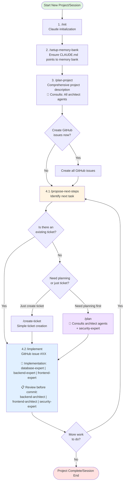

# Claude Code Workflow

This document describes the standard workflow for working with Claude Code on this project, including how each step integrates with the memory bank system and which specialized agents are involved.

## Agent Overview

Before diving into the workflow, here's an overview of the specialized agents available:

### Architect Agents (Planning & Review)

- **`backend-architect`**: Designs backend systems using Vertical Slicing + Hexagonal Architecture + Screaming Architecture
- **`frontend-architect`**: Plans UI/UX, shadcn/ui components, and visual design patterns
- **`security-expert`**: Identifies security risks, defines requirements, and reviews for vulnerabilities

### Implementation Agents (Coding)

- **`database-expert`**: Implements Prisma schemas, migrations, PostgreSQL queries
- **`backend-expert`**: Implements API routes, services, business logic with tests
- **`frontend-expert`**: Implements React components, UI features, E2E tests

### Domain Agents

- **`domain-expert`**: Product decisions, user-facing features, Blood Bowl rules, tournament formats

## Workflow Overview



## Workflow Steps Explained

### 1. `/init` - Claude Initialization

Start a new session with Claude Code. This initializes the environment and loads the context.

### 2. `/setup-memory-bank` - Memory Bank Setup

Ensures that `CLAUDE.md` contains up-to-date pointers to all relevant memory bank files. This is the "map" that helps Claude navigate the project documentation.

**Memory Bank Impact:**

- Updates `CLAUDE.md` with links to essential files
- Ensures all memory bank documents are properly referenced

### 3. `/plan-project` - Project Planning

Create or update a comprehensive project description. This is typically done at the start of a new project or major phase.

**Agents Consulted:**

| Agent                | Role in Planning                                      |
| -------------------- | ----------------------------------------------------- |
| `backend-architect`  | Backend architecture, API design, domain modeling     |
| `frontend-architect` | UI/UX design, component architecture, visual patterns |
| `database-expert`    | Schema design, data modeling, migration strategies    |
| `security-expert`    | Threat modeling, security requirements, auth patterns |

**Options:**

- Can optionally create all GitHub issues immediately
- Otherwise, issues are created iteratively as needed

**Memory Bank Impact:**

- Reads/writes `PROJECT_PLAN.md` - overall project vision
- Reads/writes `PROJECT_DEBRIEF.md` - project overview and architecture
- Updates `ROADMAP.md` - phases and timelines
- May create initial entries in `TICKETS.md`
- Creates agent-specific docs in `memory-bank/plans/[PLAN]-docs/`

### 4. Iterative Development Loop

#### 4.1. `/propose-next-steps` - Identify Next Task

Ask Claude to analyze the current state and propose the next logical step.

**Memory Bank Impact:**

- Reads `TICKETS.md` - what's been completed
- Reads `ROADMAP.md` - what's planned
- Reads `TICKETS.md` - existing GitHub issues
- Reads `TODO.md` - low-priority tasks
- Reads `FUTURE_IDEAS.md` - backlog items

**Decision Points:**

- **Existing ticket?** → Go directly to `/implement`
- **No ticket?** → Create one (with or without planning first)

##### 4.1.1. `/create-ticket` - Simple Ticket Creation

For straightforward tasks that don't need detailed planning.

**Memory Bank Impact:**

- Updates `TICKETS.md` with new issue summary

##### 4.1.2. `/plan` - Detailed Planning + Ticket Creation

For complex features that need architectural planning before implementation.

**Agents Consulted (Team Selection):**

| Agent                | When Included                                            |
| -------------------- | -------------------------------------------------------- |
| `backend-architect`  | Backend/API features, domain logic                       |
| `frontend-architect` | UI components, visual design, UX flows                   |
| `database-expert`    | Schema changes, migrations                               |
| `security-expert`    | **Default: Always included** unless purely cosmetic/docs |

**IMPORTANT**: The `security-expert` is included by default. Only exclude if the task has NO security implications (e.g., purely cosmetic UI changes, documentation updates).

**Memory Bank Impact:**

- Creates `memory-bank/plans/[PLAN_NAME].md` - the plan document
- Creates `memory-bank/plans/[PLAN_NAME]-docs/` - agent-specific documents
- Updates `TICKETS.md` with new issue(s)

#### 4.2. `/implement` - Implementation

Implement a specific GitHub issue, following all project standards and patterns.

**Implementation Phase - Expert Agents:**

The implementation uses specialized expert agents based on task type:

| Task Type | Implementation Agent  | Examples                                         |
| --------- | --------------------- | ------------------------------------------------ |
| Database  | `database-expert`     | Prisma schema, migrations, raw SQL               |
| Backend   | `backend-expert`      | API routes, services, business logic, unit tests |
| Frontend  | `frontend-expert`     | React components, UI, E2E tests                  |
| Other     | Direct implementation | Documentation, configuration                     |

**Review Phase - Before Committing:**

Before committing changes, the implementation is reviewed by architect and security agents:

| Task Type        | Reviewer Agents      | Review Focus                                                                |
| ---------------- | -------------------- | --------------------------------------------------------------------------- |
| Backend/Database | `backend-architect`  | Vertical slicing, hexagonal architecture, screaming architecture compliance |
| Frontend         | `frontend-architect` | Component architecture, UI/UX patterns, design consistency                  |
| All tasks\*      | `security-expert`    | OWASP vulnerabilities, auth handling, input validation                      |

\*Security review is required for all tasks unless clearly not security-related (e.g., pure documentation).

**Review Output Structure:**

Each reviewer provides:

- **Summary**: High-level assessment
- **Findings**: Issues categorized by severity (Critical/High/Medium/Low)
- **Recommendations**: Specific, actionable fixes with code examples
- **Verification**: How to verify the fix works

**Critical/High severity issues must be addressed before committing.**

**Memory Bank Impact:**

- **Reads** (for guidance):
  - `RULES.md` - critical development rules
  - `STANDARDS.md` - coding conventions
  - `FEATURES.md` - existing patterns to follow
  - Phase plans - detailed implementation guidance
  - `memory-bank/agents/[agent]/` - agent-specific documentation
- **Writes** (to track progress):
  - `memory-bank/worklogs/working/[TICKET_ID].md` - progress tracking
  - `TICKETS.md` - update issue status

## Agent Interaction Summary

```
┌────────────────────────────────────────────────────────────────────┐
│                         PLANNING PHASE                             │
│  /plan-project, /plan                                              │
│                                                                    │
│  ┌─────────────────┐  ┌──────────────────┐  ┌─────────────────┐    │
│  │ backend-        │  │ frontend-        │  │ security-       │    │
│  │ architect       │  │ architect        │  │ expert          │    │
│  │                 │  │                  │  │                 │    │
│  │ • Architecture  │  │ • UI/UX design   │  │ • Threat model  │    │
│  │ • Domain model  │  │ • Components     │  │ • Requirements  │    │
│  │ • API design    │  │ • Visual design  │  │ • Auth patterns │    │
│  └─────────────────┘  └──────────────────┘  └─────────────────┘    │
└────────────────────────────────────────────────────────────────────┘

┌────────────────────────────────────────────────────────────────────┐
│                      IMPLEMENTATION PHASE                          │
│  /implement (step 11)                                              │
│                                                                    │
│  ┌─────────────────┐  ┌──────────────────┐  ┌─────────────────┐    │
│  │ database-       │  │ backend-         │  │ frontend-       │    │
│  │ expert          │  │ expert           │  │ expert          │    │
│  │                 │  │                  │  │                 │    │
│  │ • Prisma schema │  │ • API routes     │  │ • Components    │    │
│  │ • Migrations    │  │ • Services       │  │ • UI features   │    │
│  │ • PostgreSQL    │  │ • Unit tests     │  │ • E2E tests     │    │
│  └─────────────────┘  └──────────────────┘  └─────────────────┘    │
└────────────────────────────────────────────────────────────────────┘

┌────────────────────────────────────────────────────────────────────┐
│                         REVIEW PHASE                               │
│  /implement (step 14, before commit)                               │
│                                                                    │
│  ┌─────────────────┐  ┌──────────────────┐  ┌─────────────────┐    │
│  │ backend-        │  │ frontend-        │  │ security-       │    │
│  │ architect       │  │ architect        │  │ expert          │    │
│  │                 │  │                  │  │                 │    │
│  │ • Architecture  │  │ • UI/UX review   │  │ • OWASP check   │    │
│  │   compliance    │  │ • Design system  │  │ • Auth review   │    │
│  │ • Code review   │  │ • Accessibility  │  │ • Input valid.  │    │
│  └─────────────────┘  └──────────────────┘  └─────────────────┘    │
│                                                                    │
│  Backend/DB tasks → backend-architect + security-expert            │
│  Frontend tasks   → frontend-architect + security-expert           │
└────────────────────────────────────────────────────────────────────┘
```

## Best Practices

### When to Use Each Command

| Command               | Use When                              | Agents Involved                    |
| --------------------- | ------------------------------------- | ---------------------------------- |
| `/propose-next-steps` | Not sure what to work on next         | None (analysis only)               |
| `/create-ticket`      | Simple, well-defined tasks            | None                               |
| `/plan`               | Complex features needing architecture | Architect + Security agents        |
| `/implement`          | Clear GitHub issue ready to execute   | Expert (impl) + Architect (review) |

### Keeping Memory Bank Updated

The memory bank is only useful if it stays current. After major milestones:

1. ✅ Update `ROADMAP.md` - check off completed phases
2. ✅ Update `TICKETS.md` - after merging PRs

### Planning vs. Doing

**Use `/plan` when:**

- Unclear how to implement something
- Need to make architectural decisions
- Feature touches multiple parts of the system
- Want to document the approach before coding
- Security considerations need to be addressed upfront

**Skip `/plan` and go straight to `/implement` when:**

- Issue is well-defined and straightforward
- Similar patterns already exist in the codebase
- Task is a simple bug fix or minor enhancement

### Security-First Approach

The workflow emphasizes security at every stage:

1. **Planning**: `security-expert` identifies risks and requirements
2. **Implementation**: Expert agents follow secure coding patterns
3. **Review**: `security-expert` reviews for vulnerabilities before commit

## Legend

### Mermaid Diagram Symbols

- 🟢 Green boxes: Start/end points
- 🔵 Blue box: Implementation step (main work)
- 🟡 Yellow box: Iteration point (decision/loop)
- 🟣 Purple box: Planning step (agent consultation)
- 🔶 Diamonds: Decision points

### Agent Colors (in CLI)

- `backend-architect`: Red
- `frontend-architect`: Blue
- `database-expert`: Yellow
- `backend-expert`: (varies)
- `frontend-expert`: (varies)
- `security-expert`: (varies)

## Related Documentation

- **Memory Bank Setup**: `.claude/commands/setup-memory-bank.md`
- **Project Overview**: `memory-bank/PROJECT_DEBRIEF.md`
- **Development Rules**: `memory-bank/RULES.md`
- **Current Status**: `memory-bank/TICKETS.md`
- **Agent Documentation**: `memory-bank/agents/README.md`
