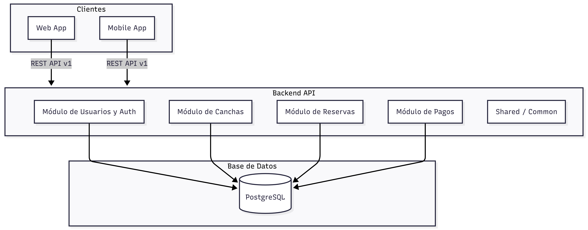
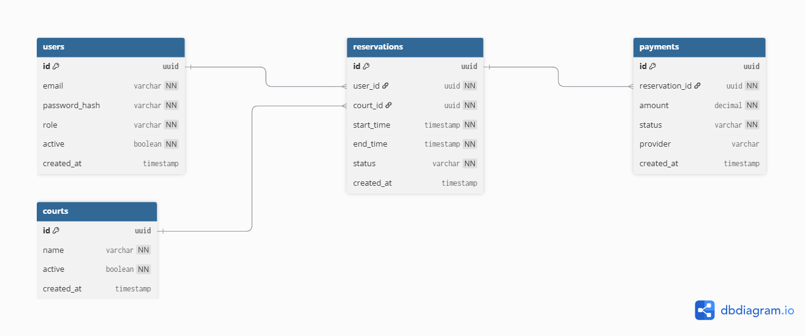

# Tabla de Contenidos

- [1. Descripción general del producto](#1-descripción-general-del-producto)
- [2. Arquitectura del Sistema](#2-arquitectura-del-sistema)
- [3. Modelo de Datos](#3-modelo-de-datos)
- [4. Especificación de la API](#4-especificación-de-la-api)
- [5. User Stories](#5-user-stories)
- [6. Tickets de trabajo](#6-tickets-de-trabajo)

# 1. Descripción general del producto

El sistema **SC Padel Club Management System** es una plataforma digital diseñada para gestionar de forma simple y eficiente la operación diaria de un club de pádel, con foco principal en la experiencia del jugador y en la automatización de tareas clave del club.

El sistema está diseñado para **SC Club, un Club de Pádel del Norte de Argentina** ubicado en una zona estratégica en LATAM, y permitirá a jugadores y administradores interactuar a través de una aplicación web y móvil para realizar reservas de canchas, gestionar usuarios y centralizar información operativa básica del club.

En su primera etapa (Phase 0 / Piloto), el proyecto busca entregar un **MVP funcional, simple y estable**, priorizando las funcionalidades esenciales para validar el uso real del sistema, minimizar la carga operativa del club y ofrecer una experiencia clara al jugador. Funcionalidades más avanzadas serán incorporadas progresivamente en fases posteriores.

## 1.1. Funcionalidades Clave

El sistema contempla un conjunto de funcionalidades organizadas por fases, priorizando en el piloto aquellas que son críticas para la operación mínima del club.

### Funcionalidades priorizadas – Phase 0 (Piloto)

Estas funcionalidades serán **diseñadas, documentadas y desarrolladas** en el MVP inicial:

* **Gestión de usuarios**

  * Registro y autenticación de usuarios mediante email y contraseña.
  * Roles básicos: jugador y administrador.
  * Creación de usuarios por parte del administrador.

* **Gestión de canchas**

  * Definición y visualización de canchas disponibles en el club.
  * Configuración básica de disponibilidad horaria.

* **Reservas de canchas**

  * Creación de reservas por parte de los jugadores.
  * Visualización de disponibilidad en tiempo real.
  * Estado de la reserva (CREATED, CONFIRMED).
  * En caso de fallo de pago, la reserva permanece en estado CREATED.

* **Pagos (integración básica)**

  * Soporte para pagos locales (LATAM).
  * Registro del intento de pago asociado a la reserva.
  * No se contempla cancelación de reservas en Phase 0.

* **Panel administrativo básico**

  * Visualización de reservas.
  * Gestión simple de usuarios y canchas.

Estas funcionalidades permiten cubrir el **flujo mínimo crítico**: usuario → disponibilidad → reserva → pago → gestión administrativa.

### Funcionalidades planificadas para fases posteriores (Phase 1 en adelante)

Las siguientes funcionalidades **no forman parte del desarrollo del piloto**, pero están contempladas dentro del roadmap del sistema:

* Cancelación y reprogramación de reservas.
* Pagos avanzados y conciliación.
* Historial de reservas y pagos.
* Notificaciones (email / push).
* Gestión de clases, torneos y eventos.
* Promociones y precios dinámicos.
* Métricas y reportes operativos.
* Automatizaciones inteligentes (sugerencias de horarios, ocupación, etc.).
* Soporte multi-idioma más avanzado (internacionalización completa).

## 1.2. Valor añadido

El SC Padel Club Management System aporta valor diferencial frente a soluciones existentes principalmente por su **enfoque regional, simplicidad y diseño centrado en el jugador**.

Entre sus principales elementos de valor se destacan:

* **Enfoque LATAM**

  * Integración con medios de pago locales.
  * Diseño alineado a la operación real de clubes de la región.
  * Consideración de particularidades operativas y culturales.

* **Simplicidad primero**

  * MVP enfocado solo en lo esencial.
  * Evita la sobrecarga de funcionalidades innecesarias en etapas tempranas.
  * Menor curva de aprendizaje para jugadores y administradores.

* **Experiencia centrada en el jugador**

  * Flujo claro y rápido para reservar canchas.
  * Reducción de fricción en el proceso de reserva.
  * Diseño pensado para uso frecuente desde dispositivos móviles.

* **Base sólida para escalar**

  * Arquitectura preparada para crecer funcionalmente.
  * Roadmap definido que permite evolucionar el sistema sin re-trabajos.
  * Posibilidad de incorporar automatización y analítica avanzada en el futuro.

## 1.3. Diagrama Lean Canvas

<style>
  .lc-grid{display:flex;flex-wrap:wrap;gap:16px;margin:16px 0;padding:0;}
  .lc-card{flex:1 1 calc(33% - 16px);background:#fff;border:1px solid #e3e7ea;border-radius:8px;padding:14px;box-shadow:0 2px 6px rgba(18,38,63,0.04);min-width:220px}
  .lc-card h4{margin:0 0 8px 0;font-size:1rem;color:#0b3b5a}
  .lc-card p{margin:6px 0;color:#243746;font-size:0.95rem}
  .lc-title{font-weight:700;font-size:1.05rem;margin-bottom:8px}
  .lc-hero{flex:1 1 100%;background:linear-gradient(90deg,#f7fbff,#f0f7ff);border:1px solid #dbe8ff;color:#052a4e;padding:16px;border-radius:8px}
  @media(max-width:900px){.lc-card{flex:1 1 calc(50% - 16px)}}
  @media(max-width:560px){.lc-card{flex:1 1 100%}}
</style>

<div class="lc-grid">
  <div class="lc-hero">
    <div class="lc-title">Lean Canvas – Sistema de Gestión para Club de Pádel (SC)</div>
    <div style="font-size:0.95rem;color:#16324f;">Resumen visual de las hipótesis de negocio y modelo de valor.</div>
  </div>

  <div class="lc-card" aria-labelledby="lc-problema">
    <h4 id="lc-problema">Problema</h4>
    <p>• Reservas manuales vía WhatsApp o llamadas</p>
    <p>• Errores y doble reserva de canchas</p>
    <p>• Falta de visibilidad de disponibilidad</p>
    <p>• Pagos desordenados o en efectivo</p>
    <p>• Pérdida de tiempo administrativo</p>
  </div>

  <div class="lc-card" aria-labelledby="lc-pv">
    <h4 id="lc-pv">Propuesta de Valor Única</h4>
    <p><em>“Reservar una cancha de pádel en segundos, sin fricción y sin mensajes.”</em></p>
    <p>• Experiencia simple y centrada en el jugador</p>
    <p>• Reservas y pagos 100% digitales</p>
    <p>• Optimizado para clubes LATAM</p>
  </div>

  <div class="lc-card" aria-labelledby="lc-clientes">
    <h4 id="lc-clientes">Segmentos de Clientes</h4>
    <p><strong>Primario:</strong> Jugadores de pádel del club</p>
    <p><strong>Secundario:</strong> Administradores del club, Dueños / managers</p>
  </div>

  <div class="lc-card" aria-labelledby="lc-solucion">
    <h4 id="lc-solucion">Solución</h4>
    <p>• Visualización de disponibilidad de canchas</p>
    <p>• Reserva online en tiempo real</p>
    <p>• Pago digital integrado</p>
    <p>• Panel básico de administración</p>
  </div>

  <div class="lc-card" aria-labelledby="lc-metricas">
    <h4 id="lc-metricas">Métricas Clave</h4>
    <p>• Número de reservas realizadas</p>
    <p>• Tasa de ocupación de canchas</p>
    <p>• % de pagos online</p>
    <p>• Tiempo promedio de reserva</p>
  </div>

  <div class="lc-card" aria-labelledby="lc-canales">
    <h4 id="lc-canales">Canales</h4>
    <p>• Aplicación web / mobile web</p>
    <p>• Comunicación directa del club</p>
    <p>• WhatsApp (notificaciones futuras)</p>
  </div>

  <div class="lc-card" aria-labelledby="lc-costos">
    <h4 id="lc-costos">Estructura de Costos</h4>
    <p>• Desarrollo de software</p>
    <p>• Hosting / infraestructura</p>
    <p>• Integración de pagos</p>
    <p>• Servicios de notificaciones</p>
  </div>

  <div class="lc-card" aria-labelledby="lc-ingresos">
    <h4 id="lc-ingresos">Flujos de Ingresos</h4>
    <p>• Suscripción mensual del club</p>
    <p>• Comisión por transacción (opcional)</p>
    <p>• Funcionalidades premium futuras</p>
  </div>

  <div class="lc-card" aria-labelledby="lc-ventaja">
    <h4 id="lc-ventaja">Ventaja Competitiva</h4>
    <p>• Simplicidad extrema (no bloat)</p>
    <p>• Enfoque LATAM (pagos, idioma, WhatsApp)</p>
    <p>• Diseño centrado en el jugador</p>
    <p>• Base preparada para automatización inteligente</p>
  </div>

</div>

---

# 2. Arquitectura del Sistema

Arquitectura del Sistema

## 2.1. Visión general de la arquitectura

El **SC Padel Club Management System** se ha diseñado bajo una arquitectura **monolítica modular**, adecuada para un **MVP / Piloto (Phase 0)** con un tiempo de desarrollo limitado, priorizando simplicidad, velocidad de entrega y bajo costo operativo.

La arquitectura permite:

* Entregar valor rápidamente.
* Mantener una base de código clara y organizada.
* Reducir la complejidad innecesaria en etapas tempranas.
* Preparar el sistema para una futura evolución hacia arquitecturas más distribuidas si el producto lo requiere.

El sistema soporta **clientes Web y Mobile**, consume un **API REST versionada**, y utiliza una base de datos relacional **PostgreSQL** como fuente única de verdad.

---

## 2.2. Metodología arquitectónica elegida

### Arquitectura Monolítica Modular

Se adopta una **arquitectura monolítica** organizada en **módulos lógicos por dominio**, siguiendo principios inspirados en:

* **DDD ligero (Domain-Oriented Design)**
* **Separación de responsabilidades**
* **Alta cohesión / bajo acoplamiento**

Cada módulo encapsula su lógica de negocio, persistencia y contratos, evitando dependencias cruzadas innecesarias.

👉 Esta decisión es intencional para Phase 0, donde:

* El equipo es pequeño.
* El alcance es acotado.
* La prioridad es validar el producto, no optimizar la escalabilidad prematuramente.

---

## 2.3. Estilo arquitectónico

* **API RESTful**
* **Versionado explícito de API** (`/api/v1`)
* **Autenticación basada en JWT**
* **Arquitectura orientada a capas**
* **Backend agnóstico de frontend** (Web / Mobile)

---

## 2.4. Componentes principales del sistema

### 1. Clientes (Web y Mobile)

* Aplicaciones Web y Mobile consumen el mismo API.
* Responsables de:

  * Internacionalización (ES / PT / EN).
  * Validación básica de formularios.
  * Experiencia de usuario.

---

### 2. Backend (Monolito Modular)

El backend se organiza en los siguientes módulos principales:

* **Auth & Users**

  * Login con email y password.
  * Gestión de roles.
  * Creación de usuarios por admin.

* **Courts**

  * Gestión de canchas.
  * Consulta de disponibilidad.

* **Reservations**

  * Creación de reservas.
  * Validación de solapamientos.
  * Estados de reserva.

* **Payments**

  * Registro de pagos.
  * Confirmación de pagos.
  * Integración simulada en Phase 0.

* **Shared / Common**

  * Manejo de errores.
  * Configuración.
  * Seguridad.
  * Utilidades comunes.

---

### 3. Base de datos

* **PostgreSQL**
* Modelo relacional normalizado (3NF).
* Integridad referencial mediante claves foráneas.
* Control de estados a nivel de dominio.

---

## 2.5. Diagrama de arquitectura

<div style="text-align: center;">
  
</div>

## 2.6. Flujo principal del sistema (Phase 0)

1. El usuario se autentica desde Web o Mobile.
2. Consulta disponibilidad de canchas.
3. Crea una reserva.
4. Inicia el pago.
5. El pago se confirma y la reserva cambia de estado.
6. El administrador gestiona usuarios y canchas.

---

## 2.7. Consideraciones de escalabilidad y evolución

Aunque se utiliza un monolito, la arquitectura está preparada para evolucionar hacia:

* **Modular Monolith más estricto**
* **Extracción progresiva de microservicios**, por ejemplo:

  * Payments
  * Notifications
  * Analytics

El diseño actual minimiza el costo de esta transición al mantener límites claros entre dominios.

---

## 2.8. Decisiones arquitectónicas clave

| Decisión            | Justificación                         |
| ------------------- | ------------------------------------- |
| Monolito modular    | Reduce complejidad inicial            |
| PostgreSQL          | Integridad y modelo relacional sólido |
| REST API versionada | Compatibilidad futura                 |
| JWT                 | Simplicidad y escalabilidad           |
| Frontend agnóstico  | Reutilización Web/Mobile              |

---

## 2.9. Fuera de alcance arquitectónico (Phase 0)

* Microservicios
* Event-driven architecture
* Mensajería asíncrona
* Cache distribuido
* Observabilidad avanzada

Estas capacidades se evaluarán en fases posteriores según crecimiento real del sistema.

# 3. Modelo de Datos

## 3.1 Visión general del modelo de datos

El modelo de datos del **SC Padel Club Management System** está diseñado para soportar las funcionalidades del **MVP (Phase 0)** de forma clara, consistente y escalable.

Se utiliza un **modelo relacional normalizado (3FN)**, implementado sobre **PostgreSQL**, garantizando:

* Integridad referencial
* Eliminación de redundancia
* Claridad en las relaciones entre dominios
* Base sólida para futuras extensiones funcionales

El modelo cubre los dominios centrales del sistema:

* Usuarios
* Canchas
* Reservas
* Pagos

---

## 3.2. Diagrama Entidad–Relación (ERD)

<div style="text-align: center;">
  
</div>

## 3.3. Descripción de las entidades

### USERS

Representa a los usuarios del sistema, tanto jugadores como administradores.

**Responsabilidades principales:**

* Autenticación y autorización
* Asociación con reservas
* Control de acceso mediante roles

**Campos clave:**

* `id`: Identificador único (UUID).
* `email`: Credencial de acceso, único en el sistema.
* `password_hash`: Contraseña almacenada de forma segura.
* `role`: Rol del usuario (`PLAYER`, `ADMIN`).
* `active`: Indica si el usuario está habilitado.
* `created_at`: Fecha de creación.

📌 **Notas de diseño:**

* No se permite auto-registro en Phase 0.
* Los usuarios son creados por un administrador.

---

### COURTS

Representa las canchas físicas del club.

**Responsabilidades principales:**

* Definir los recursos reservables.
* Determinar disponibilidad junto con las reservas existentes.

**Campos clave:**

* `id`: Identificador único.
* `name`: Nombre o identificador visible de la cancha.
* `active`: Indica si la cancha está disponible para reservas.
* `created_at`: Fecha de creación.

📌 **Notas de diseño:**

* No se gestionan precios ni horarios fijos en Phase 0.
* La disponibilidad se calcula dinámicamente.

---

### RESERVATIONS

Representa una reserva de cancha realizada por un jugador.

**Responsabilidades principales:**

* Registrar el uso de una cancha en un horario específico.
* Controlar el ciclo de vida de la reserva.

**Campos clave:**

* `id`: Identificador único.
* `user_id`: Usuario que realiza la reserva.
* `court_id`: Cancha reservada.
* `start_time` / `end_time`: Intervalo de tiempo reservado.
* `status`: Estado de la reserva (`CREATED`, `CONFIRMED`).
* `created_at`: Fecha de creación.

📌 **Notas de diseño:**

* No se permiten cancelaciones en Phase 0.
* Se debe garantizar que no existan solapamientos de reservas para la misma cancha.

---

### PAYMENTS

Representa un intento de pago asociado a una reserva.

**Responsabilidades principales:**

* Registrar el estado del pago.
* Determinar la confirmación de la reserva.

**Campos clave:**

* `id`: Identificador único.
* `reservation_id`: Reserva asociada.
* `amount`: Monto del pago.
* `status`: Estado (`PENDING`, `PAID`, `FAILED`).
* `provider`: Proveedor de pago (genérico en Phase 0).
* `created_at`: Fecha de creación.

📌 **Notas de diseño:**

* Si el pago falla, la reserva permanece en estado `CREATED`.
* Se permite un único pago por reserva en Phase 0.

---

## 3.4. Relaciones principales

* Un **usuario** puede tener múltiples **reservas**.
* Una **cancha** puede tener múltiples **reservas**, pero no superpuestas.
* Una **reserva** puede generar **un pago** (opcional).

Estas relaciones reflejan directamente los casos de uso definidos para el MVP.

---

## 3.5. Consideraciones y extensibilidad futura

El modelo está preparado para extenderse en fases posteriores con:

* Cancelaciones y reembolsos
* Historial de pagos
* Tarifas y precios dinámicos
* Torneos y clases
* Notificaciones
* Auditoría y métricas

Estas extensiones podrán incorporarse sin romper el modelo actual gracias a su normalización y separación clara de responsabilidades.

# 4. Especificación de la API

## 4.1 Visión general

El sistema expone una **API RESTful versionada** que es consumida por clientes Web y Mobile.
La API está diseñada para soportar el **MVP (Phase 0)** con foco en simplicidad, claridad y extensibilidad.

* **Base path:** `/api/v1`
* **Formato:** JSON
* **Autenticación:** JWT (Bearer Token)
* **Internacionalización:** gestionada por el frontend
* **Errores:** códigos HTTP estándar + payload consistente

---

## 4.2. Principios de diseño

* **Versionado explícito** para evitar breaking changes.
* **Recursos orientados a dominio** (users, courts, reservations, payments).
* **Estados explícitos** para reservas y pagos.
* **Autorización por rol** (ADMIN / PLAYER).
* **Idempotencia lógica** en operaciones críticas.

---

## 4.3.  Convenciones generales

### Autenticación

```http
Authorization: Bearer <jwt-token>
```

### Respuesta de error estándar

```json
{
  "error": "RESOURCE_NOT_FOUND",
  "message": "Reservation not found"
}
```

---

## 4.4. Recursos principales (Phase 0)

| Recurso      | Descripción                     |
| ------------ | ------------------------------- |
| Auth         | Login y creación de usuarios    |
| Courts       | Gestión y consulta de canchas   |
| Reservations | Creación y consulta de reservas |
| Payments     | Inicio y confirmación de pagos  |

---

## 4.5. OpenAPI Specification (Phase 0)

```yaml
openapi: 3.0.3
info:
  title: SC Padel Club API
  version: 1.0.0
  description: API REST para gestión de reservas de canchas de pádel (Phase 0)

servers:
  - url: /api/v1

security:
  - bearerAuth: []

components:
  securitySchemes:
    bearerAuth:
      type: http
      scheme: bearer
      bearerFormat: JWT

  schemas:
    LoginRequest:
      type: object
      required: [email, password]
      properties:
        email:
          type: string
          format: email
        password:
          type: string

    LoginResponse:
      type: object
      properties:
        token:
          type: string

    UserCreateRequest:
      type: object
      required: [email, password, role]
      properties:
        email:
          type: string
        password:
          type: string
        role:
          type: string
          enum: [ADMIN, PLAYER]

    Court:
      type: object
      properties:
        id:
          type: string
          format: uuid
        name:
          type: string
        active:
          type: boolean

    ReservationCreateRequest:
      type: object
      required: [courtId, startTime, endTime]
      properties:
        courtId:
          type: string
          format: uuid
        startTime:
          type: string
          format: date-time
        endTime:
          type: string
          format: date-time

    Reservation:
      type: object
      properties:
        id:
          type: string
          format: uuid
        status:
          type: string
          enum: [CREATED, CONFIRMED]

    PaymentCreateRequest:
      type: object
      required: [reservationId, amount]
      properties:
        reservationId:
          type: string
          format: uuid
        amount:
          type: number
          format: decimal

paths:
  /auth/login:
    post:
      summary: Login de usuario
      requestBody:
        required: true
        content:
          application/json:
            schema:
              $ref: '#/components/schemas/LoginRequest'
      responses:
        '200':
          description: Login exitoso
          content:
            application/json:
              schema:
                $ref: '#/components/schemas/LoginResponse'

  /auth/register:
    post:
      summary: Crear usuario (ADMIN)
      security:
        - bearerAuth: []
      requestBody:
        content:
          application/json:
            schema:
              $ref: '#/components/schemas/UserCreateRequest'
      responses:
        '201':
          description: Usuario creado

  /courts:
    get:
      summary: Listar canchas activas
      responses:
        '200':
          description: Lista de canchas
    post:
      summary: Crear cancha (ADMIN)
      security:
        - bearerAuth: []
      responses:
        '201':
          description: Cancha creada

  /courts/{courtId}/availability:
    get:
      summary: Consultar disponibilidad de cancha
      parameters:
        - name: date
          in: query
          required: true
          schema:
            type: string
            format: date
      responses:
        '200':
          description: Horarios disponibles

  /reservations:
    post:
      summary: Crear reserva
      security:
        - bearerAuth: []
      requestBody:
        content:
          application/json:
            schema:
              $ref: '#/components/schemas/ReservationCreateRequest'
      responses:
        '201':
          description: Reserva creada

  /reservations/my:
    get:
      summary: Listar reservas del usuario
      security:
        - bearerAuth: []
      responses:
        '200':
          description: Lista de reservas

  /payments:
    post:
      summary: Iniciar pago
      security:
        - bearerAuth: []
      requestBody:
        content:
          application/json:
            schema:
              $ref: '#/components/schemas/PaymentCreateRequest'
      responses:
        '201':
          description: Pago iniciado

  /payments/{paymentId}/confirm:
    post:
      summary: Confirmar pago
      responses:
        '200':
          description: Pago confirmado
```

---

## 4.6. Decisiones clave de API (Phase 0)

* No hay cancelaciones de reservas.
* Si el pago falla, la reserva queda en estado `CREATED`.
* No existe auto-registro público.
* Un pago por reserva.
* API preparada para ampliarse sin romper contratos.

# 5. User Stories

Esta sección describe las historias de usuario incluidas en el MVP del SC Padel Club Management System (Phase 0).
Estas historias representan el flujo mínimo funcional necesario para operar el club y validar el producto con usuarios reales

## 5.1 **Phase 0 – Historias de Usuario "Must-Have"**

---

### **US-01: Registro y Autenticación de Usuario**

#### **1. Título de la Historia de Usuario**

Registro y Autenticación de Usuario

#### **Descripción**

Permite a los jugadores crear una cuenta y acceder de forma segura al sistema para reservar canchas de pádel.

**1.1. Como** jugador,

**1.2. Quiero** registrarme e iniciar sesión usando mi correo electrónico y contraseña,

**1.3. Para** poder acceder al sistema de reservas y gestionar mis reservas.

---

#### **2. Criterios de Aceptación**

**2.1.** El sistema permite a un jugador registrarse usando un correo válido y contraseña.
**2.2.** El sistema evita el registro con un correo ya existente.
**2.3.** El sistema permite a los jugadores registrados iniciar y cerrar sesión de forma segura.

---

#### **3. Notas Adicionales**

* La recuperación de contraseña y el inicio de sesión social están fuera de alcance para la Fase 0.
* El idioma de la interfaz para la Fase 0 es solo español.

---

#### **4. Historias de Usuario Relacionadas**

* US-02: Ver Disponibilidad de Canchas
* US-03: Crear Reserva de Cancha

---


### **US-02: Ver Disponibilidad de Canchas**

#### **1. Título de la Historia de Usuario**

Ver Disponibilidad de Canchas

#### **Descripción**

Permite a los jugadores ver las canchas de pádel disponibles por fecha y hora para planificar sus partidos.

**1.1. Como** jugador,

**1.2. Quiero** ver la disponibilidad de canchas para una fecha y hora seleccionadas,

**1.3. Para** elegir un horario adecuado para reservar un partido.

---

#### **2. Criterios de Aceptación**

**2.1.** El sistema muestra una lista de canchas y horarios disponibles para una fecha seleccionada.
**2.2.** El sistema no muestra horarios que ya estén reservados.
**2.3.** La información de disponibilidad se actualiza en tiempo real cuando se crea una reserva.

---

#### **3. Notas Adicionales**

* Solo se requiere vista diaria (no vistas semanales o mensuales).
* Los horarios de apertura están predefinidos por el administrador.

---

#### **4. Historias de Usuario Relacionadas**

* US-03: Crear Reserva de Cancha
* US-05: Gestión de Canchas (Admin)

---


### **US-03: Crear Reserva de Cancha**

#### **1. Título de la Historia de Usuario**

Crear Reserva de Cancha

#### **Descripción**

Permite a los jugadores reservar una cancha disponible para una fecha y hora específicas.

**1.1. Como** jugador,

**1.2. Quiero** reservar una cancha de pádel disponible,

**1.3. Para** asegurar un horario para jugar.

---

#### **2. Criterios de Aceptación**

**2.1.** El sistema permite al jugador seleccionar una cancha, fecha y horario disponible.
**2.2.** El sistema evita la doble reserva de la misma cancha y horario.
**2.3.** Una reserva se crea solo si el horario seleccionado está disponible al momento de la confirmación.

---

#### **3. Notas Adicionales**

* La duración del turno es fija en la Fase 0.
* Las invitaciones a otros jugadores están fuera de alcance.

---

#### **4. Historias de Usuario Relacionadas**

* US-02: Ver Disponibilidad de Canchas
* US-04: Pagar Reserva

---


### **US-04: Pagar una Reserva**

#### **1. Título de la Historia de Usuario**

Pagar una Reserva

#### **Descripción**

Permite a los jugadores pagar en línea para confirmar su reserva de cancha.

**1.1. Como** jugador,

**1.2. Quiero** pagar en línea mi reserva,

**1.3. Para** que mi reserva quede confirmada y asegurada.

---

#### **2. Criterios de Aceptación**

**2.1.** El sistema se integra con un único proveedor de pagos LATAM.
**2.2.** Una reserva se confirma solo después de un pago exitoso.
**2.3.** El sistema almacena el estado de pago asociado a la reserva.

---

#### **3. Notas Adicionales**

* Los reembolsos y pagos parciales están fuera de alcance para la Fase 0.
* Solo se admite pago completo inmediato.

---

#### **4. Historias de Usuario Relacionadas**

* US-03: Crear Reserva de Cancha

---


### **US-05: Gestión de Canchas (Admin)**

#### **1. Título de la Historia de Usuario**

Gestión de Canchas (Admin)

#### **Descripción**

Permite a los administradores gestionar las canchas disponibles para reserva.

**1.1. Como** administrador,

**1.2. Quiero** crear, actualizar y desactivar canchas,

**1.3. Para** que los jugadores puedan reservar canchas válidas y actualizadas.

---

#### **2. Criterios de Aceptación**

**2.1.** El sistema permite al administrador crear una cancha con nombre y estado.
**2.2.** El sistema permite al administrador editar la información de canchas existentes.
**2.3.** Las canchas desactivadas no se muestran a los jugadores para reservar.

---

#### **3. Notas Adicionales**

* Tipos de canchas y configuración avanzada están fuera de alcance.
* La interfaz de administración puede ser básica y funcional.

---

#### **4. Historias de Usuario Relacionadas**

* US-02: Ver Disponibilidad de Canchas

---

## 5.2. **Fase 0 – Historias de Usuario "Should-Have"**

---

### **US-06: Notificación de Confirmación de Reserva**

#### **1. Título de la Historia de Usuario**

Notificación de Confirmación de Reserva

#### **Descripción**

Notifica a los jugadores después de una reserva y pago exitosos.

**1.1. Como** jugador,

**1.2. Quiero** recibir una confirmación de reserva,

**1.3. Para** saber que mi reserva fue exitosa.

---

#### **2. Criterios de Aceptación**

**2.1.** El sistema envía un mensaje de confirmación después de una reserva exitosa.
**2.2.** La notificación incluye fecha, hora y detalles de la cancha.

---

#### **3. Notas Adicionales**

* Solo correo electrónico para documentación de Fase 0.
* Notificaciones por WhatsApp se planean para la Fase 1.

---

#### **4. Historias de Usuario Relacionadas**

* US-04: Pagar una Reserva

---

### **US-07: Cancelar Reserva**

#### **1. Título de la Historia de Usuario**

Cancelar Reserva

#### **Descripción**

Permite a los jugadores cancelar una reserva previamente creada.

**1.1. Como** jugador,

**1.2. Quiero** cancelar mi reserva dentro de las reglas permitidas,

**1.3. Para** liberar la cancha si no puedo asistir.

---

#### **2. Criterios de Aceptación**

**2.1.** El sistema permite cancelar antes de la hora de inicio del partido.
**2.2.** Las reservas canceladas liberan el horario asociado.

---

#### **3. Notas Adicionales**

* No se manejan reembolsos en la Fase 0.
* Las reglas de cancelación están simplificadas.

---

#### **4. Historias de Usuario Relacionadas**

* US-03: Crear Reserva de Cancha

## 5.3. Alcance de las User Stories – Phase 0

Incluido:

* Flujo completo: autenticación → reserva → pago → confirmación.
* Gestión básica de club.
* Experiencia mínima viable para jugadores.

Excluido:

* Cancelaciones.
* Notificaciones.
* Reportes.
* Automatizaciones avanzadas.
* Funcionalidades sociales o competitivas.


# 6. Tickets de trabajo

A continuación se presentan los tickets de Phase 0, estimados con metodología Fibonacci, alineados con:

* MVP (Pilot)
* User Stories must-have
* API Spec
* ERD

## 🎫 TICKET 1 — Configuración del Proyecto y Arquitectura Base

**Clasificación:** Técnico / Configuración

**Descripción:**
Configurar el proyecto base del backend utilizando una arquitectura monolítica modular, definiendo la estructura de paquetes, la configuración inicial y las dependencias principales.

**Criterios de Aceptación:**

* Se crea la estructura de paquetes organizada por dominio.
* El proyecto compila y se ejecuta correctamente en entorno local.
* La configuración básica del entorno está lista.

**Prioridad:** Alta
**Estimación:** 3
**Asignado a:** Backend
**Etiquetas:** setup, arquitectura, phase-0
**Comentarios:** Base fundamental para todo el desarrollo posterior.

---

## 🎫 TICKET 2 — Esquema de Base de Datos y Migraciones

**Clasificación:** Técnico / Persistencia

**Descripción:**
Implementar el esquema de base de datos PostgreSQL según el ERD definido para Phase 0, incluyendo claves primarias, foráneas, relaciones y restricciones.

**Criterios de Aceptación:**

* Se crean las tablas USERS, COURTS, RESERVATIONS y PAYMENTS.
* Se definen correctamente las claves primarias y foráneas.
* Se aplican las restricciones básicas de integridad.

**Prioridad:** Alta
**Estimación:** 5
**Asignado a:** Backend
**Etiquetas:** base-de-datos, erd, persistencia
**Comentarios:** Debe alinearse estrictamente con el modelo de datos validado.

---

## 🎫 TICKET 3 — Autenticación (Login + JWT)

**Clasificación:** Funcionalidad / Seguridad

**Descripción:**
Implementar autenticación mediante email y contraseña, con generación de token JWT para el acceso a la API.

**Criterios de Aceptación:**

* El endpoint POST `/auth/login` funciona correctamente.
* Se validan las credenciales del usuario.
* Se genera y devuelve un JWT válido.

**Prioridad:** Alta
**Estimación:** 5
**Asignado a:** Backend
**Etiquetas:** autenticación, seguridad, api
**Comentarios:** No incluye registro público de usuarios.

---

## 🎫 TICKET 4 — Gestión de Usuarios (Creación por Administrador)

**Clasificación:** Funcionalidad

**Descripción:**
Permitir que un usuario con rol ADMIN cree nuevos usuarios del sistema.

**Criterios de Aceptación:**

* El endpoint POST `/auth/register` está disponible solo para administradores.
* El usuario se crea con un rol asignado.
* La contraseña se almacena de forma segura.

**Prioridad:** Media
**Estimación:** 3
**Asignado a:** Backend
**Etiquetas:** usuarios, admin, api
**Comentarios:** No incluye edición ni eliminación de usuarios en Phase 0.

---

## 🎫 TICKET 5 — Gestión de Canchas

**Clasificación:** Funcionalidad

**Descripción:**
Implementar la creación y el listado de las canchas del club.

**Criterios de Aceptación:**

* El endpoint GET `/courts` devuelve las canchas activas.
* El endpoint POST `/courts` permite crear nuevas canchas (solo ADMIN).
* Se aplican validaciones básicas de datos.

**Prioridad:** Alta
**Estimación:** 3
**Asignado a:** Backend
**Etiquetas:** canchas, api, dominio
**Comentarios:** No incluye gestión de precios ni horarios fijos.

---

## 🎫 TICKET 6 — Cálculo de Disponibilidad de Canchas

**Clasificación:** Funcionalidad / Lógica de Negocio

**Descripción:**
Calcular y exponer la disponibilidad de una cancha para una fecha específica, evitando solapamientos de reservas.

**Criterios de Aceptación:**

* El endpoint GET `/courts/{id}/availability` funciona correctamente.
* Se excluyen los horarios ya reservados.
* Se maneja adecuadamente una fecha inválida.

**Prioridad:** Alta
**Estimación:** 5
**Asignado a:** Backend
**Etiquetas:** disponibilidad, reservas, lógica
**Comentarios:** Lógica crítica del sistema.

---

## 🎫 TICKET 7 — Creación de Reserva

**Clasificación:** Funcionalidad

**Descripción:**
Permitir que un usuario PLAYER cree una reserva para una cancha en un horario disponible.

**Criterios de Aceptación:**

* El endpoint POST `/reservations` crea una nueva reserva.
* La reserva se crea con estado inicial `CREATED`.
* Se rechazan reservas con solapamientos (HTTP 409).

**Prioridad:** Alta
**Estimación:** 5
**Asignado a:** Backend
**Etiquetas:** reservas, core, api
**Comentarios:** No incluye modificación ni cancelación de reservas.

---

## 🎫 TICKET 8 — Listado de Reservas del Usuario

**Clasificación:** Funcionalidad

**Descripción:**
Permitir que un usuario PLAYER consulte sus propias reservas.

**Criterios de Aceptación:**

* El endpoint GET `/reservations/my` funciona correctamente.
* Solo se devuelven las reservas del usuario autenticado.
* Se incluye el estado de cada reserva.

**Prioridad:** Media
**Estimación:** 2
**Asignado a:** Backend
**Etiquetas:** reservas, consultas
**Comentarios:** Endpoint orientado a la experiencia de usuario (BFF).

---

## 🎫 TICKET 9 — Inicio de Pago

**Clasificación:** Funcionalidad / Integración

**Descripción:**
Iniciar el proceso de pago para una reserva en estado `CREATED`.

**Criterios de Aceptación:**

* El endpoint POST `/payments` crea un nuevo pago.
* El pago se crea con estado inicial `PENDING`.
* Se retorna una URL de redirección simulada (mock).

**Prioridad:** Alta
**Estimación:** 5
**Asignado a:** Backend
**Etiquetas:** pagos, integración
**Comentarios:** Pasarela de pago simulada en Phase 0.

---

## 🎫 TICKET 10 — Confirmación de Pago

**Clasificación:** Funcionalidad / Integración

**Descripción:**
Confirmar un pago y actualizar el estado de la reserva asociada.

**Criterios de Aceptación:**

* El endpoint POST `/payments/{id}/confirm` funciona correctamente.
* El pago pasa a estado `PAID`.
* La reserva asociada pasa a estado `CONFIRMED`.

**Prioridad:** Alta
**Estimación:** 3
**Asignado a:** Backend
**Etiquetas:** pagos, reservas, estados
**Comentarios:** Maneja también escenarios de fallo de pago.

---

## 6.1. 🔢 Resumen de Estimación (Fibonacci)

| Tipo                            | Puntos Totales |
| ------------------------------- | -------------- |
| Configuración & Infraestructura | 3              |
| Funcionalidades Core            | 23             |
| Integraciones                   | 8              |
| **Total**                       | **34 puntos**  |

---

# 7. Ejecución de la aplicación

El siguiente instructivo corresponde a la ejecución de la aplicación en entorno local.

## 7.1 Estructura del proyecto

```
finalproject-AVC/
├── backend/           # Node.js + TypeScript + Fastify + Prisma
│   ├── src/
│   │   ├── modules/   # Domain modules (auth, users, courts, reservations, payments)
│   │   └── shared/    # Shared utilities, config, errors, middleware
│   ├── prisma/        # Database schema and migrations
│   └── tests/         # Unit and integration tests
├── frontend/          # React + TypeScript + Vite
│   ├── src/
│   │   ├── features/  # Feature-based modules
│   │   ├── shared/    # Shared components
│   │   └── api/       # API client
│   └── cypress/       # E2E tests
└── README.md
```

## 7.2 Pre-requisitos

- Node.js 18+
- Docker and Docker Compose
- npm or yarn

## 7.3 Iniciar PostgreSQL en Docker
docker-compose up -d

## 7.4 Configuración del Backend

```bash
cd backend

# Instalar dependencias
npm install

# Copiar el archivo de entorno y configurarlo
cp .env.example .env
# Editar .env con tu cadena de conexión a PostgreSQL

# Generar cliente Prisma
npm run prisma:generate

# Ejecutar migraciones de base de datos
npm run prisma:migrate

# Sembrar la base de datos con datos iniciales
npm run prisma:seed

# Iniciar el servidor de desarrollador
npm run dev
```
## 7.5 Configuración del Frontend

```bash
cd frontend

# Instalar dependencias
npm install

# Iniciar el servidor de desarrollador
npm run dev

El Frontend se puede acceder mediante: `http://localhost:5173`

## Documentación de la API

La API está disponible en: `http://localhost:3000/api/v1`

### Health Check
```bash
curl http://localhost:3000/api/v1/health
```

## 7.6 Testing

### Testing del Backend
```bash
cd backend

# Ejecutar tests unitarios
npm test

# Ejecutar tests de integración
npm run test:integration

# Ejecutar coverage
npm test -- --coverage
```

### Testing del Frontend
```bash
cd frontend

# Ejecutar tests unitarios
npm test

# Ejecutar tests E2E
npm run cypress:run

# Open Cypress UI
npm run cypress:open
```