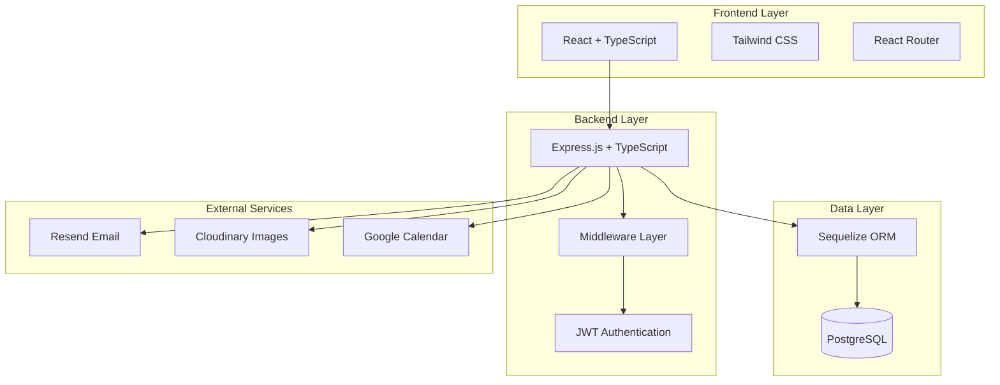
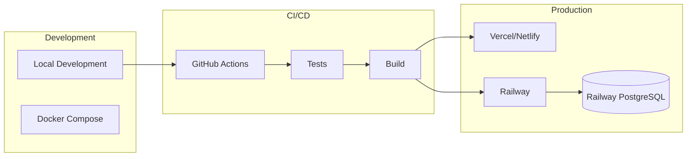
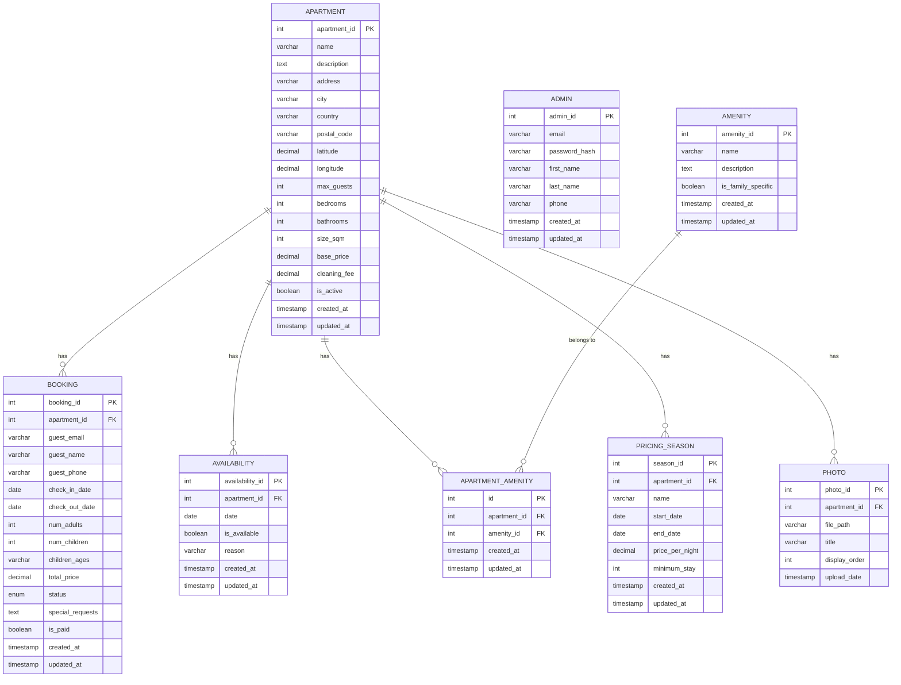
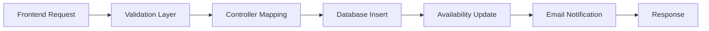

# Documentación del Proyecto Esmeralda

## Índice
- [0. Ficha del proyecto](#0-ficha-del-proyecto)
- [1. Descripción general del producto](#1-descripción-general-del-producto)
- [2. Arquitectura del Sistema](#2-arquitectura-del-sistema)
- [3. Modelo de Datos](#3-modelo-de-datos)
- [4. Especificación de la API](#4-especificación-de-la-api)
- [5. Historias de Usuario](#5-historias-de-usuario)
- [6. Tickets de Trabajo](#6-tickets-de-trabajo)

## 0. Ficha del proyecto

### 0.1. Tu nombre completo:
Miguel Ángel García Honrubia

### 0.2. Nombre del proyecto:
Sistema de Reserva de Apartamentos Familiares "Esmeralda"

### 0.3. Descripción breve del proyecto:
Esmeralda es una plataforma web especializada en la gestión y reserva de 4 apartamentos familiares específicos. Diseñada para un negocio familiar con un número fijo de propiedades, facilita la exposición, gestión y alquiler directo de estos apartamentos sin intermediarios, con un enfoque en la experiencia familiar personalizada.

### 0.4. URL del proyecto:
- **Frontend**: https://esmeraldaapartments.up.railway.app/
- **Backend**: https://esmeralda-production.up.railway.app/api-docs/#/
- **Backoffice**: https://esmeraldaapartments.up.railway.app/admin

### 0.5. URL o archivo comprimido del repositorio
https://github.com/MiguelHonrubia/esmeralda

## 1. Descripción general del producto

### 1.1. Objetivo:
**Propósito del producto:** Crear una plataforma web que permita a una familia propietaria gestionar directamente el alquiler de sus 4 apartamentos familiares, eliminando intermediarios y ofreciendo una experiencia personalizada a las familias huéspedes.

**Valor que aporta:**
- Elimina comisiones de plataformas intermediarias (20-30%)
- Proporciona comunicación directa entre propietarios y huéspedes
- Ofrece experiencia auténtica con conocimiento local personalizado
- Garantiza transparencia total en precios y condiciones

**Qué soluciona:**
- Dependencia de grandes plataformas con altas comisiones
- Falta de comunicación directa con propietarios
- Dificultad para encontrar alojamientos verdaderamente familiares
- Costos ocultos en reservas online

**Para quién:**
- **Primario**: Familias con niños (0-16 años) que buscan alojamiento vacacional
- **Secundario**: Parejas que prefieren trato personalizado
- **Terciario**: Viajeros que valoran experiencias locales auténticas

### 1.2. Características y funcionalidades principales:

#### Área Pública
1. **Presentación de apartamentos**
   - Fichas detalladas de los 4 apartamentos con fotografías profesionales
   - Descripciones personalizadas destacando características familiares
   - Información de capacidad, servicios y comodidades

2. **Sistema de disponibilidad interactivo**
   - Calendario visual con fechas disponibles/ocupadas
   - Consulta en tiempo real de disponibilidad
   - Cálculo automático de precios según temporada

3. **Proceso de reserva simplificado**
   - Formulario sin registro obligatorio
   - Proceso de 3 pasos: selección, datos, confirmación
   - Validación automática de disponibilidad

4. **Guía local integrada**
   - Recomendaciones personalizadas por la familia propietaria
   - Puntos de interés categorizados por edad
   - Mapa interactivo con ubicaciones

#### Área de Administración
1. **Panel de control centralizado**
   - Vista unificada de los 4 apartamentos
   - Dashboard con métricas de ocupación
   - Gestión de solicitudes pendientes

2. **Gestión de disponibilidad**
   - Calendario administrativo para bloquear/liberar fechas
   - Configuración de precios por temporada
   - Sincronización con calendarios externos

3. **Sistema de reservas**
   - Gestión de solicitudes (aprobar/rechazar)
   - Seguimiento de pagos manuales
   - Comunicación directa con huéspedes

### 1.3. Diseño y experiencia de usuario:
*[Pendiente: Capturas de pantalla y videotutorial del flujo de usuario]*

**Flujo principal del usuario:**
1. **Página de inicio**: Slider de imágenes con formulario de búsqueda por fechas
2. **Listado de apartamentos**: Vista de los 4 apartamentos con información básica
3. **Detalle del apartamento**: Galería de fotos, descripción, calendario y formulario de reserva
4. **Proceso de reserva**: Formulario de datos del huésped y confirmación
5. **Confirmación**: Email automático con instrucciones

### 1.4. Instrucciones de instalación:

#### Prerrequisitos:
- Node.js 18+ 
- PostgreSQL 15+
- Git

#### Instalación paso a paso:

1. **Clonar el repositorio:**
```bash
git clone [URL_REPOSITORIO]
cd esmeralda
```

2. **Configurar base de datos:**
```bash
# Iniciar PostgreSQL con Docker
docker-compose up -d
```

3. **Configurar Backend:**
```bash
cd backend
npm install
cp env.example .env
# Configurar variables de entorno en .env
npm run migrate
npm run seed
npm run dev
```

4. **Configurar Frontend:**
```bash
cd frontend
npm install
npm run dev
```

5. **Acceder a la aplicación:**
- Frontend: http://localhost:5173
- Backend API: http://localhost:3000
- API Docs: http://localhost:3000/api-docs

## 2. Arquitectura del Sistema

### 2.1. Diagrama de arquitectura:



**Patrón arquitectónico:** Arquitectura en capas (Layered Architecture) con separación Frontend/Backend

**Justificación de la elección:**
- **Simplicidad**: Adecuada para un sistema de complejidad moderada con requisitos bien definidos
- **Mantenibilidad**: Separación clara de responsabilidades facilita el mantenimiento
- **Escalabilidad controlada**: Permite crecimiento futuro sin sobreingeniería inicial
- **Desarrollo ágil**: Permite desarrollo paralelo de frontend y backend

**Beneficios:**
- ✅ Desarrollo independiente de capas
- ✅ Testing simplificado por separación de responsabilidades
- ✅ Reutilización de API para futuros clientes (móvil)
- ✅ Despliegue independiente de componentes

**Limitaciones:**
- ❌ Mayor complejidad de despliegue vs monolito puro
- ❌ Latencia de red entre capas
- ❌ Gestión de estados distribuidos

### 2.2. Descripción de componentes principales:

#### Frontend (React + TypeScript)
- **Tecnología**: React 18, Vite, Tailwind CSS
- **Responsabilidades**: UI/UX, validación cliente, gestión estado local
- **Patrones**: Component-based architecture, Custom hooks, Context API

#### Backend API (Express.js + TypeScript)
- **Tecnología**: Node.js, Express.js, TypeScript
- **Responsabilidades**: Lógica de negocio, autenticación, validación servidor
- **Patrones**: MVC, Repository pattern, Middleware pipeline

#### Base de Datos (PostgreSQL + Sequelize)
- **Tecnología**: PostgreSQL 15, Sequelize ORM
- **Responsabilidades**: Persistencia, integridad referencial, consultas complejas
- **Patrones**: Active Record (via Sequelize), Database migration

#### Servicios Externos
- **Resend**: Notificaciones por email
- **Cloudinary**: Almacenamiento y optimización de imágenes
- **Google Calendar**: Sincronización de disponibilidad

### 2.3. Descripción de alto nivel del proyecto y estructura de ficheros

```
esmeralda/
├── frontend/                 # Aplicación React
│   ├── src/
│   │   ├── components/      # Componentes reutilizables
│   │   ├── pages/          # Páginas principales
│   │   ├── hooks/          # Custom hooks
│   │   ├── services/       # Servicios API
│   │   ├── types/          # Definiciones TypeScript
│   │   └── utils/          # Utilidades
│   ├── public/             # Archivos estáticos
│   └── dist/               # Build de producción
├── backend/                # API Express.js
│   ├── src/
│   │   ├── controllers/    # Controladores MVC
│   │   ├── models/         # Modelos Sequelize
│   │   ├── routes/         # Definición de rutas
│   │   ├── middleware/     # Middleware personalizado
│   │   ├── services/       # Lógica de negocio
│   │   ├── validators/     # Validaciones
│   │   ├── config/         # Configuraciones
│   │   └── database/       # Migraciones y seeds
│   └── dist/               # Build de producción
├── docker-compose.yml      # Configuración Docker
├── README.md              # Documentación principal
├── TASKS.md               # Plan de desarrollo
└── prompts.md             # Historial de desarrollo
```

**Patrón de arquitectura**: Monorepo con separación clara Frontend/Backend siguiendo principios de Clean Architecture.

### 2.4. Infraestructura y despliegue



**Proceso de despliegue:**
1. **Desarrollo**: Docker Compose para entorno local
2. **CI/CD**: GitHub Actions para tests automatizados
3. **Frontend**: Despliegue automático en Vercel/Netlify
4. **Backend**: Despliegue en Railway con base de datos PostgreSQL
5. **Monitoreo**: Logs centralizados y métricas básicas

### 2.5. Seguridad

#### Prácticas implementadas:

1. **Autenticación y Autorización**
   - JWT tokens para sesiones
   - Middleware de autorización para rutas admin
   - Validación de roles de usuario

2. **Validación de Datos**
   - Validación exhaustiva con express-validator
   - Sanitización de inputs
   - Validación de tipos TypeScript

3. **Protección de API**
   - Rate limiting para prevenir ataques
   - CORS configurado para dominios específicos
   - Headers de seguridad con helmet

4. **Gestión de Secretos**
   - Variables de entorno para credenciales
   - .env files excluidos del control de versiones
   - Rotación periódica de tokens

**Ejemplo de middleware de seguridad:**
```typescript
// Validación de JWT
const authMiddleware = (req: Request, res: Response, next: NextFunction) => {
  const token = req.headers.authorization?.split(' ')[1];
  if (!token) return res.status(401).json({ error: 'Token required' });
  // Verificación JWT...
};
```

### 2.6. Tests

#### Backend Tests (Jest + Supertest)
- **Unit Tests**: Controladores, servicios, modelos
- **Integration Tests**: Endpoints API completos
- **Database Tests**: Operaciones CRUD con base de datos de test

**Ejemplo de test de controlador:**
```typescript
describe('ApartmentController', () => {
  it('should return all apartments', async () => {
    const response = await request(app)
      .get('/api/apartments')
      .expect(200);
    expect(response.body).toHaveLength(4);
  });
});
```

#### Frontend Tests (En desarrollo)
- **Component Tests**: Renderizado y props
- **Integration Tests**: Flujos de usuario
- **E2E Tests**: Casos de uso completos

**Cobertura actual**: ~70% en backend, frontend en desarrollo

## 3. Modelo de Datos

### 3.1. Diagrama del modelo de datos:



### 3.2. Descripción de entidades principales:

#### APARTMENT
**Descripción**: Entidad central que representa cada uno de los 4 apartamentos familiares.

**Atributos principales:**
- `apartment_id` (INT, PK, AUTO_INCREMENT): Identificador único
- `name` (VARCHAR(255), NOT NULL): Nombre del apartamento
- `description` (TEXT): Descripción detallada
- `address` (VARCHAR(255), NOT NULL): Dirección completa
- `max_guests` (INT, NOT NULL): Capacidad máxima
- `base_price` (DECIMAL(10,2), NOT NULL): Precio base por noche
- `is_active` (BOOLEAN, DEFAULT true): Estado de activación

**Relaciones:**
- 1:N con BOOKING (Un apartamento puede tener múltiples reservas)
- 1:N con AVAILABILITY (Un apartamento tiene múltiples registros de disponibilidad)
- N:M con AMENITY (a través de APARTMENT_AMENITY)

#### BOOKING
**Descripción**: Representa las reservas realizadas por los huéspedes.

**Atributos principales:**
- `booking_id` (INT, PK, AUTO_INCREMENT): Identificador único
- `apartment_id` (INT, FK, NOT NULL): Referencia al apartamento
- `guest_email` (VARCHAR(255), NOT NULL): Email del huésped
- `check_in_date` (DATE, NOT NULL): Fecha de entrada
- `check_out_date` (DATE, NOT NULL): Fecha de salida
- `status` (ENUM('pending', 'confirmed', 'cancelled', 'completed')): Estado de la reserva
- `total_price` (DECIMAL(10,2), NOT NULL): Precio total calculado

**Restricciones:**
- CHECK: check_out_date > check_in_date
- UNIQUE: apartment_id + check_in_date (previene dobles reservas)

#### AVAILABILITY
**Descripción**: Controla la disponibilidad diaria de cada apartamento.

**Atributos principales:**
- `availability_id` (INT, PK, AUTO_INCREMENT): Identificador único
- `apartment_id` (INT, FK, NOT NULL): Referencia al apartamento
- `date` (DATE, NOT NULL): Fecha específica
- `is_available` (BOOLEAN, DEFAULT true): Disponibilidad
- `reason` (VARCHAR(255)): Motivo del bloqueo si no está disponible

**Restricciones:**
- UNIQUE: apartment_id + date (una entrada por apartamento por día)

#### ADMIN
**Descripción**: Usuarios administradores del sistema (familia propietaria).

**Atributos principales:**
- `admin_id` (INT, PK, AUTO_INCREMENT): Identificador único
- `email` (VARCHAR(255), UNIQUE, NOT NULL): Email único para login
- `password_hash` (VARCHAR(255), NOT NULL): Hash de contraseña
- `first_name` (VARCHAR(100), NOT NULL): Nombre
- `last_name` (VARCHAR(100), NOT NULL): Apellido

**Restricciones:**
- UNIQUE: email
- Validación: email format

## 4. Especificación de la API

### Endpoint 1: Obtener Apartamentos

```yaml
openapi: 3.0.0
paths:
  /api/apartments:
    get:
      summary: Obtiene la lista de todos los apartamentos
      description: Retorna información básica de los 4 apartamentos familiares
      responses:
        '200':
          description: Lista de apartamentos exitosa
          content:
            application/json:
              schema:
                type: array
                items:
                  type: object
                  properties:
                    apartment_id:
                      type: integer
                      example: 1
                    name:
                      type: string
                      example: "Apartamento Marina"
                    description:
                      type: string
                      example: "Ideal para familias con niños pequeños"
                    max_guests:
                      type: integer
                      example: 6
                    base_price:
                      type: number
                      format: decimal
                      example: 85.00
                    photos:
                      type: array
                      items:
                        type: object
                        properties:
                          file_path:
                            type: string
                          title:
                            type: string
```

**Ejemplo de petición:**
```http
GET /api/apartments HTTP/1.1
Host: localhost:3000
Accept: application/json
```

**Ejemplo de respuesta:**
```json
[
  {
    "apartment_id": 1,
    "name": "Apartamento Marina",
    "description": "Ideal para familias con niños pequeños...",
    "max_guests": 6,
    "base_price": 85.00,
    "photos": [
      {
        "file_path": "/uploads/marina_1.jpg",
        "title": "Vista principal"
      }
    ]
  }
]
```

### Endpoint 2: Crear Reserva

```yaml
  /api/bookings:
    post:
      summary: Crea una nueva solicitud de reserva
      description: Permite a un huésped solicitar la reserva de un apartamento
      requestBody:
        required: true
        content:
          application/json:
            schema:
              type: object
              required:
                - apartment_id
                - guest_email
                - guest_name
                - check_in_date
                - check_out_date
                - num_adults
              properties:
                apartment_id:
                  type: integer
                  example: 1
                guest_email:
                  type: string
                  format: email
                  example: "familia@example.com"
                guest_name:
                  type: string
                  example: "Juan Pérez"
                check_in_date:
                  type: string
                  format: date
                  example: "2024-07-15"
                check_out_date:
                  type: string
                  format: date
                  example: "2024-07-20"
                num_adults:
                  type: integer
                  example: 2
                num_children:
                  type: integer
                  example: 1
      responses:
        '201':
          description: Reserva creada exitosamente
        '400':
          description: Error de validación
        '409':
          description: Apartamento no disponible para las fechas solicitadas
```

### Endpoint 3: Verificar Disponibilidad

```yaml
  /api/apartments/{id}/availability:
    get:
      summary: Verifica disponibilidad de un apartamento
      description: Retorna el calendario de disponibilidad para un apartamento específico
      parameters:
        - name: id
          in: path
          required: true
          schema:
            type: integer
        - name: start_date
          in: query
          required: true
          schema:
            type: string
            format: date
        - name: end_date
          in: query
          required: true
          schema:
            type: string
            format: date
      responses:
        '200':
          description: Disponibilidad obtenida exitosamente
          content:
            application/json:
              schema:
                type: object
                properties:
                  apartment_id:
                    type: integer
                  available_dates:
                    type: array
                    items:
                      type: string
                      format: date
                  blocked_dates:
                    type: array
                    items:
                      type: string
                      format: date
```

## 5. Historias de Usuario

### Historia de Usuario 1: Exploración de Apartamentos

**Como** visitante del sitio web, **quiero** explorar los 4 apartamentos disponibles **para** encontrar el que mejor se adapte a las necesidades de mi familia.

**Descripción:** El usuario debe poder acceder a una página principal que muestre los 4 apartamentos familiares con información básica y navegación intuitiva hacia los detalles de cada uno.

**Criterios de Aceptación:**
- **Dado que** soy un visitante, **cuando** accedo a la página principal, **entonces** veo un listado claro de los 4 apartamentos con sus nombres, imágenes principales y precios base.
- **Dado que** estoy explorando los apartamentos, **cuando** hago clic en uno de ellos, **entonces** soy dirigido a una página de detalle completa.
- **Dado que** estoy en la página de detalle, **cuando** navego por ella, **entonces** puedo ver múltiples fotografías, descripción completa, características familiares y ubicación.
- **Dado que** quiero comparar opciones, **cuando** navego entre apartamentos, **entonces** puedo volver fácilmente al listado principal.

**Criterios de Finalización:**
- Página principal responsive implementada
- 4 apartamentos con datos reales cargados
- Navegación fluida entre listado y detalle
- Imágenes optimizadas para carga rápida
- Tests de componentes pasando

**Valor de Negocio:** Alta - Funcionalidad core para captación de clientes

### Historia de Usuario 2: Solicitud de Reserva

**Como** huésped interesado, **quiero** solicitar la reserva de un apartamento para fechas específicas **para** asegurar mi alojamiento familiar.

**Descripción:** El usuario debe poder completar un proceso de reserva simplificado que incluya verificación de disponibilidad, entrada de datos personales y confirmación de solicitud.

**Criterios de Aceptación:**
- **Dado que** he seleccionado un apartamento, **cuando** elijo fechas en el calendario, **entonces** el sistema verifica automáticamente la disponibilidad.
- **Dado que** las fechas están disponibles, **cuando** procedo con la reserva, **entonces** accedo a un formulario claro con campos obligatorios marcados.
- **Dado que** completo todos los datos requeridos, **cuando** envío el formulario, **entonces** recibo confirmación inmediata de que mi solicitud ha sido enviada.
- **Dado que** he enviado la solicitud, **cuando** el administrador la procesa, **entonces** recibo un email con las instrucciones de pago.

**Criterios de Finalización:**
- Formulario de reserva con validación completa
- Verificación de disponibilidad en tiempo real
- Sistema de notificaciones por email funcionando
- Proceso completo testado end-to-end
- Documentación de flujo creada

**Valor de Negocio:** Crítico - Conversión directa en ingresos

### Historia de Usuario 3: Gestión de Reservas (Admin)

**Como** administrador familiar, **quiero** gestionar las solicitudes de reserva recibidas **para** confirmar, rechazar o solicitar información adicional de manera eficiente.

**Descripción:** El administrador debe poder acceder a un panel donde visualice todas las solicitudes, revise detalles y cambie estados de reservas con notificaciones automáticas.

**Criterios de Aceptación:**
- **Dado que** soy administrador autenticado, **cuando** accedo al panel, **entonces** veo todas las solicitudes organizadas por estado y fecha.
- **Dado que** estoy revisando una solicitud, **cuando** hago clic en ella, **entonces** veo todos los detalles del huésped y la estancia solicitada.
- **Dado que** he decidido sobre una solicitud, **cuando** cambio su estado a "confirmada" o "rechazada", **entonces** el huésped recibe automáticamente un email informativo.
- **Dado que** gestiono múltiples solicitudes, **cuando** filtro por apartamento o fecha, **entonces** puedo enfocarme en solicitudes específicas.

**Criterios de Finalización:**
- Panel de administración con autenticación funcional
- CRUD completo de reservas implementado
- Sistema de notificaciones automáticas
- Filtros y búsqueda operativos
- Tests de seguridad y funcionalidad

**Valor de Negocio:** Alta - Eficiencia operativa crítica

## 6. Tickets de Trabajo

### Ticket 1: Implementación de API de Disponibilidad (Backend)

**ID:** BACK-001
**Tipo:** Backend Development
**Prioridad:** Alta
**Sprint:** 2
**Estimación:** 8 horas

**Descripción:**
Implementar el endpoint `/api/apartments/{id}/availability` que permita consultar y gestionar la disponibilidad de apartamentos por fechas, incluyendo lógica de negocio para prevenir conflictos de reservas.

**Objetivos:**
- Crear endpoint GET para consultar disponibilidad por rango de fechas
- Implementar lógica de cálculo de disponibilidad considerando reservas existentes
- Añadir validaciones para fechas válidas y rangos coherentes
- Integrar con modelo de datos de Availability y Booking

**Criterios de Aceptación:**
- ✅ Endpoint responde correctamente con fechas disponibles/bloqueadas
- ✅ Validación de parámetros de entrada (fechas, apartment_id)
- ✅ Lógica de negocio previene dobles reservas
- ✅ Tests unitarios cubren casos edge
- ✅ Documentación OpenAPI actualizada

**Tareas Técnicas:**
1. **Diseño de la respuesta del endpoint**
   ```typescript
   interface AvailabilityResponse {
     apartment_id: number;
     available_dates: string[];
     blocked_dates: string[];
     pricing_info: PricingInfo[];
   }
   ```

2. **Implementación del controlador**
   - Crear `AvailabilityController.getApartmentAvailability()`
   - Validar parámetros con express-validator
   - Implementar lógica de consulta de disponibilidad

3. **Servicios de lógica de negocio**
   - `AvailabilityService.checkDateRange()`
   - `BookingService.getConflictingBookings()`
   - `PricingService.calculatePriceForDates()`

4. **Tests de integración**
   - Casos normales: fechas disponibles/ocupadas
   - Casos edge: fechas pasadas, rangos inválidos
   - Tests de rendimiento para consultas de grandes rangos

**Dependencias:**
- Modelos Apartment, Booking, Availability implementados
- Base de datos con datos de prueba

**Criterios de Finalización:**
- Código revisado y aprobado
- Tests pasando con cobertura >80%
- Documentación API actualizada
- Deploy en entorno de desarrollo exitoso

---

### Ticket 2: Componente de Calendario de Disponibilidad (Frontend)

**ID:** FRONT-001
**Tipo:** Frontend Development
**Prioridad:** Alta
**Sprint:** 3
**Estimación:** 12 horas

**Descripción:**
Desarrollar un componente React interactivo que muestre la disponibilidad de apartamentos en formato calendario, permita selección de fechas y se integre con la API de disponibilidad.

**Objetivos:**
- Crear componente de calendario visual y responsive
- Implementar selección de rango de fechas
- Integrar con API de disponibilidad para mostrar estados en tiempo real
- Optimizar rendimiento para múltiples consultas

**Criterios de Aceptación:**
- ✅ Calendario muestra claramente fechas disponibles/ocupadas/bloqueadas
- ✅ Selección de fechas intuitiva con validación en tiempo real
- ✅ Responsive design funciona en móvil y desktop
- ✅ Loading states y error handling implementados
- ✅ Integración completa con API backend

**Tareas Técnicas:**
1. **Estructura del componente**
   ```typescript
   interface AvailabilityCalendarProps {
     apartmentId: number;
     onDateSelect: (startDate: Date, endDate: Date) => void;
     initialSelectedDates?: { start: Date; end: Date };
   }
   ```

2. **Diseño visual con Tailwind CSS**
   - Grid layout responsive para días del mes
   - Estados visuales: disponible (verde), ocupado (rojo), bloqueado (gris)
   - Animaciones suaves para transiciones de estado
   - Indicadores de carga y feedback visual

3. **Lógica de interacción**
   - Hook personalizado `useCalendarSelection`
   - Validación de selección (no permitir fechas pasadas)
   - Gestión de estado de fechas seleccionadas
   - Debouncing para consultas API

4. **Integración con API**
   - Service `availabilityService.getApartmentAvailability()`
   - React Query para caching y estado de loading
   - Error boundaries para manejo de errores
   - Revalidación automática en cambios

**Dependencias:**
- API backend `/api/apartments/{id}/availability` funcional
- Componentes base de UI (Button, Loading, etc.)
- Configuración de React Query

**Criterios de Finalización:**
- Componente testado con React Testing Library
- Storybook con todos los estados documentados
- Código revisado y optimizado
- Integración E2E con backend verificada

---

### Ticket 3: Migraciones de Base de Datos para Sistema de Reservas (Database)

**ID:** DB-001
**Tipo:** Database Development
**Prioridad:** Crítica
**Sprint:** 1
**Estimación:** 6 horas

**Descripción:**
Crear sistema completo de migraciones para la base de datos del sistema de reservas, incluyendo todas las tablas principales, índices, restricciones y datos semilla para desarrollo.

**Objetivos:**
- Establecer esquema completo de base de datos
- Crear sistema de migraciones versionado y reversible
- Implementar datos semilla para desarrollo y testing
- Optimizar performance con índices apropiados

**Criterios de Aceptación:**
- ✅ Todas las tablas creadas con restricciones correctas
- ✅ Índices optimizados para consultas frecuentes
- ✅ Migraciones reversibles y versionadas
- ✅ Datos semilla completos para 4 apartamentos
- ✅ Scripts de setup automatizados

**Tareas Técnicas:**
1. **Migración inicial - Tablas principales**
   ```sql
   -- 001_create_apartments_table.sql
   CREATE TABLE apartments (
     apartment_id SERIAL PRIMARY KEY,
     name VARCHAR(255) NOT NULL,
     description TEXT,
     max_guests INTEGER NOT NULL,
     base_price DECIMAL(10,2) NOT NULL,
     created_at TIMESTAMP DEFAULT CURRENT_TIMESTAMP
   );
   ```

2. **Migración de reservas y disponibilidad**
   ```sql
   -- 002_create_bookings_availability_tables.sql
   CREATE TABLE bookings (
     booking_id SERIAL PRIMARY KEY,
     apartment_id INTEGER REFERENCES apartments(apartment_id),
     guest_email VARCHAR(255) NOT NULL,
     check_in_date DATE NOT NULL,
     check_out_date DATE NOT NULL,
     status booking_status DEFAULT 'pending',
     CONSTRAINT valid_dates CHECK (check_out_date > check_in_date)
   );
   ```

3. **Índices para optimización**
   ```sql
   -- Índices para consultas de disponibilidad
   CREATE INDEX idx_availability_apartment_date ON availability(apartment_id, date);
   CREATE INDEX idx_bookings_dates ON bookings(apartment_id, check_in_date, check_out_date);
   CREATE INDEX idx_bookings_status ON bookings(status, created_at);
   ```

4. **Seeds data - Apartamentos y datos de prueba**
   ```javascript
   // seeders/001-apartments.js
   const apartments = [
     {
       name: 'Apartamento Marina',
       description: 'Ideal para familias con niños pequeños...',
       max_guests: 6,
       base_price: 85.00
     }
     // ... resto de apartamentos
   ];
   ```

**Scripts de automatización:**
- `npm run migrate` - Ejecutar migraciones pendientes
- `npm run migrate:rollback` - Revertir última migración
- `npm run seed` - Poblar base de datos con datos de prueba
- `npm run db:reset` - Reset completo para desarrollo

**Dependencias:**
- PostgreSQL 15+ instalado
- Sequelize CLI configurado
- Variables de entorno de base de datos

**Criterios de Finalización:**
- Migraciones ejecutan sin errores en entornos dev/test/prod
- Performance de consultas validado con datos de prueba
- Documentación de esquema actualizada
- Backup/restore procedures documentados
- Tests de integridad referencial pasando 

## 7. Pull Requests

### PR 1: Sistema de Gestión de Reservas

## 📋 Resumen
Esta pull request implementa un sistema completo de gestión de reservas para Esmeralda Beach, incluyendo autenticación, gestión de apartamentos, reservas y un dashboard analítico avanzado.

## ✨ Nuevas Funcionalidades

### 🔐 Autenticación y Seguridad
- **Sistema de autenticación completo** con contexto de usuario
- **Página de login** con validación de credenciales
- **Validación de tokens** para sesiones seguras
- **Limpieza y optimización** de la entidad de usuario en base de datos

### 🏠 Gestión de Apartamentos
- **Pantalla principal de apartamentos** con vista de tarjetas
- **Página de detalles de apartamento** con información completa
- **Calendario con selección múltiple** para gestión de disponibilidad

### 📅 Sistema de Reservas (Backoffice)
- **Página completa de gestión de reservas** con filtros avanzados
- **Filtrado por estado** (Pendientes, Confirmadas, Canceladas, Completadas)
- **Filtrado por apartamento** específico
- **Vista de próximas entradas** con diseño horizontal y responsive
- **Diálogo de gestión de reservas** para actualizar estados
- **Actualización en tiempo real** de datos

### 📊 Dashboard Analítico Avanzado

#### KPIs Principales
- ✅ Ingresos anuales y mensuales con formato de moneda
- ✅ Número de reservas por período
- ✅ Tasas de ocupación (anual y mensual)
- ✅ Precio medio por noche (ADR)
- ✅ Ingresos por habitación disponible (RevPAR)
- ✅ Tasa de cancelaciones
- ✅ Tiempo medio de respuesta
- ✅ Tasa de clientes recurrentes
- ✅ Calificación promedio

#### Sistema de Pestañas por Apartamento
- **Pestaña "Todos los apartamentos"**: Vista agregada de todos los datos
- **Pestañas individuales**: Una por cada apartamento con métricas específicas
- **Filtrado automático** de KPIs según apartamento seleccionado

#### Gráficos y Visualizaciones

**Para "Todos los apartamentos":**
- 📊 **Ingresos por apartamento** (gráfico de barras)
- 📈 **Ingresos mensuales por apartamento** con barra total (gráfico de barras agrupadas)
- 📉 **Ocupación mensual por apartamento** (gráfico de líneas múltiples con colores únicos)
- 🥧 **Distribución de estados de reservas** (gráfico circular)

**Para apartamentos individuales:**
- 📊 **Ingresos mensuales** (gráfico de barras)
- 📈 **Tasa de cancelación mensual** (gráfico de líneas)
- 📉 **Porcentaje de ocupación mensual** (gráfico de líneas)
- 🥧 **Distribución de estados de reservas** (gráfico circular)

### 🎨 Mejoras de UI/UX
- **Diseño responsive** para todas las pantallas
- **Próximas entradas en formato horizontal** con cards individuales
- **Indicadores visuales** para entradas de hoy, mañana y futuras
- **Tooltips informativos** en todos los gráficos
- **Formato de moneda europeo** (€) en todas las visualizaciones
- **Limpieza del layout de administración** removiendo páginas no utilizadas

### 🔧 Optimizaciones Técnicas
- **Corrección de cálculos** en métricas del dashboard
- **Conversión de tipos** para evitar errores de cálculo (`Number()` en `totalPrice`)
- **Gestión eficiente del estado** con filtros reactivos
- **Validación de fechas** robusta para evitar errores de parsing
- **Manejo de errores** mejorado con notificaciones toast

## 🛠️ Tecnologías Utilizadas
- **React 18** con TypeScript
- **Recharts** para visualizaciones de datos
- **date-fns** para manejo de fechas
- **Radix UI** para componentes de interfaz
- **Tailwind CSS** para estilos
- **React Query** para gestión de estado del servidor

## 📈 Métricas Implementadas
- Revenue metrics (ingresos anuales/mensuales)
- Occupancy rates (tasas de ocupación)
- ADR (Average Daily Rate)
- RevPAR (Revenue per Available Room)
- Cancellation rates
- Customer retention metrics
- Booking volume tracking

## 🧪 Testing
- ✅ Validación de datos de entrada
- ✅ Manejo de estados de error
- ✅ Responsive design verificado
- ✅ Compatibilidad con diferentes tamaños de pantalla

## 🚀 Próximos Pasos
- Integración con sistema de notificaciones
- Exportación de reportes en PDF
- Métricas de satisfacción del cliente
- Dashboard de comparativas año a año


### PR 2: Implementación Completa de Sistema de Testing

## 📋 Resumen
Esta PR implementa un sistema completo de testing para el backend, incluyendo tests unitarios e integración, con configuración robusta y cobertura del 90%.

## 🔧 Cambios Principales

### **Configuración de Testing**
- ✅ **Arreglado setup de tests**: Corregidos errores de TypeScript en `src/__tests__/setup.ts`
  - Eliminados mocks problemáticos con `setTimeout.unref()`
  - Corregidos tipos `never` en mocks de bcrypt, jsonwebtoken, googleapis y database
  - Implementados mocks más robustos usando funciones arrow

### **Tests Unitarios**
- ✅ **ApartmentController**: Tests completos para métodos existentes
- ✅ **AmenityController**: Cobertura completa con mocks apropiados
- ✅ **EmailService**: Tests unitarios implementados
- ✅ **CloudinaryService**: Tests de servicio de imágenes
- ✅ **Cobertura del 90%**: Alcanzada cobertura objetivo

### **Tests de Integración**
- ✅ **Sistema de transacciones**: Implementado para aislamiento de base de datos
- ✅ **Apartments endpoints**: Tests E2E con datos de prueba automáticos
- ✅ **Cleanup automático**: Rollback de transacciones para no afectar DB

### **Mejoras de Código**
- 🧹 **Limpieza**: Eliminados imports no utilizados en controladores
- 📁 **Gitignore**: Archivos de cobertura excluidos del control de versiones
- 🔧 **TypeScript**: Corregidos todos los errores de tipos

## 🎯 Beneficios
- **Calidad**: Tests robustos que garantizan funcionalidad
- **Aislamiento**: Tests de integración no afectan la base de datos
- **Mantenibilidad**: Configuración reutilizable y escalable
- **Cobertura**: 90% de cobertura de código alcanzada
- **CI/CD Ready**: Tests preparados para integración continua

## 📊 Estadísticas
- **Cobertura**: 90%
- **Tests Unitarios**: Múltiples controladores y servicios
- **Tests Integración**: Endpoints principales
- **Archivos de Test**: Setup completo con mocks y transacciones

## 🔍 Archivos Modificados
- `backend/src/__tests__/setup.ts` - Configuración base de tests
- `backend/src/controllers/__tests__/*` - Tests unitarios de controladores  
- `backend/src/services/__tests__/*` - Tests de servicios
- `backend/src/__tests__/integration/*` - Tests de integración
- `backend/.gitignore` - Exclusión de archivos de cobertura

## 📝 Commits Incluidos
- `first unit tests` - Implementación inicial de tests unitarios
- `all tests fixed` - Corrección de errores en configuración de tests
- `tests` - Adición de tests adicionales
- `90 coverage` - Alcanzada cobertura del 90%
- `more tests` - Expansión de cobertura de tests
- `feat: remove coverage files from Git tracking and update .gitignore` - Limpieza de archivos de cobertura
- `last unit tests` - Finalización de tests unitarios

Esta implementación establece una base sólida para el desarrollo dirigido por tests (TDD) y garantiza la calidad del código en futuras iteraciones.

### PR 3: Refactorización Completa del Endpoint POST /bookings

## 📋 Descripción

Esta PR refactoriza completamente el endpoint `POST /bookings` para alinearlo con la estructura real de la entidad booking, eliminando el campo `userId` inexistente y añadiendo todas las validaciones y funcionalidades necesarias.

## 🎯 Objetivos Cumplidos

- ❌ **Eliminado**: Campo `userId` que no existe en la entidad booking
- ✅ **Implementado**: Estructura completa de datos según la entidad
- ✅ **Añadido**: Validaciones robustas con soporte dual de formatos
- ✅ **Corregido**: Servicio de email para confirmaciones
- ✅ **Mejorado**: Seguridad y protección de credenciales

## 🔧 Cambios Realizados

### 1. **Backend Routes** (`/backend/src/routes/bookings.ts`)
```diff
- userId (campo inexistente eliminado)
+ guestName, guestEmail, guestPhone
+ checkInDate, checkOutDate, numberOfGuests
+ totalPrice, notes, status
+ Documentación Swagger completa
+ Middleware de validación en todas las rutas
```

### 2. **Backend Controller** (`/backend/src/controllers/BookingController.ts`)
```typescript
// Soporte para estructura frontend moderna
{
  "apartmentId": 1,
  "checkIn": "2025-05-23",
  "checkOut": "2025-05-30", 
  "guestCount": 2,
  "totalPrice": 350.00,
  "guestInfo": {
    "firstName": "Carlos",
    "lastName": "Ruiz",
    "email": "carlos@example.com",
    "phone": "+34123456789"
  }
}
```

**Nuevas Validaciones:**
- ✅ Verificación de capacidad del apartamento
- ✅ Validación de fechas no en el pasado
- ✅ Mapeo automático: `firstName + lastName` → `guestName`
- ✅ Gestión automática de disponibilidad del calendario

### 3. **Backend Validators** (`/backend/src/validators/bookingValidators.ts`)
```typescript
// Validación dual: Frontend + Legacy
- Soporte para checkIn/checkOut Y checkInDate/checkOutDate
- Soporte para guestCount Y numberOfGuests
- Validación de email con regex
- Validación de teléfono internacional
- Status enum actualizado (incluye 'rejected')
```

### 4. **Email Service** (`/backend/src/services/EmailService.ts`)
```diff
- bookingDetails.totalPrice.toFixed(2) // Error: string no tiene toFixed
+ const totalPriceNum = typeof bookingDetails.totalPrice === 'string' 
+   ? parseFloat(bookingDetails.totalPrice) 
+   : bookingDetails.totalPrice;
+ totalPriceNum.toFixed(2) // ✅ Funciona correctamente
```

### 5. **Configuración de Seguridad**
```bash
# Protección de credenciales
git rm --cached backend/.env
# Archivo .env ya no es rastreado por Git
```

## 🧪 Casos de Uso Soportados

### Estructura Frontend (Recomendada)
```json
{
  "apartmentId": 1,
  "checkIn": "2025-05-23",
  "checkOut": "2025-05-30",
  "guestCount": 2,
  "totalPrice": 350.00,
  "guestInfo": {
    "firstName": "Carlos",
    "lastName": "Ruiz",
    "email": "carlos.ruiz@example.com",
    "phone": "+34987654321",
    "address": "Calle Principal 123",
    "city": "Madrid",
    "zipCode": "28001",
    "country": "Spain",
    "specialRequests": "Check-in anticipado"
  }
}
```

### Estructura Legacy (Compatibilidad)
```json
{
  "apartmentId": 1,
  "guestName": "Carlos Ruiz",
  "guestEmail": "carlos.ruiz@example.com",
  "guestPhone": "+34987654321",
  "checkInDate": "2025-05-23",
  "checkOutDate": "2025-05-30",
  "numberOfGuests": 2,
  "totalPrice": 350.00,
  "notes": "Check-in anticipado"
}
```

## ✅ Validaciones Implementadas

| Campo | Validación | Mensaje de Error |
|-------|------------|------------------|
| `apartmentId` | Entero positivo requerido | "Apartment ID must be a positive integer" |
| `checkIn/checkInDate` | Fecha ISO válida, no en el pasado | "Check-in date cannot be in the past" |
| `checkOut/checkOutDate` | Fecha ISO válida, posterior al check-in | "Check-out date must be after check-in date" |
| `guestCount/numberOfGuests` | Entero positivo, no exceder capacidad | "Number of guests exceeds apartment capacity" |
| `totalPrice` | Número positivo requerido | "Total price must be a positive number" |
| `guestInfo.email` | Formato de email válido | "Invalid email format" |
| `guestInfo.phone` | Formato internacional | "Invalid phone format. Use international format" |

## 📊 Flujo Completo



## 🔄 Backward Compatibility

✅ **Mantenida**: El endpoint sigue soportando la estructura legacy
✅ **Mejorada**: Nueva estructura más rica y detallada
✅ **Flexible**: Mapeo automático entre formatos

## 🛡️ Seguridad

- ✅ Archivo `.env` removido del tracking de Git
- ✅ Credenciales protegidas permanentemente
- ✅ Validaciones robustas contra inyección de datos

## 🧪 Testing

### Casos de Prueba Cubiertos:
- ✅ Estructura frontend completa
- ✅ Estructura legacy 
- ✅ Validación de fechas
- ✅ Validación de capacidad
- ✅ Formato de email y teléfono
- ✅ Envío de email de confirmación

### Para Probar:
```bash
# Endpoint
POST /api/bookings

# Headers
Content-Type: application/json

# Body (usar cualquiera de las estructuras documentadas arriba)
```

## 📈 Beneficios

1. **Datos Completos**: Toda la información necesaria se almacena correctamente
2. **Validación Robusta**: Prevención de errores de datos
3. **Flexibilidad**: Soporte para múltiples formatos de entrada
4. **Mantenibilidad**: Código mejor estructurado y documentado
5. **Seguridad**: Protección de credenciales y validación de entrada