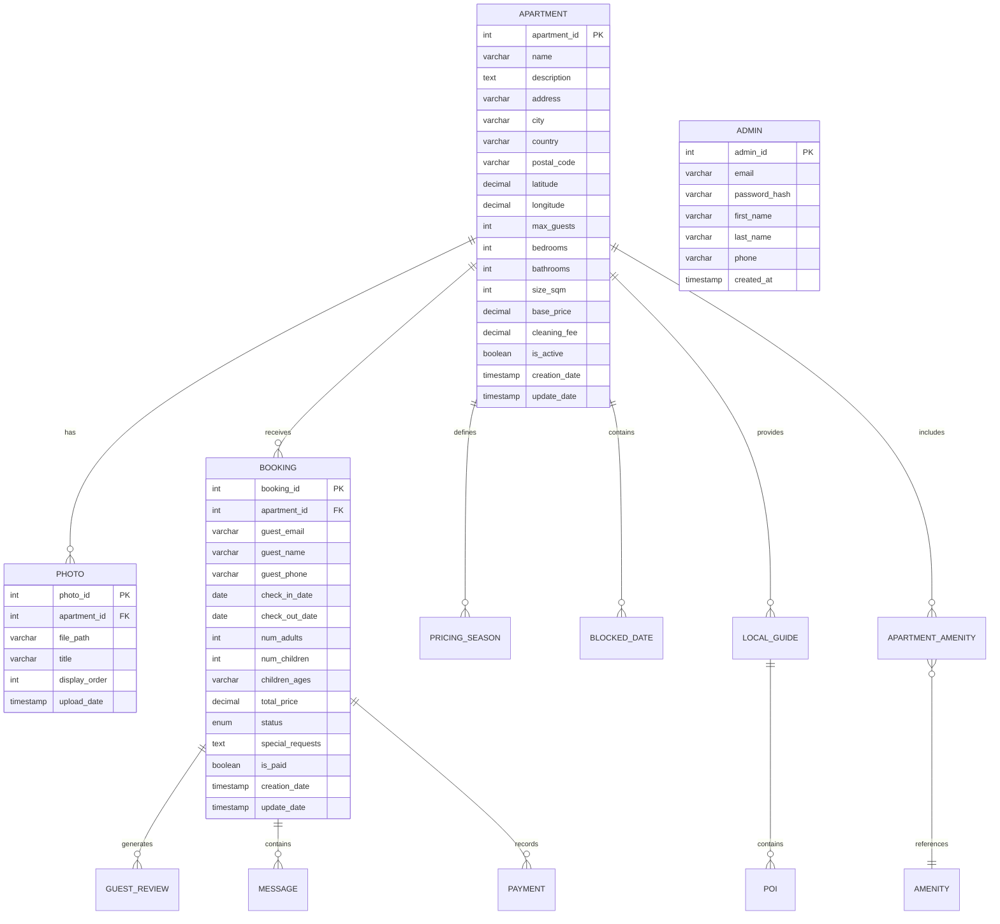

# Ficha del proyecto: Sistema de Reserva de Apartamentos Familiares "Esmeralda"

## 0. Ficha del proyecto
### 0.1. Tu nombre completo:
Miguel Ángel García Honrubia

### 0.2. Nombre del proyecto:
Sistema de Reserva de Apartamentos Familiares "Esmeralda"

### 0.3. Descripción breve del proyecto:
Plataforma web especializada en la gestión y reserva de 4 apartamentos familiares específicos, diseñada para un negocio familiar. Facilita la exposición, gestión y alquiler directo sin intermediarios, con enfoque en la experiencia familiar personalizada.

### 0.4. URL del proyecto:
[URL del proyecto - A compartir de forma segura si es privada]

### 0.5. URL o archivo comprimido del repositorio:
https://github.com/MiguelHonrubia/esmeralda

## 1. Descripción general del producto

### 1.1. Objetivo:
El sistema Esmeralda tiene como propósito eliminar intermediarios en la gestión de apartamentos familiares, permitiendo una conexión directa entre propietarios y huéspedes. Aporta valor a familias que buscan alojamientos genuinamente adaptados a sus necesidades, con transparencia total en precios y condiciones. Soluciona la falta de opciones realmente familiares y las elevadas comisiones de las grandes plataformas (20-30%), beneficiando tanto a los propietarios como a las familias viajeras.

### 1.2. Características y funcionalidades principales:

1. **Presentación detallada de apartamentos**
   - Fichas completas con fotografías de alta calidad
   - Descripciones personalizadas enfocadas en características familiares
   - Exposición clara de tarifas y condiciones

2. **Calendario de disponibilidad interactivo**
   - Visualización intuitiva de fechas disponibles, ocupadas o bloqueadas
   - Sincronización con calendarios externos (Google, iCal)
   - Precios diferenciados por temporada

3. **Sistema de reservas simplificado**
   - Proceso en 3 pasos sin registro obligatorio
   - Formulario de solicitud con información esencial
   - Confirmación automatizada por email

4. **Panel de administración centralizado**
   - Gestión unificada de los 4 apartamentos
   - Control de solicitudes, reservas y pagos
   - Estadísticas de ocupación y rendimiento

5. **Guía local interactiva**
   - Mapa personalizado con puntos de interés para familias
   - Recomendaciones categorizadas por edad
   - Información auténtica proporcionada por la familia propietaria

6. **Comunicación directa con huéspedes**
   - Sistema de mensajería interna
   - Notificaciones automatizadas pre-llegada y post-estancia
   - Plantillas personalizables para comunicaciones frecuentes

### 1.3. Diseño y experiencia de usuario:
[Aquí irían imágenes/videotutorial mostrando la experiencia del usuario con la aplicación]

### 1.4. Instrucciones de instalación:

#### Requisitos previos
- Node.js (v16 o superior)
- PostgreSQL (v14 o superior)
- Docker y Docker Compose (opcional)

#### Pasos para instalación local

1. **Clonar el repositorio**
   ```bash
   git clone https://github.com/usuario/esmeralda.git
   cd esmeralda
   ```

2. **Configurar variables de entorno**
   ```bash
   cp .env.example .env
   # Editar .env con los valores correspondientes
   ```

3. **Instalar dependencias**
   ```bash
   # Frontend
   cd frontend
   npm install
   
   # Backend
   cd ../backend
   npm install
   ```

4. **Configurar base de datos**
   ```bash
   # Crear base de datos
   createdb esmeralda
   
   # Ejecutar migraciones
   cd backend
   npm run migrate
   
   # Cargar datos semilla
   npm run seed
   ```

5. **Iniciar servicios**
   ```bash
   # Con Docker
   docker-compose up
   
   # Sin Docker (desarrollo)
   # Terminal 1 - Backend
   cd backend
   npm run dev
   
   # Terminal 2 - Frontend
   cd frontend
   npm run dev
   ```

6. **Acceder a la aplicación**
   - Frontend: http://localhost:5173
   - Backend API: http://localhost:3000
   - Panel de administración: http://localhost:5173/admin (credenciales en .env.example)

## 2. Arquitectura del Sistema

### 2.1. Diagrama de arquitectura:

```
+------------------------+        +------------------------+
|                        |        |                        |
|   FRONTEND (React)     |<------>|   BACKEND (Express)    |
|   - Vite               |   API  |   - Node.js            |
|   - Tailwind CSS       |  REST  |   - Express.js         |
|   - i18n               |        |   - JWT Auth           |
|                        |        |                        |
+------------------------+        +------------+-----------+
                                             |
          +-----------------------------+    |    +---------------------------+
          |                             |    |    |                          |
          |   SERVICIOS EXTERNOS        |<---+--->|   BASE DE DATOS          |
          |   - SendGrid (email)        |         |   - PostgreSQL           |
          |   - Cloudinary (imágenes)   |         |   - Migrations           |
          |   - Google Calendar API     |         |   - Seeds                |
          |                             |         |                          |
          +-----------------------------+         +--------------------------+
```

La arquitectura elegida sigue el patrón Cliente-Servidor con una API RESTful que conecta el frontend y el backend. Se ha optado por esta arquitectura por:

**Beneficios:**
- Separación clara de responsabilidades entre presentación y lógica de negocio
- Escalabilidad independiente de componentes
- Facilidad de mantenimiento y actualización por módulos
- Posibilidad de desarrollo en paralelo (equipos frontend/backend)
- Compatibilidad con estándares modernos de desarrollo web

**Sacrificios:**
- Mayor complejidad inicial que una solución monolítica
- Necesidad de gestión de estado en el cliente
- Potenciales problemas de rendimiento por múltiples llamadas API

### 2.2. Descripción de componentes principales:

1. **Frontend**
   - **Tecnología**: React + Vite + Tailwind CSS
   - **Propósito**: Interfaz de usuario responsive con área pública y panel de administración
   - **Características**: Sistema de componentes reutilizables, implementación i18n, gestión de estados con React Context API

2. **Backend**
   - **Tecnología**: Node.js + Express.js
   - **Propósito**: API RESTful, lógica de negocio y autenticación
   - **Características**: Middleware para validación, servicios modulares, autenticación JWT, integración con servicios externos

3. **Base de Datos**
   - **Tecnología**: PostgreSQL
   - **Propósito**: Almacenamiento persistente de datos
   - **Características**: Esquema relacional, migraciones para control de versiones, transacciones para integridad de datos

4. **Servicios Externos**
   - **SendGrid**: Envío de emails para notificaciones y comunicación
   - **Cloudinary**: Almacenamiento y optimización de imágenes
   - **Google Calendar API**: Sincronización de disponibilidad con calendarios externos

### 2.3. Descripción de alto nivel del proyecto y estructura de ficheros

```
esmeralda/
├── frontend/                # Aplicación React con Vite
│   ├── public/              # Archivos estáticos
│   │   ├── assets/          # Imágenes, fuentes, etc.
│   │   ├── src/
│   │   │   ├── components/      # Componentes reutilizables
│   │   │   ├── contexts/        # Context API para gestión de estado
│   │   │   ├── hooks/           # Custom hooks
│   │   │   ├── i18n/            # Configuración y archivos de traducción
│   │   │   ├── layouts/         # Estructuras de página reutilizables
│   │   │   ├── pages/           # Componentes de página
│   │   │   │   ├── public/      # Área pública
│   │   │   │   └── admin/       # Panel de administración
│   │   │   ├── services/        # Servicios API y utilidades
│   │   │   ├── styles/          # Configuración de Tailwind y estilos globales
│   │   │   ├── utils/           # Funciones utilitarias
│   │   │   ├── App.jsx          # Componente principal
│   │   │   └── main.jsx         # Punto de entrada
│   │   ├── .env.example         # Ejemplo de variables de entorno
│   │   └── package.json         # Dependencias y scripts
│   ├── backend/                 # API Express
│   │   ├── src/
│   │   │   ├── config/          # Configuración de la aplicación
│   │   │   ├── controllers/     # Controladores de ruta
│   │   │   ├── db/
│   │   │   │   ├── migrations/  # Migraciones de base de datos
│   │   │   │   └── seeds/       # Datos semilla
│   │   │   ├── middleware/      # Middleware personalizado
│   │   │   ├── models/          # Modelos de datos
│   │   │   ├── routes/          # Definición de rutas API
│   │   │   ├── services/        # Lógica de negocio compleja
│   │   │   ├── utils/           # Funciones utilitarias
│   │   │   └── app.js           # Punto de entrada Express
│   │   ├── .env.example         # Ejemplo de variables de entorno
│   │   └── package.json         # Dependencias y scripts
│   ├── docker-compose.yml       # Configuración Docker
│   ├── .github/                 # Workflows CI/CD
│   ├── docs/                    # Documentación del proyecto
│   └── README.md                # Instrucciones generales
```

La estructura sigue el patrón de Arquitectura Limpia (Clean Architecture), separando claramente la interfaz de usuario, lógica de negocio y acceso a datos. En el frontend se implementa un patrón de composición de componentes, mientras que el backend sigue un patrón MVC (Modelo-Vista-Controlador) adaptado a API REST.

### 2.4. Infraestructura y despliegue

**Diagrama de infraestructura:**
```
                      +------------------+
                      |                  |
  +------------------->  GitHub Actions  |
  |                   |     (CI/CD)      |
  |                   |                  |
  |                   +--------+---------+
  |                            |
  |                            v
  |                   +--------+---------+
  |                   |                  |
  |                   |  Docker Images   |
  |                   |                  |
  |                   +--------+---------+
  |                            |
PUSH                           v
  |                   +--------+---------+
  |                   |                  |
  |                   |   Cloud Server   |
  |                   |   (VPS/AWS EC2)  |
  |                   |                  |
  |                   +------------------+
  |                      |           |
  |                      v           v
  |            +-----------------+  +----------------+
  |            |                 |  |                |
  |            | Docker Compose  |  |  PostgreSQL    |
  |            | (Frontend y     |  |  Database      |
  |            |  Backend)       |  |                |
  |            +-----------------+  +----------------+
  |                      |
  |                      v
  |            +-----------------+
  |            |                 |
  +------------+    Developer    |
               |                 |
               +-----------------+
```

**Proceso de despliegue:**

1. **Desarrollo y pruebas locales**
   - Los desarrolladores trabajan en entorno local
   - Se ejecutan pruebas unitarias y de integración

2. **Integración continua**
   - Al hacer push a la rama principal, se activa el workflow de GitHub Actions
   - Se ejecutan pruebas automatizadas
   - Se construyen imágenes Docker

3. **Despliegue continuo**
   - Si las pruebas pasan, las imágenes se publican en el registro Docker
   - Se despliegan automáticamente en el servidor de producción
   - Docker Compose orquesta los contenedores de frontend, backend y servicios

4. **Monitorización**
   - Logs centralizados para análisis y depuración
   - Alertas configuradas para eventos críticos

### 2.5. Seguridad

1. **Autenticación y autorización**
   - Implementación de JWT (JSON Web Tokens) para autenticación
   - Roles y permisos para controlar acceso a recursos
   - Expiración de tokens y rotación segura

2. **Protección contra ataques comunes**
   - Implementación de rate limiting para prevenir ataques de fuerza bruta
   - Validación y sanitización de datos de entrada
   - Configuración de encabezados HTTP de seguridad (CORS, CSP, HSTS)

3. **Seguridad de datos**
   - Cifrado de datos sensibles en la base de datos
   - Implementación de HTTPS en todas las comunicaciones
   - Manejo seguro de secretos usando variables de entorno

4. **Prácticas de codificación segura**
   - Prevención de inyección SQL usando ORM y consultas parametrizadas
   - Protección contra XSS usando React (escaping automático)
   - Auditoría regular de dependencias con npm audit

### 2.6. Tests

1. **Tests unitarios**
   - Pruebas de componentes React usando React Testing Library
   - Pruebas de servicios y controladores backend con Jest

2. **Tests de integración**
   - Pruebas de flujos completos como el proceso de reserva
   - Verificación de interacción entre frontend y backend

3. **Tests E2E**
   - Pruebas de flujos críticos utilizando Cypress
   - Verificación de experiencia de usuario completa

## 3. Modelo de Datos

### 3.1. Diagrama del modelo de datos:



### 3.2. Descripción de entidades principales:

**APARTMENT**
- Propósito: Almacena la información principal de cada apartamento
- Atributos:
  - `apartment_id`: INT, PK, identificador único
  - `name`: VARCHAR(255), NOT NULL, nombre del apartamento
  - `description`: TEXT, NOT NULL, descripción detallada
  - `address`: VARCHAR(255), NOT NULL, dirección física
  - `city`: VARCHAR(100), NOT NULL, ciudad
  - `country`: VARCHAR(100), NOT NULL, país
  - `postal_code`: VARCHAR(20), código postal
  - `latitude`: DECIMAL(10,8), coordenada para mapa
  - `longitude`: DECIMAL(11,8), coordenada para mapa
  - `max_guests`: INT, NOT NULL, capacidad máxima
  - `bedrooms`: INT, NOT NULL, número de dormitorios
  - `bathrooms`: INT, NOT NULL, número de baños
  - `size_sqm`: INT, tamaño en metros cuadrados
  - `base_price`: DECIMAL(10,2), NOT NULL, precio base por noche
  - `cleaning_fee`: DECIMAL(10,2), tarifa de limpieza
  - `is_active`: BOOLEAN, DEFAULT TRUE, indica si está disponible para reservas
  - `creation_date`: TIMESTAMP, DEFAULT NOW(), fecha de creación
  - `update_date`: TIMESTAMP, fecha de última actualización

**BOOKING**
- Propósito: Registra las reservas realizadas por los huéspedes
- Atributos:
  - `booking_id`: INT, PK, identificador único
  - `apartment_id`: INT, FK, referencia al apartamento
  - `guest_email`: VARCHAR(255), NOT NULL, email del huésped
  - `guest_name`: VARCHAR(100), NOT NULL, nombre del huésped
  - `guest_phone`: VARCHAR(20), teléfono del huésped
  - `check_in_date`: DATE, NOT NULL, fecha de entrada
  - `check_out_date`: DATE, NOT NULL, fecha de salida
  - `num_adults`: INT, NOT NULL, número de adultos
  - `num_children`: INT, DEFAULT 0, número de niños
  - `children_ages`: VARCHAR(100), edades de los niños
  - `total_price`: DECIMAL(10,2), NOT NULL, precio total
  - `status`: ENUM('pending', 'confirmed', 'cancelled', 'completed'), NOT NULL, estado de la reserva
  - `special_requests`: TEXT, peticiones especiales
  - `is_paid`: BOOLEAN, DEFAULT FALSE, indica si está pagada
  - `creation_date`: TIMESTAMP, DEFAULT NOW(), fecha de creación
  - `update_date`: TIMESTAMP, fecha de última actualización

## 4. Especificación de la API

### Endpoint: Obtener Listado de Apartamentos

```yaml
openapi: 3.0.0
paths:
  /api/apartments:
    get:
      summary: Obtiene listado de apartamentos disponibles
      description: Devuelve todos los apartamentos activos con información básica
      parameters:
        - in: query
          name: limit
          schema:
            type: integer
            default: 10
          description: Número máximo de apartamentos a devolver
        - in: query
          name: offset
          schema:
            type: integer
            default: 0
          description: Número de apartamentos a saltar
      responses:
        '200':
          description: Operación exitosa
          content:
            application/json:
              schema:
                type: object
                properties:
                  count:
                    type: integer
                  data:
                    type: array
                    items:
                      type: object
                      properties:
                        apartment_id:
                          type: integer
                        name:
                          type: string
                        thumbnail:
                          type: string
                        base_price:
                          type: number
                        bedrooms:
                          type: integer
                        max_guests:
                          type: integer
```

### Endpoint: Verificar Disponibilidad de Apartamento

```yaml
openapi: 3.0.0
paths:
  /api/apartments/{apartmentId}/availability:
    get:
      summary: Verifica disponibilidad de un apartamento
      description: Comprueba si un apartamento está disponible para unas fechas específicas
      parameters:
        - in: path
          name: apartmentId
          required: true
          schema:
            type: integer
          description: ID del apartamento
        - in: query
          name: checkIn
          required: true
          schema:
            type: string
            format: date
          description: Fecha de entrada (YYYY-MM-DD)
        - in: query
          name: checkOut
          required: true
          schema:
            type: string
            format: date
          description: Fecha de salida (YYYY-MM-DD)
      responses:
        '200':
          description: Verificación exitosa
          content:
            application/json:
              schema:
                type: object
                properties:
                  available:
                    type: boolean
                  total_price:
                    type: number
                    format: float
                  breakdown:
                    type: object
                    properties:
                      nights:
                        type: integer
                      base_price:
                        type: number
                      seasonal_adjustment:
                        type: number
```

### Endpoint: Crear Solicitud de Reserva

```yaml
openapi: 3.0.0
paths:
  /api/bookings:
    post:
      summary: Crear solicitud de reserva
      description: Registra una nueva solicitud de reserva para un apartamento
      requestBody:
        required: true
        content:
          application/json:
            schema:
              type: object
              required:
                - apartment_id
                - guest_email
                - guest_name
                - check_in_date
                - check_out_date
                - num_adults
              properties:
                apartment_id:
                  type: integer
                guest_email:
                  type: string
                guest_name:
                  type: string
                guest_phone:
                  type: string
                check_in_date:
                  type: string
                  format: date
                check_out_date:
                  type: string
                  format: date
                num_adults:
                  type: integer
                  minimum: 1
                num_children:
                  type: integer
                  default: 0
      responses:
        '201':
          description: Reserva creada exitosamente
          content:
            application/json:
              schema:
                type: object
                properties:
                  booking_id:
                    type: integer
                  status:
                    type: string
                    enum: [pending]
                  message:
                    type: string
```

## 5. Historias de Usuario

### Historia de Usuario 1

**Como** visitante del sitio, **quiero** ver una lista de apartamentos disponibles **para** elegir uno que se adapte a mis necesidades.

**Descripción:** El usuario debe poder acceder a una página principal donde se muestren los 4 apartamentos con información básica como nombre, imagen principal, capacidad y precio base.

**Criterios de aceptación:**
- **Dado que** soy un visitante, **cuando** accedo a la página principal, **entonces** veo una lista de los 4 apartamentos.
- **Dado que** estoy viendo el listado, **cuando** miro cada apartamento, **entonces** puedo ver su nombre, imagen principal, capacidad y precio base.
- **Dado que** me interesa un apartamento, **cuando** hago clic en él, **entonces** soy dirigido a su página de detalle.

### Historia de Usuario 2

**Como** administrador, **quiero** gestionar la disponibilidad de apartamentos **para** controlar qué fechas están disponibles para reserva.

**Descripción:** El administrador debe poder ver y modificar el calendario de disponibilidad para cada apartamento, bloqueando fechas o marcándolas como disponibles.

**Criterios de aceptación:**
- **Dado que** estoy en el panel de administración, **cuando** accedo a la sección de disponibilidad, **entonces** puedo seleccionar un apartamento para gestionar.
- **Dado que** estoy gestionando un apartamento, **cuando** selecciono fechas en el calendario, **entonces** puedo marcarlas como bloqueadas o disponibles.
- **Dado que** he realizado cambios, **cuando** guardo los cambios, **entonces** recibo confirmación de que se han aplicado correctamente.

### Historia de Usuario 3

**Como** visitante interesado, **quiero** solicitar una reserva para un apartamento **para** iniciar el proceso de alquiler.

**Descripción:** El usuario debe poder completar un formulario con sus datos personales y detalles de la estancia para solicitar una reserva.

**Criterios de aceptación:**
- **Dado que** he verificado la disponibilidad, **cuando** decido reservar, **entonces** puedo acceder a un formulario de solicitud.
- **Dado que** estoy completando el formulario, **cuando** introduzco mis datos y detalles de la estancia, **entonces** se marcan claramente los campos obligatorios.
- **Dado que** he completado el formulario, **cuando** lo envío, **entonces** recibo confirmación de que mi solicitud ha sido recibida.

## 6. Tickets de Trabajo

### Ticket 1: Implementar API de gestión de reservas (Backend)

**Descripción:**  
Desarrollar los endpoints REST para la gestión de reservas, incluyendo creación, actualización, listado y eliminación de reservas.

**Requerimientos:**
1. Crear controladores para manejar operaciones CRUD de reservas
2. Implementar validación de datos para solicitudes de reserva
3. Verificar disponibilidad antes de confirmar reservas
4. Generar notificaciones por email al crear/actualizar reservas
5. Documentar endpoints con formato OpenAPI

**Tareas:**
- Crear modelo de datos para reservas en PostgreSQL
- Implementar endpoints:
  - GET /api/bookings (listar reservas)
  - GET /api/bookings/:id (obtener detalles)
  - POST /api/bookings (crear reserva)
  - PUT /api/bookings/:id (actualizar estado)
  - DELETE /api/bookings/:id (cancelar reserva)
- Implementar middleware de validación
- Integrar servicio de notificaciones SendGrid
- Escribir tests unitarios y de integración

**Criterios de aceptación:**
- Los endpoints devuelven las respuestas correctas según la especificación
- Se validan correctamente todos los datos de entrada
- Se comprueba la disponibilidad antes de confirmar reservas
- Se envían emails de notificación al crear/cambiar estado de reservas
- Se alcanzan al menos 80% de cobertura en tests

### Ticket 2: Implementar componente Calendario de Disponibilidad (Frontend)

**Descripción:**  
Desarrollar un componente de calendario interactivo para mostrar la disponibilidad de apartamentos y seleccionar fechas de reserva.

**Requerimientos:**
1. Crear componente de calendario que muestre fechas disponibles/ocupadas/bloqueadas
2. Permitir selección de fechas de entrada y salida
3. Calcular precio total para las fechas seleccionadas
4. Mostrar restricciones (estancia mínima, llegadas/salidas)
5. Diseño responsive para móviles y escritorio

**Tareas:**
- Crear componente Calendar usando React
- Implementar lógica para mostrar estados de fechas con diferentes colores
- Desarrollar selector de rango de fechas
- Integrar con API para verificar disponibilidad en tiempo real
- Implementar cálculo de precios según temporada
- Estilizar con Tailwind CSS para diferentes dispositivos
- Escribir tests unitarios con React Testing Library

**Criterios de aceptación:**
- El calendario muestra correctamente fechas disponibles, ocupadas y bloqueadas
- Se pueden seleccionar fechas de entrada y salida dentro del rango permitido
- Se calcula y muestra el precio total para el periodo seleccionado
- Se respetan las restricciones de estancia mínima
- El componente se visualiza correctamente en dispositivos móviles y escritorio
- Pasan todos los tests unitarios

### Ticket 3: Implementar sistema de temporadas de precios (Base de datos)

**Descripción:**  
Diseñar e implementar un sistema de temporadas para definir precios variables según el periodo del año para cada apartamento.

**Requerimientos:**
1. Crear modelo de datos para temporadas de precios
2. Implementar migraciones y relaciones en la base de datos
3. Desarrollar lógica para cálculo de precios basados en temporada
4. Permitir temporadas personalizadas para cada apartamento
5. Gestionar solapes entre temporadas

**Tareas:**
- Diseñar e implementar tabla PRICING_SEASON en PostgreSQL
- Crear migraciones para la nueva tabla y relaciones
- Implementar funciones de base de datos para cálculo de precios
- Desarrollar servicio backend para gestión de temporadas
- Crear seeders con datos de temporadas base
- Escribir tests de integración para verificar cálculos

**Criterios de aceptación:**
- El esquema de base de datos permite definir temporadas con fechas y precios
- Cada apartamento puede tener sus propias temporadas definidas
- El sistema calcula correctamente el precio total considerando diferentes temporadas
- Se gestiona adecuadamente la prioridad en caso de solape entre temporadas
- Las migraciones se ejecutan sin errores
- Los tests de integración verifican los cálculos correctos 