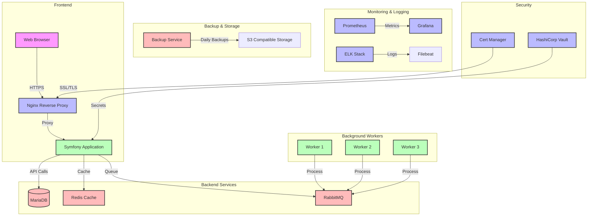

# Diagrama de Arquitectura del Sistema

## Arquitectura General con Docker Compose



## Descripción de Componentes

### Frontend
- **Nginx Reverse Proxy**: Maneja el tráfico HTTPS, SSL/TLS y balanceo de carga
- **Symfony Application**: Aplicación principal con Twig y Bootstrap

### Backend Services
- **MariaDB**: Base de datos principal
- **Redis**: Caché y sesiones
- **RabbitMQ**: Sistema de colas para tareas asíncronas

### Background Workers
- **Workers**: Procesan tareas en segundo plano (generación de informes, notificaciones, etc.)

### Monitoring & Logging
- **Prometheus & Grafana**: Monitoreo de métricas
- **ELK Stack**: Gestión centralizada de logs

### Backup & Storage
- **Backup Service**: Realiza backups diarios automatizados
- **S3 Compatible Storage**: Almacenamiento de backups y archivos

### Security
- **Cert Manager**: Gestión automática de certificados SSL/TLS
- **HashiCorp Vault**: Gestión de secretos y credenciales

## Docker Compose Services

```yaml
version: '3.8'

services:
  nginx:
    image: nginx:alpine
    ports:
      - "80:80"
      - "443:443"
    volumes:
      - ./nginx/conf.d:/etc/nginx/conf.d
      - ./nginx/ssl:/etc/nginx/ssl
      - ./public:/var/www/public
    depends_on:
      - symfony
    networks:
      - app-network

  symfony:
    build:
      context: .
      dockerfile: docker/php/Dockerfile
    volumes:
      - .:/var/www
    depends_on:
      - mariadb
      - redis
      - rabbitmq
    networks:
      - app-network

  mariadb:
    image: mariadb:10.6
    environment:
      MYSQL_ROOT_PASSWORD: ${DB_ROOT_PASSWORD}
      MYSQL_DATABASE: ${DB_NAME}
      MYSQL_USER: ${DB_USER}
      MYSQL_PASSWORD: ${DB_PASSWORD}
    volumes:
      - mariadb_data:/var/lib/mysql
    networks:
      - app-network

  redis:
    image: redis:alpine
    volumes:
      - redis_data:/data
    networks:
      - app-network

  rabbitmq:
    image: rabbitmq:3-management-alpine
    environment:
      RABBITMQ_DEFAULT_USER: ${RABBITMQ_USER}
      RABBITMQ_DEFAULT_PASS: ${RABBITMQ_PASSWORD}
    volumes:
      - rabbitmq_data:/var/lib/rabbitmq
    networks:
      - app-network

  worker:
    build:
      context: .
      dockerfile: docker/worker/Dockerfile
    volumes:
      - .:/var/www
    depends_on:
      - rabbitmq
    networks:
      - app-network

  prometheus:
    image: prom/prometheus
    volumes:
      - ./prometheus:/etc/prometheus
      - prometheus_data:/prometheus
    networks:
      - app-network

  grafana:
    image: grafana/grafana
    ports:
      - "3000:3000"
    volumes:
      - grafana_data:/var/lib/grafana
    depends_on:
      - prometheus
    networks:
      - app-network

  elk:
    image: sebp/elk
    ports:
      - "5601:5601"
      - "9200:9200"
      - "5044:5044"
    volumes:
      - elk_data:/var/lib/elasticsearch
    networks:
      - app-network

  vault:
    image: vault:latest
    ports:
      - "8200:8200"
    volumes:
      - vault_data:/vault/data
    cap_add:
      - IPC_LOCK
    networks:
      - app-network

volumes:
  mariadb_data:
  redis_data:
  rabbitmq_data:
  prometheus_data:
  grafana_data:
  elk_data:
  vault_data:

networks:
  app-network:
    driver: bridge
```

## Notas de Implementación

1. **Seguridad**:
   - Todos los servicios están en una red Docker aislada
   - Certificados SSL/TLS gestionados automáticamente
   - Secretos gestionados por Vault
   - Cumplimiento ISO 27001

2. **Escalabilidad**:
   - Los workers pueden escalarse horizontalmente
   - Redis y RabbitMQ para manejo de carga
   - MariaDB con configuración para alta disponibilidad

3. **Monitoreo**:
   - Métricas de Prometheus
   - Logs centralizados con ELK
   - Dashboard de Grafana

4. **Backups**:
   - Backups diarios automatizados
   - Almacenamiento redundante
   - Verificación de integridad

¿Quieres que procedamos con la creación de los archivos Docker necesarios para implementar esta arquitectura? 