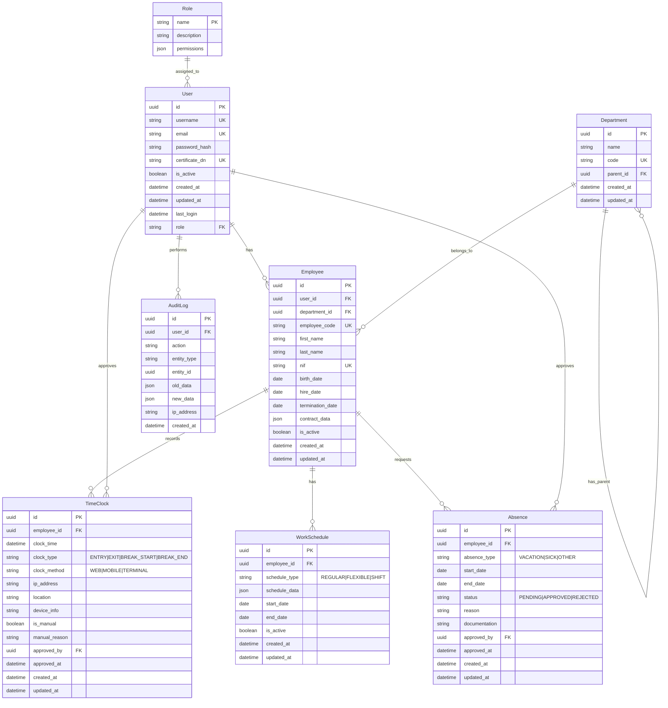

# Modelo de Datos

## Diagrama Entidad-Relación



## Descripción de Entidades

### User
- Almacena la información de autenticación y autorización
- Relacionado con Employee para datos personales
- Gestiona roles y permisos
- Registra actividad de certificado digital

### Role
- Define los roles del sistema (ROLE_EMPLOYEE, ROLE_SUPERVISOR, etc.)
- Almacena permisos específicos en formato JSON
- Jerarquía de roles implementada

### Department
- Estructura organizativa de la empresa
- Soporta jerarquía de departamentos
- Código único para identificación

### Employee
- Información personal y laboral
- Vinculado a un usuario y departamento
- Datos del contrato en formato JSON
- Historial de empleo

### TimeClock
- Registros de fichaje
- Diferentes tipos de registro (entrada, salida, pausas)
- Método de fichaje y ubicación
- Aprobación manual cuando es necesario

### WorkSchedule
- Horarios de trabajo
- Soporta diferentes tipos (regular, flexible, turnos)
- Datos de horario en formato JSON
- Períodos de validez

### Absence
- Gestión de ausencias
- Diferentes tipos (vacaciones, enfermedad, etc.)
- Proceso de aprobación
- Documentación adjunta

### AuditLog
- Registro de todas las acciones del sistema
- Almacena cambios en entidades
- Trazabilidad completa
- Información de contexto (IP, usuario, etc.)

## Índices y Optimización

### Índices Principales
```sql
-- User
CREATE INDEX idx_user_username ON User(username);
CREATE INDEX idx_user_email ON User(email);
CREATE INDEX idx_user_certificate ON User(certificate_dn);

-- Employee
CREATE INDEX idx_employee_code ON Employee(employee_code);
CREATE INDEX idx_employee_nif ON Employee(nif);
CREATE INDEX idx_employee_department ON Employee(department_id);

-- TimeClock
CREATE INDEX idx_timeclock_employee_date ON TimeClock(employee_id, clock_time);
CREATE INDEX idx_timeclock_type ON TimeClock(clock_type);

-- Absence
CREATE INDEX idx_absence_employee_date ON Absence(employee_id, start_date, end_date);
CREATE INDEX idx_absence_status ON Absence(status);

-- AuditLog
CREATE INDEX idx_audit_user_date ON AuditLog(user_id, created_at);
CREATE INDEX idx_audit_entity ON AuditLog(entity_type, entity_id);
```

## Políticas de Retención

### Retención de Datos
- Registros de fichaje: 4 años (requisito legal)
- Logs de auditoría: 1 año
- Datos de empleados inactivos: 5 años
- Backups: 30 días

### Limpieza Automática
```php
// src/Service/DataRetentionService.php
class DataRetentionService
{
    public function cleanupOldData(): void
    {
        // Limpieza de registros de fichaje
        $this->timeClockRepository->deleteOlderThan(
            new \DateTime('-4 years')
        );

        // Limpieza de logs de auditoría
        $this->auditLogRepository->deleteOlderThan(
            new \DateTime('-1 year')
        );

        // Archivado de empleados inactivos
        $this->employeeRepository->archiveInactive(
            new \DateTime('-5 years')
        );
    }
}
```

## Consideraciones de Seguridad

### Datos Sensibles
- Contraseñas: Hash bcrypt
- Certificados: Almacenados de forma segura
- Datos personales: Cifrados en reposo
- Logs: Sanitizados y cifrados

### Acceso a Datos
- Control de acceso a nivel de entidad
- Filtrado por departamento
- Auditoría de consultas sensibles
- Rate limiting en APIs

¿Necesitas más detalles sobre algún aspecto específico del modelo de datos? 