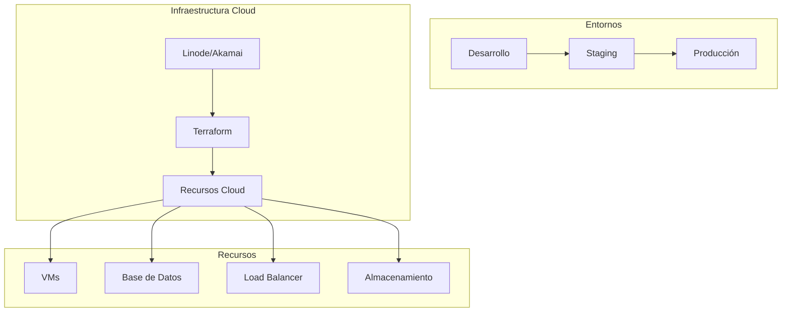
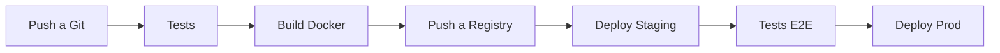

# Infraestructura y Despliegue

## 1. Arquitectura de Infraestructura

### 1.1 Entornos


### 1.2 Especificaciones por Entorno

#### Desarrollo
- 1 VM: 2 vCPUs, 4GB RAM
- MariaDB: 1 instancia
- Redis: 1 instancia
- RabbitMQ: 1 instancia
- Sin balanceo de carga
- Sin SSL en desarrollo

#### Staging
- 2 VMs: 2 vCPUs, 4GB RAM cada una
- MariaDB: 1 instancia con replica
- Redis: Cluster de 2 nodos
- RabbitMQ: Cluster de 2 nodos
- Load Balancer básico
- SSL de prueba

#### Producción
- 3+ VMs: 4 vCPUs, 8GB RAM cada una
- MariaDB: Cluster de 3 nodos
- Redis: Cluster de 3 nodos
- RabbitMQ: Cluster de 3 nodos
- Load Balancer de alta disponibilidad
- SSL de producción

## 2. Infraestructura como Código (Terraform)

### 2.1 Estructura de Terraform
```
terraform/
├── environments/
│   ├── dev/
│   │   ├── main.tf
│   │   ├── variables.tf
│   │   └── terraform.tfvars
│   ├── staging/
│   │   ├── main.tf
│   │   ├── variables.tf
│   │   └── terraform.tfvars
│   └── prod/
│       ├── main.tf
│       ├── variables.tf
│       └── terraform.tfvars
├── modules/
│   ├── compute/
│   │   ├── main.tf
│   │   └── variables.tf
│   ├── database/
│   │   ├── main.tf
│   │   └── variables.tf
│   ├── networking/
│   │   ├── main.tf
│   │   └── variables.tf
│   └── security/
│       ├── main.tf
│       └── variables.tf
└── shared/
    └── backend.tf
```

### 2.2 Módulos Principales

#### Compute
- Gestión de VMs
- Configuración de autoscaling
- Gestión de grupos de instancias

#### Database
- Configuración de MariaDB
- Gestión de backups
- Configuración de replicación

#### Networking
- VPC y subredes
- Load Balancers
- Reglas de firewall

#### Security
- Grupos de seguridad
- Certificados SSL
- Gestión de secretos

## 3. Proceso de Despliegue

### 3.1 Pipeline CI/CD


### 3.2 Workflow de GitHub Actions

```yaml
name: Deploy
on:
  push:
    branches:
      - main
      - staging
      - develop

jobs:
  test:
    runs-on: ubuntu-latest
    steps:
      - name: Run Tests
        run: |
          docker-compose run --rm php vendor/bin/phpunit

  build:
    needs: test
    runs-on: ubuntu-latest
    steps:
      - name: Build Docker Images
        run: |
          docker build -t $REGISTRY/ficharfirm:$GITHUB_SHA .

  deploy:
    needs: build
    runs-on: ubuntu-latest
    steps:
      - name: Deploy to Environment
        run: |
          cd terraform/environments/${{ github.ref_name }}
          terraform init
          terraform apply -auto-approve
```

## 4. Monitoreo y Logging

### 4.1 Stack de Monitoreo
- Prometheus para métricas
- Grafana para visualización
- ELK Stack para logs
- Alertmanager para alertas

### 4.2 Métricas Clave
- Uso de CPU y memoria
- Latencia de respuesta
- Tasa de errores
- Uso de base de datos
- Estado de los workers

### 4.3 Alertas
- Disponibilidad del servicio
- Errores críticos
- Uso de recursos
- Problemas de seguridad

## 5. Backup y Recuperación

### 5.1 Estrategia de Backup
- Backups diarios completos
- Backups incrementales cada 6 horas
- Retención de 30 días
- Verificación automática de integridad

### 5.2 Proceso de Recuperación
1. Identificación del punto de recuperación
2. Restauración de base de datos
3. Restauración de archivos
4. Verificación de integridad
5. Pruebas de funcionalidad

## 6. Seguridad

### 6.1 Medidas de Seguridad
- Firewall por capas
- WAF (Web Application Firewall)
- DDoS Protection
- Cifrado en tránsito y en reposo
- Gestión de secretos con Vault

### 6.2 Cumplimiento
- ISO 27001
- RGPD
- OWASP Top 10
- Auditorías regulares

## 7. Escalabilidad

### 7.1 Estrategia de Escalado
- Escalado horizontal automático
- Balanceo de carga
- Caché distribuido
- Colas de mensajes

### 7.2 Límites y Cuotas
- Máximo de instancias por entorno
- Límites de recursos por instancia
- Cuotas de almacenamiento
- Límites de ancho de banda

## 8. Mantenimiento

### 8.1 Tareas Programadas
- Actualizaciones de seguridad
- Rotación de logs
- Limpieza de caché
- Verificación de backups

### 8.2 Ventanas de Mantenimiento
- Desarrollo: Sin restricciones
- Staging: Fines de semana
- Producción: 02:00-04:00 UTC

## 9. Costos Estimados

### 9.1 Desarrollo
- ~100€/mes

### 9.2 Staging
- ~300€/mes

### 9.3 Producción
- ~1000€/mes base
- Escalable según necesidades

¿Necesitas más detalles sobre algún aspecto específico de la infraestructura o el despliegue? 