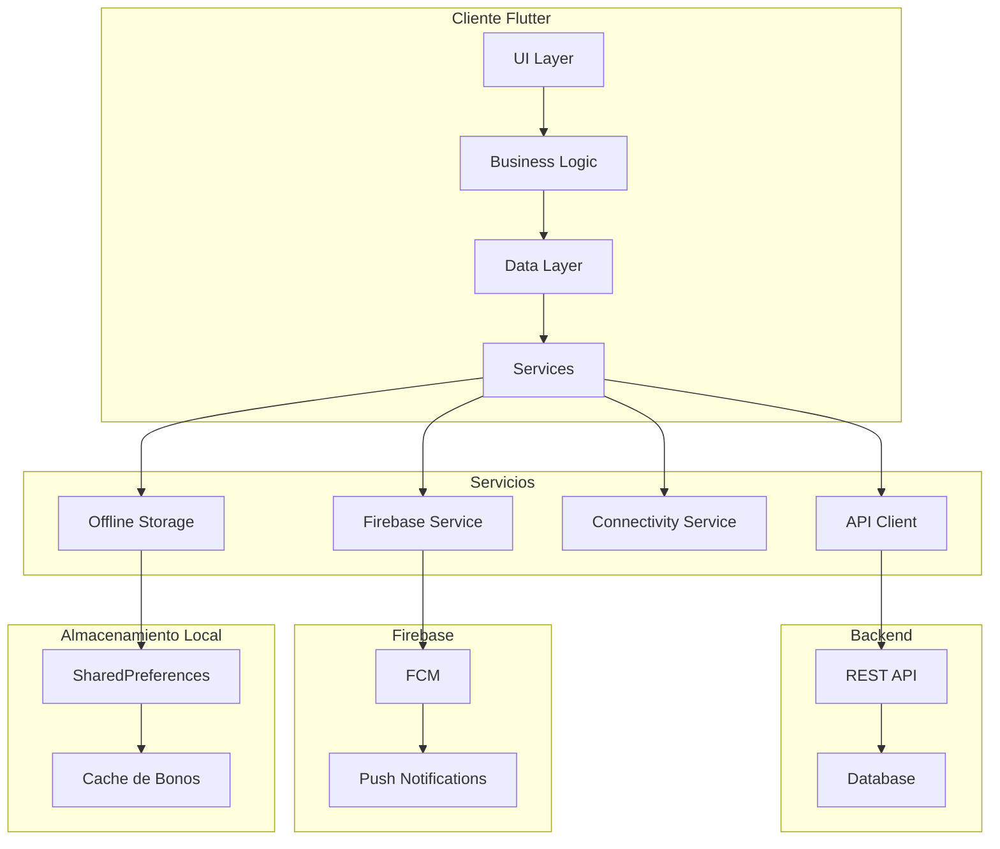
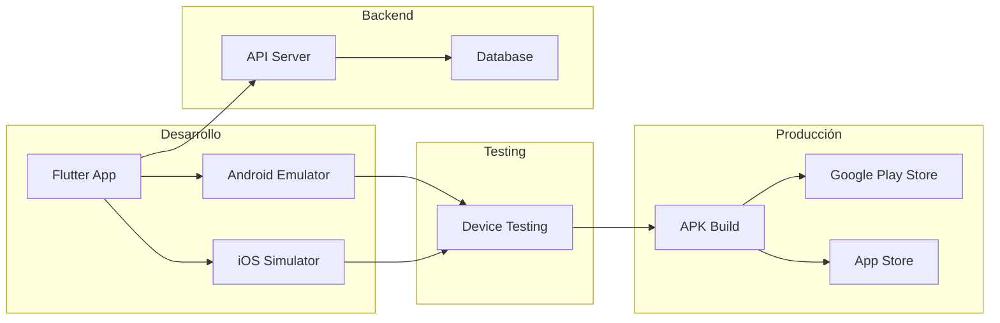
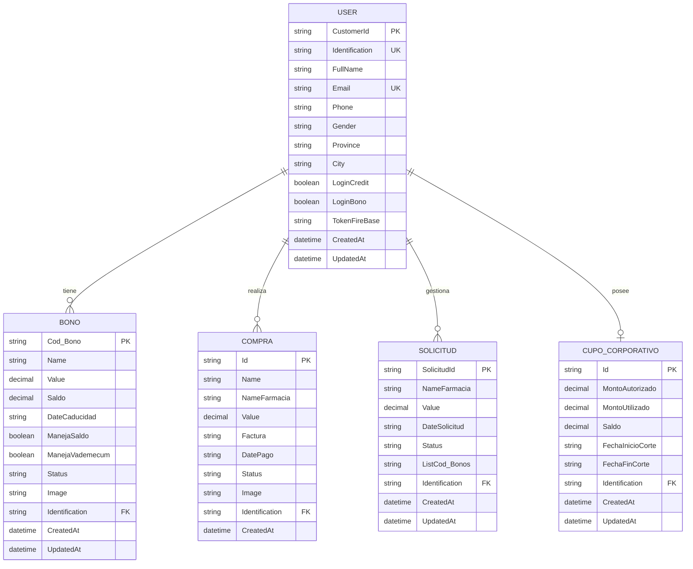

# TuAppFarmacia Flutter - Documentación del Proyecto

## Índice
- [0. Ficha del proyecto](#0-ficha-del-proyecto)
- [1. Descripción general del producto](#1-descripción-general-del-producto)
- [2. Arquitectura del Sistema](#2-arquitectura-del-sistema)
- [3. Modelo de datos](#3-modelo-de-datos)
- [4. Especificación de la API](#4-especificación-de-la-api)
- [5. Historias de usuario](#5-historias-de-usuario)
- [6. Tickets de trabajo](#6-tickets-de-trabajo)
- [7. Pull requests](#7-pull-requests)

---

## 0. Ficha del proyecto

### 0.1. Tu nombre completo:
**Willian Vladimir Collaguazo Zambrano**

### 0.2. Nombre del proyecto:
**TuAppFarmacia Flutter**

### 0.3. Descripción breve del proyecto:
Aplicación móvil Flutter para gestión de bonos farmacéuticos empresariales con sistema completo de solicitudes, aprobaciones y gestión de crédito corporativo. La aplicación permite a los usuarios gestionar sus bonos, realizar compras, aprobar solicitudes de pago y acceder a funcionalidades premium, todo con soporte offline y notificaciones push.

### 0.4. URL del proyecto:
**Privado** - https://github.com/WillianCollaguazo/TuAppFarmaciaFlutter.git

### 0.5. URL o archivo comprimido del repositorio:
**Privado** - https://github.com/WillianCollaguazo/TuAppFarmaciaFlutter.git

---

## 1. Descripción general del producto

### 1.1. Objetivo:
TuAppFarmacia es una aplicación móvil desarrollada para **FarmaEnlace** que representa la **migración y modernización** de una aplicación existente desarrollada en **Xamarin** que se encontraba descontinuada. Esta nueva versión en **Flutter** mantiene toda la funcionalidad original mientras aprovecha las ventajas de la tecnología moderna y el desarrollo asistido por **Inteligencia Artificial**.

**Contexto del Proyecto:**
- **Migración tecnológica:** De Xamarin (descontinuado) a Flutter (tecnología moderna)
- **Desarrollo con IA:** Implementación mediante desarrollo iterativo asistido por Inteligencia Artificial
- **Mantenimiento de funcionalidades:** Preservación de todas las características de la aplicación original
- **Modernización:** Mejoras en rendimiento, mantenibilidad y experiencia de usuario

**Funcionalidades principales:**
- **Gestión centralizada** de bonos farmacéuticos empresariales
- **Aprobación y rechazo** de solicitudes de pago en tiempo real
- **Acceso a crédito corporativo** para usuarios premium
- **Funcionalidad offline** para consulta sin conexión a internet
- **Notificaciones push** para mantener informados a los usuarios

**Valor aportado por la migración:**
- **Continuidad del servicio:** Mantiene operativa la aplicación tras la descontinuación de Xamarin
- **Tecnología moderna:** Flutter ofrece mejor rendimiento y mantenibilidad
- **Desarrollo eficiente:** IA acelera el proceso de desarrollo y reduce errores
- **Mejora de experiencia:** Interfaz más moderna y fluida
- **Soporte a largo plazo:** Flutter tiene roadmap de desarrollo activo

**Usuarios objetivo:**
- Empleados de empresas con bonos farmacéuticos (usuarios existentes)
- Administradores de beneficios empresariales
- Usuarios con acceso a crédito corporativo
- **Nuevos usuarios** que se benefician de la aplicación modernizada

### 1.2. Características y funcionalidades principales:

#### **Módulo de Autenticación**
- Login diferenciado por tipo de usuario (Premium/Bono Empresarial)
- Registro de nuevos usuarios con validación de datos
- Recuperación de contraseña por email
- Validación de permisos según atributos del usuario

#### **Módulo Bono Empresarial**
- **Dashboard personalizado** con información del usuario
- **Mis Bonos:** Lista de bonos asignados con soporte offline
- **Detalle de Bono:** Información completa con generación de códigos
- **Códigos del Bono:** Generación de QR, código de barras y texto
- **Mis Compras:** Historial de compras realizadas
- **Mis Solicitudes:** Gestión de solicitudes de pago (5 estados)

#### **Módulo Crédito Corporativo (Premium)**
- **Dashboard Premium** con acceso a crédito corporativo
- **Cupo Corporativo:** Visualización de crédito disponible
- **Consumos de Crédito:** Historial de transacciones
- **Tarjeta de Beneficios:** Visualización de tarjeta personal

#### **Funcionalidades Técnicas**
- **Soporte Offline:** Almacenamiento local de bonos
- **Notificaciones Push:** Firebase Cloud Messaging
- **Colores Dinámicos:** UI adaptativa según tipo de usuario
- **Validación de Internet:** Verificación de conectividad
- **Formateo Consistente:** Valores monetarios con 2 decimales

### 1.3. Diseño y experiencia de usuario:

#### **Flujo de Usuario - Bono Empresarial:**
1. **Pantalla Principal** → Selección "Bono Empresarial"
2. **Login** → Autenticación con credenciales
3. **Dashboard** → Información personal y opciones disponibles
4. **Mis Bonos** → Lista de bonos asignados (offline disponible)
5. **Detalle del Bono** → Información completa y generación de códigos
6. **Códigos** → QR, código de barras y texto para transacciones
7. **Mis Compras** → Historial de compras realizadas
8. **Mis Solicitudes** → Gestión de solicitudes de pago

#### **Flujo de Usuario - Premium:**
1. **Pantalla Principal** → Selección "Experiencia Premium"
2. **Login Premium** → Autenticación con credenciales
3. **Dashboard Premium** → Acceso a crédito corporativo
4. **Cupo Corporativo** → Visualización de crédito disponible
5. **Consumos** → Historial de transacciones de crédito
6. **Tarjeta de Beneficios** → Visualización de tarjeta personal

#### **Características de UX:**
- **Colores dinámicos:** Azul para Premium, Verde para Bono Empresarial
- **Navegación intuitiva:** Botones claros y consistentes
- **Estados visuales:** Indicadores de carga, error y éxito
- **Soporte offline:** Banners informativos y funcionalidad limitada
- **Animaciones:** Parpadeo para solicitudes pendientes

### 1.4. Instrucciones de instalación:

#### **Prerrequisitos:**
- Flutter SDK 3.0+
- Dart 3.0+
- Android Studio / VS Code
- Dispositivo Android (API 21+) o iOS (11+)

#### **Pasos de Instalación:**

1. **Clonar el repositorio:**
   ```bash
   git clone [repository-url]
   cd tuappfarmacia
   ```

2. **Instalar dependencias:**
   ```bash
   flutter pub get
   ```

3. **Configurar imágenes en `assets/images/`:**
   - `header_tuappfarmacia.png`
   - `header_credito_corporativo.png`
   - `header_bono_empresarial.png`
   - `tarjetabeneficios.png`
   - `giftcard.png`
   - `badge_*.png` (varios badges)
   - `logos/medicity_logo.png`
   - `logos/economicas_logo.png`

4. **Configurar Firebase (opcional):**
   - Copiar `google-services.json` a `android/app/`
   - Copiar `GoogleService-Info.plist` a `ios/Runner/`

5. **Ejecutar la aplicación:**
   ```bash
   flutter run
   ```

#### **Compilación:**
```bash
# Debug
flutter build apk --debug

# Release
flutter build apk --release
```

---

## 2. Arquitectura del Sistema

### 2.1. Diagrama de arquitectura:



**Patrón Arquitectónico:** MVC (Model-View-Controller)

**Justificación:**
- **Separación de responsabilidades:** UI, lógica de negocio y datos separados
- **Mantenibilidad:** Código organizado y fácil de mantener
- **Testabilidad:** Componentes independientes fáciles de testear
- **Escalabilidad:** Estructura que permite crecimiento del proyecto

**Beneficios:**
- Código organizado y mantenible
- Reutilización de componentes
- Fácil testing y debugging
- Separación clara de responsabilidades

**Sacrificios:**
- Mayor complejidad inicial
- Más archivos y estructura
- Curva de aprendizaje para desarrolladores

### 2.2. Descripción de componentes principales:

#### **UI Layer (Capa de Presentación)**
- **Tecnología:** Flutter Widgets
- **Responsabilidad:** Interfaz de usuario y navegación
- **Componentes:** Pantallas, widgets personalizados, navegación

#### **Business Logic (Lógica de Negocio)**
- **Tecnología:** Dart
- **Responsabilidad:** Lógica de aplicación y validaciones
- **Componentes:** Controladores, validadores, formateadores

#### **Data Layer (Capa de Datos)**
- **Tecnología:** Dart + HTTP
- **Responsabilidad:** Gestión de datos y comunicación con APIs
- **Componentes:** Modelos de datos, serializadores

#### **Services (Servicios)**
- **API Client:** Comunicación con backend REST
- **Offline Storage:** Almacenamiento local con SharedPreferences
- **Connectivity Service:** Verificación de conectividad
- **Firebase Service:** Notificaciones push

### 2.3. Descripción de alto nivel del proyecto y estructura de ficheros:

```
tuappfarmacia/
├── lib/
│   ├── data/                    # Modelos de datos
│   │   ├── ecuador_locations.dart
│   │   └── sucursal_config.dart
│   ├── services/                # Servicios de API y conectividad
│   │   ├── api_client.dart
│   │   ├── offline_storage.dart
│   │   ├── connectivity_service.dart
│   │   └── firebase_notification_service.dart
│   ├── widgets/                 # Componentes reutilizables
│   │   └── loading.dart
│   ├── funcionalidadSucursales/ # Módulo de sucursales
│   │   └── sucursal_screen.dart
│   └── [pantallas].dart         # Pantallas de la aplicación
├── assets/images/               # Recursos gráficos
├── android/                     # Configuración Android
├── ios/                         # Configuración iOS
├── documentacion/               # Documentación del proyecto
└── prompts/                     # Documentación de desarrollo
```

**Patrón de Organización:**
- **Por funcionalidad:** Cada módulo tiene sus archivos relacionados
- **Separación de responsabilidades:** UI, servicios y datos separados
- **Reutilización:** Componentes comunes en carpeta widgets

### 2.4. Infraestructura y despliegue:



**Proceso de Despliegue:**
1. **Desarrollo:** Flutter app en emuladores
2. **Testing:** Pruebas en dispositivos reales
3. **Build:** Generación de APK/IPA
4. **Distribución:** Subida a stores

### 2.5. Seguridad:

#### **Prácticas Implementadas:**

1. **Validación de Usuario Offline:**
   ```dart
   // Validación de identificación para seguridad offline
   static Future<List<Map<String, dynamic>>> getBonos(String identification) async {
     final prefs = await SharedPreferences.getInstance();
     final bonosKey = 'cached_bonos_$identification';
     // Validación de que los bonos pertenecen al usuario
   }
   ```

2. **Manejo Seguro de Tokens:**
   ```dart
   // Envío seguro de token FCM
   static Future<void> sendTokenToAPI() async {
     if (fcmToken != null && userIdentification != null) {
       await ApiClient.updateTokenFirebase(userIdentification!, fcmToken!);
     }
   }
   ```

3. **Validación de Conexión:**
   ```dart
   // Verificación de internet antes de operaciones críticas
   static Future<bool> hasInternetConnection() async {
     try {
       final result = await InternetAddress.lookup('google.com')
           .timeout(const Duration(seconds: 5));
       return result.isNotEmpty && result[0].rawAddress.isNotEmpty;
     } catch (_) {
       return false;
     }
   }
   ```

4. **Manejo de Errores:**
   ```dart
   // Try-catch en todas las operaciones críticas
   try {
     final response = await http.post(uri, headers: headers, body: body);
     // Procesamiento seguro
   } catch (e) {
     // Manejo de errores sin exponer información sensible
   }
   ```

### 2.6. Tests:

#### **Tests Implementados:**
- **Tests de conectividad:** Verificación de conexión a internet
- **Tests de almacenamiento:** Validación de cache offline
- **Tests de API:** Verificación de endpoints
- **Tests de UI:** Validación de componentes

---

## 3. Modelo de datos

### 3.1. Diagrama del modelo de datos:



### 3.2. Descripción de entidades principales:

#### **USER (Usuario)**
- **CustomerId (PK):** Identificador único del usuario
- **Identification (UK):** Cédula o identificación del usuario
- **FullName:** Nombre completo del usuario
- **Email (UK):** Correo electrónico único
- **Phone:** Número de teléfono
- **Gender:** Género (H/M)
- **Province:** Provincia de residencia
- **City:** Ciudad de residencia
- **LoginCredit:** Permiso para acceso premium
- **LoginBono:** Permiso para acceso a bonos
- **TokenFireBase:** Token para notificaciones push

#### **BONO (Bono Farmacéutico)**
- **Cod_Bono (PK):** Código único del bono
- **Name:** Nombre del bono
- **Value:** Valor monetario del bono
- **Saldo:** Saldo actual disponible
- **DateCaducidad:** Fecha de vencimiento
- **ManejaSaldo:** Si maneja saldo (true/false)
- **ManejaVademecum:** Si maneja vademécum (true/false)
- **Status:** Estado del bono
- **Image:** URL de imagen del bono
- **Identification (FK):** Referencia al usuario

#### **COMPRA (Compra Realizada)**
- **Id (PK):** Identificador único de la compra
- **Name:** Nombre de la compra
- **NameFarmacia:** Nombre de la farmacia
- **Value:** Valor de la compra
- **Factura:** Número de factura
- **DatePago:** Fecha de pago
- **Status:** Estado de la compra
- **Image:** URL de imagen
- **Identification (FK):** Referencia al usuario

#### **SOLICITUD (Solicitud de Pago)**
- **SolicitudId (PK):** Identificador único de la solicitud
- **NameFarmacia:** Nombre de la farmacia
- **Value:** Valor de la solicitud
- **DateSolicitud:** Fecha de la solicitud
- **Status:** Estado (PROCESADO, SIN RESPUESTA, RECHAZADO, CADUCADO, PENDIENTE)
- **ListCod_Bonos:** Lista de códigos de bonos aplicados
- **Identification (FK):** Referencia al usuario

#### **CUPO_CORPORATIVO (Crédito Corporativo)**
- **Id (PK):** Identificador único del cupo
- **MontoAutorizado:** Monto autorizado
- **MontoUtilizado:** Monto utilizado
- **Saldo:** Saldo disponible
- **FechaInicioCorte:** Fecha de inicio del período
- **FechaFinCorte:** Fecha de fin del período
- **Identification (FK):** Referencia al usuario

---

## 4. Especificación de la API

### Endpoint 1: Consulta de Bonos del Usuario

```yaml
openapi: 3.0.0
info:
  title: TuAppFarmacia API
  version: 1.0.0
  description: API para gestión de bonos farmacéuticos

paths:
  /Bonos/{identification}:
    get:
      summary: Obtener bonos del usuario
      parameters:
        - name: identification
          in: path
          required: true
          schema:
            type: string
          description: Identificación del usuario
      responses:
        '200':
          description: Lista de bonos del usuario
          content:
            application/json:
              schema:
                type: array
                items:
                  $ref: '#/components/schemas/Bono'
        '404':
          description: Usuario no encontrado
        '500':
          description: Error interno del servidor

components:
  schemas:
    Bono:
      type: object
      properties:
        Cod_Bono:
          type: string
          description: Código único del bono
        Name:
          type: string
          description: Nombre del bono
        Value:
          type: number
          format: decimal
          description: Valor monetario
        Saldo:
          type: number
          format: decimal
          description: Saldo actual
        DateCaducidad:
          type: string
          format: date
          description: Fecha de caducidad
        ManejaSaldo:
          type: boolean
          description: Si maneja saldo
        ManejaVademecum:
          type: boolean
          description: Si maneja vademécum
        Status:
          type: string
          description: Estado del bono
        Image:
          type: string
          description: URL de imagen
```

**Ejemplo de petición:**
```bash
GET /Bonos/1002642278
```

**Ejemplo de respuesta:**
```json
[
  {
    "Cod_Bono": "BONO001",
    "Name": "Bono Farmacéutico Empresarial",
    "Value": 100.00,
    "Saldo": 75.50,
    "DateCaducidad": "2024-12-31",
    "ManejaSaldo": true,
    "ManejaVademecum": false,
    "Status": "ACTIVO",
    "Image": "https://api.farmaenlace.com/images/bono001.png"
  }
]
```

### Endpoint 2: Aprobar Solicitud de Pago

```yaml
  /Bonos/AceptarSolicitud:
    get:
      summary: Aprobar solicitud de pago
      parameters:
        - name: SolicitudId
          in: query
          required: true
          schema:
            type: string
        - name: Cod_Bono
          in: query
          required: true
          schema:
            type: string
      responses:
        '200':
          description: Solicitud aprobada exitosamente
          content:
            application/json:
              schema:
                type: object
                properties:
                  success:
                    type: boolean
                  message:
                    type: string
        '400':
          description: Error en la solicitud
        '500':
          description: Error interno del servidor
```

### Endpoint 3: Actualizar Token Firebase

```yaml
  /Customers/UpdateTokenFirebase:
    post:
      summary: Actualizar token Firebase del usuario
      requestBody:
        required: true
        content:
          application/json:
            schema:
              type: object
              properties:
                Identification:
                  type: string
                TokenFireBase:
                  type: string
              required:
                - Identification
                - TokenFireBase
      responses:
        '200':
          description: Token actualizado exitosamente
        '400':
          description: Error en la solicitud
        '500':
          description: Error interno del servidor
```

---

## 5. Historias de usuario

### Historia de Usuario 1

**Como** empleado de una empresa con bonos farmacéuticos  
**Quiero** poder consultar mis bonos asignados sin conexión a internet  
**Para** poder acceder a la información de mis bonos en cualquier momento y lugar  

**Criterios de Aceptación:**
- Dado que soy un usuario autenticado
- Cuando no tengo conexión a internet
- Entonces debo poder ver la lista de bonos previamente cargados
- Y debo ver un indicador visual de que estoy en modo offline
- Y la información debe estar actualizada desde la última conexión

**Definición de Terminado:**
- [ ] La aplicación detecta automáticamente la falta de conexión
- [ ] Se muestran los bonos desde el almacenamiento local
- [ ] Se muestra un banner naranja indicando modo offline
- [ ] Se valida que los bonos pertenecen al usuario actual
- [ ] Se usa imagen local cuando no hay conexión

### Historia de Usuario 2

**Como** administrador de beneficios empresariales  
**Quiero** poder aprobar o rechazar solicitudes de pago desde la aplicación  
**Para** agilizar el proceso de autorización de compras farmacéuticas  

**Criterios de Aceptación:**
- Dado que soy un usuario con permisos de administración
- Cuando veo una solicitud de pago pendiente
- Entonces debo poder ver los detalles de la solicitud
- Y debo poder seleccionar el bono a aplicar
- Y debo poder aprobar o rechazar la solicitud
- Y debo recibir confirmación de la acción realizada

**Definición de Terminado:**
- [ ] Se muestra la lista de solicitudes con estados diferenciados
- [ ] Las solicitudes pendientes tienen animación de parpadeo
- [ ] Se puede navegar al detalle de la solicitud
- [ ] Se puede seleccionar un bono compatible
- [ ] Se puede aprobar o rechazar con confirmación
- [ ] Se muestra mensaje de éxito o error
- [ ] Se navega automáticamente tras operación exitosa

### Historia de Usuario 3

**Como** usuario premium con crédito corporativo  
**Quiero** recibir notificaciones push sobre mi cupo disponible  
**Para** estar informado sobre el estado de mi crédito corporativo  

**Criterios de Aceptación:**
- Dado que soy un usuario premium autenticado
- Cuando mi cupo corporativo cambia
- Entonces debo recibir una notificación push
- Y la notificación debe contener información relevante
- Y debo poder interactuar con la notificación

**Definición de Terminado:**
- [ ] Se configura Firebase Cloud Messaging
- [ ] Se registra el token FCM del dispositivo
- [ ] Se envía el token al backend automáticamente
- [ ] Se reciben notificaciones en todos los estados de la app
- [ ] Se puede navegar desde la notificación
- [ ] Se limpia el token al cerrar sesión

---

## 6. Tickets de trabajo

### Ticket 1 - Backend: Implementar API de Solicitudes de Pago

**Título:** Implementar endpoints para gestión de solicitudes de pago  
**Tipo:** Backend  
**Prioridad:** Alta  
**Estimación:** 8 horas  

**Descripción:**
Implementar los endpoints necesarios para la gestión de solicitudes de pago, incluyendo consulta, aprobación y rechazo de solicitudes.

**Tareas:**
- [ ] Crear endpoint GET `/Bonos/GetSolicitud` para consultar solicitudes
- [ ] Crear endpoint GET `/Bonos/AceptarSolicitud` para aprobar solicitudes
- [ ] Crear endpoint GET `/Bonos/RechazarSolicitud` para rechazar solicitudes
- [ ] Implementar validación de permisos de usuario
- [ ] Implementar manejo de errores y respuestas consistentes
- [ ] Crear tests unitarios para los endpoints
- [ ] Documentar la API con ejemplos

**Criterios de Aceptación:**
- Los endpoints deben retornar respuestas en formato JSON
- Debe validarse que el usuario tenga permisos para la operación
- Debe manejarse correctamente el estado de las solicitudes
- Debe implementarse logging para auditoría
- Debe incluirse manejo de errores robusto

**Definición de Terminado:**
- [ ] Todos los endpoints implementados y funcionando
- [ ] Tests unitarios pasando
- [ ] Documentación actualizada
- [ ] Code review aprobado
- [ ] Desplegado en ambiente de testing

### Ticket 2 - Frontend: Implementar Módulo de Solicitudes

**Título:** Crear pantallas para gestión de solicitudes de pago  
**Tipo:** Frontend  
**Prioridad:** Alta  
**Estimación:** 12 horas  

**Descripción:**
Implementar las pantallas necesarias para la gestión de solicitudes de pago, incluyendo lista de solicitudes, selección de bonos y aprobación/rechazo.

**Tareas:**
- [ ] Crear `mis_solicitudes_screen.dart` con lista de solicitudes
- [ ] Implementar estados visuales diferenciados (5 estados)
- [ ] Crear animación de parpadeo para solicitudes pendientes
- [ ] Crear `seleccion_bono_solicitud_screen.dart` para selección de bonos
- [ ] Crear `bono_solicitud_detail_screen.dart` para aprobación/rechazo
- [ ] Implementar validación de compatibilidad de bonos
- [ ] Integrar con APIs de solicitudes
- [ ] Implementar navegación entre pantallas
- [ ] Agregar manejo de errores y estados de carga

**Criterios de Aceptación:**
- Las pantallas deben seguir el diseño establecido
- Debe implementarse la navegación correcta entre pantallas
- Debe validarse la compatibilidad de bonos antes de aprobar
- Debe mostrarse confirmación antes de aprobar/rechazar
- Debe implementarse navegación automática tras operaciones exitosas

**Definición de Terminado:**
- [ ] Todas las pantallas implementadas y funcionando
- [ ] Navegación fluida entre pantallas
- [ ] Validaciones implementadas
- [ ] Manejo de errores robusto
- [ ] Testing en dispositivos reales
- [ ] Code review aprobado

### Ticket 3 - Base de Datos: Optimizar Consultas de Bonos

**Título:** Optimizar consultas de bonos para mejorar rendimiento  
**Tipo:** Base de Datos  
**Prioridad:** Media  
**Estimación:** 6 horas  

**Descripción:**
Optimizar las consultas de bonos para mejorar el rendimiento de la aplicación, especialmente para usuarios con muchos bonos asignados.

**Tareas:**
- [ ] Analizar consultas actuales de bonos
- [ ] Crear índices en campos de consulta frecuente
- [ ] Optimizar consulta de bonos por usuario
- [ ] Implementar paginación para listas grandes
- [ ] Crear vista materializada para bonos activos
- [ ] Implementar cache de consultas frecuentes
- [ ] Crear procedimientos almacenados optimizados
- [ ] Documentar cambios en esquema

**Criterios de Aceptación:**
- Las consultas deben ejecutarse en menos de 500ms
- Debe implementarse paginación para listas de más de 100 elementos
- Debe mantenerse la consistencia de datos
- Debe implementarse logging de rendimiento
- Debe incluirse rollback en caso de problemas

**Definición de Terminado:**
- [ ] Consultas optimizadas implementadas
- [ ] Índices creados y funcionando
- [ ] Paginación implementada
- [ ] Tests de rendimiento pasando
- [ ] Documentación actualizada
- [ ] Monitoreo de rendimiento configurado

---

## 7. Pull requests

### Pull Request 1

**Título:** Implementar módulo de solicitudes de pago  
**Número:** #15  
**Autor:** Willian Collaguazo  
**Fecha:** 2025-01-20  
**Estado:** Merged  

**Descripción:**
Implementación completa del módulo de solicitudes de pago, incluyendo las tres pantallas principales y la integración con las APIs correspondientes.

**Archivos modificados:**
- `lib/mis_solicitudes_screen.dart` (nuevo)
- `lib/seleccion_bono_solicitud_screen.dart` (nuevo)
- `lib/bono_solicitud_detail_screen.dart` (nuevo)
- `lib/services/api_client.dart` (modificado)
- `lib/bono_empresarial_dashboard_screen.dart` (modificado)

**Funcionalidades agregadas:**
- Lista de solicitudes con 5 estados diferenciados
- Animación de parpadeo para solicitudes pendientes
- Selección de bonos para aplicar a solicitudes
- Aprobación y rechazo de solicitudes con confirmación
- Navegación automática tras operaciones exitosas
- Integración con 3 nuevos endpoints de API

**Testing:**
- [x] Pruebas en emulador Android
- [x] Pruebas en dispositivo físico
- [x] Validación de navegación
- [x] Validación de APIs
- [x] Pruebas de manejo de errores


### Pull Request 2

**Título:** Configurar Firebase Push Notifications  
**Número:** #18  
**Autor:** Willian Collaguazo  
**Fecha:** 2025-01-25  
**Estado:** Merged  

**Descripción:**
Configuración completa de Firebase Cloud Messaging para notificaciones push, incluyendo configuración para Android e iOS y integración con el backend.

**Archivos modificados:**
- `pubspec.yaml` (dependencias agregadas)
- `android/app/build.gradle.kts` (configuración Android)
- `android/app/google-services.json` (nuevo)
- `ios/Runner/GoogleService-Info.plist` (nuevo)
- `ios/Runner/Info.plist` (permisos agregados)
- `lib/services/firebase_notification_service.dart` (nuevo)
- `lib/main.dart` (inicialización agregada)

**Funcionalidades agregadas:**
- Configuración de Firebase para Android e iOS
- Servicio completo de manejo de notificaciones push
- Envío automático de token FCM al backend
- Limpieza de token al cerrar sesión
- Manejo de notificaciones en todos los estados de la app
- Suscripción a temas para notificaciones segmentadas

**Testing:**
- [x] Pruebas en emulador Android
- [x] Pruebas en dispositivo iOS
- [x] Validación de obtención de token
- [x] Validación de envío al backend
- [x] Pruebas de notificaciones push


### Pull Request 3

**Título:** Implementar funcionalidad offline para bonos  
**Número:** #12  
**Autor:** Willian Collaguazo  
**Fecha:** 2025-01-15  
**Estado:** Merged  

**Descripción:**
Implementación de funcionalidad offline para consulta de bonos, incluyendo almacenamiento local, validación de usuario y indicadores visuales de modo offline.

**Archivos modificados:**
- `lib/services/offline_storage.dart` (nuevo)
- `lib/services/connectivity_service.dart` (nuevo)
- `lib/mis_bonos_screen.dart` (modificado)
- `lib/bono_detail_screen.dart` (modificado)
- `lib/services/api_client.dart` (modificado)

**Funcionalidades agregadas:**
- Almacenamiento local de bonos usando SharedPreferences
- Validación de identificación de usuario para seguridad
- Expiración de cache (24 horas)
- Verificación de conectividad a internet
- Reemplazo automático de URLs de imagen por asset local
- Indicadores visuales de modo offline
- Métodos para gestionar cache (guardar, cargar, limpiar)

**Testing:**
- [x] Pruebas sin conexión a internet
- [x] Validación de almacenamiento local
- [x] Validación de seguridad de usuario
- [x] Pruebas de expiración de cache
- [x] Validación de indicadores visuales

---

**Documento generado el:** 2025-10-28  
**Versión:** 1.0  
**Autor:** Willian Vladimir Collaguazo Zambrano  
**Proyecto:** TuAppFarmacia Flutter

**Consideranción:** Aun se encuentra en desarrollo, porcentaje de avance 100%
**Aplicación Original:** https://play.google.com/store/apps/details?id=com.Tandicorp.FarmaEnlace&hl=es_EC 