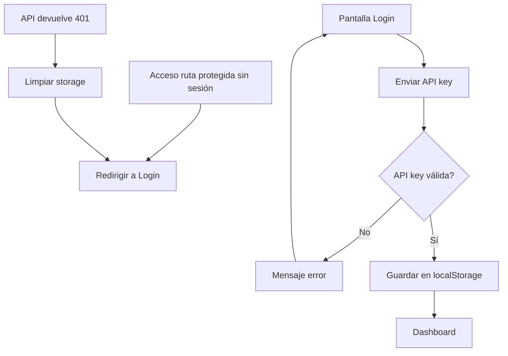

# MH1 — Login y acceso a la app

| Campo | Valor |
|-------|--------|
| **ID** | MH1 |
| **Prioridad** | Must-Have |
| **Rol** | Usuario de la empresa |
| **Historia** | Como **usuario de la empresa**, quiero **iniciar sesión con mi API key** para **acceder a la app y ver solo los datos de mi empresa**. |

## Descripción

El usuario debe poder autenticarse en la aplicación móvil o web introduciendo su API key (o credenciales si se habilita login por email/contraseña). Tras un login correcto, la app guarda la API key y redirige al dashboard. Todas las peticiones posteriores incluyen la API key en el header; el backend filtra los datos por la empresa asociada a esa clave. Si la API key es inválida o expira, el backend responde 401 y el frontend debe redirigir a la pantalla de login y limpiar el almacenamiento local.

## Flujo

## Criterios de aceptación

- **AC1**: Existe una pantalla de login donde el usuario puede introducir su API key (campo de texto o contraseña).
- **AC2**: Al enviar el formulario se llama a `POST /api/auth/login` con la API key (o email/password según configuración).
- **AC3**: Si el login es correcto, la respuesta incluye la información necesaria (usuario, empresa) y la app guarda la API key en `localStorage` (o mecanismo equivalente).
- **AC4**: Tras login correcto, el usuario es redirigido al dashboard (listado de vehículos).
- **AC5**: Si no hay API key guardada, al acceder a cualquier ruta protegida el usuario es redirigido a la pantalla de login.
- **AC6**: Si una petición a la API devuelve 401, la app limpia la API key de `localStorage`, opcionalmente muestra un mensaje de sesión expirada, y redirige a login.
- **AC7**: El usuario solo ve datos (vehículos, repostajes, mantenimientos) de la empresa asociada a su API key; no hay fugas de datos entre empresas.

## Casos de prueba sugeridos (QA)

| Caso | Pasos / condición | Resultado esperado |
|------|-------------------|--------------------|
| API key vacía | Enviar formulario de login sin introducir API key (o solo espacios). | Mostrar error de validación; no llamar a la API. |
| API key inválida | Introducir una API key que no existe o está inactiva y enviar. | API devuelve 401; frontend limpia storage, muestra mensaje de error y permanece en login. |
| API key válida | Introducir API key válida y enviar. | API devuelve 200 con user/company; frontend guarda API key en localStorage y redirige al dashboard. |
| Ruta protegida sin sesión | Sin haber hecho login, acceder directamente a `/vehicles` o dashboard. | Redirección a pantalla de login. |
| 401 en petición posterior | Con sesión iniciada, simular que la API devuelve 401 en una petición (p. ej. key revocada). | Frontend limpia API key, muestra mensaje de sesión expirada y redirige a login. |

## Notas

- La API key se genera y gestiona desde el panel Filament (backend); el usuario la obtiene de su administrador.
- Dependencias: ninguna (es la primera historia del flujo).

## Tickets que implementan esta historia

- [T2 — Backend: Middleware API key y scopes company](../tickets/T2.md)
- [T3 — API: Auth login](../tickets/T3.md)
- [T4 — API: CRUD usuarios (listar, perfil)](../tickets/T4.md)
- [T9 — Frontend: Login y guardado de API key](../tickets/T9.md)

---

[Índice de historias de usuario](../historias-usuario.md)
