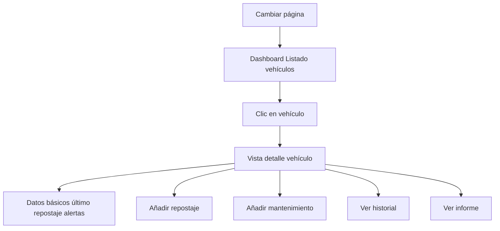

# MH2 — Listado de vehículos y detalle

| Campo | Valor |
|-------|--------|
| **ID** | MH2 |
| **Prioridad** | Must-Have |
| **Rol** | Usuario |
| **Historia** | Como **usuario**, quiero **ver el listado de vehículos de mi empresa y abrir el detalle de uno** para **gestionar repostajes y mantenimientos**. |

## Descripción

Tras el login, el usuario ve un dashboard con el listado de vehículos de su empresa. El listado debe estar paginado y, opcionalmente, permitir búsqueda por matrícula o modelo. Al hacer clic en un vehículo se abre la vista de detalle, donde se muestran los datos básicos del vehículo (marca, modelo, matrícula, año, km actual), el último repostaje si existe, y alertas relevantes (próximo mantenimiento, ITV, seguro). Desde el detalle se puede navegar a "Añadir repostaje", "Añadir mantenimiento", "Historial" e "Informe".

## Flujo

## Criterios de aceptación

- **AC1**: El dashboard muestra los vehículos de la empresa del usuario obtenidos mediante `GET /api/vehicles` (con paginación).
- **AC2**: Se muestran al menos: matrícula, marca/modelo (o nombre identificativo), y km actual (o último repostaje) por vehículo.
- **AC3**: Se puede hacer clic (o tap) en un vehículo para navegar a la vista de detalle (`/vehicle/:id`).
- **AC4**: La vista de detalle obtiene los datos con `GET /api/vehicles/{id}` y muestra: marca, modelo, matrícula, año, km, tipo de combustible por defecto.
- **AC5**: En el detalle se muestra el último repostaje si existe (fecha, km, litros, coste o consumo resumido).
- **AC6**: En el detalle se muestran alertas o avisos visibles (próximo mantenimiento, ITV, seguro) cuando los datos estén disponibles desde la API.
- **AC7**: Desde el detalle hay enlaces o botones claros para: Añadir repostaje, Añadir mantenimiento, Ver historial, Ver informe.

## Casos de prueba sugeridos (QA)

| Caso | Pasos / condición | Resultado esperado |
|------|-------------------|--------------------|
| Listado con datos | Login correcto; empresa tiene vehículos. | Dashboard muestra listado con matrícula, marca/modelo, km (o último repostaje). |
| Listado vacío | Login correcto; empresa sin vehículos. | Dashboard muestra mensaje tipo "No hay vehículos" o lista vacía; sin error. |
| Paginación | Empresa con más vehículos que el tamaño de página. | Se muestran botones o enlace "Siguiente"; al cambiar de página se cargan más vehículos. |
| Navegación a detalle | Clic en un vehículo del listado. | Navegación a `/vehicle/:id`; se cargan datos del vehículo, último repostaje y alertas si existen. |
| Detalle inexistente | Acceder a `/vehicle/999` con ID que no existe o de otra empresa. | API 404; frontend muestra mensaje de error o redirige sin exponer datos de otras empresas. |

## Notas

- Depende de MH1 (usuario autenticado). La API ya filtra por `company_id` mediante la API key.

## Tickets que implementan esta historia

- [T5 — API: CRUD vehículos y brands](../tickets/T5.md)
- [T10 — Frontend: Dashboard y listado vehículos](../tickets/T10.md)
- [T11 — Frontend: Detalle vehículo y formulario repostaje](../tickets/T11.md)

---

[Índice de historias de usuario](../historias-usuario.md)
