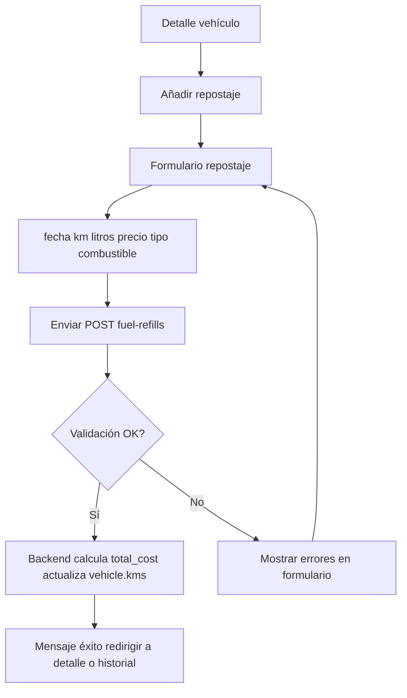

# MH3 — Registrar repostaje

| Campo | Valor |
|-------|--------|
| **ID** | MH3 |
| **Prioridad** | Must-Have |
| **Rol** | Usuario |
| **Historia** | Como **usuario**, quiero **registrar un repostaje** (fecha, km, litros, precio, opcional gasolinera) para **llevar el control del consumo y el coste**. |

## Descripción

Desde el detalle de un vehículo el usuario puede abrir el formulario "Añadir repostaje". Debe poder indicar: fecha del repostaje, km del vehículo en ese momento, litros repostados, precio por litro, tipo de combustible y, opcionalmente, gasolinera (selección desde gasolineras cercanas o manual). El backend calcula el coste total (litros × precio/litro) y actualiza los km del vehículo si los km del repostaje son mayores. Tras guardar, el repostaje aparece en el historial del vehículo y se usa para calcular consumo (L/100 km) y coste por km en el informe.

## Flujo

## Criterios de aceptación

- **AC1**: Desde la vista de detalle del vehículo existe un botón o enlace "Añadir repostaje" que lleva a un formulario (ruta `/vehicle/:id/add-fuel` o equivalente).
- **AC2**: El formulario incluye campos: fecha (obligatorio), km (opcional pero recomendado), litros (obligatorio), precio por litro (obligatorio), tipo de combustible (obligatorio; puede tener valor por defecto del vehículo). Opcional: gasolinera, notas.
- **AC3**: Al enviar el formulario se llama a `POST /api/fuel-refills` con `vehicle_id` y los datos del repostaje. El backend calcula `total_cost` si no se envía.
- **AC4**: Si el repostaje tiene `kms` mayor que el km actual del vehículo, el backend actualiza `vehicle.kms` automáticamente.
- **AC5**: Tras un guardado correcto, se muestra un mensaje de éxito y se redirige al detalle del vehículo o al historial; el nuevo repostaje aparece en la lista.
- **AC6**: Si hay error de validación (campos obligatorios, formatos), se muestran los mensajes de error en el formulario sin redirigir.
- **AC7**: El usuario solo puede crear repostajes para vehículos de su empresa (la API key impone el filtro).

## Casos de prueba sugeridos (QA)

| Caso | Pasos / condición | Resultado esperado |
|------|-------------------|--------------------|
| Repostaje válido | Rellenar fecha, km, litros, precio por litro, tipo combustible; enviar. | API 201; mensaje de éxito; redirección a detalle o historial; nuevo repostaje visible; vehicle.kms actualizado si aplica. |
| Campos obligatorios vacíos | Enviar formulario sin fecha o sin litros. | Errores de validación en el formulario; no se llama a POST o API devuelve 422 con mensajes por campo. |
| Litros o precio negativos | Introducir litros &lt; 0 o precio por litro &lt; 0. | Validación: mensaje de error; no se guarda. |
| Km mayor que actual | Repostaje con km superior al km actual del vehículo. | Se guarda el repostaje; backend actualiza vehicle.kms al nuevo valor. |
| vehicle_id de otra empresa | Manipular request para enviar vehicle_id de un vehículo ajeno. | API 403/404; no se crea repostaje; sin fuga de datos. |

## Notas

- Depende de MH1 y MH2. El cálculo de consumo L/100 km y coste por km se realiza en backend (FuelRefillService / modelo) y se expone en el informe (MH5).

## Tickets que implementan esta historia

- [T6 — API: CRUD fuel-refills y cálculo consumo](../tickets/T6.md)
- [T11 — Frontend: Detalle vehículo y formulario repostaje](../tickets/T11.md)

---

[Índice de historias de usuario](../historias-usuario.md)
