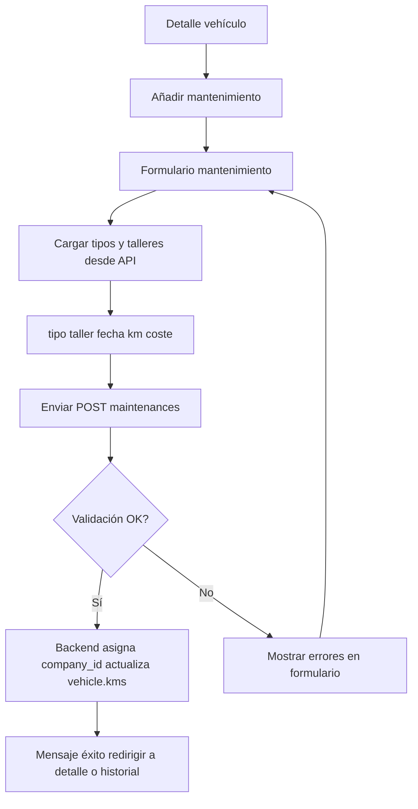

# MH4 — Registrar mantenimiento

| Campo | Valor |
|-------|--------|
| **ID** | MH4 |
| **Prioridad** | Must-Have |
| **Rol** | Usuario |
| **Historia** | Como **usuario**, quiero **registrar un mantenimiento** (tipo, taller, fecha, km, coste) para **tener trazabilidad y alertas de próximas revisiones**. |

## Descripción

Desde el detalle de un vehículo el usuario puede abrir el formulario "Añadir mantenimiento". Debe poder indicar: tipo de mantenimiento (desplegable desde `GET /api/maintenance-types`), taller (desplegable desde `GET /api/workshops` o texto libre si se permite), fecha, km del vehículo en ese momento, coste y notas. Opcionalmente puede indicar próxima fecha de mantenimiento y próximos km para generar recordatorios. Tras guardar, el mantenimiento aparece en el historial del vehículo y puede alimentar notificaciones (SH1).

## Flujo

## Criterios de aceptación

- **AC1**: Desde la vista de detalle del vehículo existe un botón o enlace "Añadir mantenimiento" que lleva a un formulario (ruta `/vehicle/:id/add-maintenance` o equivalente).
- **AC2**: El formulario incluye: tipo de mantenimiento (obligatorio; lista desde API), taller (opcional; lista desde API o texto), fecha (obligatorio), km (opcional), coste (opcional). Opcional: próxima fecha, próximos km, notas.
- **AC3**: Al enviar se llama a `POST /api/maintenances` con `vehicle_id` y los datos. El backend asocia `company_id` y, si se indica, puede crear o vincular recordatorios.
- **AC4**: Si el mantenimiento tiene `kms` mayor que el km actual del vehículo, el backend actualiza `vehicle.kms`.
- **AC5**: Tras guardado correcto, mensaje de éxito y redirección al detalle o historial; el nuevo mantenimiento aparece en la lista.
- **AC6**: Errores de validación se muestran en el formulario sin redirigir.
- **AC7**: El usuario solo puede crear mantenimientos para vehículos de su empresa.

## Casos de prueba sugeridos (QA)

| Caso | Pasos / condición | Resultado esperado |
|------|-------------------|--------------------|
| Mantenimiento válido | Seleccionar tipo, taller (si aplica), fecha, km, coste; enviar. | API 201; mensaje de éxito; redirección; nuevo mantenimiento en historial; vehicle.kms actualizado si aplica. |
| Tipo obligatorio vacío | Enviar sin seleccionar tipo de mantenimiento. | Error de validación; formulario no se envía o API 422. |
| Fecha futura | Introducir fecha de mantenimiento futura (si la regla de negocio lo prohíbe). | Validación según reglas: rechazo o aceptación documentada. |
| vehicle_id de otra empresa | Manipular request con vehicle_id ajeno. | API 403/404; no se crea mantenimiento. |
| Listas tipo/taller vacías | API de maintenance-types o workshops sin datos. | Formulario muestra desplegables vacíos o mensaje "Sin tipos/talleres"; resto del formulario usable. |

## Notas

- Depende de MH1 y MH2. Los tipos de mantenimiento y talleres se gestionan desde el panel Filament o desde la API (CRUD maintenance-types y workshops).

## Tickets que implementan esta historia

- [T7 — API: CRUD maintenances, maintenance-types y workshops](../tickets/T7.md)
- [T12 — Frontend: Formulario mantenimiento](../tickets/T12.md)

---

[Índice de historias de usuario](../historias-usuario.md)
