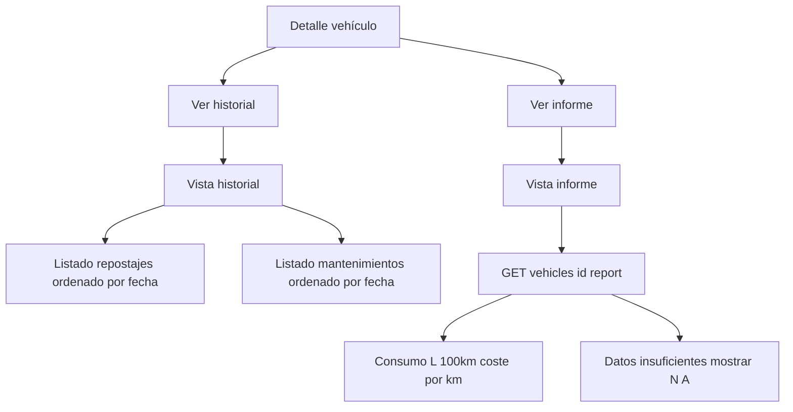

# MH5 — Historial e informe del vehículo

| Campo | Valor |
|-------|--------|
| **ID** | MH5 |
| **Prioridad** | Must-Have |
| **Rol** | Usuario |
| **Historia** | Como **usuario**, quiero **ver el historial y el informe de un vehículo** para **analizar consumo y gastos**. |

## Descripción

El usuario debe poder ver el historial completo de repostajes y mantenimientos de un vehículo (listado ordenado por fecha) y una vista de informe que muestre métricas de consumo (L/100 km) y coste por km, calculadas por el backend a partir de los repostajes. El historial puede ser una pestaña dentro del detalle del vehículo o una página dedicada (`/vehicle/:id/history`). El informe puede ser una página dedicada (`/vehicle/:id/report`) que consuma `GET /api/vehicles/{id}/report`.

## Flujo

## Criterios de aceptación

- **AC1**: Existe una vista "Historial" accesible desde el detalle del vehículo que muestra repostajes y mantenimientos (o pestañas/tabs separados para cada tipo).
- **AC2**: Los repostajes se obtienen de la API (p. ej. filtrando por `vehicle_id` en `GET /api/fuel-refills` o mediante un endpoint de historial) y se muestran ordenados por fecha (más reciente primero).
- **AC3**: Los mantenimientos se obtienen de la API (p. ej. `GET /api/maintenances` filtrado por `vehicle_id`) y se muestran ordenados por fecha.
- **AC4**: Existe una vista "Informe" que consume `GET /api/vehicles/{id}/report` y muestra al menos: consumo medio (L/100 km) y coste por km en el periodo disponible, y opcionalmente gráficos o desglose por repostajes.
- **AC5**: Los datos mostrados corresponden únicamente al vehículo seleccionado y a la empresa del usuario (sin fugas de datos).
- **AC6**: Si no hay repostajes suficientes para calcular consumo/coste, el informe lo indica de forma clara (mensaje o valores "N/A").

## Casos de prueba sugeridos (QA)

| Caso | Pasos / condición | Resultado esperado |
|------|-------------------|--------------------|
| Historial con datos | Vehículo con repostajes y mantenimientos. | Historial muestra listado ordenado por fecha (más reciente primero); repostajes y mantenimientos visibles. |
| Historial vacío | Vehículo sin repostajes ni mantenimientos. | Mensaje "Sin historial" o listas vacías; sin error. |
| Informe con repostajes | Vehículo con al menos 2 repostajes. | Informe muestra consumo L/100 km y coste por km (o equivalentes); datos coherentes con backend. |
| Informe sin repostajes | Vehículo sin repostajes. | Informe muestra "N/A" o mensaje "Datos insuficientes"; no errores. |
| ID vehículo de otra empresa | Acceder a `/vehicle/:id/history` o `/vehicle/:id/report` con ID ajeno. | API 404; frontend no muestra datos de otras empresas. |

## Notas

- Depende de MH1, MH2 y MH3 (el informe tiene más valor con repostajes registrados). El backend ya expone el reporte en `VehicleReportService` / `VehicleController::report`.

## Tickets que implementan esta historia

- [T8 — API: Reporte vehículo (consumo, costes)](../tickets/T8.md)
- [T13 — Frontend: Historial e informe vehículo](../tickets/T13.md)

---

[Índice de historias de usuario](../historias-usuario.md)
