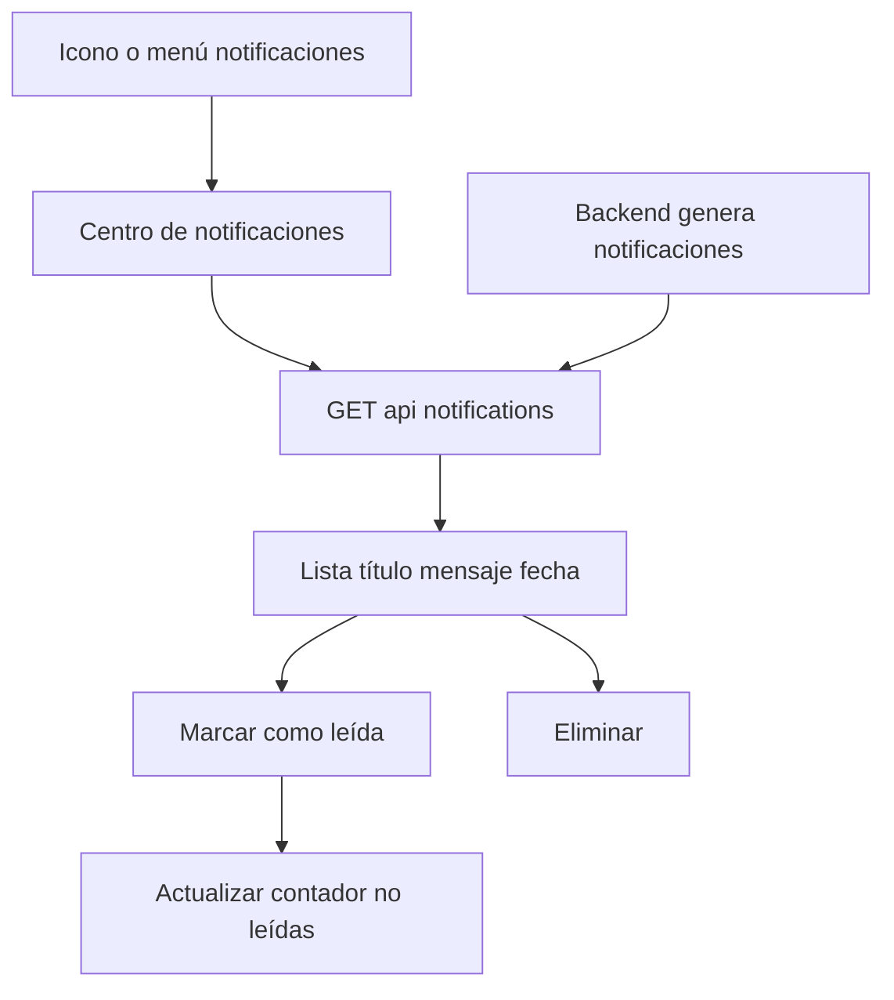

# SH1 — Notificaciones (mantenimientos, ITV, seguros)

| Campo | Valor |
|-------|--------|
| **ID** | SH1 |
| **Prioridad** | Should-Have |
| **Rol** | Usuario |
| **Historia** | Como **usuario**, quiero **recibir notificaciones de próximos mantenimientos, ITV y renovación de seguros** para **no olvidar revisiones**. |

## Descripción

El usuario debe poder ver un centro de notificaciones dentro de la app (lista de notificaciones con título, mensaje y fecha). Opcionalmente puede recibir notificaciones push (Firebase) en el dispositivo. Las notificaciones son generadas en el backend (jobs o comandos programados) según mantenimientos próximos, fechas de ITV y renovación de seguros, y se exponen mediante `GET /api/notifications` y endpoints de marcar como leído / eliminar.

## Flujo

## Criterios de aceptación

- **AC1**: Existe un centro de notificaciones en la app (icono o menú) que muestra la lista de notificaciones del usuario (`GET /api/notifications`).
- **AC2**: Cada notificación muestra título, mensaje (o resumen) y fecha; se pueden marcar como leídas (`POST /api/notifications/{id}/read` o `read-all`) y eliminar.
- **AC3**: El backend genera notificaciones para: próximos mantenimientos (fecha/km), próximas ITV, renovación de seguros (según reglas de negocio y jobs existentes).
- **AC4** (opcional): El usuario puede registrar su dispositivo para push (`POST /api/push-notifications/register`) y recibir notificaciones push cuando el backend las envíe (Firebase).
- **AC5**: El contador de no leídas se muestra en la UI y se actualiza al marcar como leído o al recibir nuevas notificaciones.

## Casos de prueba sugeridos (QA)

| Caso | Pasos / condición | Resultado esperado |
|------|-------------------|--------------------|
| Centro vacío | Usuario sin notificaciones. | Lista vacía o mensaje "No hay notificaciones"; contador en 0. |
| Listado con notificaciones | Usuario con notificaciones no leídas. | Se muestran título, mensaje y fecha; contador refleja no leídas. |
| Marcar como leída | Clic en "Marcar como leída" en una notificación. | Petición a API correcta; contador disminuye; notificación pasa a estado leído en UI. |
| Marcar todas como leídas | Si existe acción "Leer todas". | Contador pasa a 0; todas visibles como leídas. |
| Eliminar notificación | Acción eliminar en una notificación. | Desaparece de la lista; contador se actualiza si era no leída. |

## Notas

- Depende de MH1. Opcional para el MVP; mejora la retención y el cumplimiento de revisiones.

## Tickets que implementan esta historia

- [T14 — Notificaciones en app y push (opcional)](../tickets/T14.md)

---

[Índice de historias de usuario](../historias-usuario.md)
