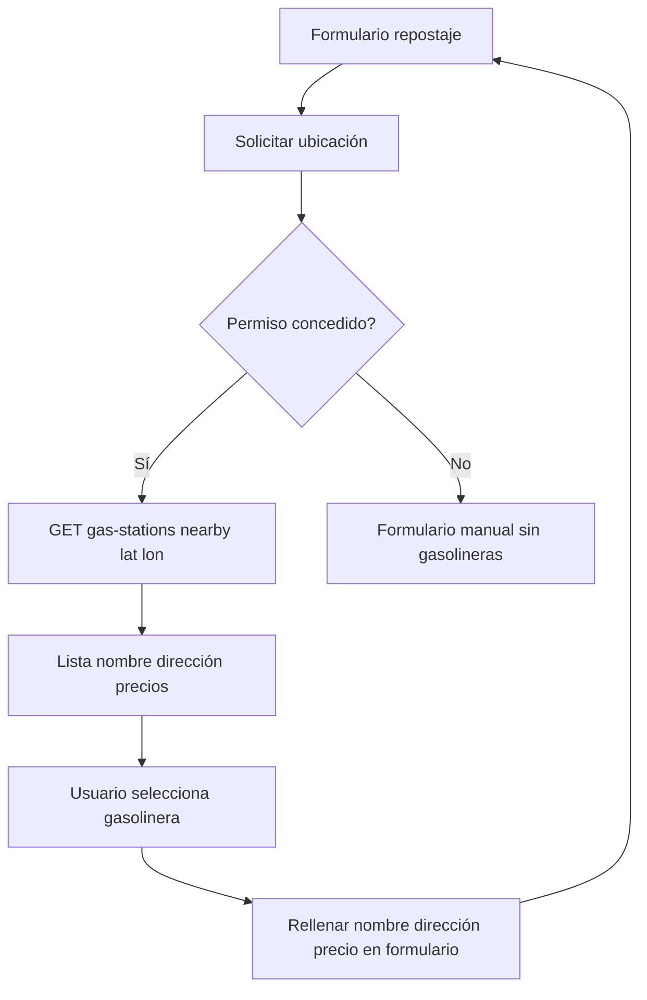

# SH2 — Gasolineras cercanas al repostar

| Campo | Valor |
|-------|--------|
| **ID** | SH2 |
| **Prioridad** | Should-Have |
| **Rol** | Usuario |
| **Historia** | Como **usuario**, quiero **ver gasolineras cercanas y precios** al registrar un repostaje para **elegir dónde repostar**. |

## Descripción

En el formulario de "Añadir repostaje" (o en una pantalla previa) el usuario puede ver gasolineras cercanas a su ubicación con los precios actuales por tipo de combustible. La app obtiene la ubicación (permisos del navegador/dispositivo) y llama a `GET /api/gas-stations/nearby?latitude=...&longitude=...` (y opcionalmente radio y tipo de combustible). El usuario puede seleccionar una gasolinera para rellenar automáticamente nombre/dirección y precio en el formulario de repostaje.

## Flujo

## Criterios de aceptación

- **AC1**: En el flujo de añadir repostaje se puede solicitar la ubicación del usuario (con permiso) y llamar a `GET /api/gas-stations/nearby` con lat/lon (y parámetros opcionales).
- **AC2**: Se muestran las gasolineras devueltas con: nombre, dirección (o municipio), precios por tipo de combustible (gasolina 95, 98, diesel, etc.) cuando estén disponibles.
- **AC3**: El usuario puede elegir una gasolinera para rellenar en el formulario: nombre de la gasolinera, dirección (opcional) y precio por litro según el tipo de combustible seleccionado.
- **AC4**: Si el usuario no concede permiso de ubicación, el formulario sigue siendo usable sin gasolineras cercanas (datos manuales).
- **AC5**: Los precios mostrados provienen del backend (API de precios o base de datos actualizada por job); se indica si son "actualizados en fecha X" si aplica.

## Casos de prueba sugeridos (QA)

| Caso | Pasos / condición | Resultado esperado |
|------|-------------------|--------------------|
| Ubicación concedida | En formulario repostaje, conceder permiso de ubicación. | Se llama a GET /api/gas-stations/nearby con lat/lon; se muestran gasolineras con nombre, dirección y precios. |
| Ubicación denegada | Denegar permiso de ubicación en el formulario repostaje. | Formulario sigue usable; no se muestran gasolineras cercanas o mensaje "Activa la ubicación para ver gasolineras". |
| Sin gasolineras en radio | Ubicación en zona sin gasolineras en el radio por defecto. | Mensaje "No hay gasolineras cercanas" o lista vacía; formulario rellenable manualmente. |
| Seleccionar gasolinera | Elegir una gasolinera de la lista. | Se rellenan nombre/dirección y precio por litro según tipo de combustible seleccionado en el formulario. |
| Parámetros inválidos | Llamar a nearby sin lat/lon o con valores fuera de rango. | API 400 o respuesta vacía; frontend no rompe; formulario manual disponible. |

## Notas

- Depende de MH1 y MH3. Mejora la UX del repostaje y aprovecha el endpoint público ya existente.

## Tickets que implementan esta historia

- [T15 — Gasolineras cercanas en repostaje (opcional)](../tickets/T15.md)

---

[Índice de historias de usuario](../historias-usuario.md)
