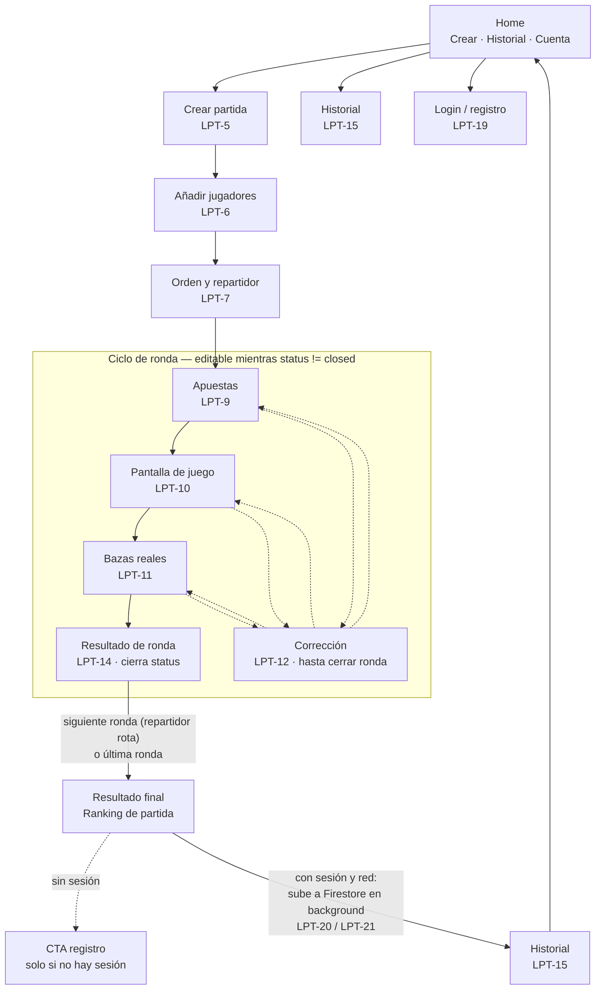

This file contains base rules for an AI agent. I need you to rewrite it for 
a different stack, keeping the exact same structure and purpose.

New stack:
- Mobile app: Flutter (Dart)
- Backend/Database: Firebase (Firestore + Authentication)
- State management: BLoC pattern (flutter_bloc package)
- Architecture: Clean Architecture — presentation (BLoC + widgets), 
  domain (use cases + entities), data (repositories + Firebase datasources)
- Platform: Android / iOS
- Code and comments: English
- Documentation, commits and PR descriptions: Spanish
- No REST API; all data access through Firebase SDK

Replace all React, Node, TypeScript and frontend/backend web references 
with their Flutter/Firebase/BLoC equivalents. Make the result implementation-ready 
for AI agents working in Cursor on this project.

--------------------------

- Deprecate or remove backend-standards.mdc and frontend-standards.mdc 
  since they describe Node/React which is not our stack.
- Update AGENTS.md to reference only the new Flutter/Firebase standards.
- Update any commands in ai-specs/.commands/ that still reference 
  the old backend/frontend standards.

----------------------

Adapt or mark as obsolete ai-specs/specs/development_guide.md and api-spec.yml 
since they describe a web stack. Replace any REST/API references with 
Firebase SDK equivalents, or add a deprecation notice if they are not relevant 
for a Flutter/Firebase project.

---------------------

Update mobile-standards.mdc and AGENTS.md to reference the installed 
skills in .agents/skills/. Specifically ensure agents use:
- flutter-apply-architecture-best-practices
- dart-add-unit-test
- flutter-add-integration-test  
- dart-generate-test-mocks
- flutter-implement-json-serialization
- flutter-setup-declarative-routing
when performing related tasks.

------------------------

Actúa como un Product Owner senior con experiencia en apps móviles.
Genera un PRD (Product Requirements Document) completo en español para
la siguiente app móvil:

## Contexto

App móvil Flutter llamada "La Pocha" — marcador digital para el juego
de cartas español homónimo. El objetivo es sustituir el papel y lápiz
con una experiencia ágil y sencilla.

## Decisiones ya tomadas

### Jugadores y cartas

- Mínimo 3, máximo 8 jugadores
- El número de cartas se determina automáticamente por el número de jugadores:
  - 3 jugadores: 30 cartas, máximo 10 por ronda
  - 4 jugadores: 40 cartas, máximo 10 por ronda
  - 5 jugadores: 40 cartas, máximo 8 por ronda
  - 6 jugadores: 48 cartas, máximo 8 por ronda
  - 7 jugadores: 49 cartas (+ comodín), máximo 7 por ronda
  - 8 jugadores: 48 cartas, máximo 6 por ronda

### Puntuación

- Acierto: 10 + (5 × bazas conseguidas)
- Fallo: -5 × diferencia entre bazas apostadas y conseguidas
- Restricción del repartidor: obligatoria. La suma de apuestas no puede
  igualar el número de bazas disponibles. No se puede cerrar la fase de
  apuestas si se incumple.

### Flujo de una ronda

1. Introducir apuestas en orden; el repartidor apuesta el último
2. Pantalla de juego: muestra apuestas de cada jugador, puntuación
   acumulada y balance de bazas pedidas vs disponibles en tiempo real
3. Introducir bazas reales obtenidas
4. Pantalla de resultado de ronda: ranking, puntuación total, delta
   respecto a ronda anterior

- Corrección permitida solo en ronda actual
- Si una corrección viola la restricción del repartidor, se bloquea
  hasta que el repartidor corrija sus bazas
- Posibilidad de repetir una ronda completa

### Configuración de partida

- El usuario elige número de jugadores (3-8); el resto se calcula solo
- Primer repartidor: por defecto el primero de la lista, con botón
  "🎲 Repartidor aleatorio"
- El orden de jugadores es editable antes de empezar y determina la
  rotación del reparto

### Jugadores

- Tres formas de añadir un jugador: nombre libre, buscar usuario
  registrado por nombre de usuario, o seleccionar de lista de favoritos
- Favoritos: lista local de jugadores frecuentes, pueden ser
  registrados o no
- El orden de jugadores puede modificarse antes de empezar la partida

### Cuenta y sincronización en la nube

- Registro completamente opcional
- Sin cuenta: todo funciona en local, sin conexión
- Con cuenta: las partidas se suben automáticamente a la nube al
  finalizar
- Los jugadores de la partida que tengan cuenta registrada reciben
  la partida automáticamente en su historial
- Partidas locales previas al registro: se quedan en local
- Historial único con icono diferenciador local/nube

### Historial

- Listado de todas las partidas (locales y en nube mezcladas)
- Detalle de una partida: resultado ronda a ronda
- Repetir partida: crea nueva partida con misma configuración y
  jugadores, editable antes de empezar

## Alcance del MVP

Incluye todo lo descrito arriba.

## Post-MVP explícito (NO incluir en MVP)

- Subida manual de partidas locales antiguas tras registrarse
- Campeonatos y ligas entre amigos
- Estadísticas sociales y gamificación
- Variantes random durante la partida
- Soporte para 2 jugadores

## Estructura del PRD

El documento debe incluir:

1. Visión del producto y problema que resuelve
2. Usuarios objetivo (2-3 personas)
3. Propuesta de valor
4. Alcance del MVP (qué sí, qué no)
5. Flujo E2E prioritario descrito en prosa
6. Funcionalidades principales
7. Restricciones técnicas
8. Métricas de éxito para el MVP

Sé específico y evita generalidades. El documento debe ser suficientemente
claro para que cualquier desarrollador pueda entender el producto sin
explicación adicional.

---------------------------

Dado este PRD: @docs/PRD.com

Genera la sección "Descripción general del producto" para el @readme.md
del proyecto. Debe incluir:

- Qué es el producto y qué problema resuelve (3-4 líneas)
- Propuesta de valor principal (bullet points)
- Funcionalidades principales del MVP (bullet points)
- Flujo E2E prioritario resumido (3-4 líneas)

Formato markdown. Tono técnico pero accesible. Máximo una página.

-----------

### Historias de usuario — Generación inicial
**Herramienta:** Claude (chat conversacional)
**Proceso:** Sesión de metaprompting para afinar el producto antes de 
generar las historias. Se definieron reglas del juego, flujos de UX, 
modelo de sincronización local/nube y casos edge antes de producir 
las historias.
**Resultado:** 15 historias organizadas en 4 épicas (Gestión de partida, 
Flujo de ronda, Historial, Cuenta y sincronización)
**Ajuste humano:** 
  ***Decisión:*** Se detectó la ausencia de funcionalidad de borrado de 
partidas y gestión de favoritos. Se añadieron dos historias Must-Have 
y se actualizó el PRD.
  ***Motivo:*** La IA no contempló la gestión del ciclo de vida de los datos. 
Revisión humana necesaria.
**Conversación completa:** [enlace a esta conversación si la exportas]


--------------


Create the following user stories as Jira tickets in project LA-POCHA. 
For each ticket set status "To refine", add the corresponding epic, 
priority (High for Must-Have, Medium for Should-Have), and estimate (S/M/L).

EPIC: Gestión de partida
1. Como organizador, quiero crear una nueva partida seleccionando el número 
   de jugadores, para que la app genere automáticamente la secuencia de 
   rondas y el número de cartas. Priority: High. Size: M.
2. Como organizador, quiero añadir jugadores por nombre libre, buscando 
   usuarios registrados o seleccionando de mis favoritos, para configurar 
   la partida rápidamente. Priority: High. Size: M.
3. Como organizador, quiero reordenar los jugadores y elegir el primer 
   repartidor (o asignarlo aleatoriamente), para respetar el orden físico 
   de la mesa. Priority: High. Size: S.
4. Como organizador, quiero repetir una partida desde el historial, para 
   recrear la misma configuración sin introducir los datos de nuevo. 
   Priority: High. Size: S.

EPIC: Flujo de ronda
5. Como organizador, quiero introducir las apuestas de cada jugador en 
   orden (repartidor al final) con validación de la restricción en tiempo 
   real, para cerrar la fase de apuestas sin errores. Priority: High. Size: L.
6. Como organizador, quiero ver durante el juego las apuestas, puntuación 
   acumulada y balance de bazas de cada jugador, para que todos puedan 
   seguir el estado de la partida. Priority: High. Size: M.
7. Como organizador, quiero introducir las bazas reales obtenidas y que 
   la app calcule los puntos automáticamente, para eliminar errores de 
   cálculo. Priority: High. Size: M.
8. Como organizador, quiero poder corregir apuestas o bazas en la ronda 
   actual, para subsanar errores de introducción. Priority: High. Size: M.
9. Como organizador, quiero poder repetir una ronda completa, para 
   gestionar situaciones excepcionales durante el juego. 
   Priority: High. Size: S.
10. Como organizador, quiero ver el resultado de cada ronda con ranking 
    y puntuación acumulada, para que todos los jugadores conozcan su 
    posición. Priority: High. Size: S.

EPIC: Historial
11. Como jugador, quiero ver un listado de todas mis partidas jugadas 
    (locales y en nube), para consultar mi historial de juego. 
    Priority: High. Size: M.
12. Como jugador, quiero ver el detalle de una partida pasada ronda a 
    ronda, para recordar cómo se desarrolló. Priority: High. Size: M.
13. Como jugador, quiero eliminar partidas de mi historial, para mantener 
    solo las que me interesa conservar. Priority: High. Size: S.
14. Como jugador, quiero gestionar mi lista de favoritos (añadir y 
    eliminar), para mantenerla actualizada. Priority: High. Size: S.

EPIC: Cuenta y sincronización
15. Como jugador, quiero registrarme y hacer login con email y contraseña, 
    para poder sincronizar mis partidas en la nube. 
    Priority: Medium. Size: M.
16. Como jugador registrado, quiero que mis partidas se suban 
    automáticamente al finalizarlas, para tener mi historial disponible 
    en la nube sin ninguna acción adicional. Priority: Medium. Size: M.
17. Como jugador registrado, quiero recibir automáticamente en mi historial 
    las partidas en las que participé aunque no fuera yo quien llevara el 
    marcador, para ver todas mis partidas desde mi cuenta. 
    Priority: Medium. Size: M.


-----------------

Use /multitask to process the following Jira tickets in parallel.
Use Atlassian  CLI (acli) to read and update Jira tickets.

For each ticket:

1. Read the current ticket description using acli
2. Run /enrich-us with the ticket content and the PRD at docs/PRD.md
   as context
3. Update the ticket in Jira with the enhanced content using acli,
   keeping the [original] section and adding the [enhanced] section

Tickets to process in parallel:
LPT-6, LPT-7, LPT-8, LPT-9, LPT-10, LPT-11, LPT-12, LPT-13,
LPT-14, LPT-15, LPT-16, LPT-17, LPT-18

---------------
Use /multitask to process the following Jira tickets in parallel.
The Atlassian MCP is not available, use acli (C:\Users\juanm\acli.exe)
to read and update Jira tickets instead.

For each ticket:

1. Read the current ticket description using acli
2. Run /enrich-us with the ticket content and the PRD at docs/PRD.md
   as context
3. Update the ticket in Jira with the enhanced content using acli,
   keeping the [original] section and adding the [enhanced] section

Tickets to process in parallel:
LPT-19, LPT-20, LPT-21

-------------------

Using acli (C:\Users\juanm\acli.exe), update the Jira ticket LPT-5.

Read the current description of LPT-5 and apply ONLY these two changes:

1. In the acceptance criteria, replace criterion 3 with:
"La secuencia de rondas sigue el patrón ascendente-plateau-descendente:
1, 2, …, M (repetido N veces, siendo N el número de jugadores), M-1, …, 2, 1.
Ejemplo con 4 jugadores (M=10): 1,2,3,4,5,6,7,8,9,10,10,10,10,9,8,7,6,5,4,3,2,1 = 22 rondas."

2. In the configuration table, replace the "Rondas (2M−1)" column
with "Rondas (2M−1+N)" and update values:
| Jugadores | Cartas totales | Máx. por ronda (M) | Rondas |
|-----------|----------------|--------------------|--------|
| 3         | 30             | 10                 | 21     |
| 4         | 40             | 10                 | 22     |
| 5         | 40             | 8                  | 19     |
| 6         | 48             | 8                  | 21     |
| 7         | 49 (+ comodín) | 7                  | 19     |
| 8         | 48             | 6                  | 18     |

Do not modify any other content. Preserve all existing formatting.

------------

Read the PRD at docs/PRD.md and update the readme.md in the repository
root with the following two sections:

## Ficha del proyecto

Generate a project card with these fields:

- Nombre: La Pocha
- Descripción corta: one sentence
- Stack: Flutter + Firebase (Firestore + Authentication)
- State management: BLoC
- Plataforma: Android / iOS
- Autor: [leave blank for the user to fill]
- Repositorio: [leave blank for the user to fill]

## Descripción general del producto

Based on PRD sections 1, 2, 3 and 5, write a concise product description
in Spanish including:

- What it is and what problem it solves (3-4 lines)
- Target users (the 3 personas from the PRD, summarized)
- Main value proposition (bullet points)
- MVP E2E flow summarized (3-4 lines)

Keep markdown formatting clean. Write in Spanish.
Do not modify any other existing content in readme.md.

----------------

### Seguridad — Eliminación de secretos expuestos
**Tipo:** Corrección humana
**Problema:** firebase_options.dart subido accidentalmente al repo público
**Solución:** git rm --cached, rotación de API key en Firebase, 
GitHub Secret configurado
**Lección:** Configurar .gitignore antes del primer commit, 
no después

-------

Read the PRD at docs/PRD.md and the standards at .cursor/rules/.
Generate the architecture section for readme.md in Spanish, filling 
these subsections:

## 2.1 Diagrama de arquitectura
Generate a Mermaid diagram showing the main components:
- Flutter app (presentation/domain/data layers)
- Local storage (device)
- Firebase Authentication
- Firebase Firestore
Show the data flow for both offline and online scenarios.
Justify the Clean Architecture choice and BLoC pattern.

## 2.2 Descripción de componentes principales
Describe each component with the technology used.

## 2.3 Estructura de ficheros
Show the folder structure under lib/ following Clean Architecture 
with BLoC. Include a brief description of each main folder.

## 2.4 Infraestructura y despliegue
Describe Firebase infrastructure and the deployment process 
for the Flutter app (APK/TestFlight).

## 2.5 Seguridad
Describe security practices: Firebase Auth, Firestore Security Rules, 
local data, secrets management.

## 2.6 Tests
Describe the testing strategy: unit tests (domain logic), 
integration tests (BLoC + repository), E2E test (main flow).

Do not modify any other section of readme.md.
Write in Spanish. Use Mermaid for diagrams.

------------

In readme.md, apply these two corrections to section 2:

1. Section 2.3: Replace any reference to SQLite or drift with
"local storage (technology to be confirmed in Entrega 2)"

2. Section 2.4: Replace Play Store and TestFlight deployment
with GitHub Releases APK download. The deployment process is:
GitHub Actions builds release APK on merge to main,
uploaded as GitHub Release artifact with a public download URL.

----------

Read the PRD at docs/PRD.md and the architecture already defined
in readme.md section 2.

Generate the data model section for readme.md in Spanish,
filling these subsections:

## 3.1 Diagrama del modelo de datos

Generate a Mermaid entity-relationship diagram for the Firestore
data model. Include these collections based on the PRD:

- users: registered user profiles
- games: game sessions (local and cloud)
- games/{gameId}/rounds: round detail subcollection
- favorites: local player favorites (document per user)

For each collection show all fields with types.
Mark which fields are used for queries (history by user,
game detail).
Note: local storage model mirrors the Firestore model
but persists on device.

## 3.2 Descripción de entidades principales

For each collection/entity describe:

- All fields with type and description
- Relationships between entities
- Key constraints and validation rules
- Which fields are indexed for queries

Important constraints from PRD:

- games.hostId: user who created the game
- games.participantIds: array of registered user IDs
  (for history queries)
- rounds are a subcollection of games (not embedded array)
- deletion is per-user only (soft delete or filtered query)
- offline-first: all data exists locally before any
  Firestore sync

Write in Spanish. Use Mermaid for the diagram.
Do not modify any other section of readme.md.

------------

In readme.md sections 2 and 3, make players consistently
embedded in the games document (not a subcollection).
Update any reference to a players subcollection in section 2
to reflect that players are an embedded array in games.
Do not modify anything else.

-----------

Read the PRD at docs/PRD.md and the data model already defined
in readme.md section 3.

Generate the API section for readme.md in Spanish, filling
section 4:

## 4. Especificación de la API

This project does not use a REST API. All data access is through
Firebase SDK. Document the 3 most important Firestore operations
as if they were API endpoints, using a similar format to OpenAPI
but adapted to Firestore:

Operation 1: Create and sync a finished game

- Firestore path: games/{gameId} + subcollection rounds/{roundNumber}
- Operation type: batch write
- Required fields from data model
- Security rule that applies
- Offline behaviour (written locally first)

Operation 2: Get user game history

- Firestore path: games (collection query)
- Operation type: query
- Filters: participantIds array-contains userId,
  status == finished, hiddenInHistory != true for this user
- Ordered by finishedAt descending
- Security rule that applies

Operation 3: Firebase Authentication - register and login

- Operations: createUserWithEmailAndPassword,
  signInWithEmailAndPassword
- Fields: email, password, displayName
- Error cases: email already in use, wrong password,
  user not found
- Effect on Firestore: creates users/{uid} document on register

For each operation include:

- Description
- Parameters / fields
- Success response
- Error cases
- Security rule that applies

Write in Spanish. Do not modify any other section of readme.md.

------------

Read the Jira tickets descriptions stored in .tmp/jira-descriptions/
and the readme.md structure.

Fill sections 5 and 6 of readme.md:

## 5. Historias de Usuario

Select the 3 most representative Must-Have user stories from
the available tickets. Good candidates:

- LPT-5 (create game - core flow)
- LPT-9 (bets with dealer restriction - most complex)
- LPT-11 (real tricks and scoring - core logic)

For each story include the full enhanced content from Jira:
original story + acceptance criteria.
Do not include technical implementation details here.

## 6. Tickets de Trabajo

Select 3 tickets that represent different layers:

- One focused on domain logic (scoring, round sequence)
- One focused on UI/presentation (a screen or BLoC)
- One focused on Firebase/data layer (sync or auth)

For each ticket include the full enhanced content from Jira
including: context, acceptance criteria, data model impact,
architecture files, and definition of done.

Write in Spanish. Do not modify any other section of readme.md.

-----------

Read the file listOfPrompts.md and the prompts.md template
in the repository root.

Fill prompts.md with the most relevant prompts from
listOfPrompts.md, mapping them to the correct sections:

- Section 1 (Descripción general): PRD generation prompt
- Section 2 (Arquitectura): architecture section prompt
- Section 3 (Modelo de datos): data model prompt
- Section 4 (API): API specification prompt
- Section 5 (Historias de usuario): user stories generation prompt
- Section 6 (Tickets de trabajo): /enrich-us + multitask prompt

Maximum 3 prompts per section. Include only the prompt text,
the tool used, and a one-line note on what human adjustment
was needed.

Do not modify listOfPrompts.md.
Write in Spanish.

**************************************

ENTREGA 2

----------

Abre el archivo `readme.md` y aplica los siguientes cambios de texto exactos. No modifiques nada más allá de lo indicado.

CAMBIO 1 — Línea 327 (diagrama ER, campo status de GAMES):
  ANTES:  string status "🔍 lobby | in_progress | finished"
  DESPUÉS: string status "🔍 setup | in_progress | finished"

CAMBIO 2 — Línea 435 (tabla de campos de `games`):
  ANTES:  | `status` | string | 🔍 `lobby`, `in_progress`, `finished` |
  DESPUÉS: | `status` | string | 🔍 `setup`, `in_progress`, `finished` |

CAMBIO 3 — Línea 446 (descripción de campo `startedAt`):
  ANTES:  | `startedAt` | timestamp? | Paso de `lobby` a `in_progress` |
  DESPUÉS: | `startedAt` | timestamp? | Paso de `setup` a `in_progress` |

CAMBIO 4 — Línea 924 (criterio de aceptación HU1 — LPT-5):
  ANTES:  en estado `lobby` persistido
  DESPUÉS: en estado `setup` persistido

CAMBIO 5 — Línea 1004 (criterio de aceptación Ticket 1 — LPT-7):
  ANTES:  mientras `status == lobby`
  DESPUÉS: mientras `status == setup`

CAMBIO 6 — Línea 1018 (tabla de impacto en modelo de datos, Ticket 1 — LPT-7):
  ANTES:  | `status` | string | `lobby` → `in_progress` al empezar |
  DESPUÉS: | `status` | string | `setup` → `in_progress` al empezar |

CAMBIO 7 — Línea 1042 (nota de Security Rules, Ticket 1 — LPT-7):
  ANTES:  transición `lobby` → `in_progress` en Firestore
  DESPUÉS: transición `setup` → `in_progress` en Firestore

  -------------------

  Abre el archivo `readme.md` y aplica los siguientes cambios de texto exactos. No modifiques nada más allá de lo indicado.

CAMBIO 1 — Línea 152 (tabla de componentes, fila "Data — local"):
  ANTES:
  | **Data — local** | Datasource + local storage (technology to be confirmed in Entrega 2) | Partidas en curso, historial local, favoritos; fuente de verdad durante el juego offline. |
  
  DESPUÉS:
  | **Data — local** | Drift (SQLite) — `drift` + `drift_flutter_libs` | Partidas en curso, historial local, favoritos; fuente de verdad durante el juego offline. Tablas: `games` (con columnas JSON para `players[]` y `roundSequence[]`), `rounds` (FK `gameId`, índice compuesto `gameId + roundNumber`), `favorites` (columna JSON `items[]`). Campos tipo map (`bids`, `tricks`, `scoresDelta`) serializados como `TEXT` mediante `TypeConverter`. |

CAMBIO 2 — Línea 182 (estructura de ficheros, comentario de `data/`):
  ANTES:  # local storage (Entrega 2) + Firestore datasources, mappers
  DESPUÉS: # Drift datasource + Firestore datasources, mappers

CAMBIO 3 — Línea 202 (tabla de carpetas, fila `features/<feature>/data/`):
  ANTES:  | `features/<feature>/data/` | Única capa con SDK Firebase y acceso a local storage (technology to be confirmed in Entrega 2); modelos DTO y mappers. |
  DESPUÉS: | `features/<feature>/data/` | Única capa con SDK Firebase y Drift (SQLite); modelos DTO, mappers y `TypeConverter` para campos JSON. |

  ----------------------

Abre el archivo `readme.md`. Localiza el encabezado de la sección `## 2. Arquitectura del Sistema` y añade el siguiente bloque JUSTO ANTES de ese encabezado (es decir, entre el cierre de la sección 1 y el inicio de la sección 2). No modifiques nada más.

---

### Decisiones de arquitectura (ADR)

| Decisión | Opción elegida | Alternativa descartada | Motivo |
|----------|---------------|------------------------|--------|
| Estado inicial de partida | `setup` | `lobby` | "Lobby" connota sala de espera multijugador (varios dispositivos); La Pocha es single-device. `setup` refleja el flujo real: configuración de jugadores y repartidor antes de empezar. |
| Almacenamiento local | Drift (SQLite) | Hive | Drift ofrece tipado fuerte, migraciones formales y BD en memoria para tests de repositorio. La tabla `rounds` con FK `gameId` e índice `roundNumber` replica exactamente la subcolección Firestore, simplificando los mappers en `data/`. |

---

## Entrega 2 — Decisiones de arquitectura previas a implementación

**Fecha:** 16/06/2026
**Rama:** feature-entrega2-JMGS
**Fase:** Decisiones de arquitectura (previas a los tickets de implementación)

### Contexto

El readme de Entrega 1 dejaba dos puntos explícitamente pendientes de
confirmar en Entrega 2:
- Estado inicial de la partida, documentado provisionalmente como `lobby`
  sin haber sido validado contra el dominio real del producto.
- Tecnología de almacenamiento local, marcada como "technology to be
  confirmed in Entrega 2".

Ambas se resolvieron en chat (Claude) antes de tocar código, siguiendo el
proceso definido: decisiones de arquitectura primero, implementación después.

### Decisión 1 — Estado inicial de partida: `setup`

**Elegido:** `setup` → `in_progress` → `finished`
**Descartado:** mantener `lobby`

**Motivo:** "Lobby" connota una sala de espera multijugador (varios
dispositivos conectándose a una partida), lo cual no aplica a La Pocha:
el modelo es single-device, un único organizador configura todo en su
teléfono antes de empezar a jugar. `setup` refleja con precisión lo que
ocurre en esa fase: creación de partida (LPT-5), alta de jugadores (LPT-6)
y configuración de orden/repartidor (LPT-7).

### Decisión 2 — Almacenamiento local: Drift (SQLite)

**Elegido:** Drift
**Descartado:** Hive

**Motivo:** El modelo de datos del readme (§3) está diseñado como réplica
local de la estructura Firestore: documento `games` con array `players[]`
embebido y subcolección `rounds`. Drift ofrece tipado fuerte, migraciones
formales y bases de datos en memoria para tests de repositorio, lo que
encaja con la estrategia de tests ya documentada (§2.6, repositorios
mockeados). La tabla `rounds` con FK `gameId` e índice compuesto
`(gameId, roundNumber)` replica exactamente la consulta `orderBy
roundNumber asc` ya documentada para Firestore, simplificando los mappers
en la capa `data/`. Hive habría sido más ligero y más cercano al modelo
mental documental de Firestore, pero exige resolver filtrado/ordenación
en Dart sobre listas cargadas en memoria; para el volumen de este
proyecto ambas opciones eran viables, pero se priorizó testabilidad y
paralelismo con el esquema Firestore ya validado.

### Prompts ejecutados

1. Reemplazo de `lobby` por `setup` en las 7 ocurrencias del readme
   (diagrama ER, tabla de campos `games`, descripción `startedAt`,
   HU1/LPT-5, Ticket 1/LPT-7 — criterios de aceptación, modelo de datos
   y Security Rules).
2. Documentación de Drift como tecnología de almacenamiento local en la
   tabla de componentes (§2.2) y en la descripción de la capa `data/`
   local (§2.3).
3. Añadido de tabla ADR (Architecture Decision Record) en el readme,
   resumiendo ambas decisiones con alternativa descartada y motivo.

### Artefactos modificados

- `readme.md` — secciones 1 (nueva tabla ADR), 2.2, 2.3, 3.1, 3.2, 5
  (HU1), 6 (Ticket 1).
- `prompts.md` — esta entrada.

### Próximo paso

Arranque de implementación: LPT-5 (crear partida), primer ticket del
Bloque 1 — Gestión de partida (LPT-5 → LPT-6 → LPT-7).

------------

Abre el archivo `readme.md`. Localiza la sección `### **1.3. Diseño y experiencia de usuario:**`, que actualmente solo contiene una nota entre `>` pidiendo imágenes/videotutorial.

Sustituye el contenido completo de esa sección (el encabezado se mantiene) por lo siguiente:

### **1.3. Diseño y experiencia de usuario:**

El diagrama siguiente documenta el flujo de navegación completo del MVP: desde
Home hasta el ciclo de ronda (apuestas → juego → bazas → resultado), pasando
por la corrección de datos y el cierre de partida con sincronización opcional.
Diseñado en sesión de arquitectura previa a la implementación de los tickets
del Bloque 1 y 2 (ver `listOfPrompts.md`).



**Notas de diseño:**

- **Home** es la pantalla mínima del MVP: acceso a crear partida, ver historial
  y gestionar cuenta. La app funciona igual con o sin sesión (PRD §6), por lo
  que el acceso a cuenta es discreto, no un bloqueo de entrada.
- **Registro contextual:** el CTA de registro aparece al finalizar una partida
  sin sesión activa, como invitación a guardar el historial en la nube — nunca
  como requisito antes de jugar.
- **Corrección de datos (LPT-12):** disponible desde cualquiera de las tres
  pantallas activas del ciclo de ronda (apuestas, juego, bazas) mientras
  `round.status != closed`. Al cerrarse la ronda (tras calcular `scoresDelta`
  en LPT-11/14), la corrección puntual deja de estar disponible; solo cabe
  repetir la ronda completa (LPT-13, post-MVP de esta entrega).
- **Pantallas pendientes de wireframe visual** (Stitch/Figma): Home, Crear
  partida, Añadir jugadores, Orden y repartidor, Apuestas, Pantalla de juego,
  Bazas reales, Resultado de ronda, Resultado final, Login/registro, Historial.

No modifiques ninguna otra sección del readme.


-----------

## Entrega 2 — Diseño de flujo de navegación (previo a Bloque 1)

**Fecha:** 17/06/2026
**Tipo:** Decisión de diseño en chat (no ejecución en Cursor)

### Contexto

Al preparar el prompt de LPT-5 se identificó un hueco de proceso: se había
saltado de historias de usuario a tickets de código sin pasar por diseño de
navegación/pantallas. Se decidió intercalar una fase de diseño de dos pasos:
(1) mapa de navegación en chat, (2) wireframes con herramienta IA externa
(Stitch/Figma), antes de implementar el Bloque 1.

### Decisiones tomadas

- **Home:** pantalla mínima con acceso a crear partida, historial y cuenta;
  acceso a login discreto (no bloqueante), coherente con PRD §6 (app funciona
  igual con o sin cuenta).
- **Registro contextual:** CTA de registro al finalizar partida sin sesión,
  no como paso obligatorio previo.
- **Corrección de datos (LPT-12):** editable desde apuestas/juego/bazas
  mientras `round.status != closed`; bloqueada tras cierre de ronda.

### Artefacto generado

Diagrama de flujo de navegación (Mermaid), trasladado a `readme.md` §1.3
mediante prompt en Cursor (ver entrada de Cursor correspondiente).

### Próximo paso

Paso 2 de diseño: wireframes de las pantallas clave con herramienta IA
(Stitch/Figma), en paralelo a la implementación del Bloque 1 (LPT-5/6/7).

-----------------

Prompt para Figma:

Diseña una pantalla de inicio (Home) para una app móvil Android/iOS llamada
"La Pocha", un marcador digital para un juego de cartas español de grupo.

Estilo visual: limpio y cálido, inspirado en una mesa de juego de cartas sin
caer en lo infantil. Paleta basada en un verde tapete como color primario
(tipo #2E7D5B o similar), fondo neutro claro (blanco roto / gris muy claro),
acentos en un tono cálido secundario (ámbar o terracota) para botones de
acción secundaria. Sigue los principios de Material Design 3: superficie,
elevación sutil mediante sombra ligera (no bordes duros), esquinas
redondeadas (12-16px) en tarjetas y botones.

Tipografía: sans-serif moderna y muy legible (tipo Inter o Roboto), tamaños
generosos — el público incluye usuarios mayores de 50 años poco
familiarizados con apps, así que prioriza alto contraste y jerarquía visual
clara sobre densidad de información.

Contenido de la pantalla:

- Cabecera superior con el nombre "La Pocha" y un icono de cuenta/perfil
  discreto en la esquina superior derecha (sin sesión iniciada: icono de
  "iniciar sesión"; no debe parecer obligatorio ni bloqueante).
- Un botón de acción principal grande y prominente: "Nueva partida".
- Debajo, una sección secundaria: "Historial" con acceso a partidas
  recientes (puede mostrarse vacío con un estado vacío amigable, ya que es
  la primera vez que se abre la app).
- Diseño mobile-first, un solo frame de tamaño móvil estándar (390x844,
  equivalente a iPhone 14 / Android medio).

No incluyas texto decorativo de relleno en inglés ("Lorem ipsum"); usa
español. No incluyas branding ni logos de terceros.

----------------

Prompt — Crear partida (LPT-5):

Usando el mismo estilo visual de la pantalla "Home" que generamos antes
(verde tapete como color primario, fondo claro, tipografía grande de alto
contraste, tarjetas con esquinas redondeadas 12-16px, Material 3), diseña
la pantalla "Crear partida".

Contenido:

- Cabecera con botón de volver (flecha izquierda) y título "Nueva partida".
- Selector de número de jugadores: 3 a 8, control tipo stepper grande
  (botones + / - a los lados de un número central grande) o selector
  segmentado con las 6 opciones visibles a la vez si cabe legible.
- Debajo del selector, una tarjeta resumen que se actualiza según el
  número elegido, mostrando en tiempo real tres datos: "Cartas totales",
  "Máximo por ronda" y "Número de rondas". Usa estos valores de ejemplo
  para 4 jugadores: 40 cartas totales, máximo 10 por ronda, 22 rondas.
- Botón de acción principal en la parte inferior: "Continuar" (color
  primario, ancho completo).
- Sin campos de texto libre en esta pantalla.

Mobile-first, mismo tamaño de frame que Home (390x844). Texto en español,
sin contenido de relleno en inglés.

------------

En la pantalla "Crear partida" que generamos, haz dos ajustes:

1. Elimina el control stepper grande (los botones circulares + y - con el
   número central "4 jugadores"). Mantén únicamente la botonera de chips
   (3, 4, 5, 6, 7, 8) como único selector de número de jugadores, con el
   valor seleccionado resaltado en verde como ya está.

2. Corrige el dato "Número de rondas" en la tarjeta resumen: para 4
   jugadores debe mostrar 22 rondas, no 19. (Cartas totales: 40 y Máximo
   por ronda: 10 ya son correctos para 4 jugadores).

Ajusta el espaciado vertical de la pantalla tras quitar el stepper para
que no quede un hueco vacío entre el título "Número de jugadores" y la
botonera.

-------------

Prompt — Añadir jugadores (LPT-6):

Mismo estilo visual que las pantallas anteriores de "La Pocha" (verde
tapete, Material 3, tipografía grande). Diseña la pantalla "Añadir
jugadores", segundo paso de la creación de partida (tras elegir número
de jugadores).

Contenido:

- Cabecera con botón de volver y título "Jugadores (2 de 4)" como
  indicador de progreso (X de N, según el número de jugadores elegido
  en el paso anterior).
- Lista de "slots" de jugador, uno por cada puesto disponible: los ya
  rellenados muestran el nombre con un avatar circular con inicial y un
  icono pequeño que distinga "invitado" de "usuario registrado"; los
  vacíos muestran un slot con borde discontinuo y texto "Añadir jugador".
- Al tocar un slot vacío (representa el estado tras tocarlo, como
  variante o segundo frame si es posible): aparece una tarjeta con tres
  opciones claras: "Nombre libre" (campo de texto), "Buscar registrado"
  (campo de búsqueda con lupa), "Favoritos" (lista breve de chips con
  nombres, ej. "Juan", "María", "Carlos").
- Botón de acción principal inferior: "Continuar", deshabilitado
  (visualmente atenuado) hasta completar todos los slots.

Mobile-first, frame 390x844. Texto en español.

-----------------

Prompt — Orden y repartidor (LPT-7):

Mismo estilo visual que las pantallas anteriores de "La Pocha". Diseña
la pantalla "Orden y repartidor", último paso antes de empezar la
partida.

Contenido:

- Cabecera con botón de volver y título "Orden de mesa".
- Lista reordenable de los jugadores ya añadidos (usa 4 nombres de
  ejemplo: Juan, María, Carlos, Ana), cada fila con: icono de "agarre"
  para arrastrar (tres líneas horizontales a la izquierda), número de
  posición en un círculo, nombre del jugador, y un indicador visual
  (ej. icono de carta o estrella) marcando cuál es el repartidor actual.
- Debajo de la lista, un botón secundario (no tan prominente como el
  principal) con icono de dados: "Repartidor aleatorio".
- Botón de acción principal inferior, color primario: "Empezar partida".

Mobile-first, frame 390x844. Texto en español, sin relleno en inglés.

-----------

Prompt — Apuestas (LPT-9):

Mismo estilo visual que las pantallas anteriores de "La Pocha". Diseña la
pantalla "Apuestas", durante el flujo de una ronda.

Contenido:

- Cabecera con título "Ronda 5 · 10 cartas" (número de ronda y cartas por
  jugador en esta ronda, como ejemplo).
- Indicador destacado de "Bazas restantes": un número grande que baja a
  medida que se introducen apuestas (ej. empieza en 10, tras dos apuestas
  de 3 y 2 muestra "5 restantes").
- Lista de jugadores en orden de turno, cada fila muestra: nombre, y si ya
  apostó, su número de apuesta en un círculo verde; si todavía no le toca,
  la fila aparece atenuada/gris; el jugador activo (le toca ahora) se
  resalta con borde verde y un selector numérico (botones - y + alrededor
  de un número, rango 0 al máximo de cartas de la ronda).
- Para el último jugador de la lista (el repartidor, marcado con un icono
  distintivo), añade una alerta visual clara junto a su selector: un aviso
  en color ámbar/advertencia con el texto "Número prohibido: 4" (ejemplo),
  indicando la cifra que no puede apostar porque haría que la suma total
  igualase las cartas de la ronda.
- Botón de acción principal inferior: "Cerrar apuestas", visualmente
  deshabilitado mientras no todos hayan apostado.

Mobile-first, frame 390x844. Texto en español.

-----------------

Necesito añadir labels de clasificación MoSCoW a varios tickets de Jira
usando acli. Antes de nada, ejecuta `acli jira workitem edit --help` (o el
comando equivalente que descubras necesario) para confirmar la sintaxis
correcta para añadir una label a un issue existente SIN eliminar las
labels que ya tenga (estos tickets ya tienen una label `estimate-S`,
`estimate-M` o `estimate-L` que debe conservarse intacta).

Una vez confirmada la sintaxis correcta, añade las siguientes labels:

Label "moscow-must" a: LPT-5, LPT-6, LPT-7, LPT-9, LPT-10, LPT-11, LPT-12,
LPT-14, LPT-15, LPT-19, LPT-20, LPT-21, LPT-24

Label "moscow-should" a: LPT-8, LPT-13, LPT-16, LPT-18

Label "moscow-could" a: LPT-17

Antes de ejecutar el lote completo, pruébalo primero con un solo ticket
(LPT-5) y muéstrame el resultado en Jira (o el output del comando) para
confirmar que: (a) el comando no da error, y (b) la label estimate-* que
ya tenía el ticket no se ha borrado. Espera mi confirmación antes de
continuar con el resto.

Al terminar, dime qué sintaxis exacta de acli funcionó, para documentarla
en listOfPrompts.md.

**Sintaxis acli que funcionó (añadir labels sin borrar las existentes):**

`--labels` sustituye todas las labels; para **añadir** sin tocar `estimate-*`
u otras, usar `--from-json` con el campo `labelsToAdd` (descubierto vía
`acli jira workitem edit --generate-json`):

```powershell
# 1. Crear JSON (ejemplo: añadir moscow-must a varios tickets)
@'
{
  "issues": ["LPT-5", "LPT-6"],
  "labelsToAdd": ["moscow-must"]
}
'@ | Set-Content -Encoding utf8 moscow-labels.json

# 2. Aplicar
acli jira workitem edit --from-json "moscow-labels.json" --yes --json

# 3. Verificar labels conservadas
acli jira workitem view LPT-5 --fields labels --json
```

Para quitar labels concretas sin reemplazar el resto: `labelsToRemove` en el
mismo JSON, o `--remove-labels "label1,label2"` en la línea de comandos.

**Resultado:** 17 tickets actualizados (13× `moscow-must`, 4× `moscow-should`,
1× `moscow-could`); labels `estimate-S|M|L` conservadas en todos.

-----------------

Necesito cambiar el tipo de issue de varios tickets de Jira de "Historia"
a "Tarea" usando acli, sin perder ningún dato (descripción, criterios de
aceptación, comentarios, labels).

Paso 1: ejecuta `acli jira workitem edit --help` (o el subcomando que
corresponda) para confirmar si existe un flag para cambiar el tipo de
issue (algo como --type o --issue-type). Si no lo encuentras ahí, busca
si acli tiene un comando específico para "transition" o "convert" de
tipo de issue, ya que algunas instancias de Jira requieren un endpoint
distinto al de edición normal de campos para cambiar el tipo.

Paso 2: antes de aplicar nada en lote, pruébalo SOLO con LPT-24 (que ya
es Historia, recién creado). Muéstrame el resultado y confirma que:
(a) el comando no da error,
(b) la descripción, criterios de aceptación y labels (moscow-must,
    estimate-*) se conservan intactos tras el cambio,
(c) el issue sigue siendo accesible con el mismo ID (LPT-24).

Espera mi confirmación antes de continuar.

Paso 3 (solo tras mi confirmación): aplica el mismo cambio de tipo
"Historia" → "Tarea" a: LPT-5, LPT-6, LPT-7, LPT-8, LPT-9, LPT-10,
LPT-11, LPT-12, LPT-13, LPT-14, LPT-15, LPT-16, LPT-17, LPT-18, LPT-19,
LPT-20, LPT-21.

Al terminar, documenta en listOfPrompts.md qué sintaxis exacta de acli
funcionó para este tipo de operación (cambio de tipo de issue), ya que
es una operación distinta a editar campos o labels que ya hemos
documentado antes.

**Sintaxis acli que funcionó (cambiar tipo de issue Historia → Tarea):**

Flag directo en `acli jira workitem edit` (no usar `transition`, que solo
cambia estado). El nombre del tipo debe coincidir exactamente con Jira
(case-sensitive; en LPT: `"Tarea"`, no `"Task"`):

```powershell
# Un ticket
acli jira workitem edit --key "LPT-21" --type "Tarea" --yes --json

# Lote vía JSON (--generate-json expone el campo "type")
@'
{
  "issues": ["LPT-5", "LPT-6", "LPT-7"],
  "type": "Tarea"
}
'@ | Set-Content -Encoding utf8 historia-to-tarea.json

acli jira workitem edit --from-json "historia-to-tarea.json" --yes --json

# Verificar tipo y datos conservados
acli jira workitem view LPT-21 --fields issuetype,labels,description --json
```

**Notas:**
- Conserva descripción, labels, comentarios e ID/key del issue.
- **Subtask → Tarea falla** (ej. LPT-24, subtarea de LPT-7): Jira responde
  «El tipo de incidencia seleccionada no es válido»; no aplica al lote LPT-5…21.
- Tipos válidos en LPT (según error de Jira): Epic, Subtask, Tarea, Historia,
  Función, Error.

**Resultado:** 17 tickets LPT-5…LPT-21 convertidos a Tarea; labels
`estimate-*` y `moscow-*` conservadas; descripciones intactas.

------------

Prompt — Ajustes a la pantalla de Apuestas (LPT-9 + LPT-24);

En la pantalla "Apuestas" que ya generamos para "La Pocha" (Ronda 5 · 10
cartas), añade los siguientes dos elementos, manteniendo el estilo visual
ya establecido:

1. CABECERA: añade un icono de "más opciones" (tres puntos verticales) en
   la esquina superior derecha de la cabecera verde. Al tocarlo, se
   despliega un menú con una única opción: "Cancelar partida" (texto en
   color de advertencia/rojo). No diseñes el diálogo de confirmación en
   esta misma pantalla; basta con mostrar el menú desplegado como
   variante o anotación.

2. NAVEGACIÓN A RONDA ANTERIOR: añade un botón o enlace secundario, discreto
   (no debe competir visualmente con el selector de apuestas activo),
   situado en la parte superior del contenido (debajo de la cabecera,
   encima de "Bazas restantes"), con un icono de flecha hacia atrás y el
   texto "Ver ronda anterior". Este elemento solo debe mostrarse a partir
   de la ronda 2 en adelante (en la ronda 1 no existe ronda anterior, así
   que no debe aparecer ningún hueco vacío en su lugar).

No modifiques ningún otro elemento de la pantalla (el indicador de bazas
restantes, la lista de jugadores, el selector del repartidor con el aviso
de número prohibido, y el botón "Cerrar apuestas" deben quedar exactamente
igual que en la versión actual).

--------------------

Prompt — Pantalla de juego (LPT-10):

Mismo estilo visual que las pantallas anteriores de "La Pocha". Diseña la
pantalla "En juego", de solo lectura, mostrada mientras se juega la mano
físicamente con las cartas reales.

Contenido:

- Cabecera con título "Ronda 5 · 10 cartas".
- Panel resumen destacado: "Bazas apostadas: 10 / 10" con un check verde
  indicando que la restricción se cumple correctamente (suma de apuestas
  distinta a las cartas disponibles).
- Lista de jugadores, cada fila de solo lectura mostrando: nombre, icono
  si es el repartidor de esta ronda, apuesta de la ronda actual (número
  pequeño con etiqueta "apostó"), y puntuación acumulada total a la
  derecha (número grande, etiqueta "puntos").
- Sin ningún control editable visible en esta pantalla (ni selectores ni
  botones +/-, es solo lectura).
- Botón de acción principal inferior: "Introducir bazas reales".
- Enlace secundario, más discreto, encima del botón principal: "Corregir
  apuestas".

Mobile-first, frame 390x844. Texto en español.

--------------

CAMBIO en checklist:
ANTES:

- [ ] Decisiones de arquitectura pendientes (estados de partida, storage local)

DESPUÉS:

- [x] Decisiones de arquitectura pendientes (estados de partida → `setup`,
      storage local → Drift). Ver tabla ADR en readme.md.
