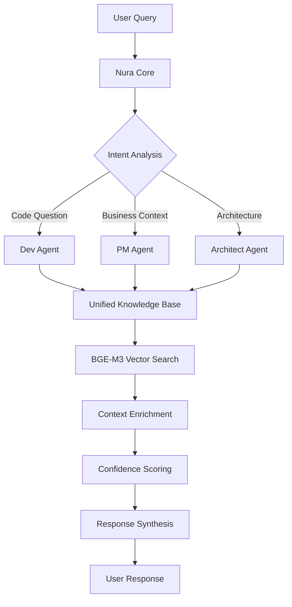

# System Patterns & Architecture

## Core Architectural Pattern: Microkernel (Plugin Architecture)

### 🏗️ Architecture Overview

**Nura Core (Kernel)**:
- Central orchestration hub managing plugin lifecycle
- Standardized APIs for plugin registration, communication, resource sharing
- Shared services: authentication, logging, configuration, vector database access
- Plugin discovery, loading, health monitoring, and hot-swapping capability

**Plugin Ecosystem**:
- **Agent Plugins**: Dev Agent, PM Agent, Architect Agent (specialized intelligence)
- **Connector Plugins**: Bitbucket, Confluence, AWS Service Mapper (data integration)
- **Interface Plugins**: Streamlit WebApp, Future VS Code Extension, React Frontend
- **Extension Plugins**: Confidence Scoring, Business Context Enhancer, Metrics Collector

### 🔧 Key Design Decisions

**1. Plugin Architecture Rationale**:
- **Incremental Scalability**: Add agents/connectors without modifying Nura Core
- **Parallel Development**: Independent plugin development cycles
- **Testing Isolation**: Individual plugin testing, stable core kernel
- **Deployment Flexibility**: Dynamic plugin activation/deactivation
- **Future Extensions**: Enterprise connectors, new LLM providers as plugins

**2. Unified Embedding Strategy**:
- **BGE-M3 Consistency**: Same model for indexation AND search (100% consistency)
- **Multi-Domain Support**: Code, documentation, business context unified embedding space
- **Dimension Standardization**: 1024 dimensions across all content types
- **Performance Optimization**: Local SageMaker deployment with auto-scaling

## Component Relationships

### 🎭 Agent Orchestration Pattern



**Pattern Benefits**:
- **Single Entry Point**: Nura Core simplifies user interaction
- **Intelligent Routing**: Context-aware delegation to specialist agents
- **Unified Knowledge Access**: All agents share same vector space
- **Graceful Fallback**: Single-agent mode when specialists unavailable

### 🔗 Data Flow Architecture

**Knowledge Ingestion Pipeline**:
1. **Connector Plugins** extract content from sources (Bitbucket, Confluence)
2. **BGE-M3 Embedding Service** generates consistent vector representations
3. **PostgreSQL + pgvector** stores embeddings with metadata
4. **Cross-Reference Engine** links code to business documentation

**Query Processing Pipeline**:
1. **User Query** → Nura Core intent analysis
2. **Agent Routing** → Specialist agent selection based on query type
3. **Vector Search** → BGE-M3 semantic similarity in unified space
4. **Context Enrichment** → Business context injection from related documents
5. **Confidence Scoring** → 1-10 reliability assessment
6. **Response Synthesis** → Agent-specific formatting with business integration

### 🛡️ Error Handling & Resilience Patterns

**Graceful Degradation Strategy**:
- **Agent Fallback**: Multi-agent → Single-agent → Generic response
- **Model Fallback**: Local models → Commercial APIs → Cached responses
- **Search Fallback**: Vector search → Keyword search → Documentation links
- **Service Fallback**: Primary DB → Read replica → Cached knowledge

## Technical Patterns

### 🤖 Multi-Agent Coordination

**Framework Integration**:
- **LangGraph**: State management and workflow orchestration
- **DSPy**: Optimized signatures for consistent prompt engineering
- **LangChain**: Rich ecosystem integration for tools and memory

**Agent Communication Pattern**:
```python
class AgentCoordination:
    def __init__(self):
        self.shared_context = SharedContext()
        self.event_bus = EventBus()
        
    def route_query(self, query: str) -> Agent:
        intent = self.analyze_intent(query)
        agent = self.select_specialist(intent)
        self.shared_context.update(query, intent, agent)
        return agent
        
    def synthesize_response(self, agent_response, confidence):
        enriched = self.business_context_enricher.enhance(agent_response)
        scored = self.confidence_scorer.score(enriched, confidence)
        return self.response_formatter.format(scored)
```

### 🔍 Vector Search Optimization

**BGE-M3 Implementation Pattern**:
```python
class UnifiedEmbeddingService:
    def __init__(self):
        self.model = SentenceTransformer("BAAI/bge-m3")
        self.dimensions = 1024  # Fixed for consistency
        
    def create_embeddings(self, texts: List[str], domain: str):
        # CRITICAL: Same model regardless of domain
        embeddings = self.model.encode(
            texts, 
            normalize_embeddings=True  # Cosine similarity consistency
        )
        return embeddings
        
    def semantic_search(self, query: str) -> List[SearchResult]:
        # Guaranteed same model as indexation
        query_embedding = self.model.encode([query], normalize_embeddings=True)[0]
        return self.postgres_vector_search(query_embedding)
```

**Advanced Techniques**:
- **Late Chunking**: Preserve context during document segmentation
- **Contextual Retrieval**: Enrich chunks with document context (67% accuracy improvement)
- **Hybrid Search**: Vector + BM25 lexical search combination

### 🎯 Plugin Lifecycle Management

**Plugin Registration Pattern**:
```python
class PluginManager:
    def __init__(self):
        self.plugins = {}
        self.health_checker = HealthChecker()
        
    def register_plugin(self, plugin: BasePlugin):
        # Auto-discovery and capability advertisement
        capabilities = plugin.advertise_capabilities()
        self.plugins[plugin.name] = {
            'instance': plugin,
            'capabilities': capabilities,
            'health': self.health_checker.check(plugin)
        }
        
    def route_to_plugin(self, request_type: str):
        compatible_plugins = self.find_compatible(request_type)
        return self.load_balance(compatible_plugins)
```

### 📊 Confidence Scoring Integration

**Multi-Layer Confidence Assessment**:
1. **Model Confidence**: LLM internal confidence scores
2. **Knowledge Base Confidence**: Vector search similarity scores
3. **Cross-Validation**: Multiple agent agreement assessment
4. **Historical Accuracy**: User feedback on previous responses

**Implementation Pattern**:
```python
class ConfidenceScorer:
    def calculate_confidence(self, response, context):
        model_confidence = response.model_confidence
        search_confidence = context.vector_similarity
        cross_validation = self.check_agent_agreement(response)
        historical = self.get_historical_accuracy(response.topic)
        
        return self.weighted_average([
            (model_confidence, 0.3),
            (search_confidence, 0.3), 
            (cross_validation, 0.2),
            (historical, 0.2)
        ])
```

## Scalability Patterns

### 📈 Multi-Tenant Architecture Preparation

**Data Isolation Strategy**:
- **Complete Segregation**: Separate embeddings per tenant
- **Metadata Filtering**: Tenant-aware vector search
- **Plugin Configuration**: Tenant-specific agent customization
- **Security Boundaries**: Row-level security + API isolation

### ⚡ Performance Optimization

**Caching Strategy**:
- **Embedding Cache**: Redis for frequently accessed vectors
- **Response Cache**: Common queries cached with TTL
- **Knowledge Cache**: Hot documents in memory
- **Agent State Cache**: Conversation context preservation

**Horizontal Scaling**:
- **Read Replicas**: PostgreSQL read scaling for vector search
- **Service Mesh**: Kubernetes service communication
- **Load Balancing**: EKS Application Load Balancer
- **Auto-Scaling**: HPA based on CPU/memory + custom metrics

## Integration Patterns

### 🔗 External System Integration

**Connector Plugin Pattern**:
- **Standardized Interface**: Uniform API for all external systems
- **Event-Driven Sync**: Real-time updates from source systems
- **Batch Processing**: Initial indexation and periodic full sync
- **Error Recovery**: Retry logic with exponential backoff

**Business Context Integration**:
- **Semantic Linking**: Code-to-documentation relationships
- **Process Mapping**: Technical implementations to business workflows
- **Regulatory Compliance**: Code changes to compliance requirements
- **Financial Impact**: Development decisions to business metrics

This architectural foundation provides the scalability, reliability, and flexibility needed for Nura's evolution from MVP to enterprise platform.
