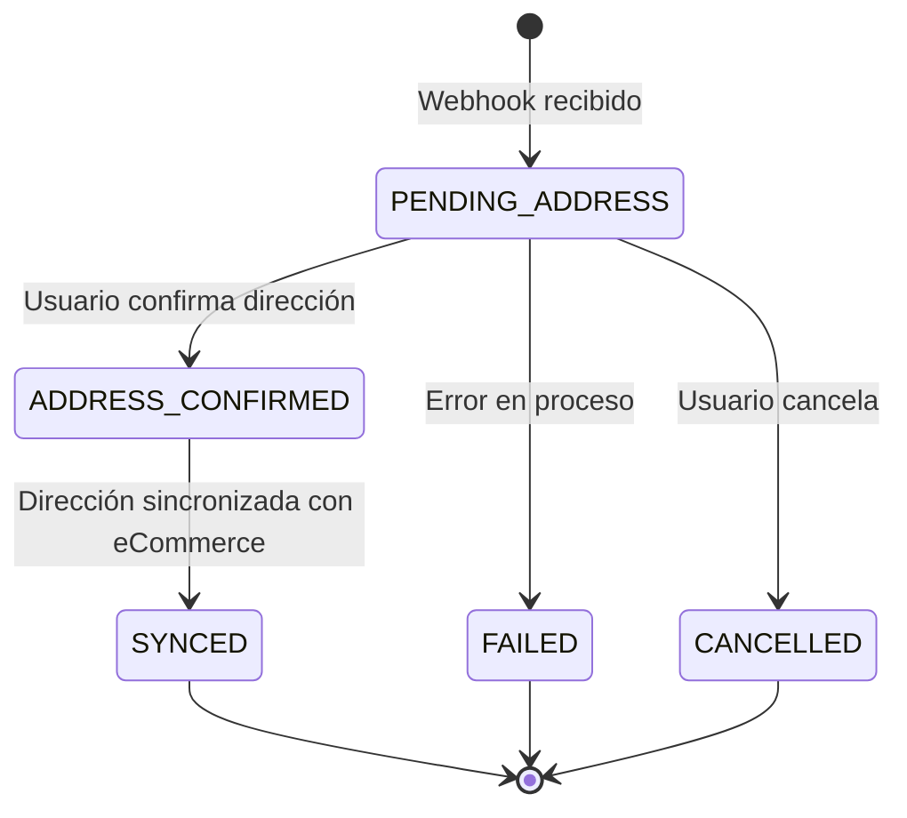
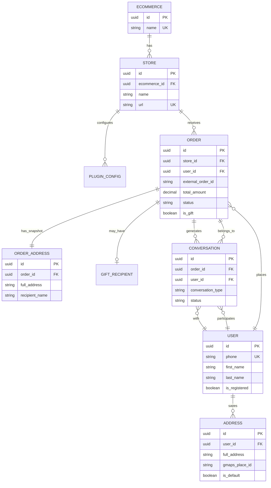

# Documentación del Modelo de Datos - Adresles

Este documento describe el modelo de datos para **Adresles**, incluyendo descripciones de entidades, definiciones de campos, relaciones y diagramas entidad-relación.

**Ver modelo completo y detallado**: [Adresles_Business.md - Sección 3.2-3.3](../../Adresles_Business.md#32-modelo-entidad-relación)

## Arquitectura de Base de Datos Híbrida

Adresles utiliza dos sistemas de base de datos optimizados para diferentes tipos de datos:

### Supabase (PostgreSQL)
**Propósito**: Datos relacionales con transacciones ACID

Entidades principales:
- `ecommerce` - Plataformas de comercio electrónico registradas
- `store` - Tiendas individuales de un eCommerce
- `user` - Usuarios finales (compradores/destinatarios)
- `address` - Direcciones de entrega guardadas
- `order` - Pedidos realizados
- `order_address` - Snapshot inmutable de dirección del pedido
- `gift_recipient` - Información de destinatario regalo
- `plugin_config` - Configuración de plugins por tienda
- `conversation` - Metadata de conversaciones
- `conversation_metadata` - Metadata persistente (2 años)

### DynamoDB
**Propósito**: Mensajes de conversaciones (alta volumetría, TTL automático)

Tabla:
- `adresles-messages` - Mensajes de chat IA-usuario
  - Partition Key: `conversation_id`
  - Sort Key: `timestamp`
  - TTL: 90 días automático

**Decisión arquitectural**: Ver [ADR-002](../../memory-bank/architecture/002-supabase-dynamodb.md)

## Entidades Principales (Supabase)

### 1. User

Representa usuarios finales del sistema (compradores y destinatarios de regalos).

**Campos**:
- `id`: UUID (PK)
- `phone`: VARCHAR(20) (UNIQUE, NOT NULL) - Identificador único del usuario
- `phone_country`: VARCHAR(2) (NOT NULL) - Código país
- `first_name`: VARCHAR(100)
- `last_name`: VARCHAR(100)
- `email`: VARCHAR(255)
- `preferred_language`: VARCHAR(5) - Idioma detectado
- `is_registered`: BOOLEAN (DEFAULT false)
- `registered_at`: TIMESTAMPTZ
- `created_at`: TIMESTAMPTZ (NOT NULL, DEFAULT now())
- `updated_at`: TIMESTAMPTZ (NOT NULL, DEFAULT now())

**Reglas de Validación**:
- Teléfono es el identificador único (no email)
- Teléfono debe incluir código de país
- Usuario puede existir sin estar registrado formalmente

**Relaciones**:
- `addresses`: Uno-a-muchos con Address
- `orders`: Uno-a-muchos con Order (como comprador)

### 2. Address

Representa direcciones de entrega guardadas en la libreta del usuario.

**Campos**:
- `id`: UUID (PK)
- `user_id`: UUID (FK → user, NOT NULL)
- `label`: VARCHAR(100) - Etiqueta amigable (Casa, Trabajo, etc.)
- `full_address`: VARCHAR(500) (NOT NULL)
- `street`: VARCHAR(255) (NOT NULL)
- `number`: VARCHAR(20)
- `block`: VARCHAR(20)
- `staircase`: VARCHAR(20)
- `floor`: VARCHAR(20)
- `door`: VARCHAR(20)
- `additional_info`: VARCHAR(255)
- `postal_code`: VARCHAR(20) (NOT NULL)
- `city`: VARCHAR(100) (NOT NULL)
- `province`: VARCHAR(100)
- `country`: VARCHAR(2) (NOT NULL) - Código ISO
- `gmaps_place_id`: VARCHAR(255) - ID de Google Maps
- `latitude`: DECIMAL(10,8)
- `longitude`: DECIMAL(11,8)
- `is_default`: BOOLEAN (DEFAULT false)
- `is_deleted`: BOOLEAN (DEFAULT false) - Soft delete
- `created_at`: TIMESTAMPTZ

**Validación inteligente**:
- Integración con Google Maps API para normalización
- Detección de datos faltantes (escalera, bloque, piso, puerta) mediante IA

**Relaciones**:
- `user`: Muchos-a-uno con User

### 3. Order

Representa pedidos realizados en tiendas eCommerce integradas.

**Campos**:
- `id`: UUID (PK)
- `store_id`: UUID (FK → store, NOT NULL)
- `user_id`: UUID (FK → user, NOT NULL)
- `external_order_id`: VARCHAR(100) (NOT NULL) - ID en el eCommerce
- `external_order_number`: VARCHAR(50)
- `total_amount`: DECIMAL(12,2) (NOT NULL)
- `currency`: VARCHAR(3) (NOT NULL)
- `fee_percentage`: DECIMAL(5,2) (NOT NULL)
- `fee_amount`: DECIMAL(12,2) (NOT NULL)
- `status`: ENUM - PENDING_ADDRESS, ADDRESS_CONFIRMED, SYNCED, FAILED, CANCELLED
- `is_gift`: BOOLEAN (DEFAULT false)
- `items_summary`: JSONB
- `webhook_received_at`: TIMESTAMPTZ (NOT NULL)
- `address_confirmed_at`: TIMESTAMPTZ
- `synced_at`: TIMESTAMPTZ

**Estados del pedido**:


**Relaciones**:
- `store`: Muchos-a-uno con Store
- `user`: Muchos-a-uno con User (comprador)
- `order_address`: Uno-a-uno con OrderAddress (snapshot inmutable)
- `gift_recipient`: Uno-a-uno con GiftRecipient (si is_gift = true)
- `conversation`: Uno-a-muchos con Conversation

### 4. Conversation

Representa metadata de una conversación entre usuario y agente IA.

**Campos**:
- `id`: UUID (PK)
- `order_id`: UUID (FK → order, NOT NULL)
- `user_id`: UUID (FK → user, NOT NULL)
- `conversation_type`: ENUM - INFORMATION, GET_ADDRESS, REGISTER, GIFT_NOTIFICATION, SUPPORT
- `user_type`: ENUM - BUYER, RECIPIENT
- `status`: ENUM - ACTIVE, WAITING_USER, COMPLETED, ESCALATED, TIMEOUT
- `started_at`: TIMESTAMPTZ (NOT NULL)
- `completed_at`: TIMESTAMPTZ
- `is_registered_adresles`: BOOLEAN
- `is_registered_ecommerce`: BOOLEAN
- `has_address_adresles`: BOOLEAN
- `has_address_ecommerce`: BOOLEAN

**Mensajes**: Almacenados en DynamoDB (`adresles-messages`)

**Relaciones**:
- `order`: Muchos-a-uno con Order
- `user`: Muchos-a-uno con User

## Mensajes de Conversaciones (DynamoDB)

### Tabla: adresles-messages

**Esquema**:

```typescript
{
  PK: string;              // conversation_id (Partition Key)
  SK: string;              // timestamp ISO (Sort Key)
  message_id: string;      // UUID
  conversation_id: string;
  order_id: string;        // Para GSI
  user_id: string;         // Para GSI
  role: 'user' | 'assistant' | 'system';
  content: string;
  metadata: {
    model?: string;
    tokens?: number;
    // ...
  };
  ttl: number;             // Unix timestamp (90 días)
}
```

**Índices GSI**:
1. `user_id-timestamp-index` - Buscar mensajes por usuario
2. `order_id-timestamp-index` - Buscar mensajes por pedido

**Política de retención**: Ver [Adresles_Business.md - Sección 3.4](../../Adresles_Business.md#34-política-de-retención-de-datos)

## Diagrama Entidad-Relación Simplificado



**Nota**: Los mensajes individuales se almacenan en DynamoDB, no en el diagrama E-R de Supabase.

## Principios Clave de Diseño

1. **Arquitectura Híbrida**: Datos relacionales en Supabase, mensajes alta volumetría en DynamoDB
2. **Multi-tenant**: Row Level Security (RLS) en Supabase por `store_id`
3. **Inmutabilidad**: OrderAddress es snapshot inmutable (no se modifica si usuario cambia dirección después)
4. **TTL Automático**: DynamoDB elimina mensajes automáticamente tras 90 días
5. **Teléfono como ID**: El número de teléfono es el identificador único del usuario (no email)
6. **Soft Delete**: Addresses usan `is_deleted` en lugar de eliminación física
7. **Audit Trail**: Timestamps completos en todas las entidades

## Referencias

- **Modelo completo**: [Adresles_Business.md - Sección 3](../../Adresles_Business.md#fase-3-modelado-de-datos)
- **Decisión DB híbrida**: [ADR-002](../../memory-bank/architecture/002-supabase-dynamodb.md)
- **Diccionario de datos detallado**: [Adresles_Business.md - Sección 3.3](../../Adresles_Business.md#33-diccionario-de-datos)
