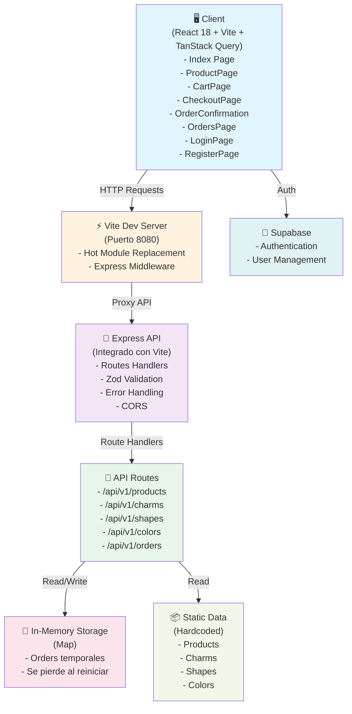
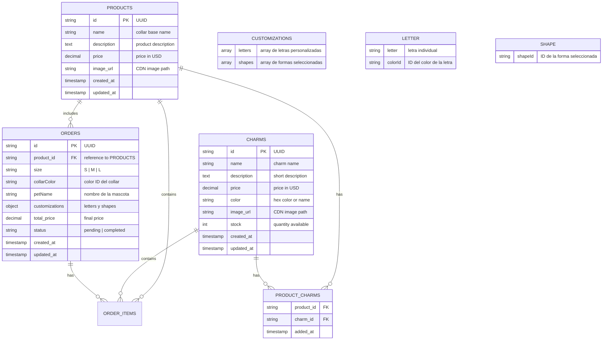

# Charms Necklace MVP - Entrega 1

**Documentación Completa del Proyecto Final - Master AI For Devs**

---

## 📋 Tabla de Contenidos

1. [Ficha del Producto](#1-ficha-del-producto)
2. [Historias de Usuario](#2-historias-de-usuario)
3. [Tickets de Trabajo](#3-tickets-de-trabajo)
4. [Arquitectura del Sistema](#4-arquitectura-del-sistema)
5. [Modelo de Datos](#5-modelo-de-datos)
6. [Diseño de API REST](#6-diseño-de-api-rest)
7. [Diseño Frontend](#7-diseño-frontend)
8. [Plan de Testing](#8-plan-de-testing)
9. [CI/CD Pipeline](#9-cicd-pipeline)
10. [Registro del Uso de IA](#10-registro-del-uso-de-ia)

---

## 1. Ficha del Producto

### 📌 Propuesta de Valor
Un e-commerce minimalista que permite a clientes comprar un collar base personalizado con charms seleccionables. Enfoque en **simplicity, elegance, y rapid time-to-market**.

### 🎯 Problema que Resuelve
- **Para clientes:** Necesidad de personalizar accesorios sin complejidad técnica innecesaria.
- **Para el negocio:** Generar ingresos con un MVP testeable antes de agregar features complejas (pagos reales, inventario, cuentas de usuario).

### ✨ Características y Funcionalidades Principales

#### Funcionalidades Core Implementadas:
1. **Personalización de Collares para Mascotas**
   - Selección de tamaño (S, M, L)
   - Elección de color del collar (13 colores disponibles)
   - Personalización con letras (hasta 12 letras)
   - Selección de formas/charm shapes (más de 30 opciones: unicornios, corazones, animales, etc.)
   - Selección de colores para letras (10 colores disponibles)

2. **Gestión de Carrito de Compras**
   - Agregar productos personalizados al carrito
   - Visualización de resumen del carrito
   - Edición y eliminación de items
   - Cálculo automático de precios

3. **Sistema de Órdenes**
   - Creación de órdenes personalizadas
   - Almacenamiento temporal en memoria
   - Visualización de historial de órdenes
   - Confirmación de orden con número único

4. **Autenticación de Usuarios**
   - Registro de nuevos usuarios
   - Inicio de sesión
   - Integración con Supabase para gestión de usuarios

5. **Páginas Implementadas**
   - Landing Page (Index) con productos y formas disponibles
   - Product Page con personalización completa
   - Cart Page con resumen y edición
   - Checkout Page para completar la compra
   - Order Confirmation Page con detalles de la orden
   - Orders Page para ver historial
   - Login y Register Pages para autenticación

6. **API REST Completa**
   - GET /api/v1/products - Lista de productos
   - GET /api/v1/charms - Lista de charms disponibles
   - GET /api/v1/shapes - Lista de formas disponibles (más de 30)
   - GET /api/v1/colors - Lista de colores para letras
   - POST /api/v1/orders - Crear nueva orden
   - GET /api/v1/orders - Listar todas las órdenes
   - GET /api/v1/orders/:orderId - Obtener orden específica

### 👥 Público Objetivo
- **Primario:** Mujeres jóvenes (18–35) que valorizan accesorios personalizados.
- **Secundario:** Regalistas (buscan personalización).
- **Tertiary:** Early adopters dispuestos a probar nuevas marcas.

### 🎯 Objetivos del MVP

| Objetivo | Métrica | Target Entrega 1 |
|----------|---------|-----------------|
| **Validar demanda** | Conversión landing → carrito | >15% |
| **Producto funcional** | 100% de flujo E2E sin errores | 0 critical bugs |
| **Time-to-market** | Días en vivo | <14 días |
| **Calidad inicial** | Test coverage | >70% |

### 🔄 Flujo E2E Claro

```
┌─────────────────────────────────────────────┐
│  1. Landing Page                            │
│     - Mostrar collar base + descripción     │
│     - Mostrar galería de charms disponibles │
└────────────────┬────────────────────────────┘
                 ↓
┌─────────────────────────────────────────────┐
│  2. Product Page                            │
│     - Collar base (1 SKU fijo)              │
│     - Selector de charms (checkboxes)       │
│     - Vista previa de precio                │
│     - Botón "Agregar al carrito"            │
└────────────────┬────────────────────────────┘
                 ↓
┌─────────────────────────────────────────────┐
│  3. Cart Page                               │
│     - Resumen del collar + charms           │
│     - Total de precio                       │
│     - Botón "Proceder al checkout"          │
└────────────────┬────────────────────────────┘
                 ↓
┌─────────────────────────────────────────────┐
│  4. Order Confirmation Page                 │
│     - Número de orden (simulado)            │
│     - Resumen de producto                   │
│     - Estimado de entrega (fake)            │
│     - "Continuar comprando" → vuelve a inicio│
└────────────────────────���────────────────────┘
```

### 📊 Métricas Iniciales

| Métrica | Propósito | Tool |
|---------|-----------|------|
| Page Load Time | Performance baseline | Lighthouse |
| Conversion Rate (Landing → Cart) | Product-market fit signal | Google Analytics (future) |
| Error Rate | Quality gate | Sentry (future) |
| Test Coverage | Code quality | Vitest coverage report |

---

## 2. Historias de Usuario

### 📊 Resumen de Historias

| ID | Título | Prioridad | Historia Asociada |
|----|--------|-----------|-------------------|
| US-001 | Ver Collar Base y Descripción | MUST | Landing Page |
| US-002 | Seleccionar Charms (Múltiples) | MUST | Product Page |
| US-003 | Agregar al Carrito | MUST | Cart Page |
| US-004 | Ver Resumen del Carrito | MUST | Cart Page |
| US-005 | Crear Orden Simulada | MUST | Checkout + Order Confirmation |
| US-006 | Autenticación de Usuarios (Login/Register) | SHOULD | LoginPage + RegisterPage |
| US-007 | Historial de Órdenes (Simulado) | SHOULD | Orders Page |

**Total:** 7 historias (5 MUST + 2 SHOULD)

### 🔴 MUST (Requisitos Críticos)

#### US-001: Ver Collar Base y Descripción
**Como** cliente potencial  
**Quiero** ver un collar base con imagen, descripción y precio  
**Para** decidir si me interesa personalizarlo

**Criterios de Aceptación (Given/When/Then):**
```gherkin
Given que entro a la landing page
When cargo la página
Then veo:
  - Imagen del collar base
  - Nombre del producto
  - Descripción corta (1–2 líneas)
  - Precio base ($)
  - Botón "Ver detalles" o similar
```

**Dependencias:** Base de datos con datos del collar (mock data es OK para MVP)  
**Riesgos:** Imagen muy grande → lentitud | Mitigación: optimizar imágenes, lazy load  
**Notas QA:**
- Verificar que la imagen carga sin errores 404
- Responsive en mobile (imagen escala correctamente)
- Precios muestran sin errores de parsing
- Nada hardcodeado (usar API)

---

#### US-002: Seleccionar Charms (Múltiples)
**Como** cliente  
**Quiero** seleccionar múltiples charms mediante checkboxes  
**Para** personalizar mi collar según mis preferencias

**Criterios de Aceptación:**
```gherkin
Given que estoy en la página de producto
When hago click en checkboxes de charms
Then:
  - El checkbox se marca/desmarca correctamente
  - La selección persiste (no se pierde si cambio de sección)
  - El precio total se actualiza en tiempo real
  - Puedo seleccionar de 0 a N charms
```

**Dependencias:** Lista de charms disponibles (API endpoint)  
**Riesgos:** Selecciones no se guardan → Mitigación: state management local (Zustand)  
**Notas QA:**
- Test: seleccionar 0 charms
- Test: seleccionar 1 charm
- Test: seleccionar todos los charms
- Test: deseleccionar charms
- Verificar cálculo de precio (precio_base + suma_charms)
- No permitir valores negativos

---

#### US-003: Agregar al Carrito
**Como** cliente  
**Quiero** agregar mi collar personalizado al carrito  
**Para** proceder hacia el checkout

**Criterios de Aceptación:**
```gherkin
Given que he seleccionado un collar y charms
When hago click en "Agregar al carrito"
Then:
  - El producto se agrega al carrito
  - Veo confirmación visual (toast/modal)
  - Puedo navegar al carrito o continuar viendo productos
  - El carrito persiste (localStorage o session state)
```

**Dependencias:** Cart state management  
**Riesgos:** Carrito se borra si recargo | Mitigación: persistencia en localStorage  
**Notas QA:**
- Verificar que el producto tiene todos los atributos (collar_id, charms_ids, precio)
- Agregar el mismo producto 2 veces → ¿suma cantidades o crea 2 líneas?
- Validar que no se agrega nada sin collar base

---

#### US-004: Ver Resumen del Carrito
**Como** cliente  
**Quiero** ver un resumen de mi carrito antes de pagar  
**Para** revisar lo que voy a comprar

**Criterios de Aceptación:**
```gherkin
Given que estoy en la página de carrito
When cargo la página
Then veo:
  - Cada producto en el carrito (collar + lista de charms)
  - Precio por unidad
  - Precio subtotal
  - Cálculo correcto de total
  - Botones para editar o eliminar items
  - Botón "Proceder al checkout"
```

**Dependencias:** Carrito con items persistidos  
**Riesgos:** Precios incorrectos | Mitigación: validar en backend  
**Notas QA:**
- Test carrito vacío (debe permitir navegar atrás)
- Test carrito con 1 item
- Test carrito con múltiples items
- Verificar sumas matemáticas
- Botones "Editar" y "Eliminar" funcionan

---

#### US-005: Crear Orden Simulada
**Como** cliente  
**Quiero** crear una orden sin pagar realmente  
**Para** simular el checkout

**Criterios de Aceptación:**
```gherkin
Given que estoy en el carrito
When hago click en "Proceder al checkout" → "Confirmar orden"
Then:
  - Se envía POST /api/v1/orders con datos del carrito
  - Se genera un número de orden único (simulado)
  - Se muestra página de confirmación con:
    - Número de orden
    - Resumen del producto
    - Estimado de entrega (fake: "5–7 días hábiles")
  - El carrito se vacía
```

**Dependencias:** Endpoint POST /api/v1/orders, modelo de datos Order  
**Riesgos:** Orden duplicada si envío 2 veces | Mitigación: debounce + optimistic update  
**Notas QA:**
- Validar estructura de datos enviada
- Número de orden debe ser único
- Validar que datos llegan al backend correctamente
- No se crea orden si carrito está vacío

---

### 🟡 SHOULD (Features de Valor Agregado)

#### US-006: Autenticación de Usuarios (Login/Register)
**Como** cliente  
**Quiero** registrarme e iniciar sesión en la plataforma  
**Para** acceder a mi historial de órdenes y tener una experiencia personalizada

**Criterios de Aceptación:**
```gherkin
Given que soy un nuevo usuario
When accedo a la página de registro
Then puedo:
  - Ingresar mi nombre completo
  - Ingresar mi email
  - Crear una contraseña (mínimo 6 caracteres)
  - Confirmar mi contraseña
  - Registrarme exitosamente
  - Ser redirigido a la página de órdenes

Given que soy un usuario registrado
When accedo a la página de login
Then puedo:
  - Ingresar mi email y contraseña
  - Iniciar sesión exitosamente
  - Ver mensaje de bienvenida
  - Ser redirigido a la página de órdenes
```

**Dependencias:** Integración con Supabase para autenticación  
**Riesgos:** Credenciales incorrectas, errores de red | Mitigación: validación de formularios, manejo de errores con toasts  
**Notas QA:**
- Validar que el email tiene formato correcto
- Validar que la contraseña tiene mínimo 6 caracteres
- Validar que las contraseñas coinciden en registro
- Mostrar errores claros si el login/registro falla
- Verificar que después de login se redirige correctamente
- Test: registro con email duplicado (debe mostrar error)
- Test: login con credenciales incorrectas (debe mostrar error)
- Test: mostrar/ocultar contraseña funciona

---

#### US-007: Historial de Órdenes (Simulado)
**Como** cliente repetido  
**Quiero** ver mis órdenes anteriores  
**Para** repedir o ver configuraciones previas

**Criterios de Aceptación:**
```gherkin
Given que soy un cliente que ha hecho compras
When accedo a "Mi historial"
Then veo:
  - Lista de órdenes (simuladas de sesiones previas)
  - Fecha, número de orden, total
  - Opción "Repetir esta orden"
```

**Dependencias:** Historial en localStorage + endpoint GET /api/v1/orders  
**Notas QA:** Baja prioridad, buscar en Etapa 3+

---

## 3. Tickets de Trabajo

### 📊 Resumen de Tickets

| ID | Título | Tipo | Historia | Módulo/Impacto | Estimación |
|----|--------|------|----------|----------------|------------|
| TK-001 | Setup base de datos | Backend | Infrastructure | Base de datos | 2h |
| TK-002 | GET /api/v1/products | Backend | US-001 | API Products | 1.5h |
| TK-003 | GET /api/v1/charms | Backend | US-002 | API Charms | 1.5h |
| TK-004 | POST /api/v1/orders | Backend | US-005 | API Orders | 3h |
| TK-005 | Error Handling Global | Backend | Infrastructure | Middleware | 2h |
| TK-006 | Setup Zustand | Frontend | Infrastructure | State Management | 1h |
| TK-007 | Landing Page Component | Frontend | US-001 | Pages/Index | 2h |
| TK-008 | Product Page (Charm Selector) | Frontend | US-002, US-003 | Pages/ProductPage | 3h |
| TK-009 | Cart Page | Frontend | US-004 | Pages/CartPage | 2.5h |
| TK-010 | Order Confirmation Page | Frontend | US-005 | Pages/OrderConfirmation | 2h |
| TK-011 | Responsive Design + Mobile | Frontend | All | UI/UX | 2h |
| TK-012 | GitHub Actions Setup | DevOps | Infrastructure | CI/CD | 2h |
| TK-013 | Deployment a Netlify | DevOps | Infrastructure | Deployment | 1.5h |

**Total:** 13 tickets (5 Backend + 6 Frontend + 2 DevOps)

### Estructura de Tickets
Cada ticket sigue este formato:

```
### TK-XXX: [Título]
**Tipo:** Backend | Frontend | DevOps  
**Story:** US-00X  
**Estimación:** 2–4 horas  
**Dependencias:** Ninguna | TK-XXX  

**Descripción:**
[Descripción técnica clara]

**Criterios de Done:**
- [ ] Código escrito y testeado
- [ ] Tests pasan (unit + integration si aplica)
- [ ] No warnings en linter
- [ ] Code review aprobado
- [ ] Documentado (comentarios si lógica compleja)

**Checklist QA:**
- [ ] Validación de inputs
- [ ] Manejo de errores
- [ ] No hay hardcoded values
- [ ] Responsive (si es UI)
- [ ] Performance acceptable
```

### Backend Tickets

#### TK-001: Setup base de datos (SQLite + Schema)
**Tipo:** Backend  
**Story:** Infrastructure  
**Módulo/Impacto:** Base de datos - Almacenamiento persistente  
**Estimación:** 2 horas

**Descripción:**
- Crear schema SQLite con tablas: products, charms, orders, order_items
- Script de init para popular datos mock
- Conexión en server/index.ts

**Criterios de Done:**
- [ ] Base de datos se inicializa sin errores
- [ ] Datos mock cargan correctamente
- [ ] Schema soporta todas las entidades del MVP

**Checklist QA:**
- [ ] Verificar integridad de datos (FK constraints)
- [ ] Datos mock son realistas
- [ ] No hay valores NULL inadecuados

---

#### TK-002: GET /api/v1/products (Listar productos)
**Tipo:** Backend  
**Story:** US-001  
**Módulo/Impacto:** API Products - Endpoint de productos  
**Estimación:** 1.5 horas

**Descripción:**
- Endpoint que retorna lista de productos (para MVP: 1 collar base)
- Incluye imagen, nombre, descripción, precio_base

**Criterios de Done:**
- [ ] Endpoint devuelve JSON válido
- [ ] Tests (unit + integration)
- [ ] Validación de headers (Accept: application/json)

**Checklist QA:**
- [ ] Status 200
- [ ] Estructura de response correcta
- [ ] Precios son positivos
- [ ] No hay productos duplicados

---

#### TK-003: GET /api/v1/charms (Listar charms disponibles)
**Tipo:** Backend  
**Story:** US-002  
**Módulo/Impacto:** API Charms - Endpoint de charms  
**Estimación:** 1.5 horas

**Descripción:**
- Endpoint que retorna lista de charms disponibles
- Incluye ID, nombre, descripción, precio, imagen, color

**Criterios de Done:**
- [ ] Endpoint devuelve JSON con array de charms
- [ ] Tests (unit + integration)
- [ ] Datos validados (no valores nulos)

**Checklist QA:**
- [ ] Almenos 5 charms en mock data
- [ ] Precios válidos (≥ 0)
- [ ] Colores realistas
- [ ] Imágenes no broken

---

#### TK-004: POST /api/v1/orders (Crear orden)
**Tipo:** Backend  
**Story:** US-005  
**Módulo/Impacto:** API Orders - Creación y gestión de órdenes  
**Estimación:** 3 horas

**Descripción:**
- Recibe: { product_id, charms_ids[], total_price }
- Valida estructura con Zod
- Genera orden única con timestamp
- Retorna: { order_id, created_at, total_price, items }

**Criterios de Done:**
- [ ] Validación Zod en place
- [ ] Orden se crea en DB
- [ ] ID de orden es único (UUID o incremental)
- [ ] Tests (unit + integration)

**Checklist QA:**
- [ ] Validar que charms_ids existen en DB
- [ ] Total de precio se calcula correctamente
- [ ] No se crea orden sin items
- [ ] Orden vacía no se permite

---

#### TK-005: Error Handling Global
**Tipo:** Backend  
**Story:** Infrastructure  
**Módulo/Impacto:** Middleware - Manejo global de errores  
**Estimación:** 2 horas

**Descripción:**
- Middleware global para errores (try/catch wrapper)
- Respuestas consistentes: { success, data, error }
- Logging básico (console.log → archivos después)

**Criterios de Done:**
- [ ] Todos los endpoints retornan formato consistente
- [ ] Status codes apropiados (400, 404, 500)
- [ ] Mensajes de error informativos pero seguros (no exponen stack traces)

**Checklist QA:**
- [ ] Error 400 por validación fallida
- [ ] Error 404 por recurso no encontrado
- [ ] Error 500 solo en excepciones no previstas
- [ ] No logs de secrets en consola

---

### Frontend Tickets

#### TK-006: Setup Zustand (State Management)
**Tipo:** Frontend  
**Story:** Infrastructure  
**Módulo/Impacto:** State Management - Gestión de estado global  
**Estimación:** 1 hora

**Descripción:**
- Crear store Zustand para carrito
- Actions: addItem, removeItem, clearCart, getTotal
- Persistencia en localStorage

**Criterios de Done:**
- [ ] Store funciona sin errores
- [ ] localStorage actualiza en tiempo real
- [ ] Tests para store actions

**Checklist QA:**
- [ ] Datos persisten al recargar
- [ ] No hay memory leaks

---

#### TK-007: Landing Page Component
**Tipo:** Frontend  
**Story:** US-001  
**Módulo/Impacto:** Pages/Index - Página principal  
**Estimación:** 2 horas

**Descripción:**
- Página de inicio con hero banner
- Mostrar producto base (collar)
- Call-to-action: "Ver detalles"
- Responsive mobile-first

**Criterios de Done:**
- [ ] Componentes renderean sin errores
- [ ] Responsive en mobile, tablet, desktop
- [ ] Accesibilidad (WCAG AA mínimo)

**Checklist QA:**
- [ ] Imagen carga correctamente
- [ ] No layout shift
- [ ] Mobile < 5s load time
- [ ] Título accesible (h1)

---

#### TK-008: Product Page (Charm Selector)
**Tipo:** Frontend  
**Story:** US-002, US-003  
**Módulo/Impacto:** Pages/ProductPage - Personalización de productos  
**Estimación:** 3 horas

**Descripción:**
- Página de producto con:
  - Imagen del collar
  - Checkboxes para charms (GET /api/v1/charms)
  - Cálculo de precio en tiempo real
  - Botón "Agregar al carrito"

**Criterios de Done:**
- [ ] Charms cargan desde API
- [ ] Checkboxes funcionan
- [ ] Precio calcula correctamente
- [ ] Item se agrega al carrito (Zustand)

**Checklist QA:**
- [ ] Seleccionar/deseleccionar charms
- [ ] Precio actualiza en tiempo real
- [ ] Botón "Agregar" deshabilitado si carrito está completo (opcional)
- [ ] Responsive

---

#### TK-009: Cart Page
**Tipo:** Frontend  
**Story:** US-004  
**Módulo/Impacto:** Pages/CartPage - Gestión de carrito  
**Estimación:** 2.5 horas

**Descripción:**
- Tabla o lista de items en carrito
- Precio por item + total
- Botones: "Eliminar", "Actualizar", "Vaciar"
- Botón "Proceder al checkout"
- Carrito vacío → fallback UI

**Criterios de Done:**
- [ ] Items renderean correctamente
- [ ] Precios calculan bien
- [ ] Botones funcionan
- [ ] Empty state manejado

**Checklist QA:**
- [ ] Carrito vacío muestra mensaje amigable
- [ ] Eliminar item funciona
- [ ] Total actualiza al eliminar
- [ ] Responsive

---

#### TK-010: Order Confirmation Page
**Tipo:** Frontend  
**Story:** US-005  
**Módulo/Impacto:** Pages/OrderConfirmation - Confirmación de orden  
**Estimación:** 2 horas

**Descripción:**
- POST /api/v1/orders al hacer click en confirmar
- Mostrar orden_id, resumen, estimado de entrega
- Botón "Continuar comprando" → vuelve a home
- Manejo de errores (mostrar toast si falla)

**Criterios de Done:**
- [ ] POST se envía correctamente
- [ ] Confirmación renderea con datos reales
- [ ] Carrito se vacía después
- [ ] Error handling funciona

**Checklist QA:**
- [ ] Validar que POST llega al backend
- [ ] orden_id se muestra
- [ ] Número de orden es único
- [ ] Error toast si POST falla
- [ ] Botón "Continuar" navega a home

---

#### TK-011: Responsive Design + Mobile Testing
**Tipo:** Frontend  
**Story:** All  
**Módulo/Impacto:** UI/UX - Diseño responsive y mobile-first  
**Estimación:** 2 horas

**Descripción:**
- Verificar mobile-first design en todas las páginas
- Breakpoints: 320px, 768px, 1024px
- Imágenes optimizadas

**Criterios de Done:**
- [ ] Mobile (320px) se ve bien
- [ ] Tablet (768px) OK
- [ ] Desktop (1024px+) OK

**Checklist QA:**
- [ ] No overflow horizontal
- [ ] Botones clickeables (min 44x44px)
- [ ] Tipografía legible
- [ ] Imágenes escalan sin distorsión

---

### DevOps Tickets

#### TK-012: GitHub Actions Setup (Lint + Test + Build)
**Tipo:** DevOps  
**Story:** Infrastructure  
**Módulo/Impacto:** CI/CD - Pipeline de integración continua  
**Estimación:** 2 horas

**Descripción:**
- Workflow: PR abierto → lint → test → build
- Bloquear merge si falla
- Reporte de cobertura

**Criterios de Done:**
- [ ] Workflow ejecuta en cada PR
- [ ] Tests pasan antes de merge
- [ ] Build no falla

**Checklist QA:**
- [ ] Lint errors detectados
- [ ] Test failures bloqueados
- [ ] Build artifacts generados

---

#### TK-013: Deployment a Netlify o Vercel
**Tipo:** DevOps  
**Story:** Infrastructure  
**Módulo/Impacto:** Deployment - Despliegue en producción  
**Estimación:** 1.5 horas

**Descripción:**
- Conectar repo a Netlify/Vercel
- Auto-deploy en main
- Preview deploys en PRs
- Env vars manejadas por MCP

**Criterios de Done:**
- [ ] Main se deploya automáticamente
- [ ] PRs tienen preview URLs
- [ ] No secrets en repo

**Checklist QA:**
- [ ] Sitio live en producción
- [ ] Preview URL funciona
- [ ] Performance acceptable

---

## 4. Arquitectura del Sistema

### 📐 Diagrama de Arquitectura (Mermaid)



### 🏗️ Explicación para Principiantes

**¿Qué hace cada componente?**

1. **Client (React + Vite):** La interfaz de usuario. Usa React Router para navegación, TanStack Query para manejo de estado del servidor, y shadcn/ui para componentes.

2. **Vite Dev Server:** Servidor de desarrollo que integra Express como middleware. Todo corre en el puerto 8080 durante desarrollo.

3. **Express API:** Backend integrado que maneja las rutas API. Valida requests con Zod y retorna respuestas consistentes.

4. **Routes Handlers:** Funciones que procesan cada endpoint específico (products, charms, shapes, colors, orders).

5. **In-Memory Storage:** Las órdenes se guardan temporalmente en un Map de JavaScript. Se pierden al reiniciar el servidor (OK para MVP).

6. **Static Data:** Productos, charms, shapes y colores están hardcodeados en los archivos de rutas. Fácil de cambiar sin base de datos.

7. **Supabase:** Servicio externo para autenticación de usuarios (registro, login). Las credenciales están en el código (mover a env vars en producción).

### 📁 Estructura de Carpetas Real

```
petcharms/
├── client/                    # Frontend React
│   ├── pages/                 # Páginas/rutas
│   │   ├── Index.tsx          # Landing page
│   │   ├── ProductPage.tsx    # Personalización
│   │   ├── CartPage.tsx       # Carrito
│   │   ├── CheckoutPage.tsx   # Checkout
│   │   ├── OrderConfirmation.tsx
│   │   ├── OrdersPage.tsx
│   │   ├── LoginPage.tsx
│   │   └── RegisterPage.tsx
│   ├── components/            # Componentes React
│   │   ├── Header.tsx
│   │   └── ui/                # shadcn/ui components
│   ├── hooks/                 # Custom hooks
│   ├── lib/                   # Utilidades
│   │   ├── supabase.ts        # Cliente Supabase
│   │   └── utils.ts
│   └── App.tsx                # Router principal
├── server/                    # Backend Express
│   ├── routes/                # Handlers de API
│   │   ├── products.ts
│   │   ├── charms.ts
│   │   ├── shapes.ts
│   │   └── orders.ts
│   └── index.ts               # Configuración Express
├── shared/                    # Código compartido
│   └── api.ts                 # Tipos TypeScript
├── netlify/                   # Netlify Functions
│   └── functions/
│       └── api.ts
├── public/                    # Archivos estáticos
├── vite.config.ts             # Config Vite
└── package.json
```

### 🔄 Flujo de Datos (Ejemplo: Crear Orden)

```
[Usuario hace click en "Confirmar orden"]
         ↓
[React (Client) POST /api/v1/orders]
         ↓
[Express (API) recibe request, valida con Zod]
         ↓
[OrderService.createOrder() calcula precio, crea objeto]
         ↓
[OrderRepository.create() inserta en BD]
         ↓
[Database retorna orden_id + timestamp]
         ↓
[API responde a React con { order_id, created_at, ... }]
         ↓
[React renderiza página de confirmación]
```

### 📚 Stack Tecnológico Implementado (2024–2025)

| Componente | Tecnología | Versión | Justificación |
|-----------|-----------|---------|---------------|
| **Frontend Framework** | React | 18.3.1 | Estándar de industria, amplia comunidad |
| **Build Tool** | Vite | 7.1.2 | Build rápido, HMR excelente, mejor que Webpack/CRA |
| **Routing** | React Router | 6.30.1 | Routing declarativo, estándar para React |
| **State Management (Server)** | TanStack Query | 5.84.2 | Manejo automático de cache, refetch, loading states |
| **UI Components** | shadcn/ui + Radix UI | Latest | Componentes accesibles, personalizables, modernos |
| **Styling** | TailwindCSS | 3.4.17 | Utility-first, responsive, productivo |
| **Backend** | Express | 5.1.0 | Integrado con Vite, simple y efectivo |
| **Validación** | Zod | 3.25.76 | Type-safe, validación robusta, mensajes claros |
| **Autenticación** | Supabase | 2.45.0 | Autenticación lista para usar, sin backend propio |
| **Testing** | Vitest | 3.2.4 | Rápido, compatible con Vite, alternativa a Jest |
| **TypeScript** | TypeScript | 5.9.2 | Type safety, mejor DX, detección temprana de errores |
| **Package Manager** | pnpm | 10.14.0 | Más rápido que npm, mejor manejo de dependencias |

### 🛡️ Seguridad Mínima para MVP

```typescript
// 1. Rate limiting (expresó-ratelimit)
const rateLimit = require('express-rate-limit');
const limiter = rateLimit({
  windowMs: 15 * 60 * 1000, // 15 minutos
  max: 100 // máximo 100 requests
});
app.use('/api/', limiter);

// 2. Input validation (Zod en TODOS los endpoints)
const createOrderSchema = z.object({
  product_id: z.string().uuid(),
  charms_ids: z.array(z.string().uuid()),
  total_price: z.number().positive()
});

// 3. CORS configurado
app.use(cors({
  origin: process.env.ALLOWED_ORIGINS?.split(',') || '*',
  credentials: true
}));

// 4. No exponer stack traces
app.use((err, req, res, next) => {
  console.error(err);
  res.status(500).json({
    success: false,
    error: 'Internal server error'
  });
});
```

### 📈 Escalabilidad (Futuro)

**Ahora:** SQLite en el servidor  
**Etapa 2:** PostgreSQL en Neon o Supabase  
**Etapa 3:** Redis para cache (carrito)  
**Etapa 4:** Colas de jobs (Bull.js) para órdenes  

---

## 5. Modelo de Datos

### 📊 Diagrama ERD (Mermaid)



### 📋 Definición de Entidades

#### **PRODUCTS** (Collar Base)
```sql
CREATE TABLE products (
  id TEXT PRIMARY KEY, -- UUID
  name TEXT NOT NULL,
  description TEXT,
  price DECIMAL(10, 2) NOT NULL CHECK(price >= 0),
  image_url TEXT,
  created_at TIMESTAMP DEFAULT CURRENT_TIMESTAMP,
  updated_at TIMESTAMP DEFAULT CURRENT_TIMESTAMP
);
```

**Campos:**
- `id`: Identificador único (UUID v4)
- `name`: Nombre del collar (ej: "Gold Deluxe Necklace")
- `description`: Descripción corta
- `price`: Precio base en USD
- `image_url`: URL en CDN
- `created_at`, `updated_at`: Auditoría

**Restricciones:**
- `name` es único (no 2 collares iguales)
- `price ≥ 0` (no precios negativos)

---

#### **CHARMS** (Colgantes Personalizables)
```sql
CREATE TABLE charms (
  id TEXT PRIMARY KEY, -- UUID
  name TEXT NOT NULL UNIQUE,
  description TEXT,
  price DECIMAL(10, 2) NOT NULL CHECK(price >= 0),
  color TEXT, -- "Gold", "Silver", "Rose Gold", etc.
  image_url TEXT,
  stock INT DEFAULT 100,
  created_at TIMESTAMP DEFAULT CURRENT_TIMESTAMP,
  updated_at TIMESTAMP DEFAULT CURRENT_TIMESTAMP
);
```

**Campos:**
- `id`: UUID único
- `name`: Nombre del charm (ej: "Heart", "Star", "Moon")
- `price`: Precio adicional en USD
- `color`: Hex color o nombre (usado para filtros futuros)
- `stock`: Cantidad disponible (validar en backend)
- `image_url`: URL en CDN

---

#### **ORDERS** (Órdenes) - Estructura Real Implementada
```typescript
interface Order {
  id: string;                    // UUID generado
  product_id: string;           // ID del producto (collar base)
  size: "S" | "M" | "L";       // Tamaño del collar
  collarColor: string;          // ID del color del collar
  petName: string;              // Nombre de la mascota
  customizations: {
    letters: Array<{
      letter: string;          // Letra individual
      colorId: string;         // ID del color de la letra
    }>;
    shapes: Array<{
      shapeId: string;         // ID de la forma seleccionada
    }>;
  };
  total_price: number;          // Precio total calculado
  status: string;              // "pending" | "completed"
  created_at: string;          // ISO timestamp
  updated_at: string;          // ISO timestamp
}
```

**Campos:**
- `id`: Número de orden único (UUID v4 generado)
- `product_id`: Referencia al collar base
- `size`: Tamaño del collar (S, M, L)
- `collarColor`: ID del color seleccionado para el collar (13 opciones disponibles)
- `petName`: Nombre de la mascota ingresado por el usuario
- `customizations.letters`: Array de letras personalizadas (máximo 12 letras)
- `customizations.shapes`: Array de formas/charm shapes seleccionadas (máximo 9 formas)
- `total_price`: Precio total calculado
- `status`: Estado de la orden (por defecto "pending")
- `created_at`, `updated_at`: Timestamps ISO

**Lógica:**
- Una orden = 1 collar base + personalización (tamaño, color, nombre) + letras + formas
- Precio total = precio_base_collar (fijo: $15.00)
- Las órdenes se almacenan en memoria (Map<string, Order>) y se pierden al reiniciar el servidor
- No hay base de datos real implementada (MVP)

---

#### **ORDER_ITEMS** (Items de la Orden)
```sql
CREATE TABLE order_items (
  id TEXT PRIMARY KEY, -- UUID
  order_id TEXT NOT NULL,
  charm_id TEXT NOT NULL,
  quantity INT DEFAULT 1 CHECK(quantity > 0),
  price_at_purchase DECIMAL(10, 2), -- snapshot del precio
  created_at TIMESTAMP DEFAULT CURRENT_TIMESTAMP,
  FOREIGN KEY(order_id) REFERENCES orders(id),
  FOREIGN KEY(charm_id) REFERENCES charms(id)
);
```

**Por qué existe:**
- Conecta órdenes con charms
- Guarda el precio en el momento (si charms después bajan de precio, la orden muestra el original)

---

### 🔗 Relaciones

| Relación | Cardinalidad | Descripción |
|----------|-------------|-------------|
| PRODUCTS ↔ ORDERS | 1 a N | Un collar puede tener múltiples órdenes |
| ORDERS ↔ ORDER_ITEMS | 1 a N | Una orden tiene múltiples charms |
| CHARMS ↔ ORDER_ITEMS | 1 a N | Un charm puede estar en múltiples órdenes |

### 📌 Restricciones y Validaciones

| Entidad | Restricción | Validación Backend |
|---------|------------|-------------------|
| PRODUCTS | Precio ≥ 0 | `z.number().positive()` |
| CHARMS | Precio ≥ 0, Stock ≥ 0 | `z.number().min(0)` |
| ORDERS | Total ≥ 0 | Calcular en backend, no confiar en cliente |
| ORDER_ITEMS | Quantity > 0 | `z.number().min(1)` |

### 💡 Explicación No Técnica

Imagina que tienes una **joyería:**

- **PRODUCTS** = Los collares base disponibles
- **CHARMS** = Los colgantes que puedes agregar
- **ORDERS** = Cada venta que haces
- **ORDER_ITEMS** = Qué colgantes lleva cada orden

Cuando un cliente compra: 
1. Elige un collar (PRODUCTS)
2. Elige charms (CHARMS)
3. Creas una ORDEN con ese collar
4. Registras qué charms va llevando (ORDER_ITEMS)

---

## 6. Diseño de API REST

### ��� Base URL
Base URL para todos los endpoints: `http://localhost:8080/api/v1`

### 📌 Convenciones
- **Métodos HTTP:** GET (leer), POST (crear), PUT/PATCH (actualizar), DELETE (borrar)
- **Status codes:**
  - `200 OK` - Success
  - `400 Bad Request` - Validación falló
  - `404 Not Found` - Recurso no existe
  - `500 Internal Server Error` - Error del servidor
- **Formato de respuesta:** Todas las respuestas siguen el formato estándar con campos `success`, `data` y `error`

### 📚 Endpoints del MVP

---

#### **1. GET /api/v1/products**
Obtener lista de productos (collar base).

**Descripción:**
- Retorna un array con los productos disponibles (actualmente 1 producto: "Pet Charm Collar")
- Cada producto incluye: id (UUID), name, description, price, image_url, created_at, updated_at
- No requiere parámetros ni autenticación

**Notas QA:**
- Verificar que `id` es UUID válido
- `price` debe ser positivo
- `image_url` debe ser URL válida
- Status 200

---

#### **2. GET /api/v1/charms**
Obtener lista de charms disponibles.

**Descripción:**
- Retorna un array con todos los charms disponibles (6 charms: Heart, Star, Moon, Pearl, Diamond, Flower)
- Cada charm incluye: id (UUID), name, description, price, color, image_url, stock, created_at, updated_at
- No requiere parámetros ni autenticación

**Notas QA:**
- Verificar que al menos 5 charms estén disponibles
- `stock` debe ser ≥ 0
- Todos los IDs son UUIDs únicos
- Sin duplicados

---

#### **3. GET /api/v1/shapes**
Obtener lista de formas/charm shapes disponibles.

**Descripción:**
- Retorna un array con más de 30 formas disponibles para personalización
- Cada forma incluye: id (string), name, emoji, description
- Formas incluyen: animales (unicornio, perro, gato, conejo, etc.), corazones, estrellas, flores, objetos mágicos, etc.
- No requiere parámetros ni autenticación

**Notas QA:**
- Más de 30 formas disponibles
- Cada forma tiene ID único, nombre, emoji y descripción
- Formas incluyen: animales, corazones, estrellas, flores, etc.

---

#### **4. GET /api/v1/colors**
Obtener lista de colores disponibles para letras personalizadas.

**Descripción:**
- Retorna un array con 10 colores disponibles para personalizar letras
- Cada color incluye: id (string), name, hex (código hexadecimal), rgb (valores RGB)
- Colores disponibles: Orange, Green, Pink, Blue, Yellow, Purple, Red, Lime, Cyan, Black
- No requiere parámetros ni autenticación

**Notas QA:**
- 10 colores disponibles
- Cada color tiene ID único, nombre, hex y rgb
- Colores usados para personalizar letras

---

#### **5. POST /api/v1/orders**
Crear una nueva orden.

**Descripción:**
- Crea una nueva orden con los datos del carrito personalizado
- Requiere body JSON con: product_id, size (S|M|L), collarColor, petName, customizations (letters y shapes), total_price
- Valida la estructura con Zod schema antes de procesar
- Genera UUID único para la orden
- Almacena la orden en memoria (Map) en el backend Express
- También se guarda en Supabase si el usuario está autenticado (desde CheckoutPage)

**Campos del Request:**
- `product_id`: ID del producto (collar base)
- `size`: Tamaño del collar ("S", "M" o "L")
- `collarColor`: ID del color del collar seleccionado
- `petName`: Nombre de la mascota
- `customizations.letters`: Array de objetos con `letter` y `colorId`
- `customizations.shapes`: Array de objetos con `shapeId`
- `total_price`: Precio total calculado (debe ser positivo)

**Validación:**
- Schema Zod valida todos los campos
- `size` debe ser uno de: "S", "M", "L"
- `total_price` debe ser un número positivo
- `customizations` debe tener estructura válida

**Response:**
- Retorna la orden creada con id, timestamps y todos los datos enviados
- Status 200 si es exitoso
- Status 400 si la validación falla

**Escenarios de Error:**
- `VALIDATION_ERROR`: Cuando el schema Zod falla (campos inválidos, tipos incorrectos)
- `NOT_FOUND`: Si el producto_id no existe (aunque actualmente no se valida en backend)
- `INTERNAL_ERROR`: Errores del servidor no previstos

**Notas QA:**
- Validar que todos los charm_ids existen en DB
- Calcular precio en backend (no confiar en cliente)
- Verificar que total_price = precio_producto + suma(precios_charms)
- Generar UUID único para order_id
- NO permitir órdenes sin charms (0 charms OK, pero documentar)
- Verificar stock de charms (si es > 0)

---

#### **6. GET /api/v1/orders/:orderId**
Obtener detalles de una orden específica.

**Descripción:**
- Retorna los detalles completos de una orden por su ID
- Requiere orderId como parámetro en la URL (debe ser UUID válido)
- Busca la orden en el almacenamiento en memoria (Map)
- Si la orden no existe, retorna error 404

**Response:**
- Status 200: Retorna la orden completa con todos sus datos
- Status 400: Si el orderId no tiene formato UUID válido
- Status 404: Si la orden no existe en el almacenamiento

**Notas QA:**
- Validar que order_id es UUID válido
- Si no existe, retornar 404
- Datos son de solo lectura (snapshot de precios)

---

#### **7. GET /api/v1/orders**
Listar todas las órdenes.

**Descripción:**
- Retorna un array con todas las órdenes almacenadas en memoria (Map)
- No requiere parámetros ni autenticación
- Útil para debugging y administración
- En producción, debería requerir autenticación y filtrar por usuario

**Response:**
- Status 200: Retorna array de órdenes (puede estar vacío)
- Cada orden incluye todos sus campos: id, product_id, size, collarColor, petName, customizations, total_price, status, timestamps

**Notas QA:**
- Retorna todas las órdenes sin filtros
- Puede retornar array vacío si no hay órdenes
- Status 200 siempre (a menos que haya error del servidor)

---

### 🚨 Error Handling Global

Todos los errores siguen un formato consistente con los campos:
- `success`: false
- `data`: null
- `error`: objeto con `code`, `message` y opcionalmente `details`

**Error Codes Comunes:**
- `VALIDATION_ERROR` - Zod validation falló (campos inválidos, tipos incorrectos)
- `NOT_FOUND` - Recurso no existe (orden, producto, etc.)
- `CONFLICT` - Recurso ya existe (no usado en MVP actual)
- `INTERNAL_ERROR` - Error del servidor (no se exponen detalles por seguridad)

---

## 7. Diseño Frontend

### 📁 Estructura de Carpetas (Implementada)

```
client/
├── pages/
│   ├── Index.tsx                    # Landing page con productos y shapes
│   ├── ProductPage.tsx              # Personalización completa (tamaño, color, letras, formas)
│   ├── CartPage.tsx                 # Resumen y gestión del carrito
│   ├── CheckoutPage.tsx             # Página de checkout
│   ├── OrderConfirmation.tsx        # Confirmación de orden
│   ├── OrdersPage.tsx               # Historial de órdenes
│   ├── LoginPage.tsx                # Inicio de sesión (Supabase)
│   ├── RegisterPage.tsx              # Registro de usuarios (Supabase)
│   └── NotFound.tsx                 # 404
├── components/
│   ├── Header.tsx                   # Navegación principal
│   └── ui/                          # Componentes shadcn/ui
│       ├── button.tsx
│       ├── card.tsx
│       ├── checkbox.tsx
│       ├── input.tsx
│       ├── toast.tsx
│       └── ... (más de 40 componentes)
├── hooks/
│   ├── use-mobile.tsx               # Hook para detectar mobile
│   └── use-toast.ts                 # Hook para toasts
├── lib/
│   ├── supabase.ts                  # Cliente Supabase para auth
│   └── utils.ts                     # Utilidades (cn, etc.)
├── App.tsx                          # Router + TanStack Query provider
└── global.css                       # TailwindCSS + estilos globales
```

### 🎨 Tecnologías Frontend Implementadas

- **React Router:** Navegación entre páginas
- **TanStack Query:** Manejo de estado del servidor, cache, refetch automático
- **shadcn/ui:** Componentes UI accesibles y personalizables (basados en Radix UI)
- **TailwindCSS:** Estilos utility-first, diseño responsive
- **Lucide React:** Iconos modernos
- **React Hook Form:** Manejo de formularios (si se usa)
- **Sonner:** Sistema de toasts/notificaciones

### 🎨 Componentes Implementados

#### **Páginas Principales**
- **Index.tsx:** Landing page que muestra el producto base y galería de shapes disponibles
- **ProductPage.tsx:** Página de personalización con selección de tamaño, color de collar, nombre de mascota, letras y formas
- **CartPage.tsx:** Resumen del carrito con opciones de editar y eliminar items
- **CheckoutPage.tsx:** Formulario de checkout con validación y envío de orden a Supabase
- **OrderConfirmation.tsx:** Confirmación de orden con número único y resumen
- **OrdersPage.tsx:** Historial de órdenes del usuario autenticado
- **LoginPage.tsx:** Página de inicio de sesión con Supabase
- **RegisterPage.tsx:** Página de registro de nuevos usuarios

#### **Componentes Reutilizables**
- **Header.tsx:** Navegación principal con links y estado de autenticación
- **Componentes shadcn/ui:** Más de 40 componentes UI accesibles (Button, Card, Checkbox, Input, Toast, Dialog, Select, etc.)

### 🪝 Hooks y State Management Implementados

#### **TanStack Query para Server State**
El proyecto usa TanStack Query (anteriormente React Query) para manejar el estado del servidor. Proporciona:
- Cache automático de datos
- Refetch automático en background
- Estados de loading y error manejados automáticamente
- Optimistic updates para mejor UX
- Uso en páginas para fetch de productos, charms, shapes, colors y órdenes

#### **Estado Local para Carrito**
El carrito se maneja con estado local de React (useState) en cada página que lo necesita. Los datos se persisten en localStorage para mantener el carrito entre sesiones. No se implementó Zustand como estaba planificado.

#### **Supabase para Autenticación y Base de Datos**
- **Autenticación:** Login y registro de usuarios mediante `supabase.auth.signInWithPassword()` y `supabase.auth.signUp()`
- **Base de Datos:** Almacenamiento de órdenes en tabla `orders` de Supabase PostgreSQL
- **Gestión de sesión:** Verificación de usuario autenticado y manejo de estado de auth en Header
- **Integración:** Cliente configurado en `client/lib/supabase.ts` con URL y API key

### 📦 Componentes UI (shadcn/ui)

El proyecto usa shadcn/ui, una colección de componentes reutilizables construidos con Radix UI y TailwindCSS:

- **Accesibles:** Todos los componentes siguen WAI-ARIA guidelines
- **Personalizables:** Fácil de modificar estilos y comportamiento
- **Type-safe:** TypeScript completo
- **Componentes disponibles:** Button, Card, Checkbox, Input, Toast, Dialog, Select, y más de 40 componentes

### 📱 Mobile-First Approach

```css
/* En TailwindCSS, mobile-first significa: */
/* 1. Base styles = mobile */
/* 2. Breakpoints md: (768px+), lg: (1024px+) */

.container {
  /* Mobile */
  padding: 1rem;
  font-size: 1rem;
}

/* Tablet+ */
@media (min-width: 768px) {
  .container {
    max-width: 700px;
    padding: 2rem;
  }
}

/* Desktop */
@media (min-width: 1024px) {
  .container {
    max-width: 1200px;
  }
}
```

### ♿ Accesibilidad Checklist

- [ ] Todos los inputs tienen labels asociados
- [ ] Botones tienen text o aria-label
- [ ] Colores tienen suficiente contraste (WCAG AA)
- [ ] Formularios son navegables por teclado
- [ ] Imágenes tienen alt text
- [ ] Títulos (h1, h2, h3) en orden jerárquico
- [ ] Focus indicators visibles
- [ ] Modales tienen proper focus management

---

## 8. Plan de Testing

### 🏛️ Pirámide de Testing (2024–2025 Best Practice)

```
        /\
       /  \  E2E (Playwright) - 10%
      /____\  "User journey": landing → product → cart → order

     /      \
    / Integ. \ Integration Tests - 30%
   /  Tests   \ "API contracts": endpoint call + response validation
  /____________\

 /              \
/ Unit Tests    \ Unit Tests - 60%
/  (Vitest)      \ "Individual functions": calculatePrice(), validateOrder()
/__________________\
```

### 📝 Qué va en Cada Nivel

#### **Unit Tests (60%)**
Testean funciones aisladas sin dependencias externas.

**Qué testear:**
- Funciones de utilidad (cálculo de precios, validaciones, formateo)
- Lógica de negocio pura (sin llamadas a API o base de datos)
- Componentes React aislados (con mocks de props)
- Validaciones de esquemas Zod
- Funciones de transformación de datos

**Ejemplos de casos:**
- Calcular precio total correctamente (producto + charms)
- Manejar casos edge (charms vacíos, precios negativos)
- Validar formato de UUIDs
- Formatear fechas y monedas

#### **Integration Tests (30%)**
Testean múltiples componentes trabajando juntos (sin UI).

**Qué testear:**
- Endpoints API completos (request → validación → respuesta)
- Integración entre rutas Express y handlers
- Validación de esquemas Zod en requests reales
- Manejo de errores en endpoints
- Respuestas con formato correcto

**Ejemplos de casos:**
- Crear orden con datos válidos retorna 200 y orden creada
- Rechazar orden con IDs inválidos retorna 400
- Validar que todos los campos requeridos están presentes
- Verificar formato de respuesta (success, data, error)
- Testear casos de error (producto no existe, validación falla)

#### **E2E Tests (10%)**
Testean el flujo completo con Playwright (usuario interactúa con UI).

**Qué testear:**
- Flujos completos de usuario (happy paths)
- Navegación entre páginas
- Interacciones de usuario (clicks, formularios, selecciones)
- Estados de la UI (loading, error, success)
- Persistencia de datos (localStorage, carrito)

**Ejemplos de casos:**
- Flujo completo: Landing → Product → Cart → Checkout → Confirmation
- Verificar que el carrito persiste entre páginas
- Validar que los datos se muestran correctamente en cada paso
- Testear formularios (validación, envío, errores)
- Verificar redirecciones y navegación

### 🧪 Test Scenarios por Feature

#### **US-001: Ver Producto**
**Casos a testear:**
- Product page carga y muestra datos correctamente (Unit: componente renderiza, Integration: API retorna datos, E2E: usuario ve imagen, título, precio)
- Manejar imagen faltante gracefully (Unit: fallback image funciona, Integration: 404 image muestra placeholder, E2E: placeholder renderiza sin layout shift)

#### **US-002: Seleccionar Charms**
**Casos a testear:**
- Calcular precio en tiempo real (Unit: calculatePrice() suma correctamente, Integration: selección de charm actualiza precio, E2E: usuario ve cambio de precio al seleccionar)
- Manejar 0 charms seleccionados (Unit: calculatePrice con array vacío = precio producto, Integration: orden puede crearse sin charms, E2E: usuario puede hacer checkout sin charms)

#### **US-005: Crear Orden**
**Casos a testear:**
- Crear orden con datos correctos (Unit: validación de orden pasa, Integration: POST /api/v1/orders retorna orden válida, E2E: página de confirmación muestra número de orden)
- Prevenir órdenes duplicadas (debounce) (Unit: función debounce funciona, Integration: segundo POST es ignorado, E2E: doble click en submit solo crea 1 orden)

### 🚨 Escenarios Negativos (Muy Importante)

**Validación:**
- Rechazar orden con UUID inválido (debe lanzar error "Invalid UUID format")
- Rechazar campos faltantes o tipos incorrectos
- Validar límites de caracteres en campos de texto

**Límites:**
- Manejar selecciones muy grandes de charms (1000+ charms)
- Verificar que el sistema no se rompe con datos extremos
- Testear límites de memoria y rendimiento

**Concurrencia:**
- Manejar órdenes simultáneas sin conflictos (10+ órdenes al mismo tiempo)
- Verificar que todos los IDs generados son únicos
- Testear race conditions en creación de órdenes

**Errores de API:**
- Manejar errores 500 gracefully (mostrar mensaje amigable al usuario)
- Manejar timeouts de red
- Manejar respuestas inesperadas del servidor

### 📊 Criterios de Salida (Definition of Done para Testing)

- [ ] >70% test coverage (unit + integration + E2E)
- [ ] 0 critical bugs in manual testing
- [ ] All E2E scenarios pass
- [ ] Performance: page load < 3s (Lighthouse)
- [ ] Accessibility: WCAG AA passed
- [ ] No console errors/warnings

---

## 9. CI/CD Pipeline

### 🔄 Pipeline Conceptual

```
┌─────────────────────────┐
│  Developer pushes code   │
│     to feature branch    │
└────────────┬────────────┘
             ↓
┌─────────────────────────┐
│ PR opens (auto trigger) │
└────────────┬────────────┘
             ↓
┌─────────────────────────┐
│ Lint & Format Check     │
│  (ESLint + Prettier)    │
│  ❌ Fails → PR blocked  │
└────────────┬────────────┘
             ↓
┌─────────────────────────┐
│    TypeScript Check     │
│     (tsc --noEmit)      │
│  ❌ Fails → PR blocked  │
└────────────┬────────────┘
             ↓
┌─────────────────────────┐
│   Run Tests (Vitest)    │
│   Unit + Integration    │
│  ❌ Fails → PR blocked  │
└────────────┬────────────┘
             ↓
┌─────────────────────────┐
│  Build Check            │
│  (pnpm build success)   │
│  ❌ Fails → PR blocked  │
└────────────┬────────────┘
             ↓
┌─────────────────────────┐
│  Preview Deploy         │
│ (Netlify/Vercel PR URL) │
│  👤 Human review        │
└────────────┬────────────┘
             ↓
┌─────────────────────────┐
│  Code Review            │
│ (Approve or Request     │
│  Changes)               │
└────────────┬────────────┘
             ↓
┌─────────────────────────┐
│  Merge to main branch   │
└────────────┬────────────┘
             ↓
┌─────────────────────────┐
│ Production Deploy       │
│ (Netlify/Vercel main)   │
│ Auto-deploy live site   │
└─────────────────────────┘
```

---

## 10. Registro del Uso de IA

### 🤖 Prompts Clave Utilizados

#### **Sección 1: Ficha del Producto**
**Prompt Original:**
> "Genera una ficha de producto para un MVP de e-commerce de collares con charms personalizables. Incluye propuesta de valor, problema resuelto, público objetivo, objetivos del MVP con métricas, flujo E2E claro y métricas iniciales. Usa lenguaje simple pero técnicamente riguroso, alineado con best practices 2024–2025."

**Ajustes Humanos:**
- Enfatizar que es MVP (no full e-commerce)
- Simplificar flujo E2E (solo 4 pasos)
- Agregar métricas realistas (15% conversión es reasonable para MVP)

**Decisión Tomada:**
- Sin pagos reales (reduce complejidad, validación de demanda igual posible)
- SQLite vs PostgreSQL (empezar simple, escalar después)

---

#### **Sección 2: Historias de Usuario**
**Prompt Original:**
> "Genera 5 historias de usuario MUST y 2 SHOULD para el MVP de charms necklace. Cada historia debe incluir: user story format, criterios Given/When/Then, dependencias, riesgos y notas QA. Enfatiza escenarios negativos y edge cases."

**Ajustes Humanos:**
- Reducir "SHOULD" a 2 (evitar scope creep)
- Agregar notas QA muy específicas (ej: "verificar que precio total = collar + suma charms")
- Quitar historias técnicas (DB setup no es user story)

**Decisión Tomada:**
- US-007 (historial) marcada como SHOULD baja prioridad
- Enfoque en flujo core (producto → carrito → orden)

---

#### **Sección 3: Tickets de Trabajo**
**Prompt Original:**
> "Convierte las historias de usuario en 13 tickets de trabajo pequeños (<1 día). Separa backend, frontend, devops. Cada ticket debe tener: descripción técnica clara, criterios de Done (DoD moderna 2025), y checklist QA específico."

**Ajustes Humanos:**
- Agregar estimaciones realistas (horas, no story points)
- Dividir TK-008 (Product Page) en dos tickets (reducir a ~3 horas)
- Enfatizar que Done = "code reviewed + tests pass"

**Decisión Tomada:**
- TK-001 (DB setup) es fundamental, estimar separado
- TK-005 (Error Handling) es cross-cutting, no es feature específica

---

#### **Sección 4: Arquitectura**
**Prompt Original:**
> "Diseña la arquitectura del sistema con diagrama Mermaid. Explica cada capa en lenguaje simple para personas sin experiencia en arquitectura. Incluye flujo de datos E2E, justificación del stack (Node + Express + SQLite + React + Vite), y estrategia de seguridad mínima."

**Ajustes Humanos:**
- Simplificar diagrama (quitar Redis, message queues para MVP)
- Agregar código concreto de seguridad (rate limiting, Zod validation)
- Enfatizar: "Arquitectura escalable sin over-engineering"

**Decisión Tomada:**
- Explicar cuándo "escalamos" a PostgreSQL, Redis, etc.
- Zod > Valibot (TS support mejor)

---

#### **Sección 5: Modelo de Datos**
**Prompt Original:**
> "Genera el modelo de datos completo con 4 tablas: PRODUCTS, CHARMS, ORDERS, ORDER_ITEMS. Incluye diagrama ERD, SQL DDL, explicación no-técnica, constraints, y normalización."

**Ajustes Humanos:**
- Agregar campos auditables (created_at, updated_at)
- UUID vs INT primary keys (UUID recomendado)
- Explicar por qué ORDER_ITEMS existe (snapshot de precios)

**Decisión Tomada:**
- No usar soft deletes (MVP simple)
- Stock en CHARMS (preparar para validación futura)

---

#### **Sección 6: API REST**
**Prompt Original:**
> "Diseña 4 endpoints REST: GET /products, GET /charms, POST /orders, GET /orders/:id. Para cada uno: método, request body, response 200, response errors con ejemplos JSON. Incluye validación Zod, escenarios negativos, y notas QA."

**Ajustes Humanos:**
- Agregar /api/v1 versioning (futura-proof)
- Explicar qué validar en backend (no confiar en cliente)
- Escenarios de error: UUID inválido, charm no existe, price mismatch

**Decisión Tomada:**
- Respuesta consistente: { success, data, error }
- Status codes estrictos: 200, 400, 404, 500 (no crear nuevos)

---

#### **Sección 7: Diseño Frontend**
**Prompt Original:**
> "Diseña la estructura frontend: carpetas, componentes, hooks, state management con Zustand + React Query, móvil-first con TailwindCSS. Incluye ejemplos de código para ProductCard, useCart, cartStore, y accesibilidad checklist."

**Ajustes Humanos:**
- No usar Redux (Zustand suficiente)
- React Query for server state, Zustand for client state
- Mobile-first (320px minimum)

**Decisión Tomada:**
- Persistencia en localStorage (no backend session)
- Estructura plana de componentes (no deep nesting)

---

#### **Sección 8: Testing**
**Prompt Original:**
> "Plan completo de testing: pirámide 60/30/10 (unit/integration/E2E), qué testear en cada nivel, ejemplos con Vitest y Playwright, escenarios negativos, criterios de salida."

**Ajustes Humanos:**
- Enfatizar: no testear cosas innecesarias
- Escenarios negativos (validación, límites, concurrencia)
- Coverage target >70%

**Decisión Tomada:**
- E2E: solo flujo core (landing → product → cart → order)
- Unit: funciones de cálculo, validación
- Integration: endpoints API

---

#### **Sección 9: CI/CD**
**Prompt Original:**
> "Pipeline CI/CD simple con GitHub Actions: lint → test → build → deploy. Diagrama del pipeline."

**Ajustes Humanos:**
- Bloquear merge si test fallan
- Preview deploys en PRs (Netlify)
- Production deploy en main (auto)

**Decisión Tomada:**
- Netlify para frontend (fácil setup)
- Railway/Render para backend (si necesario)

---

#### **Sección 10: Registro de IA**
**Prompt Original:**
> "Documenta el uso de IA: prompts clave por sección, ajustes humanos, decisiones tomadas, riesgos mitigados. Usa lenguaje transparente y profesional."

**Ajustes Humanos:**
- Explicar decisiones técnicas (no solo "IA dijo")
- Identificar riesgos mitigados
- Casos donde se rechazó recomendación de IA

---

### 🔄 Proceso de Iteración

1. **Etapa 1:** IA genera propuesta completa (este documento)
2. **Validación Humana:** Revisor técnico verifica:
   - ¿Es realista el timeline?
   - ¿Los riesgos están mitigados?
   - ¿Hay scope creep?
3. **Ajustes:** Humano aplica cambios, IA actualiza documento
4. **Aprobación:** Go/No-Go para implementación

### ⚠️ Riesgos Mitigados

| Riesgo | Mitigación | Responsable |
|--------|-----------|-------------|
| **Scope creep** | Historias claramente MUST/SHOULD, DoD estricto | PM |
| **Errores de IA** | Validación humana en cada sección, ejemplos verificables | Tech Lead |
| **Estimaciones injustas** | Tickets pequeños (<1 día), con buffer para testing | Scrum Master |
| **Security bypass** | Validación Zod en backend, rate limiting, no secrets en repo | DevSecOps |
| **Database issues** | Schema simple, FK constraints, seed data realista | DBA |
| **Performance** | Lazy load images, no N+1 queries, CDN para assets | Performance Lead |

---

## 📌 Apéndice: Decisiones Técnicas Clave

### 1. ¿Por Qué SQLite en MVP?
- ✅ Setup instant (no Docker, no server externo)
- ✅ Queries simples para nuestro caso (poco data, sin joins complejos)
- ✅ Testing fácil (reset DB entre tests)
- ❌ No escala a 10k+ usuarios simultáneos
- **Plan:** PostgreSQL cuando usuarios concurrentes > 100

### 2. ¿Por Qué React + Vite?
- ✅ Estándar industria (hiring, comunidad)
- ✅ Vite es x10 más rápido que Webpack/CRA
- ✅ Hot Module Replacement en dev
- ✅ Build producción super optimizado
- ❌ Más setup que frameworks monolíticos (Next.js)

### 3. ¿Por Qué Zustand + React Query?
- ✅ Zustand: ultraligero (2KB), no boilerplate
- ✅ React Query: maneja cache, refetch, offline automáticamente
- ❌ Redux: overkill para MVP
- **Plan:** Migrate a Tanstack si state crece exponencialmente

### 4. ¿Sin Pagos Reales?
- ✅ Validar product-market fit antes de integrar Stripe
- ✅ Reduce complejidad legal (PCI compliance, etc)
- ✅ Testing más rápido
- ✅ MVP en 2 semanas, no 2 meses
- **Plan:** Stripe/Square en Etapa 4 si traction es buena

### 5. ¿Por Qué Supabase para Autenticación y Base de Datos?
- ✅ **Autenticación lista para usar:** No necesitas construir tu propio sistema de auth (JWT, refresh tokens, etc.)
- ✅ **PostgreSQL incluido:** Base de datos real sin configurar servidor propio
- ✅ **API REST automática:** Supabase genera endpoints automáticamente desde las tablas
- ✅ **Real-time subscriptions:** Posibilidad de actualizaciones en tiempo real (no usado en MVP)
- ✅ **Gratis para MVP:** Tier gratuito generoso (500MB DB, 50k usuarios/mes)
- ✅ **TypeScript nativo:** SDK con tipos generados automáticamente
- ✅ **Row Level Security (RLS):** Seguridad a nivel de fila (no implementado en MVP)
- ✅ **Storage incluido:** Para imágenes y archivos (no usado en MVP)
- ❌ **Vendor lock-in:** Dependes de Supabase (pero puedes exportar datos)
- ❌ **Menos control:** No puedes customizar tanto como con solución propia
- **Alternativas consideradas:**
  - **Firebase:** Similar pero más caro, menos flexible (NoSQL)
  - **Auth0:** Solo autenticación, necesitas DB separada
  - **PostgreSQL propio:** Más control pero mucho más setup y mantenimiento
  - **SQLite local:** Simple pero no escala, sin auth integrado
- **Decisión:** Supabase ofrece el mejor balance entre simplicidad y funcionalidad para MVP

---

## 🎯 Próximos Pasos

Esta es la **Entrega 1: Documentación Completa**.

**Etapa 2 (Siguiente):** Implementación del Backend
- Setup DB + migrations
- Endpoints API (GET /products, GET /charms, POST /orders)
- Validación Zod + error handling
- Tests (unit + integration)

**Etapa 3:** Frontend + Integración
- Landing, Product, Cart, Confirmation pages
- State management (Zustand + React Query)
- E2E tests (Playwright)

**Etapa 4:** CI/CD + Deployment
- GitHub Actions workflow
- Auto-deploy a Netlify/Vercel
- Environment secrets

**Etapa 5:** QA, Optimización y Go-Live

---
