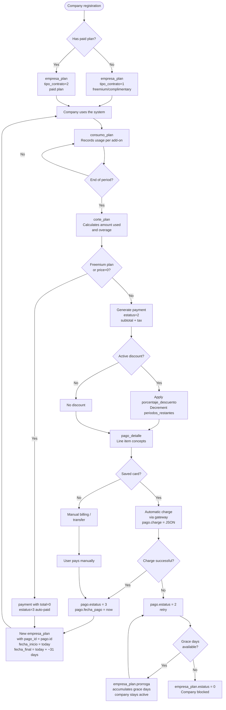

# Plans, payments, and billing system design

## Main entities

### `plan` — Available plan catalog
- `tipo`: 0=consumption, 1=regular payment, 3=complimentary
- `prorroga`: grace days after expiration
- `predeterminado`: plan assigned by default to new records
- `app`: suite the plan belongs to (multiple suites supported)

### `complemento` — Measurable plan resources

| id | clave        | nombre               |
|----|--------------|----------------------|
|  1 | COMP-REC-A   | Resource type A      |
|  2 | COMP-REC-B   | Resource type B      |
|  3 | COMP-REC-C   | Resource type C      |
|  4 | COMP-REC-D   | Resource type D      |
|  5 | COMP-REC-E   | Resource type E      |
|  6 | COMP-REC-F   | Resource type F      |

- `por_volumen`: tiered billing
- `permite_extra`: can exceed limit (charges overage)
- `validar_consumo`: blocks if limit is reached

### `complemento_escala` — Volume price tiers (overages)

Each add-on can have unit ranges with differentiated price factors for tiered billing.

---

## Plan → company structure

```
plan
 ├── plan_complemento        (add-on limits in the base plan)
 ├── plan_modulo             (modules enabled for the plan)
 └── empresa_plan            (active company subscription)
      ├── empresa_plan_complemento  (custom overrides per company)
      ├── empresa_plan_modulo
      ├── consumo_plan              (actual usage record per add-on)
      └── corte_plan                (monthly cycle: amount used + overage)
```

### `empresa_plan` — Active subscription
- `tipo_contrato`: **1** = freemium/complimentary, **2** = paid plan
- `estatus`: 0=inactive, 1=active
- `fecha_inicio` / `fecha_final`: period validity (~31 days)
- `prorroga`: remaining grace days
- `precio_unitario`: agreed price (may differ from base plan)
- `pago_id`: FK to the payment that originated this period

### `empresa_plan_complemento` — Custom add-ons per empresa_plan
- `tipo`: 1=included in plan, 2=extra purchase
- `cantidad` and `precio_unitario` override those of the plan

---

## Payment flow

### Involved tables

```
corte_plan (calculates monthly overage)
    ↓
pago (charge header)
    ├── estatus: 1=pending/active, 2=generated/pending collection, 3=paid
    ├── forma_pago: 0=card, null=transfer
    ├── subtotal + impuesto + total
    ├── porcentaje_descuento / importe_descuento
    └── charge (payment gateway JSON blob)
         ↓
pago_detalle (charge line items)
    ├── concepto
    ├── fecha_inicio / fecha_final
    └── cantidad × precio_unitario = total
```

### Other supporting entities
- **`tarjeta`**: saved card token for automatic billing
- **`descuento`**: temporary discounts per company — `porcentaje`, `periodos` / `periodos_restantes`, validity by dates
- **`facturacion`**: tax data for invoice

---

## Flow diagram — Plan and payment for a company



---

## Lifecycle summary

| Event | Result |
|--------|-----------|
| New registration | `empresa_plan` tipo_contrato=1, date ~31 days |
| Daily usage | `consumo_plan` accumulates per add-on |
| End of month | `corte_plan` calculates usage and overage |
| Billing | `pago` (estatus 2) + `pago_detalle` |
| Successful payment | `pago` estatus 3 → new `empresa_plan` |
| Failed payment | `empresa_plan.prorroga` decrements days |
| No grace days | `empresa_plan.estatus = 0` → company blocked |
