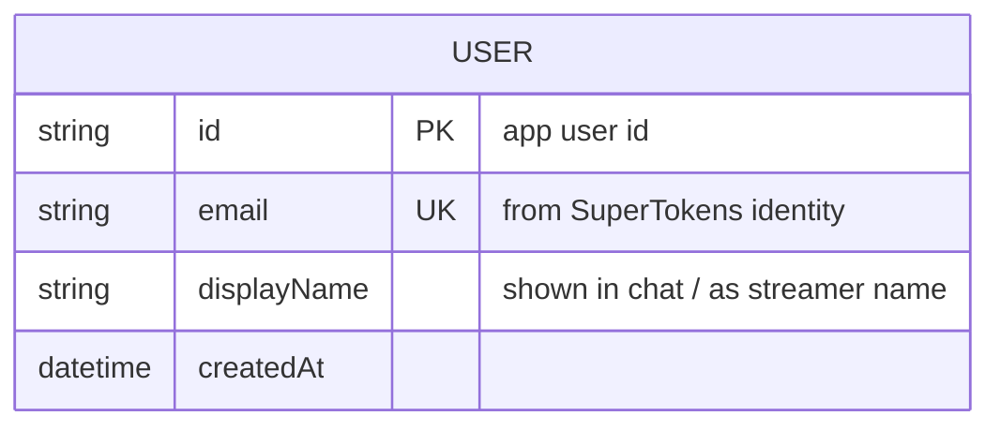

# QuickChat — Project Spec

Live streaming + real-time chat, Twitch-style. A publisher goes live; subscribers watch and chat. Built as a final project — deliberately small, five features, every component justified.

This document is the source of truth for development and for completing the project template. Keep it updated as decisions change.

---

## 1. Product

**What it is:** users start a quick live stream and share a real-time experience; other users browse who's live, open a stream, and chat alongside the video.

**Actors:**
- **Publisher** — authenticated user who broadcasts a stream.
- **Subscriber** — authenticated user who watches a stream and chats.

**Features (the whole scope):**
1. Sign up / log in (passwordless, magic link).
2. List streams that are currently live.
3. Broadcast a stream (go live).
4. Watch a live stream.
5. Chat in a stream (ephemeral, Twitch-style).

Anything not in this list is out of scope. No follows, no VODs, no profiles beyond a display name, no chat history.

---

## 2. Tech stack

| Layer | Choice | Notes |
|---|---|---|
| Frontend | TypeScript + Vite + VanJS | SPA. No framework beyond VanJS. `tsc --noEmit && vite build`. |
| Realtime media | LiveKit (self-hosted) | SFU. One publisher stream in, fanned out to N subscribers. Media never touches the Go services. |
| Backend | Go | Three small HTTP/WS APIs (see below). |
| Auth | SuperTokens | Passwordless / magic link. External system. |
| Hot store | Valkey | Chat pub/sub + recent-messages cache + live-room metadata. Ephemeral. |
| Durable store | MongoDB | User records only. |
| Deploy | Docker on a single EC2 box, TLS via Caddy | See §8. |

---

## 3. Architecture (C4)

Pattern: a small set of single-responsibility services behind a SPA. Chosen because the real-time delivery path (WebRTC + WS fan-out) must stay decoupled from the control/persistence path, and because credential issuance is isolated into one service.

**Container view:**

```
   publishers          subscribers
        \                  /
         v                v
      +----------------------+        +------------------------+
      |    QuickChat Portal   |------->|      LiveKit SFU        |
      | [TS, Vite, VanJS]     | media  | [WebRTC media]          |
      +----------------------+ (WebRTC)+------------------------+
        |        |                          |
        |        | list/manage streams      | (control)
        | magic  | [JSON/HTTP]              v
        | link   |              +------------------------+     +---------+
        | auth   |              |        Streamer         |---->| Valkey  |
        |        |              | [Go API] rooms, chat WS |     +---------+
        |        +------------->|                         |
        |                       +------------------------+
        |                                  |
        v                                  | ask for JWT (stream-room)
   +------------------+                    v
   |    Security       |<-------------------+
   | [Go API]          |
   +------------------+
        |        \
        |         \ generates magic link [SDK]
        |          v
        |     +------------------+
        |     |   SuperTokens     |
        |     | [System]          |
        |     +------------------+
        v
   (Security issues "create user" command on first login)
        |
        v
   +------------------+        +-------------+
   |     Users         |------->|  MongoDB    |
   | [Go API]          |        +-------------+
   +------------------+
```

### Key decisions (do not silently reverse these)
- **Security mints all credentials.** Magic-link user auth (via SuperTokens) *and* LiveKit room JWTs. Streamer and other services ask Security for tokens; they never sign their own.
- **Streamer owns rooms and chat.** It manages LiveKit rooms (create/delete/list) and terminates chat WebSockets. It does *not* mint tokens.
- **Media never touches the Go services.** The Portal (browser) publishes/subscribes WebRTC straight to LiveKit. Go APIs are control-plane only.
- **Chat is ephemeral.** Messages live in Valkey (pub/sub for fan-out + a capped list/stream per room for "recent on join"). Nothing is persisted. No Mongo write on the chat path.
- **Users are created once, at first login.** Triggered by Security when SuperTokens reports a new identity. No edit, no delete from the app.
- **LiveKit is the source of truth for "what's live."** The streams list is built from LiveKit's room API, not a database table.

### Trade-offs
- Three Go services is generous for the scope; justified here to demonstrate separation (credentials vs. rooms vs. user data). Could collapse to one binary with packages if simplicity wins.
- Ephemeral chat means a reload loses history beyond the cached window — accepted, matches the Twitch model and removes a persistence path.
- Single EC2 node = single point of failure; acceptable for a final project, noted in §8 for how it would scale.

---

## 4. Containers & components

### QuickChat Portal `[TS, Vite, VanJS]`
SPA. Components (TS packages):
- `login` → calls Security (magic-link auth).
- `streamings` → calls Streamer to list live streams.
- `room` → WebRTC publish/subscribe to LiveKit + chat WebSocket to Streamer.

### Streamer `[Go API]` — rooms, chat WS
Components (Go packages):
- `Stream` — wires publisher/subscriber media intent to LiveKit (publish vs. watch).
- `Rooms` — create/delete/list rooms; room metadata to Valkey.
- `Chats` — chat WebSocket; write/read messages via Valkey.
- `Auth` (token client) — forwards "room token" requests to the Security container. *Internal package; do not confuse with the Security container.*

### Security `[Go API]` — credential issuance
Components (Go packages):
- `User` — generates magic link via SuperTokens SDK; on new identity, issues the "create user" command to Users.
- `Tokens` — mints LiveKit room JWTs on request from Streamer (publisher = canPublish; subscriber = canSubscribe only).

### Users `[Go API]`
Component: `Users` — receives "create user when new" from Security, writes the user record to MongoDB. Creation only.

### External systems
- **SuperTokens** — passwordless auth provider.
- **Valkey** — chat + room hot store.
- **MongoDB** — user persistence.
- **LiveKit SFU** — WebRTC media (self-hosted; treated as its own container).

---

## 5. Data model

Only one durably persisted entity. The rest is ephemeral or owned by LiveKit.



- **USER** (MongoDB) — created once on first magic-link login. `email` unique. SuperTokens owns the auth identity/session; this record is the app-side profile.
- **Chat message** (Valkey, *not* persisted) — per-room capped list/stream, e.g. key `chat:{roomId}`, trimmed to ~100–200 entries. Shape: `{ user, text, ts }`.
- **Room metadata** (Valkey, ephemeral, TTL) — e.g. key `room:{roomId}` with title/owner/startedAt. Authoritative "is it live" comes from LiveKit's room API, not this.

---

## 6. Key flows

**Sign up / log in:** Portal `login` → Security `User` → SuperTokens sends magic link → on first valid login, Security commands Users to create the record → session established.

**Go live:** Portal `room` → Streamer `Rooms` creates a LiveKit room → Streamer `Auth` asks Security `Tokens` for a publisher JWT → Portal publishes WebRTC to LiveKit with that token.

**Watch:** Portal `streamings` lists live rooms (Streamer → LiveKit) → user picks one → Streamer issues a subscriber JWT (via Security) → Portal subscribes to LiveKit.

**Chat:** Portal `room` opens a WS to Streamer `Chats` → messages fan out via Valkey pub/sub → recent messages served from the Valkey capped list on join.

---

## 7. Suggested repo structure

Monorepo. Each service is independently buildable.

```
quickchat/
  portal/                 # Vite + VanJS + TS SPA
    src/
      components/         # login, streamings, room
      api.ts              # token fetch, list streams
      main.ts
    vite.config.ts
  services/
    streamer/             # Go: stream, rooms, chats, auth(token client)
    security/             # Go: user (supertokens), tokens (livekit jwt)
    users/                # Go: user creation -> mongo
  deploy/
    docker-compose.yml    # livekit, valkey, mongo, the three Go APIs, caddy
    Caddyfile
    livekit.yaml
  docs/
    c4/                   # the four C4 diagrams
  PROJECT.md
```

Keep the Streamer's chat code free of direct dependencies on the rooms/token code, so chat fan-out can be peeled into its own container later if it needs to scale independently.

---

## 8. Infrastructure & deployment

Single EC2 instance (memory-optimised, e.g. `r7g`/`c7g` Graviton). All containers via `docker-compose`.

- **TLS:** Caddy terminates HTTPS/WSS in front of the Portal and Go APIs (browsers require secure context for WebRTC + WS).
- **LiveKit ports:** `7880` (API/WS, behind Caddy), `7881/tcp` + `50000-60000/udp` (media), `3478/udp` (embedded TURN). Set `rtc.use_external_ip: true` so ICE advertises the public IP — the classic "works locally, fails on EC2" gotcha.
- **Valkey:** container with `--network host` to avoid NAT latency on the chat hot path; host volume for persistence (or none, since chat is ephemeral).
- **Scale path (not built):** move Valkey to ElastiCache for Valkey; cascade LiveKit SFUs behind the room API; split chat WS into its own service. Use sharded pub/sub (`SPUBLISH`/`SSUBSCRIBE`) keyed by room if Valkey ever goes cluster-mode — name channels by room ID from day one so that migration is trivial.

---

## 9. Security

- **No self-signed tokens.** Only Security mints JWTs (user sessions via SuperTokens; LiveKit room tokens). Publisher tokens grant `canPublish`; subscriber tokens are subscribe-only — the only thing stopping a viewer from broadcasting.
- **Passwordless.** No password storage; SuperTokens handles magic-link issuance and verification.
- **Rate limiting** belongs at the chat gateway (Streamer `Chats`): token bucket per user per room in Valkey, enforced before a message hits pub/sub.
- **TLS everywhere** (Caddy). WS over WSS.
- **TURN** required for ~10–15% of viewers behind symmetric NATs (LiveKit embeds one).

---

## 10. Tests (minimum worth having)

- **Unit:** token minting (publisher vs. subscriber claims), chat message capping/trim logic.
- **Integration:** "create user on first login" command path (Security → Users → Mongo); room create → token issue round-trip.
- **E2E (manual ok for the project):** go live in one browser, watch + chat in a second.

---

## Open items to confirm before/while building
- Display name source — collected at signup, or derived from email until set?
- Room identity — is a room keyed by the publisher (one stream per user at a time) or can a user run several? Affects room naming and the "go live" flow.
- Whether Users and Security stay separate binaries or merge (scope vs. demonstration of separation).
