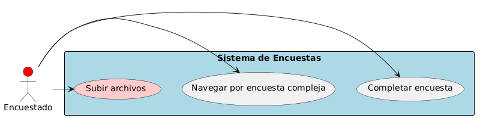
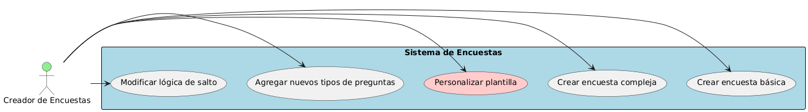
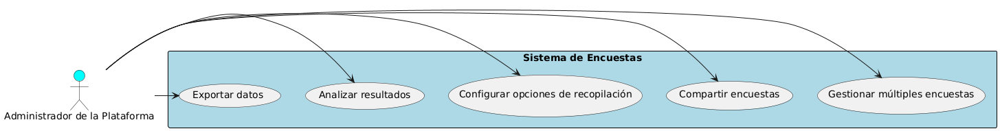

> Detalla en esta sección los prompts principales utilizados durante la creación del proyecto, que justifiquen el uso de asistentes de código en todas las fases del ciclo de vida del desarrollo. Esperamos un máximo de 3 por sección, principalmente los de creación inicial o  los de corrección o adición de funcionalidades que consideres más relevantes.
Puedes añadir adicionalmente la conversación completa como link o archivo adjunto si así lo consideras

## Índice

1. [Descripción general del producto](#1-descripción-general-del-producto)
2. [Arquitectura del sistema](#2-arquitectura-del-sistema)
3. [Modelo de datos](#3-modelo-de-datos)
4. [Especificación de la API](#4-especificación-de-la-api)
5. [Historias de usuario](#5-historias-de-usuario)
6. [Tickets de trabajo](#6-tickets-de-trabajo)
7. [Pull requests](#7-pull-requests)

---

## 1. Descripción general del producto

**Prompt 1:**

Eres un experto en producto con amplia experiencia en herramientas para recolección de datos usando formularios o encuestas, por favor analiza y enumera las funcionalidades básicas que debe tener un sistema de este tipo

**Prompt 2:**

Quiero que nos limitemos a las funcionalidades de configuración de los formularios y el diligenciamiento de las encuestas

**Prompt 3:**

Te responderé las preguntas para que por favor complementes la descripción:

Tecnología: Front con React, Backend con Java/Spring boot.
Escala: No quiero tener limitantes respecto al número de encuestas o usuarios.
Mantenimiento: Esta aplicación entrará a hacer parte del portafolio de productos de la empresa para la cual trabajo.

**Prompt 4:**

Por favor redacta el objetivo general de este proyecto

**Prompt 5:**

Me gusta, pero quiero que tengas en cuenta que también quiero poder permitirle a nuestros clientes crear y distribuir sus propias encuestas usando nuestra aplicación integrada a cualquier solución nuestra con la que ya cuenten

**Prompt 6:**

retomemos un poco lo que llamamos la descripción detallada del proyecto, ahora quiero que la adaptemos para dar una descripción al producto. Por favor ten en cuenta que esta descripción sea un poco más enfocada a la funcionalidad como tal del producto, más que en las actividades o tecnologías que vamos a estar utilizando. Quiero que sea usada como parte de la publicidad que nos ayudará a vender la idea a nuestros clientes así que incluye todos los aspectos relevantes y diferenciadores de nuestra solución de encuenstas.

**Prompt 7:**

Estoy disfrutando mucho este proceso de definición del producto y del proyecto. Por favor ayúdame organizando un listado detallado de las funcionalidades que deberá tener este producto, pero ten en cuenta estos detalles:

1. Solo quiero que te enfoques en funcionalidad relacionada con las encuestas, no quiero distraerme con temas como la autenticación ni la autorización ya que para esto nos integraremos en una aplicación existente que ya se encarga de ello.
2. Aparte de listarme la funcionalidad, quiero que agregues una descripción completa de en que consiste.
3. No limites la funcionalidad, por ejemplo propón todos los tipos de preguntas que se te ocurran, ya luego profundizaremos y daremos prioridad a algunas pero no quiero limitarme desde el inicio.

**Prompt 8:**

Me quedo con estas funcionalidades: 

Funcionalidades Clave de la Plataforma de Encuestas
Creación y Edición de Encuestas
Diseño de encuestas:
Editor visual intuitivo para arrastrar y soltar preguntas y secciones.
Biblioteca de plantillas prediseñadas para diferentes tipos de encuestas (satisfacción del cliente, investigación de mercado, etc.).
Personalización de la apariencia de la encuesta (colores, logo, etc.).
Tipos de preguntas:
Preguntas de opción múltiple: Con una o múltiples respuestas correctas.
Preguntas de escala Likert: Para medir la opinión o el acuerdo en una escala numérica.
Preguntas abiertas: Para respuestas textuales extensas.
Preguntas de matriz: Para comparar múltiples elementos.
Preguntas de clasificación: Para ordenar elementos por importancia o preferencia.
Preguntas de selección múltiple: Para seleccionar varias opciones de una lista.
Preguntas de fecha: Para capturar fechas específicas.
Preguntas de carga de archivos: Para permitir a los encuestados subir archivos (imágenes, documentos, etc.).
Lógica de salto:
Definición de flujos de preguntas condicionales basados en las respuestas anteriores.
Creación de ramas y subramas para personalizar la experiencia del encuestado.

Puedes por favor formatearlas en Markdown para yo integrarlas en mi sistema de documentación, arropa el texto markdown en """

---

## 2. Arquitectura del Sistema

### **2.1. Diagrama de arquitectura:**

**Prompt 1:**

Vamos a desplegar una aplicación para la gestión de encuestas teniendo en cuenta las siguientes consideraciones:

1. El front está escrito en React y lo vamos a desplegar en un servidor nginx.
2. Contamos con un API Rest escriba en java/spring boot y documentada con OpenAPI.
3. La base de datos puede ser cualquier motor de bases de datos relacional, pero probaremos con Postgresql inicialmente. Para lograr esto usaremos el proyecto Spring Data JPA.
4. Solo se expondrá en internet el front con nginx, y este a su vez enrutará hacia el API cuando sea necesario usando su funcionalidad de proxy.
5. En caso de requerirlo, podremos levantar más instancias de API que se balancearán usando la funcionalidad de nginx.
6. Ten en cuenta que nuestra API deberá conectarse a la base de datos de la aplicación actual o en su defecto consumir algún API que expongamos allí.

Cada componente lo pondré en un contenedor por separado

**Prompt 2:**

Quiero que la base de datos esté afuera del contenedor del API

**Prompt 3:**

Por favor representa cuando tenemos más de una instancia del api

**Prompt 4:**

Quita el elemento de la documentación ya que me parece que no es claro

**Prompt 5:**

Pienso que cada api debe tener su contenedor dado que así será en la práctica

### **2.2. Descripción de componentes principales:**

**Prompt 1:**

**Prompt 2:**

**Prompt 3:**

### **2.3. Descripción de alto nivel del proyecto y estructura de ficheros**

**Prompt 1:**

Actua como un arquitecto de software experto y me ayudes a definir la estructura de archivos más óptima para el proyecto de gestión de encuestas. Estoy pensando usar arquitectura hexagonal pero aplicando vertical slicing para organizar un poco mejor el código. Te pasaré el diagrama del modelo de datos para que me ayudes con esta labor:

**Prompt 2:**

Pero quiero que entremos más en detalle incluyendo hasta los controladores, servicios, modelos, entidades, repositorios y demás componentes usados. Ten en cuenta que queremos desarrollar usando Spring Boot

**Prompt 3:**

Incluye todos los conceptos

### **2.4. Infraestructura y despliegue**

**Prompt 1:**

Vamos a desplegar una aplicación para la gestión de encuestas teniendo en cuenta las siguientes consideraciones:

1. El front está escrito en React y lo vamos a desplegar en un servidor nginx.
2. Contamos con un API Rest escriba en java/spring boot y documentada con OpenAPI.
3. La base de datos puede ser cualquier motor de bases de datos relacional, pero probaremos con Postgresql inicialmente. Para lograr esto usaremos el proyecto Spring Data JPA.
4. Solo se expondrá en internet el front con nginx, y este a su vez enrutará hacia el API cuando sea necesario usando su funcionalidad de proxy.
5. En caso de requerirlo, podremos levantar más instancias de API que se balancearán usando la funcionalidad de nginx.
6. Ten en cuenta que nuestra API deberá conectarse a la base de datos de la aplicación actual o en su defecto consumir algún API que expongamos allí.

**Prompt 2:**

**Prompt 3:**

### **2.5. Seguridad**

**Prompt 1:**

**Prompt 2:**

**Prompt 3:**

### **2.6. Tests**

**Prompt 1:**

**Prompt 2:**

**Prompt 3:**

---

### 3. Modelo de Datos

**Prompt 1:**

Te daré unos diagramas de casos de uso para que los analices y me ayudes a realizar la definición del modelo de datos que debe soportar mi aplicación para la gestión de encuestas:

**Prompt 2:**

Quiero que el diagrama completo lo representemos en foramto mermaid

**Prompt 3:**

Me parece que es una buena primera versión, pero quiero saber si tenemos opciones de respuesta para una pregunta, por ejemplo las preguntas de selección múltiple, en donde almacenamos dichas respuestas?

**Prompt 4:**

Para estos casos, se requiere que el actor creador de encuestas defina cuales son las opciones de respuesta correctas, ya lo hemos considerado?

**Prompt 5:**

Por favor agrega a los atributos de las encuestas un campo para controlar el estado que podría ser: Nueva, Activa, Cerrada o Pausada.

También quisiera poder guardar las fechas de publicación, y de cierre. Por otra parte no veo en. nuestro diagrama en que lugar vamos a guardar las respuestas ingresadas por los encuestados?

**Prompt 6:**

Me parece perfecto, por otra parte: Algunas encuestas se crean con la intención que solo se puedan responder una única ves por parte de cada encuestado, como podemos lograr este comportamiento también?

**Prompt 7:**

Si queremos que las encuestas soporten una distribución de múltiples páginas, crees que es relevante esto para el modelo de datos?

---

### 4. Especificación de la API

En este apartado quien miejor funcionó fue GPT. Gemini realizó muchos intentos y nunca lo logró.

**Prompt 1:** 

Eres un experto arquitecto de software, podrías darme el archivo de definición OpenAPI para un sistema que soporte las operaciones de: Creación, Actualización, Borrado, Búsqueda de todos los registros usando paginación y ordenado y búsqueda por identificador de cada uno de ellos.

Ten en cuenta el modelo de datos que te adjunto para los nombres y atributos de cada uno de los conceptos.

Quiero que me des el archivo completo para yo poder copiar y pegar en mi proyecto.

**Prompt 2:**

**Prompt 3:**

---

### 5. Historias de Usuario

**Prompt 1:**

Eres el product owner en una organización que fabrica software principalmente para America latina en donde se está desarrollando la nueva gran aplicación la gestión y diligenciamiento de encuestas.

Hemos idetinficado 3 roles:

1. Administrador: Encargado de compartir encuestas, gestionar encuestas.
2. Creador de encuestas: Encargado de crear encuestas básicas y complejas, Agregar nuevas preguntas.
3. Encuestado: Quien se encarga de dilgenciar, navegar y completar la encuesta.

Por favor dame un listado de historias de usuario para cubrir esta funcionalidad

**Prompt 2:**

Ahora quiero que me las organices dando prioridad a aquellas historias que permiten crear nuevas encuestas, es decir el primer rol que obtendrá valor con nuestro sistema será el creador de encuestas, posteriormente haremos las historias que tu consideres de los demás roles.

**Prompt 3:**

---

### 6. Tickets de Trabajo

**Prompt 1:**

Considera el listado detallado que me acabas de dar con las historias de usuario y a partir de este genera una tabla con todos los tickets de trabajo necesarios para completar el backlog, y añade tu sugerencia de estimación de puntos.

**Prompt 2:**

Podrías darme la tabla en formato markdown, por favor arrópalo en """

**Prompt 3:**

---

### 7. Pull Requests

**Prompt 1:**

**Prompt 2:**

**Prompt 3:**
