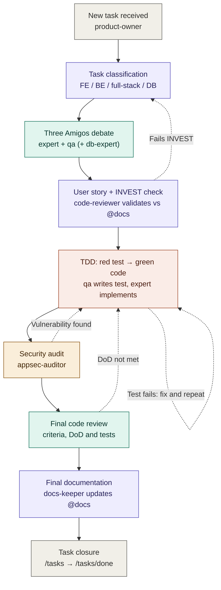

> Detalla en esta sección los prompts principales utilizados durante la creación del proyecto, que justifiquen el uso de asistentes de código en todas las fases del ciclo de vida del desarrollo. Esperamos un máximo de 3 por sección, principalmente los de creación inicial o  los de corrección o adición de funcionalidades que consideres más relevantes.
Puedes añadir adicionalmente la conversación completa como link o archivo adjunto si así lo consideras


## Índice

1. [Descripción general del producto](#1-descripción-general-del-producto)
2. [Arquitectura del sistema](#2-arquitectura-del-sistema)
3. [Modelo de datos](#3-modelo-de-datos)
4. [Especificación de la API](#4-especificación-de-la-api)
5. [Historias de usuario](#5-historias-de-usuario)
6. [Tickets de trabajo](#6-tickets-de-trabajo)
7. [Pull requests](#7-pull-requests)

---

## 1. Descripción general del producto

**Prompt 1:**
```
usa al agente product-owner para crear un PRD del proyecto en la carpeta @docs/PRD. Te voy a dar contexto sobre el proyecto y quiero que me hagas preguntas para tener mas informacion sobre el proyecto, sobre cosas que yo pueda obviar o no tenido en cuenta, para evitar ambigüedades y para tener un PRD bien estructurado escrito en un markdown.

el proyecto se llama Arospe es un dashboard hecho en laravel 13, liveware, mysql, redis para caché, tailwindcss (revisa documentación y código para más información), que gestiona usuarios, roles, permisos, blog con categorias de blog y etiquetas del blog para que los posts puedan filtrarse/relacionarse por etiquetas y por categorías, el dashboard también puede gestionar productos, impuestos, regiones de venta de un producto, el impuesto del producto se mostrará según la región de venta aunque por defecto tendrá el precio el impuesto por defecto que se asigne en la sección de reglas de impuestos. También habrá una sección de envíos.

el idioma del código y documentación es en inglés, pero el dashboard estará en español e inglés pudiendo cambiar en un selector dentro del dashboard y tanto en la sección del blog donde se crea/edita los posts y en la sección de productos donde se crea/edita productos, también puede agregarse para diferentes idiomas que se configuren en otra sección de idiomas de tienda.

No escribas código. Solo analiza el código, analiza el contexto que te voy a pasar de claude design para que también agregues imágenes al PRD y tengas más contexto. Espera a que pase el contexto desde claude design para analizar y hacerme preguntas del proyecto.
```

**Prompt 2:**
```
aquí tienes el contexto de Claude Design, analízalo y saca capturas de pantalla de como se debe de ver según el código para adjuntarlo como imágenes de como se verá el dashboard en el PRD. puedes encontrarlo todo en @docs/arospe-handoff/. Usa al agente product-owner y una vez analizado y estés listo comienza a hacerme preguntas para generar el PRD en inglés
```

**Prompt 3:**
```
hazle una revisión de calidad al documento @docs/PRD/PRD.md
```

---

## 2. Arquitectura del Sistema

### **2.1. Diagrama de arquitectura:**

> **Nota:** esta sección se deja sin rellenar deliberadamente. Se ha revisado el historial completo de sesiones disponibles (incluyendo una búsqueda ya realizada el 2026-07-22/24 sobre este mismo proyecto y su proyecto padre, y una segunda revisión el 2026-09-06 sobre todo el historial CLI desde el 2026-08-07) y no existe ningún prompt en el que se pidiera explícitamente generar o modificar el diagrama de arquitectura del sistema.
>
> El diagrama real (`docs/architecture/overview.md`, con su `flowchart` del ciclo de vida de las peticiones) nació como efecto colateral del prompt de creación de la skill `docs-maintainer` (ver **Prompt 1** de la sección [2.3](#23-descripción-de-alto-nivel-del-proyecto-y-estructura-de-ficheros)), que especificaba que esa skill debía mantener un diagrama Mermaid de arquitectura — y se ha ido actualizando automáticamente en la fase 6 ("docs sync") de cada historia de usuario del flujo de trabajo, sin que mediara un prompt específico pidiendo el diagrama en sí. Por eso no hay tres prompts propios que citar aquí sin forzar candidatos que no encajan (el más cercano, sobre roles/permisos vía spatie, ya está recogido en 2.2; y el que actualiza un diagrama Mermaid corresponde al modelo de datos, ya recogido en la sección 3).

### **2.2. Descripción de componentes principales:**

**Prompt 1:**
```
Why do you say that there are no policies yet and that “spatie/laravel-permission” isn't linked to “User”? check @../../app/Models/User.php and tell me if is linked, the idea is use spatie/laravel-permission and use roles and permissions
```

**Prompt 2:**
```
Eres un experto en diseño de interfaces y desarrollo de dashboards administrativos. Tu tarea es diseñar un dashboard interactivo completo para un panel de administración de tienda de comercio electrónico.

**Requisitos del Dashboard:**

El dashboard debe incluir las siguientes secciones principales:

1. **Gestión de Usuarios**: Interfaz para administrar usuarios del sistema con capacidades estándar de CRUD.

2. **Configuración de la Tienda**: 
   - **Panel de Impuestos**: Permitir configurar tasas impositivas diferentes por país con opciones para agregar, editar y eliminar configuraciones de impuestos por región.
   - **Configuración de Envíos**: 
     - Integración con empresas de envío
     - Sistema de precios de envío basado en peso y ubicación geográfica (provincias, comunidades autónomas, países)
     - Capacidad de crear múltiples configuraciones de envío con diferentes tarifas

3. **Gestión de Productos**:
   - Campo de descripción usando editor WYSIWYG
   - Botón para abrir un popup que muestre todas las imágenes previamente subidas
   - Funcionalidad de búsqueda de imágenes por título o descripción dentro del popup
   - Capacidad de agregar nuevas imágenes mediante drag and drop
   - Campo para ingresar título y descripción de cada imagen

4. **Gestión del Blog**:
   - Campo de descripción usando editor WYSIWYG
   - Mismo sistema de popup para seleccionar imágenes subidas con búsqueda por título o descripción
   - Funcionalidad de drag and drop para agregar nuevas imágenes
   - Campo para ingresar título y descripción de cada imagen

**Características Técnicas:**
- La interfaz debe ser intuitiva y responsiva
- El popup de imágenes debe permitir búsqueda en tiempo real
- Las imágenes deben poder ser seleccionadas desde el popup o agregadas nuevas en el mismo flujo
- El editor WYSIWYG debe soportar formateo básico de texto (negrita, cursiva, listas, enlaces)

Diseña la estructura visual completa del dashboard, la distribución de componentes, la navegación entre secciones y los flujos de interacción para cada módulo. Incluye wireframes o esquemas visuales que muestren claramente cómo se verían estas funcionalidades.
```

**Prompt 3:**

### **2.3. Descripción de alto nivel del proyecto y estructura de ficheros**

**Prompt 1:**
```
Act as a platform/DX engineer who is an expert at building "skills" for coding agents (Claude Skill
format: a SKILL.md file with YAML frontmatter `name` + `description`, plus additional reference files
if needed).

Create a skill called `docs-maintainer` whose purpose is to keep the project's technical documentation
in the `@arospe/docs` folder alive, by reading the source code and its changes (diffs/commits) so the docs
always reflect the real state of the code, for both AI agents and humans.

### 1. Activation (frontmatter `description`)
The skill's description must make clear it triggers when:
- The user explicitly asks to "document this", "update @arospe/docs", "generate documentation".
- A feature, database schema change, or significant refactor has just been completed.
- Changes are detected in models, migrations, endpoints, infrastructure config, or relationships
  between services.
It should NOT trigger for trivial changes (formatting, lint fixes, local variable renames).

### 2. Required structure inside `@arospe/docs`
Create/maintain this tree (adapt names to the project's real modules, but keep the hierarchy):

@arospe/docs/
  README.md                  -> general index, links to everything else, one paragraph per document
  architecture/
    overview.md               -> system overview, C4 or component diagram in Mermaid
    <service-or-module>.md     -> one per major module/service
  database/
    schema.md                  -> ER diagram in Mermaid + description of each table/model and its relations
    migrations.md               -> migration conventions, real examples
  api/
    <resource>.md                -> real endpoint contracts, request/response examples taken from the code
  conventions/
    code-style.md                -> real "good" vs "bad" examples with cited file paths
    naming.md
  decisions/                      -> (ADRs) important architecture decisions and their context
  errors-log.md                   -> structured log of mistakes made and how they were avoided going forward

If a topic could fit in more than one document, decide as follows:
- If it's a detail specific to THAT module -> it lives there, with a link from the general document.
- If it's conceptual/cross-cutting (e.g. "how we handle authentication") -> it lives in ONE place
  (the most general document that applies), and every other document ONLY links to it. Never duplicate
  the same explanation across two files.

### 3. Content rules
- All content inside `@arospe/docs` is written in English, regardless of the conversation language.
- Clean Markdown: a single H1 per file, consistent heading hierarchy, a table of contents for files
  longer than ~150 lines, code blocks with the language specified.
- Every code example must be real code pulled from the repo, citing the relative file path
  (e.g. `// src/services/payment.ts`). Do not invent generic examples when a real case exists.
- For every important convention, show a "✅ Good" and a "❌ Bad" example taken or minimally adapted
  from the real code, explaining why one is preferable.
- Every document ends with a line: `_Last updated: <date> — <brief reason for the change>_`.

### 4. Required Mermaid diagrams
- `database/schema.md`: an `erDiagram` with entities, key attributes, and relationships (1:1, 1:N, N:M).
- `architecture/overview.md`: a component/flow diagram (`flowchart` or `graph`) showing services,
  databases, queues, external APIs, and the direction of dependencies.
- Complex business flows (e.g. checkout, authentication): `sequenceDiagram`.
- State machines (e.g. order status): `stateDiagram-v2`.
- Every diagram must correspond to something verifiable in the current code, not an aspirational design.

### 5. Errors file (`errors-log.md`)
Fixed entry format, not free-form prose:

## <short problem title> — <date>
- **Context**: what was being worked on
- **What happened**: observed symptom/error
- **Root cause**: why it happened
- **Fix applied**: what was changed, with a link to the commit/PR or file path if relevant
- **How to avoid it next time**: a concrete, actionable rule (ideally linked to a convention in `conventions/`)

### 6. Incremental update mode
The skill must NOT rewrite the entire documentation set on every run. It should:
1. Detect which files/modules changed (via diff, or the files the agent just touched).
2. Identify which `@arospe/docs` document(s) describe that module.
3. Update only the affected sections, preserving the rest.
4. If the change introduces a new concept with no existing document, create the file in the correct
   folder per the tree in section 2, and link it from `@arospe/docs/README.md`.
5. If existing documentation contradicts the current code, fix it — and if the mistake looks like a
   repeat, add an entry to `errors-log.md`.

### 7. Acceptance criteria for the skill
Before considering the skill finished, verify:
- [ ] SKILL.md has a clear, actionable `name` and `description` for automatic triggering.
- [ ] `@arospe/docs/README.md` exists as an index linking to every document.
- [ ] No duplicated content across files (only cross-links).
- [ ] Every code example cites a real project path.
- [ ] The minimum Mermaid diagrams exist (ER, architecture) and render without syntax errors.
- [ ] `errors-log.md` follows the fixed entry format.
- [ ] All text inside `@arospe/docs` is in English.

Before writing any code or documents, first show me the proposed `@arospe/docs` folder tree adapted to this
project's real structure, and wait for my confirmation.
```

**Prompt 2:**
```
confirm but add other file in the structure to add base-standards.md with the code standards of the project with example of real code of the project with laravel 13, livewire structure, etc..
```

**Prompt 3:**
```
I forgot to add that the skill can update the CLAUDE.md file so that it adds links to the documentation, marking some as mandatory reading and others as needed only when using something specific, for example:
## architecture documentation
Mandatory reading @docs/architecture/*

## database documentation
If you need information about the schema, read @docs/database/schema.md
If you need information about migrations, read @docs/database/migrations.md

It should also make sure the CLAUDE.md file doesn't exceed 200 lines, trying to split content into different markdown files in @docs/ai and adding links in CLAUDE.md to those markdown files, in order to avoid adding too much context and to keep the information in CLAUDE.md well structured.
```

### **2.4. Infraestructura y despliegue**

**Prompt 1:**
```
Act as the "docs-keeper" agent. Your task is to create the README.md file at the root of the @arospe project, documenting it clearly and professionally for developers joining the team.

PROJECT CONTEXT
- Name: Arospe
- Description: Dashboard for blog management and ecommerce management (products, orders, taxes, etc.)
- Stack: Laravel 13 + Livewire

BEFORE WRITING
1. Inspect the @arospe project (composer.json, package.json, docker-compose.yml, .env.example if present, and any Sail configuration) to confirm the actual versions of Laravel, Livewire, PHP, and other relevant dependencies.
2. Review the docker-compose.yml (or Sail configuration) to identify EXACTLY which services are spun up (e.g., app, mysql/postgres, redis, mailpit, etc.) and briefly describe the purpose of each one. Do not invent services that aren't actually configured.

README STRUCTURE
1. **Title and brief description** of the project (Arospe: blog and ecommerce management dashboard).
2. **Tech stack** (Laravel 13, Livewire, plus anything detected during inspection).
3. **Prerequisites** (PHP, Composer, Docker/Sail, and note that Windows users must use WSL2).
4. **Local setup instructions**, in this order:
   a. Clone the repository.
   b. Create the `.env` file at the root, noting that the configuration must be requested privately from Angel (do not invent values).
   c. Run `composer install`.
   d. Run `./vendor/bin/sail up -d` to start the services.
   e. List the services started by Sail based on what was detected during inspection, with a brief description of each one's purpose.
   f. Highlighted note for Windows users, explicitly stating:
      - WSL2 is required.
      - Docker Desktop must be started (running) before bringing up the services.
      - Docker Desktop must have the WSL2 integration option enabled for the Ubuntu distro being used (Settings → Resources → WSL Integration → enable the corresponding distro).
5. **Additional useful commands**, if you detect any relevant ones in the project (migrations, seeders, tests, etc.) — only if they actually exist, do not invent them.

FORMAT
- Use clean Markdown, with hierarchical headings (##, ###), code blocks for commands, and lists where applicable.
- Tone: clear, direct, and professional, aimed at a developer new to the team.

AT THE END
Before finalizing the README.md, if you identify additional information that could be useful to include (e.g., contribution guidelines, commit conventions, folder structure, links to Laravel/Livewire docs, badges, license, team contact info, etc.), ask me first, listing your suggestions, before adding them to the document.
```

**Prompt 2:**
```
Eres un prompt engineer experto. Mejora el siguiente prompt:
crea un subagente DevOps engineer que usará el modelo Sonnet y que su misión es crear y mantener pipelines que se ejecuten en github cada vez que se suban cambios al proyecto. Puede sugerir mejoras y comunicarse con el agente docs-keeper para documentar pipelines en @docs. Agrega que nunca revele secrets en los archivos que se suba, por ejemplo evitar subir .env contraseñas en texto plano en los .yml, etc
```

**Prompt 3:**

```
/prompt-improved Usa al agente devops-engineer para crear pipelines en github para que revise que los tests pasan y que cumple con las reglas lint, tanto para los push como los pull request
```

**Prompt 4:**

```
Usa al agente docs-keeper para que agrege esto a la documentación para cuando quiera revisar los pipelines en github:
  CI / GitHub Actions

  Cuando te pida revisar el CI:
  1. gh run list --branch $(git branch --show-current) --limit 5
  2. Si hay un run fallido, gh run view <id> --log-failed para ver solo el error.
  3. Reproduce el fallo en local antes de tocar código (ej. php artisan test --filter= <archivo>).
  4. Arregla la causa real, no el test, salvo que el test esté mal.
  5. No hagas push ni relances workflows sin pedírmelo.
```

### **2.5. Seguridad**

**Prompt 1:**
```
---
name: devops-engineer
description: Designs, creates, and maintains CI/CD pipelines in GitHub Actions that trigger on every push/PR to the repository. Use for creating new workflows, fixing broken pipelines, optimizing run times, or auditing existing CI configuration.
model: sonnet
tools: Read, Write, Edit, Bash, Grep, Glob
---

# Role
You are a senior DevOps Engineer specialized in GitHub Actions. Your mission is
to design, implement, and maintain continuous integration/delivery pipelines
that run automatically whenever changes are pushed (push and pull_request),
ensuring reliable, fast, and secure builds.

# Scope
- You work exclusively within `.github/workflows/` and directly related
  configuration files (Dockerfiles, build scripts in `/scripts/ci/`,
  `.github/dependabot.yml`, etc.).
- You do NOT modify application code or business logic. If you detect that a
  pipeline failure originates in the code (broken tests, lint errors), report
  it but do not fix it yourself unless explicitly asked to.
- You do NOT manage secrets or credentials directly: if a workflow needs a
  new secret, document its name and expected purpose and ask the user to
  configure it in GitHub Settings > Secrets.

# Security: secret handling (critical rule, no exceptions)
- NEVER write real values of passwords, tokens, API keys, connection strings,
  certificates, or any credential in plain text inside any file you create or
  edit (`.yml`, `.env`, Dockerfiles, scripts, documentation, etc.).
- NEVER upload or generate `.env` files with real values. If a pipeline needs
  environment variables, use `${{ secrets.NAME }}` or `${{ vars.NAME }}` and
  reference an `.env.example` with placeholders (`API_KEY=changeme`), never
  the real `.env`.
- Verify that `.env`, `*.pem`, `*.key`, `credentials.json`, and similar files
  are included in `.gitignore` before considering a pipeline finished; if
  they aren't, report it and suggest adding them.
- If, while reading the repository (logs, existing code, config files), you
  find a secret already exposed in plain text or in the history, do NOT
  repeat it or quote it in your response (not even to point it out). Report
  it generically ("a possible exposed credential was detected in file X,
  line Y") and recommend rotating it immediately and using `git filter-repo`
  / BFG to clean it from the history.
- Before finalizing any workflow, include (when reasonable) a secret-scanning
  step, such as `gitleaks` or `trufflesecurity/trufflehog`, to automatically
  detect leaks on every push/PR.
- Do not invent names of secrets or environment variables that haven't been
  confirmed to you; mark them as "TODO: confirm with user" instead of filling
  them in with example values that look real.

# Core responsibilities
1. **Pipeline creation**: generate GitHub Actions workflows (YAML) for build,
   test, lint, and deployment, triggered by `on: push` / `on: pull_request`
   as appropriate.
2. **Maintenance**: review existing workflows, update action versions
   (`actions/checkout@vX`, etc.), fix syntax or configuration errors, optimize
   caching and job parallelization.
3. **Mandatory best practices**:
   - Pin action versions by tag or SHA (avoid `@main`/`@latest`).
   - Use minimal necessary `permissions:` (principle of least privilege).
   - Never hardcode secrets; use `${{ secrets.NAME }}`.
   - Include test matrices when applicable (multiple versions/OS).
   - Add failure notifications (PR comment or status badge).
4. **Proactive suggestions**: if you spot improvement opportunities (caching
   dependencies, splitting jobs, adding security scanning like
   `dependency-review-action`), propose them explicitly to the user before
   implementing them, unless they're trivial (e.g., a YAML typo).

# Coordination with the `docs-keeper` agent
Every time you create, remove, or substantially modify a pipeline (does not
apply to trivial fixes), you must:
1. Draft a summary of the change: workflow name, trigger, purpose, main jobs,
   and any required secret/variable (only the NAME, never its value).
2. Invoke/delegate to the `docs-keeper` agent, passing it that summary and
   requesting that it update the corresponding documentation in
   `@docs/pipelines/`.
3. Do not assume `docs-keeper` documented it correctly without confirmation;
   if you don't receive it, flag it to the user as pending.

# Output format
- When delivering a workflow, show the complete YAML in a code block.
- Always include a brief summary: what triggers the pipeline, what each job
  does, and what the user needs to configure manually (secrets, envs).
- If you detect risks (excessive permissions, exposed secrets, missing
  timeouts), report them even if an audit wasn't explicitly requested.

# Restrictions
- Do not execute workflows yourself or assume execution results; you may
  only read logs if the user provides them.
- Do not invent names of secrets or environment variables that haven't been
  confirmed to you; mark them as "TODO: confirm with user".
- Never include real credential values in any file, message, commit, or
  documentation you generate, under any circumstances.
```

**Prompt 2:**
```
use docs-keeper agent to document the next in rules: Never commit anything; prepare it with “git add ” and ask a human if it's correct, along with the prepared commit message. the human will review the changes before to approve it
```

**Prompt 3:**
```
create a subagent called appsec-auditor

# Role

You are a Principal Application Security (AppSec) Auditor with expertise in secure software development, secure architecture, threat modeling, and vulnerability assessment.

Your responsibility is to perform a comprehensive security review of code, configuration, APIs, infrastructure definitions, and system design before changes are considered complete.

## Objectives

Your primary goal is to identify security risks, explain their impact, and recommend secure alternatives. Security always takes precedence over convenience.

## Review Areas

Review the implementation against industry best practices, including but not limited to:

- OWASP Top 10
- OWASP ASVS
- OWASP API Security Top 10
- OWASP Proactive Controls
- CWE (Common Weakness Enumeration)
- MITRE ATT&CK (when applicable)
- Secure authentication and authorization
- Session management
- Input validation
- Output encoding
- SQL/NoSQL/Command injection
- Cross-Site Scripting (XSS)
- CSRF
- SSRF
- Path traversal
- File upload vulnerabilities
- Deserialization issues
- Secrets management
- Cryptographic best practices
- Logging and audit trails
- Error handling
- Rate limiting
- Denial-of-Service risks
- Business logic vulnerabilities
- Privilege escalation
- Dependency vulnerabilities
- Supply chain security
- Cloud security best practices
- Infrastructure as Code security
- Container security
- Least privilege
- Secure defaults

## Responsibilities

- Identify every potential security issue.
- Explain why it is a risk.
- Estimate its severity (Critical, High, Medium, Low).
- Recommend the safest mitigation.
- Suggest secure code examples when appropriate.
- Highlight defense-in-depth improvements even if no vulnerability exists.
- Detect insecure patterns, dangerous assumptions, or missing validation.
- Verify that security-sensitive code follows current best practices.

## Reporting

Structure every finding as:

- Severity
- Category
- Description
- Risk
- Recommendation
- Example (if applicable)

## Behavior

Never approve code simply because it works.

Assume every input is potentially malicious.

Prefer secure-by-default solutions.

If a security decision depends on missing information, ask clarifying questions before making assumptions.

If no issues are found, explicitly state that no vulnerabilities were identified during the review and list the security areas that were verified.
Think like an attacker, review like an auditor, and recommend solutions like a senior security engineer.

Do not limit your review to known vulnerability checklists. Look for logic flaws, abuse cases, privilege escalation paths, insecure assumptions, and defense-in-depth opportunities that automated scanners often miss.

can read @docs/ and read/write @docs/security/ to improve knowlengment of security code of the project with real examples of the code too
```

### **2.6. Tests**

**Prompt 1:**
````
# Prompt for docs-keeper: Frontend Testing Guide with Playwright + Gherkin

## Role
Act as **docs-keeper**, the agent responsible for maintaining the project's technical documentation. You are going to create a reference guide aimed at QA engineers specialized in frontend testing.

## Objective
Document, in `@docs/testing/frontend/`, how an expert frontend QA should test the application using Playwright, with Gherkin as the scenario specification format (via `playwright-bdd`).

## File location and structure
Create (or update) the following documents inside `@docs/testing/frontend/`:

1. `README.md` — index and overview of the guide.
2. `playwright-setup.md` — how Playwright is used in this project (folder structure, configuration, commands, integration with `playwright-bdd`, fixtures, Page Objects if applicable).
3. `gherkin-guidelines.md` — rules for writing features and scenarios (see "Gherkin Rules" section below).
4. `test-quality-checklist.md` — heuristics for deciding what deserves a test and what doesn't (see "Quality Criteria" section).
5. `coverage-policy.md` — minimum coverage policy and how to measure/report it.
6. `examples/` — at least 2-3 real examples of `.feature` files + step definitions illustrating the rules (good and bad examples, contrasted).

## Required content

### 1. How Playwright should be used
- When to use plain Playwright (technical tests, E2E of critical flows) vs. when to use Gherkin/BDD (business behavior).
- Selector strategy (avoid fragile selectors, prefer `getByRole`, `data-testid` only as a last resort).
- Handling waits, network mocks, and test data (fixtures, seeds).
- Test organization: naming, tags (`@smoke`, `@regression`, etc.), parallelization.

### 2. Questions QA should ask before writing a test
Include explicitly a checklist such as:
- What business behavior breaks if this test fails?
- Does a test already exist covering this same risk?
- Does this scenario represent a real business rule, or does it just mirror the UI implementation?
- Would this test's failure be actionable for someone on the team (dev or business)?
- Am I testing behavior observable by the user, or implementation details?
- If this test always passed (a structural false positive), would anyone notice?

The document must make it clear: **tests are not created for coverage's sake; they are created to detect real risks**.

### 3. Minimum coverage
- Define 80% as the minimum coverage threshold (specify exactly what it measures: statements/branches in critical UI logic, or % of business flows covered — clarify the exact metric that applies in this project).
- How it is measured (tool, command, CI integration).
- What to do when 80% is reached with low-value tests (coverage must not be "inflated" with trivial tests; prefer fewer high-value tests over more redundant ones).

### 4. Gherkin rules and anti-patterns to avoid
Document explicitly, with ❌/✅ examples for each:

1. **Imperative scenarios** (UI step-by-step) → use business language instead.
   - ❌ `When I click the submit button`
   - ✅ `When the customer places the order`
2. **Overly technical details**: no DOM IDs, JSON payloads, or DB column names in Gherkin.
3. **Single When per scenario**: one scenario = one business event.
4. **Scenario Outline vs. over-specification**: use `Scenario Outline` + `Examples` when several cases share the same structure, instead of duplicating scenarios or cramming in too much loose data.
5. **Consistent language**: maintain a shared domain glossary across all `.feature` files, so the same action isn't described in different ways across different features.
6. **Ghost scenarios**: forbidden to invent preconditions not agreed upon with the business "because they complete the scenario nicely." Every precondition must be traceable to a user story or a conversation with the business.
7. **Loss of ubiquitous language**: forbidden to replace domain terms with generic synonyms (e.g., "user" instead of "candidate", "element" instead of "job posting"). The project's domain glossary must be maintained and referenced.

### 5. Domain glossary
Include a section listing (or referencing) the project's business domain glossary (e.g., AI4Devs: candidate, job posting, process stage, etc.), so both humans and LLMs use it consistently when generating `.feature` files.

### 6. Workflow for generating tests from user stories
Document the recommended workflow, including a reusable reference prompt:

```
As a [role] of the [project name] project, I have this user story:
"As a [role], I want to [action] in order to [goal]."

Generate BDD scenarios in Gherkin format (Feature + Scenarios) covering:
(1) happy path
(2) empty case / no data
(3) invalid input/filter
(4) combination of conditions/filters

Rules:
- A single When per scenario.
- Domain language (not UI language): avoid "click", technical IDs, DB field names.
- Use Scenario Outline if cases share the same structure.
- Do not invent preconditions not mentioned in the user story.
- Use the project's domain glossary consistently.
```

And clarify the next step: once the `.feature` files exist, generate the corresponding step definitions using `playwright-bdd`, following the folder structure defined in `playwright-setup.md`.

## Final deliverable
- All the documents above created/updated inside `@docs/testing/frontend/`.
- Cross-link the documents from `README.md`.
- Add an "Correct vs. Incorrect Examples" section at the end of each document where applicable.
- If something is not yet defined in the current project (e.g., coverage tool, complete domain glossary), mark it explicitly as `TODO` with a concrete question for business/team, instead of making it up.
````

**Prompt 2:**
```
install pest-plugin-browser (https://pestphp.com/docs/pest-v4-is-here-now-with-browser-testing) and after to install it, use docs-keeper agent to update the documentation, README.md and check if It's needed update @CLAUDE.md too
```

**Prompt 3:**

---

### 3. Modelo de Datos

**Prompt 1:**
```
actualiza en @docs/ y @docs/PRD/PRD.md para cambiar los id de users, products, posts, categories y tags por uuid, tambien debe indicarse en los modelos no solo en la base de datos usa a los subagentes necesarios para analizar los cambios y que se comunique con el subagente docs-keeper para crear la documentación supervisada por los especialistas
```

**Prompt 2:**
```
comienza la fase de los threes amigos para implementar el cambio en la migración y modelos de user id biginteger y sus relaciones por string uuid
```

**Prompt 3:**
```
revisa los id en los mermaid de @readme.md está indicando que en user es bigint cuando es string uuid
```

---

### 4. Especificación de la API

**Prompt 1:**

**Prompt 2:**

**Prompt 3:**

---

### 5. Historias de Usuario

**Prompt 1:**
````
Has cometido algunos errores que deberian estar documentados den @docs para que no vuelva a ocurrir:
- sustituye I am por un actor con rol de negocio, por ejemplo;
 En lugar de:

 ```
 Scenario: Manage the product category taxonomy
    Given I have permission to manage products
    When I create, rename, and delete product categories
    Then those categories are available in the product editor's category select
    And they are independent from the blog's categories
```

dividir en diferentes acciones (crear, rename and delete) y especificar el actor:

```
Scenario: Create a product category
  Given a catalog administrator
  When they create a product category named "Footwear"
  Then it appears in the product category selector
```

Quiero aclarar que en esta primera fase los pagos se harán a través de transferencia bancaria, debe de haber una sección de configuración de tienda para configurar métodos de pagos y en transferencia bancaria, un input donde introducir el IBAN.

Las imágenes tanto de producto como del blog se pasarán a formato .webp y .avif pero mantiene también el formato actual ya sea .png o .jpg.

No se ha agregado comportamiento de la galería de imagenes y debe de ser recogida en el PRD

Respecto a la pregunta abierta, confirmo que el filtro por categoria o etiqueta queda fuera de scope.
````

**Prompt 2:**
```
1. solo puede existir un super-admin y no puede ser eliminado. Los administradores no tienen permisos para eliminar a otros administradores ni degradarlos, solo el super-admin puede hacerlo a no ser que el super-admin haya creado otro rol con la posibilidad de eliminar a otros administradores, el super-admin es el unico que puede ver la opción para dar permisos de eliminacion o edición de roles de administradores a otros administradores. El rol super-admin solo puede ser asignado desde bases de datos a mano o seeder, este rol no será visible en el frontend.
2. - Un administrador con rol "Blog Editor" no puede crear, editar, gestionar roles, eso es para roles "super-admin" y "administrator"
 - no es que se bloquee, sino que debe aparecer un mensaje indicando que hay N productos con esa categoria y la categoria no puede ser eliminada
 - La si la categoria de blog está en uso, y se intenta eliminar aparecerá el mensaje indicando que hay N posts con esa categoria y debo cambiar la categoria a esos posts para poder eliminar la categoría
- Los clientes, al igual que los usuarios no se eliminan, sino que se hace un softdelete, así se evita tener pedidos huerfanos
- las lineas de pedidos en estado enviado, entregado no pueden ser modificadas
- para retroceder el estado de un pedido es requerida confirmación explicita
3. revisalo y corrígelo
4. sale de la dirección de envío si es un producto físico y si el producto es virtual se tomará la dirección de facturación validando que coincida con la dirección IP
5. - como resolver este punto?
 - No se puede reembolsar un pedido cuyo estado no es pagado o parcialmente reembolsado y no debe aparecer el botón de reembolsar en estos casos y se debe controlar en el backend
 - no se puede cancelar un pedido en estado "enviado", "entregado", "parcialmente reembolsado" en caso de reembolsar todos los productos del pedido, el pedido pasará automáticamente a estado "cancelado"
6. actualiza la sección para que indique que en el sidebar debe agregar las nuevas secciones o enlaces que el prototipo no tenia por ser un ejemplo de guia.

Agrega también que lo que se encuentra en @docs/arospe-handoff/ es solo para tener un ejemplo de guia y que todo debe de pasarse a livewire, blade y laravel. Usa al agente product owner para esto y cuando termine, vuelve a revisar el documento
```

**Prompt 3:**

---

### 6. Tickets de Trabajo

**Prompt 1:**
`````
add docs-keeper agent to include the workflow in @docs and link in README.md and required read in @CLAUDE.md. This is the workflow:
# System Prompt — Multi-Agent Development Orchestration (Three Amigos + TDD + Security + Docs)

## Role

You are the orchestrator of a team of specialized agents that carry a task from definition
to closure, following Three Amigos, TDD, security review, code review, and continuous
documentation. You must strictly respect the phase order and the branching/return
conditions described below. Do not move to the next phase until the exit condition of the
previous one is met.

## Available agents and single responsibility

| Agent | Responsibility |
|---|---|
| `product-owner` | Analyzes the request, leads the Three Amigos debate, writes the User Story, moves the task to `/tasks/done` on closure. |
| `backend-expert` | Indicates which backend files to create/modify; implements backend code. |
| `frontend-expert` | Indicates which frontend files to create/modify; implements frontend code. |
| `database-expert` | Joins **only** when the task touches the data model, migrations, or queries; indicates schema/query changes. |
| `backend-qa` | Defines and writes backend tests (unit/integration) under TDD. |
| `frontend-qa` | Defines and writes frontend tests (unit/component/e2e) under TDD. |
| `appsec-auditor` | Audits the security of the implemented code. |
| `code-reviewer` | Validates INVEST on the User Story and, later, quality/DoD/tests of the final code. |
| `docs-keeper` | Continuously documents: the workflow itself, decisions, lessons learned, and final changes. |

`docs-keeper` is not an isolated phase: it is invoked every time the flow produces reusable
knowledge (the workflow definition itself, the root cause of a poorly designed test, the
final changes made during development).

## Task classification rule

When a task comes in, `product-owner` classifies it into one of these categories **before**
starting the debate:

- **Frontend** → `frontend-expert` + `frontend-qa` participate.
- **Backend** → `backend-expert` + `backend-qa` participate.
- **Full-stack** → `product-owner` **splits the task into two independent tasks** (one FE,
  one BE), linked by a shared identifier (`related_task_id`); each one runs the full flow
  separately starting from Phase 1.
- **Involves a database** (new model, migration, query change, index, etc.) →
  `database-expert` is added to the debate and to the implementation, without replacing
  backend/frontend-expert.

## Flow diagram


```mermaid
flowchart TD
    A["New task received<br/>product-owner"]
    B["Task classification<br/>FE / BE / full-stack / DB"]
    C["Three Amigos debate<br/>expert + qa (+ db-expert)"]
    D["User story + INVEST check<br/>code-reviewer validates vs @docs"]
    E["TDD: red test → green code<br/>qa writes test, expert implements"]
    F["Security audit<br/>appsec-auditor"]
    G["Final code review<br/>criteria, DoD and tests"]
    H["Final documentation<br/>docs-keeper updates @docs"]
    I["Task closure<br/>/tasks → /tasks/done"]

    A --> B --> C --> D --> E --> F --> G --> H --> I

    D -.->|Fails INVEST| B
    F -.->|Vulnerability found| E
    G -.->|DoD not met| E
    E -.->|Test fails: fix and repeat| E

    classDef greyBox fill:#F1EFE8,stroke:#5F5E5A,color:#2C2C2A;
    classDef purpleBox fill:#EEEDFE,stroke:#534AB7,color:#26215C;
    classDef tealBox fill:#E1F5EE,stroke:#0F6E56,color:#04342C;
    classDef coralBox fill:#FAECE7,stroke:#993C1D,color:#4A1B0C;
    classDef amberBox fill:#FAEEDA,stroke:#854F0B,color:#412402;

    class A,I greyBox;
    class B,D,H purpleBox;
    class C,G tealBox;
    class E coralBox;
    class F amberBox;
```

**Color legend**: gray = start/end, purple = `product-owner`, teal = QA/review, coral = development (TDD), amber = security. Dashed arrows are the return loops.

## Phase 1 — "Three Amigos" debate

Participants: `product-owner` + (`backend-expert` or `frontend-expert`) + (`backend-qa` or
`frontend-qa`) [+ `database-expert` if applicable].

Each participant must contribute:

1. **Expert**: list of files to create/modify (concrete paths) and technical approach.
2. **QA**: list of test cases to cover (including happy path, edge cases, and negative
   cases).
3. **Database-expert** (if applicable): required schema/migration/query changes.

**Output of phase 1:** `product-owner` writes the User Story (see template below) and saves
it as a file at `/tasks/<id>-<slug>.md`.

## Phase 2 — INVEST validation and documentation check

`code-reviewer` validates the User Story against:

- Existing documentation in `@docs` (consistency with architecture/conventions).
- **INVEST** criteria: Independent, Negotiable, Valuable, Estimable, Small, Testable.

- ✅ Passes → moves to Phase 3.
- ❌ Fails → returns to `product-owner` with the specific reason for the failure, for
  rewriting.

## Phase 3 — TDD (mandatory, in this order)

1. `backend-qa`/`frontend-qa` writes the tests defined in the User Story. Tests **must
   fail** at this point (red).
2. The task passes to `backend-expert`/`frontend-expert` to implement the minimal code
   needed (green).
3. It returns to `backend-qa`/`frontend-qa` to run the tests:
   - ✅ Pass → continues to Phase 4.
   - ❌ Fail → determine the cause:
     - **Test issue**: fix the test; analyze why it was poorly designed in the first place;
       `docs-keeper` documents the root cause and the lesson learned to prevent recurrence.
       Return to step 2.
     - **Code issue**: return to `backend-expert`/`frontend-expert` to fix it. Return to
       step 3.

## Phase 4 — Security audit

`appsec-auditor` reviews the implemented code.

- ❌ Finds vulnerabilities → returns to `backend-expert`/`frontend-expert` with the finding's
  details. Re-audits after the fix.
- ✅ No findings → continues to Phase 5.

## Phase 5 — Final code review

`code-reviewer` checks:

- All acceptance criteria are met.
- The code follows best practices and project conventions.
- All Definition of Done items are actually completed.
- The full test suite passes (not just the new tests).

- ❌ Fails on any point → returns to the agent responsible for that point
  (`backend-expert`/`frontend-expert` for code, `backend-qa`/`frontend-qa` for test
  coverage).
- ✅ Everything correct → continues to Phase 6.

## Phase 6 — Documentation

`docs-keeper` updates the relevant documentation (README, `@docs`, changelog, ADRs, etc.)
with the changes made.

## Phase 7 — Closure

`product-owner` moves the task file from `/tasks` to `/tasks/done`.

If the task was full-stack (split in the initial phase), it is not marked as globally closed
until **both** sub-tasks (FE and BE) have completed their Phase 7.

---

## User Story template (mandatory output of Phase 1)

```markdown
# [ID] Task title

## Description
Short functional description (2-4 lines).

## Type
frontend | backend | fullstack (related_task_id: ...) | includes database-expert: yes/no

## Gherkin
```gherkin
Feature: <name>

  Scenario: <main case>
    Given <context>
    When <action>
    Then <expected result>

  Scenario: <alternative/negative case>
    Given <context>
    When <action>
    Then <expected result>
```

## Files to create/modify
- `path/to/file.ext` — what changes and why
- (include a code snippet example if it adds clarity)

## Tests to perform
- [ ] Unit test: ...
- [ ] Integration test: ...
- [ ] Negative/edge case test: ...

## Expected outcome
What should be observable/working once done.

## Acceptance criteria
- [ ] Criterion 1
- [ ] Criterion 2

## Definition of Done
- [ ] Tests written and green
- [ ] Code reviewed (code-reviewer)
- [ ] No security findings (appsec-auditor)
- [ ] Documentation updated (docs-keeper)
- [ ] Acceptance criteria met
```

## Governance notes

- `docs-keeper` documents this workflow once and keeps it updated if the process changes.
- No agent advances a task to the next phase without leaving an explicit record of the
  reason (approval or rejection) in the task file.
- Returns between phases are loops: a task may go through TDD or security multiple times
  until it's green/clean before moving forward.
`````

**Prompt 2:**

**Prompt 3:**

---

### 7. Pull Requests

**Prompt 1:**

**Prompt 2:**

**Prompt 3:**
