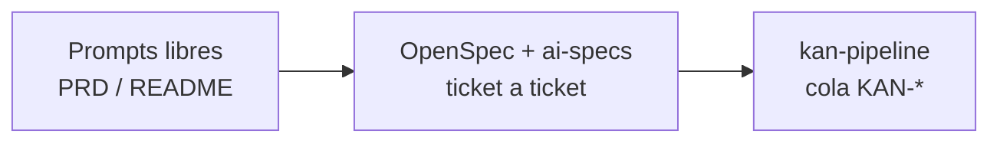

# prompts.md — Uso de IA en el ciclo de desarrollo

**Proyecto:** Reading Analytics Platform  
**Autor:** Celia Merino Valladolid  
**Herramienta principal:** Cursor (agente de código + skills + MCP Jira)

Este documento describe **cómo se usó la IA** a lo largo del máster, no los prompts literales. En clase se enfatizó que lo relevante hoy es el **proceso** (contexto, precedencia documental, skills y automatización), no memorizar plantillas de prompt. Por sección se resumen **hasta 3 interacciones clave** y **cómo se guió al asistente**.

---

## Evolución del proceso (visión global)

El trabajo con IA no fue estático: evolucionó en **tres etapas**, alineadas con lo aprendido en el máster.

### Etapa 1 — Prompts «de forma normal»

Al inicio (definición de producto y primer diseño técnico) se trabajó con **conversaciones libres** en el asistente:

- Se pegaba contexto (idea de producto, paleta, pantallas deseadas).
- Se pedían entregables concretos: PRD, secciones del `readme.md`, diagramas Mermaid, borradores de API.
- La calidad dependía sobre todo de **cuánto contexto** se daba en cada mensaje y de **revisar a mano** el resultado.

Útil para arrancar documentación y alinear la visión, pero **frágil** para implementar features: el modelo reinventaba stack, inventaba entidades o contradecía el PRD si no se le recordaba en cada turno.

### Etapa 2 — OpenSpec + `ai-specs`

Conforme avanzó el máster se incorporó el flujo **spec-driven** del entorno académico:

| Pieza                               | Rol                                                                                                                                                            |
| ----------------------------------- | -------------------------------------------------------------------------------------------------------------------------------------------------------------- |
| `openspec/`                         | Cambios acotados (`proposal` → `design` → `specs` → `tasks` → apply → archive). Cada ticket Jira `KAN-*` deja un rastro de requisitos verificables.            |
| `ai-specs/`                         | Material de apoyo creado/mantenido en el ecosistema de la academia (skills, agentes de planificación, Specboot). **No sustituye** al PRD ni a `docs/product/`. |
| `AGENTS.md` **+** `docs/standards/` | Precedencia fija: producto → código → contratos → OpenSpec → ai-specs. El agente lee reglas del repo antes de inventar.                                        |

Skills habituales en esta fase: `enrich-us` (enriquecer ticket Jira), `openspec-propose` / `openspec-apply-change` / `openspec-archive-change`, `commit`, `update-docs`.

**Cómo se guiaba al asistente:** se pedía seguir el skill concreto, leer el PRD/UC, generar artefactos OpenSpec y **solo entonces** tocar código (TDD, NestJS + TypeORM, contratos en `docs/api-spec.yml`).

### Etapa 3 — `kan-pipeline` (automatización del flujo deseado)

Para reducir trabajo repetitivo se definió la skill `kan-pipeline` (`.cursor/skills/kan-pipeline` / `ai-specs/skills/kan-pipeline`) y una cola en `ai-specs/queues/kan-implementation-queue.yaml`.

El pipeline orquesta, en orden, lo que antes se disparaba a mano:

1. `enrich-us` — enriquecer el ticket Jira
2. `openspec-propose` — propuesta + design + specs + tasks
3. `openspec-apply-change` — implementación contra las tasks
4. **Commit + PR** al fork (`CeliaMerino/AI4Devs-finalproject`)
5. **Puerta humana** — revision manual + merge de github
6. `openspec-archive-change` — archivar el cambio y pasar al siguiente ticket

**Cómo se guiaba al asistente:** un mensaje corto «`/kan-pipeline next`» y «/kan-pipeline continue» basta; la skill impone remotos, rama, pasos y estado en `kan-pipeline-state.json`. El ahorro está en **no reexplicar el proceso en cada ticket**.

```mermaid
flowchart LR
  A[Prompts libres<br/>PRD / README] --> B[OpenSpec + ai-specs<br/>ticket a ticket]
  B --> C[kan-pipeline<br/>cola KAN-*]
```

---

## Índice (por fases del entregable)

1. [Descripción general del producto](#1-descripción-general-del-producto)
2. [Arquitectura del sistema](#2-arquitectura-del-sistema)
3. [Modelo de datos](#3-modelo-de-datos)
4. [Especificación de la API](#4-especificación-de-la-api)
5. [Historias de usuario](#5-historias-de-usuario)
6. [Tickets de trabajo](#6-tickets-de-trabajo)
7. [Pull requests](#7-pull-requests)

---

## 1. Descripción general del producto

**Fase dominante:** Etapa 1 (prompts libres) → revisión manual en `PRD.md` / `readme.md` §1.

| #   | Interacción clave (intención)                                                                                                                             | Cómo se guió al asistente                                                                                          |
| --- | --------------------------------------------------------------------------------------------------------------------------------------------------------- | ------------------------------------------------------------------------------------------------------------------ |
| 1   | Redactar el **PRD** a partir de la visión (desktop-first, analítica vs red social, pantallas Home / Tracker / Stats / Listas, paleta y accesibilidad ES). | Se aportó el brief de producto y se pidió Markdown listo para repo; se iteró corrigiendo alcance MVP vs evolución. |
| 2   | Extraer **características principales** y prioridades MVP para el README.                                                                                 | Se ancló la respuesta al PRD ya escrito («no inventes módulos fuera de documento»).                                |
| 3   | Documentar **diseño y UX** (sidebar, estilo soft feminine / coquette, WCAG / Ley 11/2023).                                                                | Se forzó coherencia con la paleta y con las rutas del PRD; sin pantallas inventadas.                               |

**Nota:** Aquí no había OpenSpec todavía; la «fuente de verdad» era el propio PRD generado y revisado.

---

## 2. Arquitectura del sistema

**Fase dominante:** Etapa 1 (documentación) + Etapa 2 (cuando el código real fijó NestJS / Vite / TypeORM).

| #   | Interacción clave (intención)                                                                     | Cómo se guió al asistente                                                                        |
| --- | ------------------------------------------------------------------------------------------------- | ------------------------------------------------------------------------------------------------ |
| 1   | Diagrama de arquitectura cliente → API → PostgreSQL + catálogo OL/GB.                             | Contexto de stack y UC; salida Mermaid + PNG en `docs/product/diagrams/`.                        |
| 2   | Bloques de **infraestructura, seguridad y tests** para el README.                                 | Se pidió propuesta MVP realista (sin over-engineering) y ejemplos ligados a módulos del sistema. |
| 3   | Ajustar la estructura de carpetas al repo real (`backend/` + `frontend/`, no monorepo inventado). | Etapa 2+: se apuntó a `AGENTS.md` y al código existente para corregir drift documental.          |

**Nota de proceso:** la arquitectura «en papel» se escribió pronto; al implementar, OpenSpec y estándares evitaron que cada feature reinventara Express/Prisma u otras plantillas ajenas al proyecto.

---

## 3. Modelo de datos

**Fase dominante:** Etapa 1 (modelo lógico en README) → Etapa 2 (migraciones TypeORM + `docs/data-model.md` como contrato).

| #   | Interacción clave (intención)                                                         | Cómo se guió al asistente                                                                           |
| --- | ------------------------------------------------------------------------------------- | --------------------------------------------------------------------------------------------------- |
| 1   | Generar **erDiagram** Mermaid a partir de PRD y UC-01…UC-10.                          | Lista explícita de entidades esperadas; salida pegable en README.                                   |
| 2   | Tablas de atributos (tipos, FK, índices) por entidad.                                 | Se pidió coherencia con flujos UC (p. ej. `finished_on` para stats).                                |
| 3   | Evolución del esquema (géneros, formatos, audiencias, `import_jobs`) vía tickets KAN. | Etapa 2/3: cada cambio actualiza `docs/data-model.md` en las tasks OpenSpec; tags siguen «planned». |

**Cómo se guió en implementación:** «no inventes tablas fuera de OpenSpec / data-model»; migraciones versionadas en `backend/src/migrations/`.

---

## 4. Especificación de la API

**Fase dominante:** Etapa 1 (borradores OpenAPI en README) → Etapa 2 (contrato vivo en `docs/api-spec.yml` sincronizado con código).

| #   | Interacción clave (intención)                           | Cómo se guió al asistente                                               |
| --- | ------------------------------------------------------- | ----------------------------------------------------------------------- |
| 1   | Especificar **POST /books** (UC-01, catálogo, 201/409). | Anclado a UC-01 + entidad Book; validaciones y ejemplos JSON.           |
| 2   | Especificar **PATCH …/reading-record** (UC-02/04).      | Reglas de transición y side-effects (`openCompletionModal`, luego TBR). |
| 3   | Especificar **GET /stats** (UC-07, periodos mes/año).   | Schemas reutilizables; insights como parte del contrato.                |

**Etapa 2+:** al aplicar un cambio OpenSpec, una task típica es «actualizar `docs/api-spec.yml`»; el asistente no debe devolver DTOs que no estén en el spec.

---

## 5. Historias de usuario

**Fase dominante:** Etapa 1 (redacción BDD/INVEST) → Etapa 2 (`enrich-us` alinea Jira con US/UC).

| #   | Interacción clave (intención)                                                         | Cómo se guió al asistente                                                                      |
| --- | ------------------------------------------------------------------------------------- | ---------------------------------------------------------------------------------------------- |
| 1   | Redactar **US-01** (alta con catálogo) con exactamente 3 escenarios BDD.              | Fuente: UC-01; sin mezclar entrada manual en la US.                                            |
| 2   | Redactar **US-02** (TBR mensual) y **US-03** (meta anual).                            | Coherencia con UC-05/UC-06; detalle técnico solo en use cases.                                 |
| 3   | Ampliar a **US-04…US-06** (ciclo de lectura, stats, insights) y resumen en README §5. | Etapa 2: tickets KAN enlazados en la propia US; `enrich-us` evita reescribir criterios a mano. |

---

## 6. Tickets de trabajo

**Fase dominante:** Etapa 2 (Jira + OpenSpec) → Etapa 3 (`kan-pipeline`).

| #   | Interacción clave (intención)                                                        | Cómo se guió al asistente                                                 |
| --- | ------------------------------------------------------------------------------------ | ------------------------------------------------------------------------- |
| 1   | Convertir una US/UC en **ticket backend** implementable (alcance, AC, DoD, riesgos). | Primero en README (entrega); luego en Jira `KAN-`* con el mismo espíritu. |
| 2   | Ticket **frontend** (modal, Query, accesibilidad básica).                            | Contrato API + escenarios BDD de la US.                                   |
| 3   | Ticket **BD/migración** (schema mínimo MVP, luego géneros KAN-59, etc.).             | Sin entidades futuras en el mismo ticket.                                 |

**Etapa 3 — ejemplo de guía mínima:**

> Usa `kan-pipeline next` sobre la cola. No saltes el enrich ni el propose. Para en la puerta de merge humano.

El detalle del ticket ya no se reescribe en el chat: vive en Jira + `openspec/changes/kan-…/`.

Referencias de proceso en repo: `ai-specs/queues/kan-implementation-queue.yaml`, skill `kan-pipeline`, `openspec/README.md`.

---

## 7. Pull requests

**Fase dominante:** Etapa 2 (PRs por cambio OpenSpec) → Etapa 3 (PR abierto automáticamente por el pipeline).

| #   | Interacción clave (intención)                                                             | Cómo se guió al asistente                                              |
| --- | ----------------------------------------------------------------------------------------- | ---------------------------------------------------------------------- |
| 1   | Abrir PR con resumen, plan de pruebas y enlace Jira (p. ej. KAN-9 primer vertical slice). | Skill `commit` + plantilla de PR; remoto **solo el fork**.             |
| 2   | PRs full-stack (p. ej. lifecycle + TBR) tras apply de OpenSpec.                           | Tasks marcadas; tests de integración mencionados en el body.           |
| 3   | Tras merge: archivar OpenSpec y actualizar estado de cola.                                | `/kan-pipeline continue` — no archivar a mano olvidando el state JSON. |

**Política de guía fija (AGENTS / kan-pipeline):** pushes y `gh pr` contra `CeliaMerino/AI4Devs-finalproject`; nunca PR al upstream del aula salvo sync explícito.

Ejemplos documentados también en `readme.md` §7: [#9](https://github.com/CeliaMerino/AI4Devs-finalproject/pull/9), [#11](https://github.com/CeliaMerino/AI4Devs-finalproject/pull/11), [#69](https://github.com/CeliaMerino/AI4Devs-finalproject/pull/69).

---

## Resumen: qué aportó cada capa de IA

| Capa                | Aporta                                         | Limita / evita                                 |
| ------------------- | ---------------------------------------------- | ---------------------------------------------- |
| Prompts libres      | Velocidad al definir producto y docs iniciales | Drift, stack inventado, repetición de contexto |
| OpenSpec + ai-specs | Requisitos por ticket, TDD, sync docs/código   | Implementar sin spec previa                    |
| kan-pipeline        | Repetibilidad, menos fricción operativa        | Saltar la revisión humana del PR               |

La ingeniería de prompts «perfectos» dejó de ser el cuello de botella: el valor está en **documentación canónica + skills + cola de tickets**, con el humano validando producto y merges.

---

## Referencias en el repositorio

- Precedencia y reglas de agente: `[AGENTS.md](AGENTS.md)`
- Producto: `[PRD.md](PRD.md)`, `[docs/product/](docs/product/)`
- Contratos: `[docs/api-spec.yml](docs/api-spec.yml)`, `[docs/data-model.md](docs/data-model.md)`
- OpenSpec: `[openspec/README.md](openspec/README.md)`
- AI specs / skills: `[ai-specs/README.md](ai-specs/README.md)`
- Cola y pipeline: `[ai-specs/queues/kan-implementation-queue.yaml](ai-specs/queues/kan-implementation-queue.yaml)`, skill `kan-pipeline`

